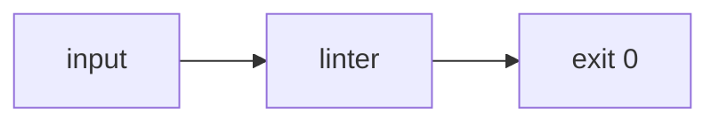

# Plan: Sample passing fixture

**Spec**: [./spec.md](./spec.md)
**Type**: feat
**Size**: XS
**Field**: greenfield
**Status**: approved

## Summary

A minimal complete plan whose only structural requirement is a mermaid diagram; the executable task lives in tasks.md.

## Technical Context

**Language**: n/a (fixture) · **Testing**: shell

## Gate check

- Trust boundary: none — fixture only.

## Architecture diagram

