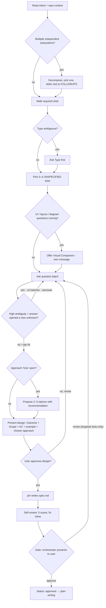

# Pre-flight checklist, process flow, and a worked example

Deep reference for SKILL.md — the run-top-to-bottom checklist before the first interview question, the full interview→gate flowchart, and one worked example end-to-end.

## Pre-flight checklist (run top-to-bottom)

Before the first question of the interview:

- [ ] Read `CLAUDE.md`, recent commits (`git log -5 --oneline`), and any file the intent names.
- [ ] Read `.workflow/_templates/spec.md` and `.workflow/FOLLOWUPS.md > Open` — fold any in-scope follow-up IDs into the interview.
- [ ] Read `.claude/agents/pm.md > Spec sections` (the authoritative triggers; the template `.workflow/_templates/spec.md` is a clean skeleton). Walk the floor + triggered slots: which are answered by the intent + repo, which trigger fires, which are genuinely open?
- [ ] Decide the run's `Type` (`feat | fix | refactor | chore | docs | spike`). If genuinely ambiguous, that is question 1.
- [ ] Run the scope-decomposition test — is this one ship-able thing, or multiple? If multiple, surface that BEFORE asking detail questions.
- [ ] Load the relevant construction-fundamentals skill(s) for the work that's coming — they shape the approach options in principle 4:
  - Real code → [[programming-fundamentals]]
  - Schema / query / migration → [[database-fundamentals]]
  - Backend with real domain logic → [[hexagonal-backend]]
  - Cross-service / system-level decisions → [[architecture-fundamentals]]
  - Queue / broker / async worker → [[queue-fundamentals]]
  - Unknown-cause bug → [[debug-fundamentals]] *before* this skill (find the cause, then brainstorm the fix)

Then pick the 3–4 most consequential unanswered slots for the interview batch.

## Process flow

**Terminal state in `/dev`:** `Status: approved` and the orchestrator spawns `lead` in plan mode. Outside `/dev`: a clean design doc the user can hand to whatever workflow they use next. The next phase is planning — not implementation, not code-writing. Load [[plan-writing]] only when the plan complexity warrants the full skill body.

## Mini worked example (one-paragraph feature request)

**Intent:** "add a way for users to export their data"

**Step 1 — read repo:** `package.json` shows Next.js + Postgres; `app/api/` has REST handlers; no export-related file. → tech stack is answered; integration point is `app/api/` plus a new download route.

**Step 2 — decomposition check:** one user-visible feature, one subsystem. Single spec works.

**Step 3 — required-slots walk:**
- Type: `feat` (clear from "add a way")
- Outcome: After answered ("export their data"); Before + Benefit still to confirm in the interview
- Users: not specified — *ask*
- Scope/AC: not specified — *ask*
- Constraints: stack visible; integration point inferable
- `Ship as`: not specified — defaults to `one-drop`, confirm at gate
- Open PR: default `yes` for feat, confirm at gate

→ **Three open questions to batch:** (1) which user role and entry point, (2) what data and what format (CSV / JSON / both), (3) sync download vs async email with link.

**Step 4 — approach options (after answers come in):** Option A: synchronous CSV download from a new `/api/export` route, recommended for ≤ 100k rows. Option B: background job + email link, better for large exports but adds a queue. Option C: hybrid — sync if under threshold, async otherwise. Lead with A unless answer 2 implied >100k rows.

**Step 5 — present design, get yes, hand to `pm`.** `pm` writes `spec.md` with concrete AC ("CSV download from /api/export, ≤30s for accounts up to 100k rows, columns A/B/C"). **Step 6 — self-review (5 scans):** placeholder/ambiguity, content discipline, contradictions, scope, and verifiability + example + pre-mortem (confirm the CSV AC carries its concrete `e.g.:` example). Fix inline. **Step 7 — orchestrator runs the gate.**
