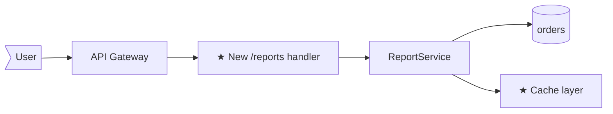
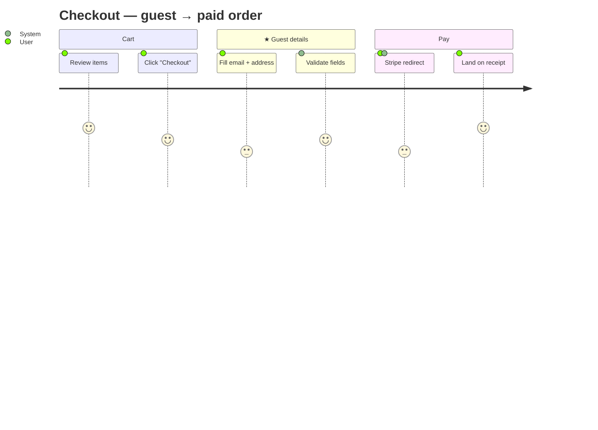
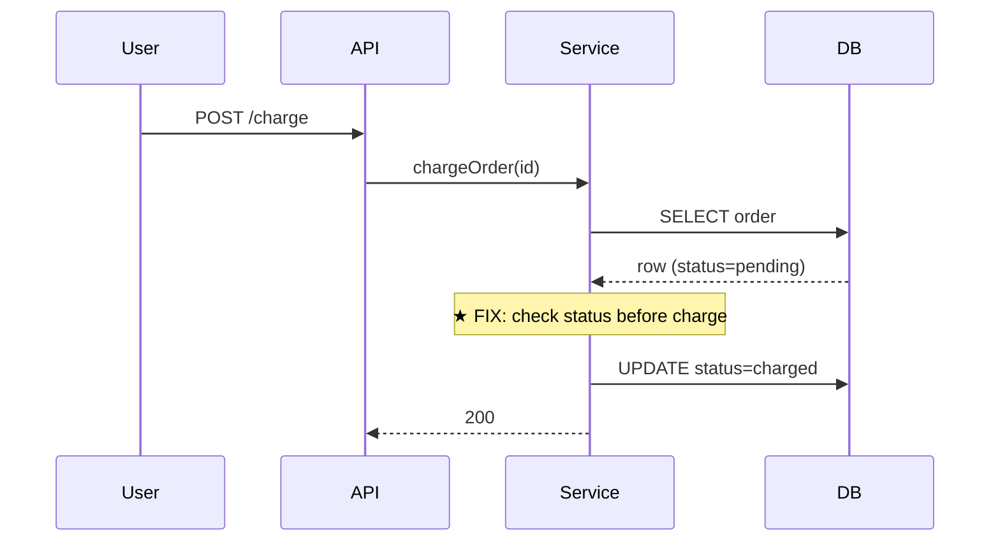
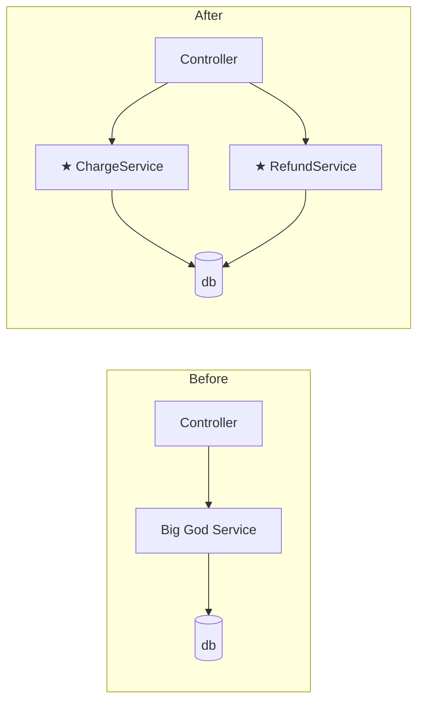
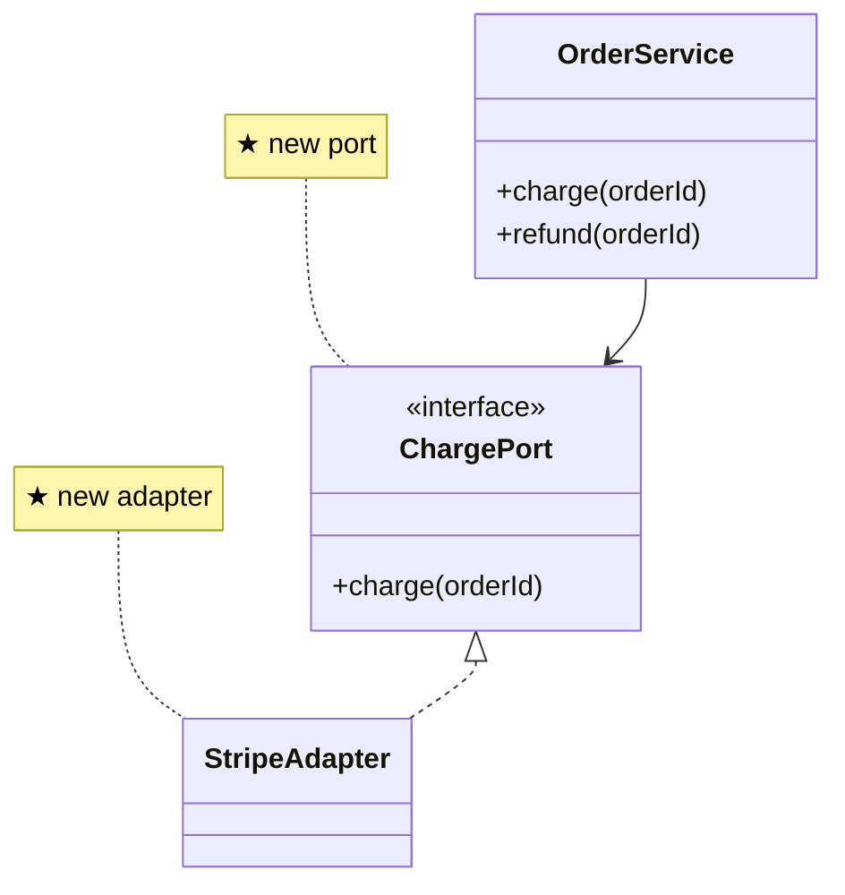
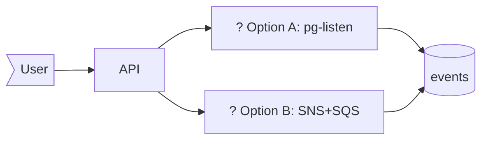

# Architecture Diagrams in Plans

Always required in `plan.md`. Form scales with `Size`; type defaults from the run's `Type`. Format: Mermaid. Keep diagrams small — they exist to make the *seam* of the change legible at a glance.

**Code-bearing plans (`feat` / `fix` / `refactor`) MUST include a `sequenceDiagram`** of the call order across the slice — that order is the half of the design prose hides. A structural diagram (`flowchart` / `classDiagram`) is an optional companion when shape matters too. `chore` / `docs` / `spike` are exempt — no real interaction order to draw.

## Conventions

- **Mark new pieces with `★`** — both in node labels and in narration. `[★ NewService]`, `★ writes new column`.
- **Mark deleted / removed pieces with `~~strikethrough~~`** in labels: `[~~OldHandler~~]`.
- **Use mermaid's defaults for shape**: `[...]` for processes / components, `(...)` for data stores, `[(...)]` for databases, `>...` for actors / users.
- **Direction**: `LR` (left-to-right) is the default and the most readable. Use `TB` only when you have layers (e.g., a 3-tier app showing top-down).
- **One or two diagrams** — the required `sequenceDiagram`, plus a structural companion only when shape matters (L: a before/after pair). Never more without a reason.

## Templates per Type

### `feat` — required `sequenceDiagram` of the new call path; optional `flowchart` companion

Sequence form as in `fix` below, new participant(s)/message(s) marked `★`. Add a `flowchart LR` companion when *where the new piece sits* matters as much as the order:



**UI-heavy `feat`** — a mermaid `journey` may substitute for the sequence only when the flow is pure user-visible step order with no client↔server round-trip; otherwise the `sequenceDiagram` stays required.



### `fix` — sequenceDiagram of the bug path, with the fix marked



Optional companion: a before/after `flowchart` when the fix changes control flow rather than adding a guard.

### `refactor` — required `sequenceDiagram` (call order, unchanged) + before/after `flowchart`/`classDiagram` (shape change)

The sequence is the visual half of the behaviour-equivalence `Summary` (same order in/out; only internals move) — drawn once, form as in `fix`. Then show the shape change:

Before/after flowchart for behavioural restructuring:



classDiagram for structural change (interfaces, inheritance, port/adapter shifts):



### `chore` / `docs` — one line, OR `N/A`

Most chore/docs work has no architecture impact. State that:

```
**Impact:** N/A — single-file chore. No system impact.
```

When there *is* impact (e.g., a chore that swaps a dep that touches many call sites), use a one-liner:

```
package.json (lodash 4.17.x → 4.17.y) → triggers re-bundle in 14 packages under src/
```

Never delete the section entirely — "always have a diagram slot", even when the content is "no diagram needed".

### `spike` — flowchart with `?` on unanswered nodes



The diagram for a spike is a *question*, not an answer. The spike's job is to pick one — `recommendations.md` lands that pick.

## When Size = XS

Keep the section. Code-bearing XS still needs the `sequenceDiagram` — minimal (≤3 participants). `chore`/`docs`/`spike`: `**Impact:** N/A — <reason>`, a one-line summary, or a 3-node mermaid. Do not skip.

## When Size = L

The required `sequenceDiagram` plus a structural **Before** + **After** pair (`★` on additions, `~~strikethrough~~` on removals). Separate blocks beat subgraphs — flowchart shows *shape*, sequence shows *interaction order*.

## Choosing between diagram kinds

| Question to answer | Use |
|--------------------|-----|
| Where does the new piece sit in the system? | `flowchart` |
| What does the user *see and do*, step by step? | `journey` (or `sequenceDiagram` if client↔server back-and-forth matters) |
| What's the order of operations across components? | `sequenceDiagram` |
| What's the structural relationship between types? | `classDiagram` |
| How does the system shape change pre → post? | `flowchart` with before/after subgraphs |
| What's the data shape stored where? | `erDiagram` (rare; only for DB-heavy L plans) |
| What states does an entity move through? | `stateDiagram-v2` (rare; for state-machine features) |

## Anti-patterns

- **Don't draw the full system** — only the slice the plan touches, plus one hop of context (the immediate caller, the immediate dependency). More than that is map, not plan.
- **Don't paste architecture diagrams from design docs** — re-draw for *this change*. A reused diagram makes the new pieces blur into the existing system.
- **Don't label nodes with implementation details** — `[OrderService]` not `[OrderService (TypeScript class extending BaseService<T>)]`. The diagram is for the seam, not the code.
- **Don't use color or styling for emphasis** — `★` and `~~strikethrough~~` are enough and render in every viewer.
- **Don't draw what isn't changing** unless it provides essential context. Every node the reader has to parse is attention you've taken from the actual change.
