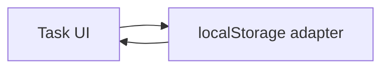

# Plan: Task list app

**Type**: feat

## Summary

One HTML page plus a small state module backed by localStorage. No build step.

## Architecture diagram

## Phases for this task

Matrix defaults for type=feat — no deviations.

## Files to touch

- `index.html` — markup and script include
- `src/store.js` — load and save items

## Rollback

Delete the added files; there is no persisted server state to unwind.
