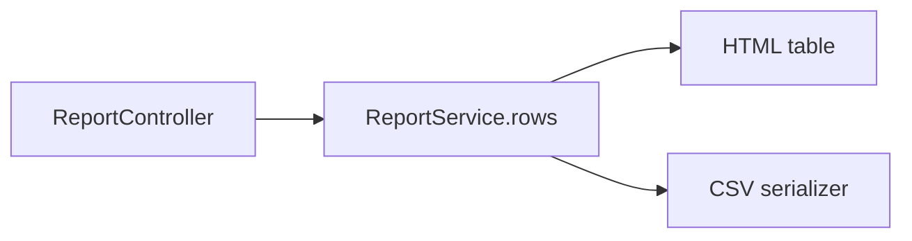

# Plan: CSV export for reports

**Type**: feat

## Summary

Add a `GET /reports.csv` route that serializes the existing `ReportService.rows` output. No change to the row source.

## Technical Context

The HTML report and the CSV export share one row source, so the two surfaces cannot drift.

## Current state

- Entry point — `app/controllers/report_controller.rb#show` renders HTML from `ReportService.rows`.
- Flow — `report_controller.rb#show` → `app/services/report_service.rb#rows` → `app/views/reports/show.html.erb`.
- Blast radius — `ReportService.rows` has one caller today (`report_controller.rb#show`); the CSV branch becomes the second.
- Invariant — `app/services/report_service.rb#rows` returns rows already scoped to the caller's tenant; a new surface that re-queries would bypass that scoping.
- Invariant — `app/controllers/report_controller.rb#show` is the only place the report is authorised; a format branch must stay inside it.

## Architecture diagram

## Phases for this task

Matrix defaults for type=feat — no deviations.

## Files to touch

- `app/controllers/report_controller.rb` — add the CSV format branch
- `app/serializers/csv_row.rb` — new serializer with comma quoting

## Risks

- Large reports could stream slowly; acceptable at current row counts.

## Rollback

Remove the CSV route and serializer; the HTML path is untouched.
