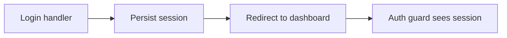

# Plan: Fix login redirect loop

**Type**: fix

## Summary

Persist the session before the post-login redirect so the auth guard observes it on the next request.

## Architecture diagram

## Phases for this task

Matrix defaults for type=fix — no deviations. Task 1 is the failing regression test.

## Files to touch

- `app/auth/session_handler.rb` — set the session before issuing the redirect

## Rollback

Revert the single handler change; behaviour returns to the prior loop.
