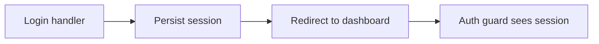

# Plan: Fix login redirect loop

**Type**: fix

## Summary

Persist the session before the post-login redirect so the auth guard observes it on the next request.

## Current state

- Entry point — `app/auth/session_handler.rb#after_login`.
- Bug path — `session_handler.rb#after_login` issues the redirect ← BUG (session not yet written) → `app/auth/guard.rb#call` reads an empty session → bounces back to `/login`.
- Blast radius — `session_handler.rb#after_login` is called by the password login and the SSO callback; both share the fix.
- Invariant — `app/auth/guard.rb#call` denies by default on a missing session; the fix must make the session present, never relax the guard.

## Architecture diagram

## Phases for this task

Matrix defaults for type=fix — no deviations. Task 1 is the failing regression test.

## Files to touch

- `app/auth/session_handler.rb` — set the session before issuing the redirect

## Rollback

Revert the single handler change; behaviour returns to the prior loop.
