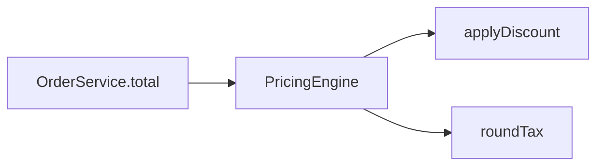

# Plan: Extract the pricing engine

**Type**: refactor

## Summary

Introduce `PricingEngine` and delegate from `OrderService`, moving the math in small green steps guarded by a golden master.

## Technical Context

Coverage over the pricing path is thin today, so a characterization baseline is captured before any code moves.

## Architecture diagram

## Phases for this task

Matrix defaults for type=refactor — no deviations. Task 1 captures the baseline before the move.

## Files to touch

- `app/services/order_service.rb` — delegate pricing to the engine
- `app/pricing/pricing_engine.rb` — new home for the math

## Risks

- A fixture may expose a latent bug; pin it, do not fix inline.

## Rollback

Inline the engine back into `OrderService`; the golden master still passes.
