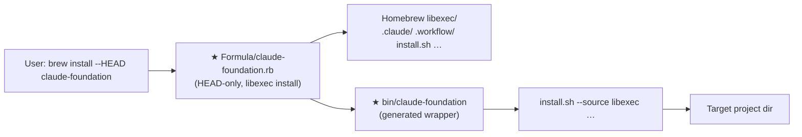

# Plan: Homebrew tap formula for claude-foundation

**Spec**: [./spec.md](./spec.md) · **Type**: feat · **Size**: S · **Status**: draft

## Outcome

- **Before:** Installing claude-foundation requires cloning the repo and running `install.sh` by hand — no discoverable, single-command path for new users.
- **After:** `brew tap maximumsoft-co-ltd/claude-foundation https://github.com/Maximumsoft-Co-LTD/claude-foundation` + `brew install --HEAD claude-foundation` puts a `claude-foundation` CLI on PATH; running it inside any target project scaffolds `.claude/`, `.workflow/`, `WORKFLOW.md`, and `CLAUDE.md` there, identical to running `install.sh` from a clone.
- **Benefit:** → `spec.md > Outcome` — lowers the adoption barrier for macOS / Linux users from "clone + run a shell script" to a single brew command.

## Approach

Create a `Formula/claude-foundation.rb` that (1) installs the full source tree into `libexec` using an explicit path list (not `Dir["*"]`, which silently omits dotfiles like `.claude/` and `.workflow/`) and (2) generates a `bin/claude-foundation` wrapper that execs `install.sh` with `--source "#{libexec}"`, bypassing `install.sh`'s `SCRIPT_DIR` heuristic for the brew-managed path. A standalone symlink cannot be used because `install.sh` resolves `SCRIPT_DIR` via `dirname "${BASH_SOURCE[0]}"` — only a generated wrapper that passes `--source` explicitly makes this reliable. README gets a new "Install via Homebrew" section alongside the existing quick-start block.

No license file exists in the repo and README says "Not yet specified." The formula will omit the `license` stanza rather than hardcode a wrong SPDX id; a `# TODO: add license "SPDX-ID" once repo license is declared` comment marks the spot.

## Architecture diagram



## References / examples to follow

- `install.sh#"for needed in"` (~L137–150) — the exact list of paths `install.sh` validates against `SOURCE_PATH`; this is the authoritative source for what must land in `libexec`. Used in step 3. [ref: install.sh]
- `install.sh#"SCRIPT_DIR"` (~L13) — the `dirname "${BASH_SOURCE[0]}"` heuristic the wrapper must bypass with `--source`. Used in step 4. [ref: install.sh]
- `spec.md > References / examples to follow` — the canonical Homebrew formula skeleton (HEAD-only, `libexec`, generated `bin` wrapper, `test do` block). Used in step 3.

## Folder structure

New subtree only (all other paths unchanged):

```
Formula/
└── claude-foundation.rb   ★ HEAD-only Homebrew formula
```

## Steps

1. Read `install.sh#"for needed in"` (~L137–150) to confirm the exact source-validation list used at runtime — verify: read confirms the 11 checked paths (`.claude/agents`, `.claude/orchestrator.md`, `.claude/commands/dev.md`, `.claude/skills`, `.claude/rules`, `.claude/hooks`, `.claude/settings.json`, `.workflow/_templates`, `.workflow/_templates/state.json`, `.workflow/FOLLOWUPS.md`, `WORKFLOW.md`) plus `install.sh` itself; no new paths introduced by a recent commit. [AC2]

2. Check `README.md#"## License"` and repo root for any `LICENSE` file — verify: `README.md` shows "Not yet specified" and no `LICENSE` file exists; formula will omit `license` stanza and include a `# TODO` comment instead of hardcoding `"MIT"`. [AC5]

3. Create `Formula/claude-foundation.rb` (new) with:
   - `desc`, `homepage`, `head "https://github.com/Maximumsoft-Co-LTD/claude-foundation.git", branch: "main"` (HEAD-only, no `url`/`sha256`)
   - `# TODO: add license "SPDX-ID" once repo license is declared` comment in place of `license` stanza
   - `depends_on "jq" => :optional` (degrades gracefully without it; improves UX when present)
   - `def install` block that uses an **explicit path list** instead of `Dir["*"]`:
     ```ruby
     libexec.install ".claude", ".workflow", "WORKFLOW.md", "CLAUDE.md",
                     "install.sh", "install-cursor.sh"
     ```
     This list covers every path `install.sh` validates at source (step 1) plus `CLAUDE.md` and `install-cursor.sh` that live alongside. The explicit list intentionally excludes `.git`, `.github`, `website/`, `examples/`, `CHANGELOG.md`, run artifacts, and `Formula/` itself — none of which `install.sh` needs.
   - Generated `bin/claude-foundation` wrapper:
     ```ruby
     (bin/"claude-foundation").write <<~EOS
       #!/usr/bin/env bash
       exec "#{libexec}/install.sh" --source "#{libexec}" "$@"
     EOS
     chmod 0755, bin/"claude-foundation"
     ```
   - `test do` block: `system "#{bin}/claude-foundation", "--help"`
   - verify: `ruby -c Formula/claude-foundation.rb` exits 0 (syntax check; runnable without brew). [AC1, AC5]

4. Verify dotfile coverage in the formula's install list — verify: `grep -E '".claude"|".workflow"' Formula/claude-foundation.rb` shows both dotfile paths in the `libexec.install` call (not inside a `Dir["*"]` glob that would silently omit them). [AC2]

5. Verify wrapper `--source` wiring — verify: `grep -- '--source' Formula/claude-foundation.rb` shows `--source "#{libexec}"` in the generated wrapper body; the `--source` flag is passed unconditionally before `"$@"` so `install.sh`'s `SCRIPT_DIR` heuristic is bypassed. [AC2, AC3]

6. Verify flag pass-through — verify: `grep '"$@"' Formula/claude-foundation.rb` shows `"$@"` after `--source "#{libexec}"` in the wrapper, confirming all caller flags (`--force`, `--yes`, `--dry-run`, `--help`, `[target-path]`) are forwarded unchanged. [AC3]

7. Run style and audit checks where Homebrew is available — verify: `brew style Formula/claude-foundation.rb` exits 0 AND `brew audit --strict --formula Formula/claude-foundation.rb` exits 0. If brew is absent in the current environment: `ruby -c Formula/claude-foundation.rb` for syntax (already done in step 3) confirms no Ruby parse errors; full lint must be run locally before opening the PR. [AC5]

8. Manually validate the libexec layout using a simulated install — verify: create a temp dir, copy `.claude/`, `.workflow/`, `WORKFLOW.md`, `CLAUDE.md`, `install.sh` into it, then run `bash install.sh --source <tempdir> --dry-run /tmp/testproj`; confirm exit 0 and plan output lists the expected files. This proves `--source` wiring works end-to-end without brew. [AC2, AC3]

9. Assert dotfiles land in the simulated libexec — verify: after step 8 temp setup, run `ls <tempdir>/.claude/agents` and `ls <tempdir>/.workflow/_templates`; both must list files (non-empty), proving `.claude/` and `.workflow/_templates/` were not silently omitted. [AC2]

10. Update `README.md#"## Quick start"` — add a new `## Install via Homebrew` section above the existing quick-start block containing: (a) two-step tap + install commands (`brew tap maximumsoft-co-ltd/claude-foundation https://github.com/Maximumsoft-Co-LTD/claude-foundation` then `brew install --HEAD claude-foundation`), (b) how to run `claude-foundation` inside a target project (`cd /path/to/myproject && claude-foundation`), (c) Windows / non-brew fallback note pointing to `install.sh`, (d) manual follow-up note: "Before others can install, push this repo and then create the tap repo at `homebrew-claude-foundation` (or equivalent); see Homebrew tap docs. Future hardening: cut a tagged release and add `url`/`sha256` to replace the HEAD-only formula." — verify: `grep -A 20 "## Install via Homebrew" README.md` shows all four elements (tap command, run example, Windows note, follow-up note). [AC4]

11. Final file-set check — verify: `ls Formula/claude-foundation.rb` exits 0 (formula committed); `grep "Install via Homebrew" README.md` exits 0 (README updated). No changes to `install.sh`. [DoD]

## Files touched

| Path | Change | Why |
|---|---|---|
| `Formula/claude-foundation.rb` | new | HEAD-only Homebrew formula — AC1, AC2, AC3, AC5 |
| `README.md` | edit | "Install via Homebrew" section — AC4 |

## Risks

| Risk | Likelihood | Mitigation |
|---|---|---|
| `brew audit --strict` rejects missing `license` stanza | Medium | Homebrew auditor warns but does not error for taps (only core formulae require it); the `# TODO` comment is the self-documenting signal. If it does error, add `license :cannot_represent` as the SPDX placeholder. |
| Explicit `libexec.install` list misses a path `install.sh` reads in a future commit | Low | The list mirrors the `for needed in` validation block verbatim (step 1 read); `install.sh` will exit non-zero with a clear error if a checked path is absent, surfacing the gap immediately. |
| `--HEAD` formula breaks if upstream branch is renamed or repo is private | Low | Formula specifies `branch: "main"` explicitly; HEAD-only is an accepted trade-off documented in AC out-of-scope (pinned release is the future hardening path). |
| `brew style` lint rejects `depends_on "jq" => :optional` syntax (deprecated in newer Homebrew) | Low | If lint fails on this line, change to a comment-documented optional pattern or remove the `depends_on` stanza entirely; `install.sh` already degrades gracefully without `jq`. |

## Out of scope

Per `spec.md > Scope — Out`: no tap repo creation or push, no GitHub release / sha256 pinning, no CI release automation, no Windows Homebrew support, no changes to `install.sh`'s copy logic, no `install-cursor.sh` brew support.
