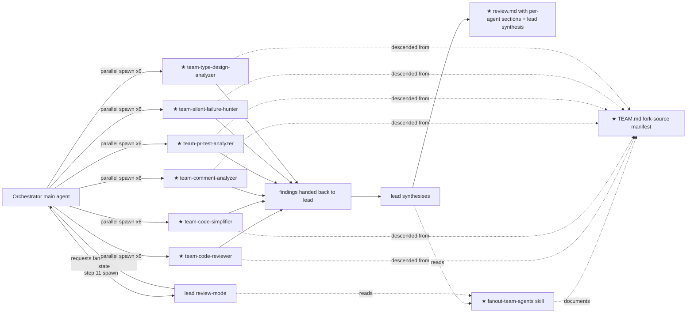

# Plan: Fanout team agents

**Spec**: [./spec.md](./spec.md)
**Type**: feat
**Size**: M
**Status**: draft

<!-- Self-review (plan-writing > references/self-review.md):
  Scan 1 (anti-placeholder): pass
  Scan 2 (AC coverage): pass — AC1–AC10 all tagged in Steps; every Step carries ≥1 AC tag
  Scan 3 (diagram ↔ files): pass — 8 ★ pieces ↔ 8 new rows; review.md ★ explicitly annotates an edit structural change
  Scan 4 (current-state coverage): pass — every edit row appears in data flow or invariants; every invariant cites path:line
  Scan 5 (verify-per-step): pass — every numbered step has a runnable verify command or concrete observable; no manually-check / eyeball language -->

## Approach

Land the fanout pattern as a first-class capability of three existing /dev agents (`lead`, `qa`, `engineer`) by (a) codifying the *technique* in a new `fanout-team-agents` skill, (b) embedding 7 local fork agents under `.claude/agents/` with a `team-<role>` filename prefix so they coexist flat with the 5 /dev workers without subfolder-discovery risk, and (c) editing the three /dev agent files to invoke fanout at named modes — mandatory in `lead` review mode, opt-in everywhere else. The pattern is plumbing; no new product behaviour ships.

The obvious alternative — leave the pattern as upstream-only and have `lead` call the upstream `code-reviewer` directly — is rejected because (1) the source plugins are not guaranteed to be installed in every clone of this repo, (2) the local copies let us version/fork them deliberately, and (3) the synthesis step (per-agent sections in `review.md`) needs a stable contract the agent file can reference by exact name.

**Step order**: foundation-first — skill + agents (AC1, AC2) before any wiring (AC3–AC7), template before docs, smoke run last. The wiring steps depend on the agent files existing; the docs step (AC9) depends on every other change being final so the references don't drift.

**Resolved Open questions** (from spec):
- **A. Naming/folder convention** → option (i) `team-<role>` filename prefix. Subfolder support under `.claude/agents/` is not documented in Claude Code (every observed example is flat; the spawn surface uses the `name:` YAML field, which must match the filename slug). The `team-` prefix gives visual separation from the 5 /dev workers (`pm`, `lead`, `engineer`, `qa`, `retro`) and forces every reference to spell out `team-code-reviewer` so it cannot be confused with `lead` in review mode.
- **D. Fork-source/date note** → new `.claude/agents/TEAM.md`. Cleaner than mixing fork metadata into `CLAUDE.md`; sits next to the agents it documents.
- **E. Which `code-reviewer`** → `pr-review-toolkit`'s version. It has a clean `git diff` review scope, an explicit confidence-score filter (≥80), and a structured Critical/Important grouping — much closer to what `lead` review mode needs from a fanned-out worker. The `superpowers` version is more advisory and lacks the confidence filter, so it's dropped (not shipped alongside) to avoid two competing reviewers.
- **B (Ship as)** and **C (Open PR on ship)** → left for the orchestrator gate; not flipped here. Surfaced under Risks.

## Current state

**Entry point(s)**:
- `.claude/agents/lead.md:8` — Lead agent dispatched by the orchestrator for plan / review / security modes (mode passed in the spawn prompt).
- `.claude/agents/qa.md:8` — QA agent dispatched for test mode; the mode-pick block at `qa.md:17-23` branches on `Type`.
- `.claude/agents/engineer.md:8` — Engineer agent dispatched for implement / docs / ship modes.
- `.claude/orchestrator.md:46` — orchestrator spawns `lead` in plan mode (Phase 1 step 8); `:64` review mode (Phase 2 step 11); `:67-74` security mode (step 12); `:76-77` qa (step 13); `:60-63` engineer implement (step 10).
- `.workflow/_templates/review.md:1-32` — current single-reviewer template shape; `Plan adherence` (`:9-13`), `Acceptance-criteria check` (`:15-21`), `Findings > Blocking / Non-blocking` (`:23-29`).
- `WORKFLOW.md > Type-aware phase matrix` — phase truth table; `WORKFLOW.md > Agent map` — 5 sub-agents (plus the `team-*` row added by step 18); `WORKFLOW.md > Anti-bias rule` — checklist discipline for `lead` review mode.

**Data / control flow** (LSP/Grep-walked, today):
1. Orchestrator at `.claude/orchestrator.md:64` spawns `lead` with `Mode B` prompt → lead reads `lead.md:66-92` (single-reviewer review-mode steps).
2. Lead in review mode walks plan steps (`lead.md:77`) and AC checkboxes (`lead.md:78`) **sequentially**, in one pass, producing `review.md` (`.workflow/_templates/review.md`) — no per-agent sections today.
3. Orchestrator at `.claude/orchestrator.md:67-74` (step 12, security) spawns `lead` with `Mode C` prompt → lead reads `lead.md:96-123`; the checklist (`lead.md:110`) is walked **sequentially**, one pass per trigger bucket.
4. Orchestrator at `.claude/orchestrator.md:76-77` (step 13, test) spawns `qa` → qa picks mode at `qa.md:17-23` and runs Full / Fix / Skipped **sequentially**; no per-test-category fanout exists.
5. Orchestrator at `.claude/orchestrator.md:60-63` (step 10, implement) spawns `engineer` → engineer reads `engineer.md:18-36` and executes plan steps **sequentially via TaskCreate**, one step at a time.
6. `lead` writes single `review.md` (`.workflow/_templates/review.md:9-29`) → terminal artifact handed back to orchestrator.

**Callers / blast radius**:
- `.claude/agents/lead.md` (entry `:8`): 1 caller — the orchestrator at `.claude/orchestrator.md:46, :64, :67-74`. Mode is passed in the spawn prompt, not the agent's frontmatter, so adding fanout instructions inside lead.md does not change the spawn contract.
- `.claude/agents/qa.md` (entry `:8`): 1 caller — orchestrator at `.claude/orchestrator.md:76-77`. Mode-pick is internal (`qa.md:17-23`); adding an opt-in fanout branch does not change the spawn shape.
- `.claude/agents/engineer.md` (entry `:8`): 1 caller — orchestrator at `.claude/orchestrator.md:60-63, :82, :83`. Modes A/B/C dispatched by prompt content.
- `.workflow/_templates/review.md`: 1 reader (`lead` in review mode at `lead.md:71`) and 1 indirect reader (`retro` at `.claude/agents/retro.md`, which lifts findings into `retro.md`). Additive per-agent sections must remain valid for runs that don't fanout (AC8).
- `WORKFLOW.md`: read by humans + orchestrator on every run (`.claude/orchestrator.md:11`). Doc additions only — no behaviour change.
- `CLAUDE.md` / `.claude/agents/TEAM.md`: 0 existing callers for the TEAM.md path (new file); CLAUDE.md is read by Claude Code at session start (out-of-process — not by orchestrator).

**Invariants the current code relies on**:
- *Sub-agents cannot spawn other sub-agents* — `WORKFLOW.md > Sub-agent constraints` and `.claude/orchestrator.md > Orchestrator (main-agent role)` make this explicit; Claude Code's runtime filters `Agent` out of sub-agent tool lists. **This is the load-bearing invariant for this plan**: `lead`, `qa`, and `engineer` are themselves sub-agents, so they **cannot** literally spawn the team agents via `Agent(...)`. The fanout pattern as written for *main agents* (per the `dispatching-parallel-agents` skill source) must be re-encoded here as either (a) the sub-agent invoking the team-agent's *instructions* in parallel reads (not parallel spawns), or (b) the orchestrator (main agent) spawns the team agents directly and hands their outputs to `lead` for synthesis. The new skill must document this constraint and pick a path; preferred path is (b) — the orchestrator owns spawns, `lead` synthesises.
- *Mode is passed in the spawn prompt, not the YAML* — `.claude/orchestrator.md:102` ("The mode hint goes in the prompt, not in the description"). New fanout instructions inside lead/qa/engineer go in mode bodies, not in YAML frontmatter, so the orchestrator's existing spawn shape stays valid.
- *Anti-bias rule for `lead` review mode is non-negotiable* — `WORKFLOW.md > Anti-bias rule` and `.claude/agents/lead.md > Anti-bias rule (you wrote the plan you're reviewing)`. The per-agent sections from fanout do NOT replace the plan-adherence row-per-step + AC row-per-criterion discipline; they add to it.
- *Sub-agent `tools:` lists are exhaustive* — `.claude/agents/lead.md:4` (`Read, Write, Edit, Grep, LSP, Bash`). The new fanout instructions must not assume any tool lead doesn't already have; do not add tools to YAML unless an existing one is insufficient.
- *Worker-spawn guard at `.claude/orchestrator.md:34`* — the hook at `.claude/hooks/dev-agent-guard.sh` blocks main-agent `Agent` calls whose `subagent_type` doesn't match `pm | lead | engineer | qa | retro`. If the orchestrator spawns the team agents directly (preferred fanout path), it must do so under a relaxed guard OR the team-`<role>` names must be added to the guard's allowlist. This is a real constraint that the skill must call out.

## Architecture diagram

To-be flow for `lead` review mode (Phase 2 step 5 / orchestrator step 11), the mandatory-fanout case. Other modes are opt-in and use the same shape with fewer workers.

Notes on `★`:
- New skill: `.claude/skills/fanout-team-agents/SKILL.md`.
- 6 new agent files under `.claude/agents/team-<role>.md` (all 6 shown in the diagram).
- 1 new manifest: `.claude/agents/TEAM.md` (fork-source/date for each of the 6).
- `★ review.md` marks a *structural change* to the existing template (additive `## Per-agent findings` section), not a new file — the file is `edit` in Files touched. Per `plan-writing > references/self-review.md` Scan 3, edit rows can carry a `★` annotation when the structural shape changes.
- Sub-agents cannot spawn sub-agents (see Invariants), so the *orchestrator* owns the parallel spawn even when it logically belongs to `lead`'s review pass. `lead` returns a "fanout requested" signal; orchestrator dispatches; `lead` is re-spawned with the workers' outputs in its prompt for synthesis.

## Steps

Mapping: AC1 = skill exists; AC2 = 7 agents exist; AC3 = lead review-mode fanout; AC4 = lead security-mode bucket fanout; AC5 = lead plan-mode opt-in exploration; AC6 = qa test-mode fanout; AC7 = engineer implement-mode fanout; AC8 = review.md template accommodates both shapes; AC9 = WORKFLOW.md + TEAM.md docs; AC10 = smoke run.

1. Create skill file with overview + when-to-use → `.claude/skills/fanout-team-agents/SKILL.md` (new) — verify: `test -f .claude/skills/fanout-team-agents/SKILL.md && grep -q "fanout-team-agents" .claude/skills/fanout-team-agents/SKILL.md` [AC1]
2. Add the four core sections to the skill — independent-domain identification, focused-prompt construction, parallel-dispatch mechanics (including the sub-agent-cannot-spawn invariant + orchestrator-owns-dispatch path), findings integration — `.claude/skills/fanout-team-agents/SKILL.md:new` (edit) — verify: `grep -c "^##" .claude/skills/fanout-team-agents/SKILL.md` returns ≥ 5 (overview + 4 sections); each of the four headings is present via `grep -E "independent|focused|dispatch|integration"` [AC1]
3. Add the anti-patterns section to the skill — name the same three failure modes as upstream (too-broad prompts, no constraints, vague output) — `.claude/skills/fanout-team-agents/SKILL.md:new` (edit) — verify: `grep -E "too.broad|no constraint|vague output" .claude/skills/fanout-team-agents/SKILL.md` returns 3 hits [AC1]
4. Copy `team-code-reviewer` from `pr-review-toolkit` (Open question E resolution) — `.claude/agents/team-code-reviewer.md` (new) — verify: `head -10 .claude/agents/team-code-reviewer.md | grep -q "^name: team-code-reviewer"` (the `name:` YAML must be renamed from `code-reviewer` to `team-code-reviewer` to match the filename slug) [AC2]
5. Copy + rename `team-code-simplifier` — `.claude/agents/team-code-simplifier.md` (new), mirror source `~/.claude/plugins/marketplaces/claude-plugins-official/plugins/pr-review-toolkit/agents/code-simplifier.md` — verify: `grep -q "^name: team-code-simplifier" .claude/agents/team-code-simplifier.md` [AC2]
6. Copy + rename `team-comment-analyzer` — `.claude/agents/team-comment-analyzer.md` (new), mirror `pr-review-toolkit/agents/comment-analyzer.md` — verify: `grep -q "^name: team-comment-analyzer" .claude/agents/team-comment-analyzer.md` [AC2]
7. Copy + rename `team-pr-test-analyzer` — `.claude/agents/team-pr-test-analyzer.md` (new), mirror `pr-review-toolkit/agents/pr-test-analyzer.md` — verify: `grep -q "^name: team-pr-test-analyzer" .claude/agents/team-pr-test-analyzer.md` [AC2]
8. Copy + rename `team-silent-failure-hunter` — `.claude/agents/team-silent-failure-hunter.md` (new), mirror `pr-review-toolkit/agents/silent-failure-hunter.md` — verify: `grep -q "^name: team-silent-failure-hunter" .claude/agents/team-silent-failure-hunter.md` [AC2]
9. Copy + rename `team-type-design-analyzer` — `.claude/agents/team-type-design-analyzer.md` (new), mirror `pr-review-toolkit/agents/type-design-analyzer.md` — verify: `grep -q "^name: team-type-design-analyzer" .claude/agents/team-type-design-analyzer.md` [AC2]
10. Add a `Fork source / date` block to each of the 6 new agent files (top of file, under YAML; one-line: `Fork source: pr-review-toolkit @ <plugin path>, version inferred from cache, forked: 2026-05-21`) — `.claude/agents/team-*.md` (edit, all 6) — verify: `grep -c "^Fork source:" .claude/agents/team-*.md` returns 6 [AC2, AC9]
11. Update `.workflow/_templates/review.md` to add an additive `## Per-agent findings` section between `Acceptance-criteria check` (currently `:15-21`) and `Findings` (currently `:23-29`); keep existing sections intact; mark the new section as `(present only when fanout ran; omit for single-reviewer runs)` so the template stays valid for both shapes — `.workflow/_templates/review.md:22` (edit) — verify: `grep -q "Per-agent findings" .workflow/_templates/review.md && grep -q "Plan adherence" .workflow/_templates/review.md && grep -q "Acceptance-criteria check" .workflow/_templates/review.md && grep -q "Blocking" .workflow/_templates/review.md` (template carries both shapes) [AC8]
12. Edit `.claude/agents/lead.md` Mode B (Review) — after the existing step 1 (`lead.md:76`) and before step 2 (`lead.md:77`), add: "Mandatory fanout — return a `FANOUT_REQUESTED: review` signal so the orchestrator can dispatch the 6 `team-*` agents in parallel; the orchestrator re-spawns lead with the workers' findings in the prompt for synthesis. Per-agent sections go into `review.md > Per-agent findings`; the existing Plan-adherence + Acceptance-criteria rows are still walked one-by-one (anti-bias rule per `WORKFLOW.md > Anti-bias rule`, unchanged)." Cite the new skill — `.claude/agents/lead.md:76` (edit) — verify: `grep -A2 "Mode B" .claude/agents/lead.md | grep -q "FANOUT_REQUESTED" && grep -q "team-code-reviewer" .claude/agents/lead.md` [AC3]
13. Edit `.claude/agents/lead.md` Mode C (Security) — after step 1 (`lead.md:108`), add the per-bucket fanout opt-in: "When the diff trips ≥ 2 distinct sensitive-paths buckets (per `WORKFLOW.md > Type-aware phase matrix` security trigger list), return `FANOUT_REQUESTED: security:<bucket-list>` so the orchestrator can spawn one `team-code-reviewer` per bucket with a focused threat-model prompt; single-bucket diffs continue the existing single-pass flow." — `.claude/agents/lead.md:108` (edit) — verify: `grep -A5 "Mode C" .claude/agents/lead.md | grep -q "FANOUT_REQUESTED: security"` [AC4]
14. Edit `.claude/agents/lead.md` Mode A (Plan) — inside step 9 (`lead.md:52`, "Existing code: use LSP first..."), add the opt-in heuristic: "If `spec.md > Constraints > Integration points` lists ≥ 2 independent integration points whose code paths do not share files or symbols, return `FANOUT_REQUESTED: plan:<point-list>` so the orchestrator can dispatch parallel codebase-exploration sub-passes; lead synthesises into `Current state`. Default = single-pass." — `.claude/agents/lead.md:52` (edit) — verify: `grep -A5 "Existing code" .claude/agents/lead.md | grep -q "FANOUT_REQUESTED: plan"` [AC5]
15. Edit `.claude/agents/qa.md` Steps (Full / Fix modes) — at `qa.md:25` (the "Steps (Full / Fix modes)" block), add an opt-in fanout step: "If the plan spans ≥ 2 of {unit, integration, e2e} test categories AND any category has ≥ 3 tests, return `FANOUT_REQUESTED: test:<category-list>` so the orchestrator can spawn one `team-pr-test-analyzer` per category; qa synthesises results into `tests.md > Results`. Default = single-pass." — `.claude/agents/qa.md:25` (edit) — verify: `grep -A3 "Steps .Full" .claude/agents/qa.md | grep -q "FANOUT_REQUESTED: test"` [AC6]
16. Edit `.claude/agents/engineer.md` Mode A (Implement) — at `engineer.md:22` (step 3 of the Steps block), add an opt-in fanout step: "If `plan.md` has Phases (L-tier plans, >12 steps) AND the phases write to disjoint file sets (no overlap in `Files touched`), return `FANOUT_REQUESTED: implement:<phase-list>` so the orchestrator can spawn one engineer per phase; the lead-spawned engineer integrates results. Default = single-pass sequential execution via TaskCreate." — `.claude/agents/engineer.md:22` (edit) — verify: `grep -A3 "Mode A" .claude/agents/engineer.md | grep -q "FANOUT_REQUESTED: implement"` [AC7]
17. Create `.claude/agents/TEAM.md` recording (a) the team-`<role>` naming convention and why it doesn't shadow `code-reviewer` or the 5 /dev workers, (b) the source plugin paths for each of the 7 agents, (c) the fork date (`2026-05-21`) and inferred upstream version (`pr-review-toolkit @ ~/.claude/plugins/marketplaces/claude-plugins-official/`), (d) the drift-awareness rule: "any change to a `team-*` agent file must update the corresponding `Fork source:` block; upstream parity is not enforced — drift is expected and audited via this file" — `.claude/agents/TEAM.md` (new) — verify: `test -f .claude/agents/TEAM.md && grep -q "Fork date: 2026-05-21" .claude/agents/TEAM.md && grep -c "^- team-" .claude/agents/TEAM.md` returns 7 (one entry per team agent) [AC9]
18. Edit `WORKFLOW.md` agent map (`WORKFLOW.md > Agent map`) to add a row pointing at `.claude/agents/TEAM.md` for the team-agent forks, and append a one-line note under the phase matrix (`WORKFLOW.md > Type-aware phase matrix`) that fanout is available at steps 4, 5, 6, and 7 with the opt-in heuristic per mode — `WORKFLOW.md` (edit, under Agent map and Type-aware phase matrix sections) — verify: `grep -q "team agents" WORKFLOW.md && grep -q ".claude/agents/TEAM.md" WORKFLOW.md && grep -q "fanout" WORKFLOW.md` [AC9]
19. Smoke run: produce a one-line throwaway edit to `WORKFLOW.md` (a single comment-edit reverted before commit at the end of the smoke run), spawn `lead` in review mode end-to-end through the orchestrator against that diff, and confirm `review.md` lands with all 6 `## Per-agent findings` subsections (`### team-code-reviewer`, `### team-code-simplifier`, `### team-comment-analyzer`, `### team-pr-test-analyzer`, `### team-silent-failure-hunter`, `### team-type-design-analyzer`) populated, plus the existing `Plan adherence` and `Acceptance-criteria check` rows — `.workflow/0002-feat-fanout-team-research/smoke-review.md` (new — written to this run's folder, not a fresh /dev run; the smoke run does not consume a new run ID) — verify: `grep -c "^### team-" .workflow/0002-feat-fanout-team-research/smoke-review.md` returns 6, AND each of the 6 sections contains ≥ 1 non-empty bullet (checked via `awk '/^### team-/{name=$0; next} /^### |^## /{name=""; next} name && NF{print name}' .workflow/0002-feat-fanout-team-research/smoke-review.md | sort -u | wc -l` returns 6) [AC10]

## Files touched

| Path | Change | Why |
|------|--------|-----|
| `.claude/skills/fanout-team-agents/SKILL.md` | new | The pattern's source of truth — overview, when-to-use, the four mechanics sections, anti-patterns, sub-agent-cannot-spawn caveat (AC1). |
| `.claude/agents/team-code-reviewer.md` | new | Fork of `pr-review-toolkit/code-reviewer.md`, renamed to avoid shadowing `lead` in review mode (AC2). |
| `.claude/agents/team-code-simplifier.md` | new | Fork of `pr-review-toolkit/code-simplifier.md` (AC2). |
| `.claude/agents/team-comment-analyzer.md` | new | Fork of `pr-review-toolkit/comment-analyzer.md` (AC2). |
| `.claude/agents/team-pr-test-analyzer.md` | new | Fork of `pr-review-toolkit/pr-test-analyzer.md` (AC2). |
| `.claude/agents/team-silent-failure-hunter.md` | new | Fork of `pr-review-toolkit/silent-failure-hunter.md` (AC2). |
| `.claude/agents/team-type-design-analyzer.md` | new | Fork of `pr-review-toolkit/type-design-analyzer.md` (AC2). |
| `.claude/agents/TEAM.md` | new | Fork-source/date manifest + naming-convention rationale; the place drift gets audited (AC9, resolves spec Open question D). |
| `.claude/agents/lead.md` | edit | Wire mandatory fanout into Mode B (review), opt-in into Mode A (plan) and Mode C (security); cite the new skill (AC3, AC4, AC5). Edit lines: `:52`, `:76`, `:108`. |
| `.claude/agents/qa.md` | edit | Wire opt-in fanout into the Full/Fix mode steps block at `:25` (AC6). |
| `.claude/agents/engineer.md` | edit | Wire opt-in fanout into Mode A (implement) step 3 at `:22` (AC7). |
| `.workflow/_templates/review.md` | edit | Add the additive `## Per-agent findings` section at `:22` while keeping the template valid for single-reviewer runs (AC8). |
| `WORKFLOW.md` | edit | Append a row to the agent map at `:145` and a one-line note under the phase matrix at `:86` so the docs name the new skill, the team agents, and the fanout-available steps (AC9). |

## Alternatives considered

- **Subfolder under `.claude/agents/team/` (Open question A option ii)** — rejected: Claude Code's agent-discovery surface is undocumented for subfolders; every observed example in the marketplace plugins (`pr-review-toolkit`, `feature-dev`, `plugin-dev`, `everything-claude-code`) is flat. The `team-` prefix achieves the same visual separation with no discovery risk and aligns with the `name:` YAML rule (filename slug must match agent `name`). If a future Claude Code version officially supports subfolders we can move the files at that time — the rename is the load-bearing decision, not the directory.
- **Keep the original filenames flat (Open question A option iii)** — rejected: the `code-reviewer` filename would shadow `lead`'s review-mode role visually and would not telegraph that these are forks. The risk that someone reads `code-reviewer` in `lead.md` and thinks it means lead is too high.
- **Ship both `superpowers` and `pr-review-toolkit` `code-reviewer` forks** — rejected: two competing reviewers in the same fanout pass either produce overlapping findings (wasted cycle budget) or force a precedence rule that becomes its own design decision. `pr-review-toolkit`'s version has the cleaner contract; pick one and move on.
- **Have `lead` itself spawn the team agents in parallel** — rejected: sub-agents cannot spawn sub-agents (`WORKFLOW.md > Sub-agent constraints`, `.claude/orchestrator.md > Orchestrator (main-agent role)`). The orchestrator owns the parallel spawn; `lead` returns a `FANOUT_REQUESTED` signal and is re-spawned with the workers' outputs. This is documented in the skill and called out in every mode that uses fanout.

## Risks

| Risk | Likelihood | Mitigation |
|------|------------|------------|
| Many agent-file edits in one run create concurrency-of-change risk if a parallel `/dev` run touches the same files. | low (one /dev run at a time per repo by convention) | Commit each agent-file edit as its own atomic commit (step 12, 13, 14, 15, 16 are independent edits to different sections of different files). Reference `git-workflow` skill at commit time. |
| Claude Code agent discovery may quietly skip subfolders — covered by the prefix decision, but the `team-` prefix itself depends on the `name:` YAML matching the filename slug. If a fork's `name:` field is not renamed in lock-step (step 4–9 verify clause), discovery silently fails. | medium | Step 4–9 verify clauses each grep for the renamed `name:` field; step 10 adds the fork-source block which forces a second touch of each file. |
| The first live fanout will fail at the spawn surface with `Agent type 'team-*' not found`. Claude Code's agent registry is loaded at session start — `team-*.md` files created mid-session are not yet discoverable as `subagent_type`. This is the **actual** observed failure mode (live-confirmed on this run). `dev-agent-guard.sh` does NOT block `team-*` spawns (Case 1 = orchestrator, Case 2 = general-purpose with worker-prefix description, Case 3 = state.json discipline for the 5 /dev workers only); a `team-*` spawn falls through and exits 0. | high (will fire on the first run after install / after this skill ships, then disappear) | Orchestrator picks one of two responses at run time: (a) **session restart** so the registry picks up the new files, or (b) **inline fallback** — dispatch via `subagent_type="general-purpose"` with each worker's role contract read inline from `.claude/agents/team-<role>.md`, parallelism preserved. Provenance is recorded via the `**Dispatched-as**:` line per per-agent subsection so a real `team-<role>` dispatch is distinguishable from the fallback path. Documented in `.claude/skills/fanout-team-agents/SKILL.md > Operational caveats > Agent registry is session-scoped` and `.claude/orchestrator.md > Fanout dispatch > Registry-not-refreshed fallback`. |
| Forks drift from upstream — `pr-review-toolkit` may update `code-reviewer.md` upstream while our `team-code-reviewer.md` stays pinned to the 2026-05-21 fork date. | medium (drift expected) | Mitigated by AC9 — `.claude/agents/TEAM.md` records the fork date and the per-agent `Fork source:` block (step 10) lets a future audit diff each fork against upstream. Drift is *expected*, not pathological. |
| Smoke run (AC10) needs an actual diff to review — if the repo has no in-flight diff at smoke-test time, the run produces empty per-agent sections and AC10 cannot tick. | medium | The smoke run step (19) explicitly says "use the smallest available real change — e.g., a one-line throwaway edit to a doc file, or a pre-existing branch with a tiny diff". Engineer picks the cheapest option at run time. |
| Plan scope is on the larger side (~19 steps, 13 files touched, 6 agent forks). `WORKFLOW.md > Scope: when to split (rare path)` says: heavy plans flag scope in Risks rather than split. Spec frontmatter is `Ship as: one-drop` and spec Open question B defers the confirm to the gate. | n/a (already surfaced) | This row is the surface. Gate decides whether to split or proceed. The fanout pattern is itself a single capability — splitting it phase-by-phase is awkward because the smoke run (AC10) only validates after wiring lands. |
| Open question B (`Ship as`) and Open question C (`Open PR on ship`) are not flipped in this plan — they remain the gate's decision. | low | Surfaced explicitly. Gate reads spec Open questions and decides. |

## Observability

N/A — change is in workflow tooling (skill files, agent prompts, doc edits, template additions); no runtime logs or metrics to emit. Failure surfaces as missing files (caught by step verify-clauses), wrong `review.md` shape (caught by AC8 + AC10), or guard-hook blocks at spawn time (caught by smoke run AC10).

## Rollback

Revert the commit (or sequence of atomic commits per the Risk-table mitigation). The workflow falls back to single-pass review automatically because:
- Pre-revert: `lead.md` Mode B contains the `FANOUT_REQUESTED: review` instruction.
- Post-revert: `lead.md` Mode B is back to single-pass steps (`:77, :78, :79`); the orchestrator at `.claude/orchestrator.md:64` doesn't change behaviour; `review.md` template's `Per-agent findings` section was additive and its removal leaves the original shape intact.

No data loss — change is metadata/doc/orchestration. Any in-flight `/dev` runs at revert time will continue under whichever lead.md they last read; future runs use the rolled-back version.

## Out of scope

- Upstream PRs back to `superpowers` or `pr-review-toolkit` (per spec Out / non-goals).
- Runtime references to the source plugins — embedded copies are the only source of truth inside this repo (per spec Out / non-goals).
- New cross-project install scripts; `install.sh` is *not* in `Files touched` because the current `install.sh` (if any) does not enumerate agents by name. If a future install script lists agents, that's a follow-up.
- Changes to the 5 /dev worker sub-agents' *core responsibilities*. The edits in steps 12–16 add fanout *modes* but do not alter plan-adherence, regression-test, or ship contracts.
- Automatic always-on fanout outside of `lead` review mode — plan/test/implement fanout stays opt-in via the per-mode heuristics (steps 14, 15, 16). The orchestrator does not force fanout.
- A formal spec for the `FANOUT_REQUESTED:` signal shape (orchestrator-side parsing). The skill documents it as a return-prefix convention; if the orchestrator needs richer wiring, that's a follow-up (note in `FOLLOWUPS.md` at retro time).
