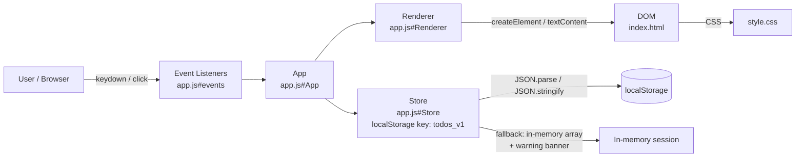

# Plan: Todo List App

**Spec**: [./spec.md](./spec.md)
**Type**: feat
**Size**: S
**Field**: greenfield
**Status**: draft

## Summary

Build a self-contained, three-file (index.html / style.css / app.js) todo app backed by localStorage. The data layer is a plain JS module that wraps `localStorage` and falls back to in-memory on failure; all rendering is DOM manipulation via `textContent` / `createElement` (never `innerHTML` on untrusted content). Each user story is a vertical slice added on top of the CRUD+persistence foundation: filter/count/clear (US2), due-date+priority+sort (US3), tags (US4).

## Technical Context

**Language**: HTML5 / CSS3 / ES2022 (vanilla) · **Framework**: none
**Storage**: `localStorage` (key: `todos_v1`) — JSON array of `Todo` objects · **Testing**: manual + e2e_visual (per spec)
**Target**: modern desktop and mobile browsers · **Perf**: SC-001 (30-second first-use) · **Scale**: single user, single device

## Gate check

- **Trust boundary**: user-typed title is untrusted; validated (non-empty, trimmed, ≤200 chars) before storage write. DOM updates use `textContent`/`createElement` — no `innerHTML` on user content, so no XSS sink. localStorage round-trip is own-origin first-party data; security phase 7 does not fire (no dangerous sink, no trust-boundary crossing per WORKFLOW.md security-trigger rule).
- **Ponytail**: no framework, no build step, no npm — enforced by FR-019. Vanilla DOM APIs are the right tool. `crypto.randomUUID()` (built-in) for todo IDs; `<input type="date">` for due-date picker (native). No new dependency is added.
- **Programming fundamentals**: module split — `store.js`-equivalent logic lives in `app.js` as a clearly delimited `Store` object; `Renderer` object handles DOM; `App` wires events. Three-object separation keeps functions short and testable by inspection.
- **Accessibility**: all interactive controls get explicit `aria-label` / `role`; focus indicators via CSS `:focus-visible`; keyboard paths tested per AC8, AC9, SC-003.
- **Responsive**: single flexible layout (max-width container, fluid sizing); verified at 320 px / 768 px / 1280 px per AC10, SC-005.

## Phases for this task

Matrix defaults for type=feat, size=S — no deviations.
Phases: 1 Interview+spec ✓ · 2 Plan ✓ · 2½ Test plan ✓ · 3 Gate ✓ · 4 Implement ✓ · 5 Test ✓ (e2e_visual=on per spec) · 6 Review ✓ · 7 Security check (will not fire — no dangerous sink, own-origin storage, no trust-boundary crossing) · 8 Docs ✓ · 9 Ship ✓ · 10 Retro ✓.

## Fanout plan

No fanout — single-pass. Greenfield S, one contiguous set of files, no disjoint surfaces.

## Architecture diagram

---

## Risks

- **localStorage quota**: exceeded writes silently fail on some browsers; the storage wrapper must catch on every `setItem` call and switch to the degraded warning path (FR-001).
- **Date input cross-browser**: `<input type="date">` is supported in all modern browsers; Safari on iOS renders natively. Edge case: empty value string must be treated as no-date.
- **Sort stability**: JS `Array.prototype.sort` is stable (ES2019+); safe to chain tiebreakers without a custom stable sort.
- **Tag filter + status filter interaction**: two simultaneous filter axes (status + tag). Render function must AND both. Needs an explicit test task.

## Rollback

Greenfield — discard the three files. No existing code is modified. Rollback: `git checkout main -- . && git branch -D 0002-feat-todolist` or simply delete `index.html`, `style.css`, `app.js`.
