# Plan: CIB data analytics webapp

**Spec**: [./spec.md](./spec.md)
**Type**: feat
**Size**: L
**Status**: draft

## Approach
Stand up a fresh case-centric investigative webapp under `/app/` as a Next.js (App Router + Tailwind) frontend talking to a Go hexagonal backend; persist cases, files, parsed graphs, and per-file column mappings in Postgres; provision ClickHouse + PuppyGraph in docker-compose but keep them dormant behind stub adapters for v1. The alternative — a single-page in-memory MVP — was rejected per the revised spec: graphs MUST survive page refresh and process restart, and "by case" is now the primary organizing axis, so persistence + multi-page UI are core, not optional. Greenfield: no existing code under `/app/`, so no `Current state` section — the LSP walk does not apply.

**Step order**: foundation-first — schema and ports land before adapters; adapters before use cases; use cases before HTTP; HTTP before frontend; the network chart lands last because every other surface must work first to feed it data.

**Default picks for spec open questions** (engineer/orchestrator can override before implementation):
1. PuppyGraph interpretation: confirmed as PuppyGraph (graph-query layer); stub-only in v1, non-blocking.
2. File-blob storage: **Postgres BYTEA column on `files.original_blob`** for v1 simplicity (xlsx capped at 5 MiB; one fewer mount; rollback = drop the table). Filesystem-under-`/data` remains the obvious v2 option.
3. Markdown renderer: **`react-markdown`** with `remark-gfm` for tables/checklists; sanitised via `rehype-sanitize`.

## Architecture diagram

```mermaid
flowchart LR
  U>Analyst] --> B[★ Next.js app under /app/frontend]

  subgraph FE[★ Frontend pages]
    P1[★ /cases data-explorer]
    P2[★ /cases/new create-case form]
    P3[★ /cases/:id case-detail]
    P4[★ /cases/:id/edit edit-case]
    P5[★ /cases/:id/upload upload + column-mapping]
  end
  B --> FE

  subgraph FC[★ Frontend components]
    C1[★ CaseCard / CaseFilters]
    C2[★ NetworkChart react-force-graph-2d]
    C3[★ NodeDetailPanel]
    C4[★ WeightSlider]
    C5[★ FileToggleList]
    C6[★ ExportButtons PNG+JSON]
    C7[★ ColumnMappingForm]
    C8[★ MarkdownView react-markdown]
    C9[★ ErrorBanner / EmptyState]
  end
  FE --> FC

  FE -->|HTTP+JSON| GO[★ Go HTTP API /app/backend cmd/api]

  subgraph DRIVING[★ Driving adapter: HTTP]
    H1[★ /api/cases CRUD + list+filters]
    H2[★ /api/cases/:id/files upload]
    H3[★ /api/cases/:id/files/:fid/mapping PATCH]
    H4[★ /api/cases/:id/graph GET combined]
    H5[★ /api/cases/:id/nodes/:nodeId GET detail]
    H6[★ /api/cases/:id/graph/export.json]
    H7[★ /healthz + /metrics]
  end
  GO --> DRIVING

  subgraph USECASE[★ Application use cases]
    UC1[★ CreateCase / UpdateCase / ArchiveCase]
    UC2[★ ListCases with filters]
    UC3[★ UploadFile + SetMapping + ParseFile]
    UC4[★ GetCombinedGraph + ToggleFileIncluded]
    UC5[★ GetNodeDetail + ExportGraphJSON]
  end
  DRIVING --> USECASE

  subgraph PORTS[★ Domain + ports]
    DOM[★ Case / Graph / Node / Edge / Mapping entities]
    PR1[★ CaseRepository port]
    PR2[★ FileRepository port]
    PR3[★ GraphRepository port]
    PR4[★ XlsxParser port]
    PR5[★ GraphStore port - dormant]
  end
  USECASE --> PORTS

  subgraph DRIVEN[★ Driven adapters]
    A1[★ postgres.CaseRepo]
    A2[★ postgres.FileRepo]
    A3[★ postgres.GraphRepo]
    A4[★ xlsx.ExcelizeParser]
    A5[★ puppygraph.StubStore dormant]
  end
  PORTS --> DRIVEN

  subgraph STORAGE[Storage runtimes]
    PG[(★ Postgres - used)]
    CH[(ClickHouse - provisioned dormant)]
    PG_QL[(PuppyGraph - provisioned dormant)]
  end
  A1 --> PG
  A2 --> PG
  A3 --> PG
  A5 -.dormant.-> PG_QL
  A5 -.dormant.-> CH
```

## Steps

### Phase 1: Repo skeleton + docker-compose + tooling

1. Create `/app/` workspace skeleton (frontend/, backend/, scripts/, README.md placeholder) — `app/README.md:new`, `app/.gitignore:new` (new) — verify: `test -d app/frontend && test -d app/backend && test -d app/scripts` [AC12]
2. Add root `docker-compose.yml` with 5 services (web=next, api=go, postgres=15, clickhouse=24, puppygraph=stub-or-latest) + named volumes — `app/docker-compose.yml:new` (new) — verify: `docker compose -f app/docker-compose.yml config | grep -c '^  [a-z]' | grep -q 5` [AC12]
3. Add `app/.env.example` with `POSTGRES_*`, `API_*`, `NEXT_PUBLIC_API_BASE_URL`, ClickHouse + PuppyGraph creds — `app/.env.example:new` (new) — verify: `grep -E '^(POSTGRES_|API_|NEXT_PUBLIC_)' app/.env.example | wc -l` ≥ 6 [AC12]
4. Add `app/Makefile` with `up`, `down`, `migrate`, `smoke`, `fmt`, `test` targets — `app/Makefile:new` (new) — verify: `make -C app -n up && make -C app -n smoke` exits 0 [AC12]
5. Add `app/scripts/migrate.sh` wrapping `goose -dir app/backend/internal/adapters/driven/postgres/migrations postgres "$DATABASE_URL" up` — `app/scripts/migrate.sh:new` (new) — verify: `bash -n app/scripts/migrate.sh` exits 0 [AC12]
6. Add `app/scripts/smoke.sh` shell that does case-create → upload bank/crypto/phone/travel fixtures → mapping → assert graph endpoint returns nodes>0 — `app/scripts/smoke.sh:new` (new) — verify: `bash -n app/scripts/smoke.sh` exits 0; full execution covered by AC12 [AC12]

### Phase 2: Postgres schema + migrations

7. Add migration `0001_create_cases.sql` (id uuid PK, title text NOT NULL, notes text DEFAULT '', tags text[] DEFAULT '{}', status text NOT NULL CHECK status IN ('open','closed','archived') DEFAULT 'open', created_at timestamptz, updated_at timestamptz) — `app/backend/internal/adapters/driven/postgres/migrations/0001_create_cases.sql:new` (new) — verify: `psql -c "\d cases"` shows all 7 columns [AC1, AC2, AC3]
8. Add indexes on `cases.status`, `cases.created_at`, `cases.tags` (GIN), and a `cases.title` trigram GIN index (`pg_trgm`) for substring search — `app/backend/internal/adapters/driven/postgres/migrations/0002_index_cases.sql:new` (new) — verify: `psql -c "\di"` shows 4 indexes on `cases` [AC4]
9. Add migration `0003_create_files.sql` (id uuid PK, case_id uuid NOT NULL REFERENCES cases ON DELETE CASCADE, filename text NOT NULL, original_blob bytea NOT NULL, byte_size int NOT NULL CHECK ≤ 5242880, sha256 text NOT NULL, uploaded_by text NOT NULL DEFAULT 'analyst', uploaded_at timestamptz, included bool NOT NULL DEFAULT true) — `app/backend/internal/adapters/driven/postgres/migrations/0003_create_files.sql:new` (new) — verify: `psql -c "\d files"` shows FK to cases and CHECK on byte_size [AC5, AC7, AC11]
10. Add migration `0004_create_file_mappings.sql` (file_id uuid PK REFERENCES files ON DELETE CASCADE, source_col text NOT NULL, target_col text NOT NULL, weight_col text, header_names jsonb NOT NULL, set_at timestamptz) — `app/backend/internal/adapters/driven/postgres/migrations/0004_create_file_mappings.sql:new` (new) — verify: `psql -c "\d file_mappings"` shows PK = FK [AC5]
11. Add migration `0005_create_file_graphs.sql` (file_id uuid PK REFERENCES files ON DELETE CASCADE, nodes jsonb NOT NULL, edges jsonb NOT NULL, node_count int, edge_count int, parsed_at timestamptz) — `app/backend/internal/adapters/driven/postgres/migrations/0005_create_file_graphs.sql:new` (new) — verify: `psql -c "\d file_graphs"` shows jsonb columns [AC6]
12. Add index on `file_graphs.file_id` (already PK) and GIN on `nodes`/`edges` jsonb (for future node-id lookups) — `app/backend/internal/adapters/driven/postgres/migrations/0006_index_graphs.sql:new` (new) — verify: `psql -c "\di file_graphs*"` shows 2 jsonb GINs [AC8]
13. Wire `goose` as the migration tool (chosen because go-native binary, no separate runtime, simple up/down) — `app/backend/go.mod:new` (new) + `app/backend/internal/adapters/driven/postgres/migrations/README.md:new` (new) — verify: `cd app/backend && go list -m github.com/pressly/goose/v3` resolves [AC12]

### Phase 3: Go domain layer + ports

14. Define `Case`, `CaseStatus`, `CaseFilters` value objects with `NewCase`, `Archive`, `SetTitle/Notes/Tags/Status` methods + validation (title non-empty, status in enum) — `app/backend/internal/domain/case/case.go:new` (new) — verify: `go test ./internal/domain/case/...` passes [AC1, AC2, AC3]
15. Define `Graph`, `Node`, `Edge`, `NodeID` types + `MergeGraphs(...) Graph` pure function that unions nodes by id and concatenates edges — `app/backend/internal/domain/graph/graph.go:new` (new) — verify: `go test -run TestMergeGraphs ./internal/domain/graph/...` passes with multi-file merge fixture [AC7]
16. Define `ColumnMapping{SourceCol, TargetCol, WeightCol}` value object + `Validate(headers []string) error` (returns sentinel error when any col missing) — `app/backend/internal/domain/graph/mapping.go:new` (new) — verify: `go test -run TestMappingValidate ./internal/domain/graph/...` passes (4 cases: ok, source missing, target missing, weight optional) [AC5, AC11]
17. Define `FilterEdgesByWeight(g Graph, min float64) Graph` pure function for the weight-slider semantics — `app/backend/internal/domain/graph/filter.go:new` (new) — verify: `go test -run TestFilterEdgesByWeight ./internal/domain/graph/...` passes [AC9]
18. Define `domain/errors.go` with sentinel errors: `ErrCaseNotFound`, `ErrFileNotFound`, `ErrInvalidMapping`, `ErrEmptyXlsx`, `ErrNotXlsx`, `ErrTooLarge`, `ErrInvalidStatus` — `app/backend/internal/domain/errors.go:new` (new) — verify: `go vet ./internal/domain/...` clean [AC11]
19. Define `CaseRepository` port interface: `Create(ctx, Case) error`, `Get(ctx, id) (Case, error)`, `Update(ctx, Case) error`, `List(ctx, CaseFilters) ([]Case, error)` — `app/backend/internal/app/ports/case_repository.go:new` (new) — verify: `go build ./internal/app/ports/...` succeeds [AC1, AC2, AC3, AC4]
20. Define `FileRepository` port: `Save(ctx, File) error`, `Get(ctx, id) (File, error)`, `ListByCase(ctx, caseID) ([]File, error)`, `SetIncluded(ctx, id, bool) error`, `SetMapping(ctx, id, ColumnMapping) error` — `app/backend/internal/app/ports/file_repository.go:new` (new) — verify: `go build ./internal/app/ports/...` succeeds [AC5, AC7]
21. Define `GraphRepository` port: `SaveFileGraph(ctx, fileID, Graph) error`, `GetByFile(ctx, fileID) (Graph, error)`, `GetByCase(ctx, caseID) (map[fileID]Graph, error)` — `app/backend/internal/app/ports/graph_repository.go:new` (new) — verify: `go build ./internal/app/ports/...` succeeds [AC6, AC7]
22. Define `XlsxParser` port: `ReadHeaders(blob []byte) ([]string, error)`, `Parse(blob []byte, m ColumnMapping) (Graph, error)` — `app/backend/internal/app/ports/xlsx_parser.go:new` (new) — verify: `go build ./internal/app/ports/...` succeeds [AC5, AC6, AC11]
23. Define `GraphStore` port (dormant for v1; documents v2 surface): `Publish(ctx, caseID, Graph) error` — `app/backend/internal/app/ports/graph_store.go:new` (new) — verify: `go build ./internal/app/ports/...` succeeds [AC12]

### Phase 4: Driven adapters

24. Implement `postgres.CaseRepo` against `CaseRepository` port using `pgxpool`; List composes WHERE clauses for title (`ILIKE`), tags (`&&`), status (`= ANY`), created-date range — `app/backend/internal/adapters/driven/postgres/case_repo.go:new` (new) — verify: `go test -run TestCaseRepo ./internal/adapters/driven/postgres/... -tags=integration` passes against ephemeral pg [AC1, AC2, AC3, AC4]
25. Implement `postgres.FileRepo` (insert, get by id, list by case, toggle included, set/replace mapping; mapping is upsert into `file_mappings`) — `app/backend/internal/adapters/driven/postgres/file_repo.go:new` (new) — verify: `go test -run TestFileRepo ./internal/adapters/driven/postgres/... -tags=integration` passes [AC5, AC7]
26. Implement `postgres.GraphRepo` (save+overwrite per file, get-by-file, get-by-case joins through files for included-only filter) — `app/backend/internal/adapters/driven/postgres/graph_repo.go:new` (new) — verify: `go test -run TestGraphRepo ./internal/adapters/driven/postgres/... -tags=integration` passes [AC6, AC7]
27. Implement `xlsx.ExcelizeParser` using `qax-os/excelize/v2`; `ReadHeaders` reads row 1 of first sheet; `Parse` iterates rows, builds Edge{Source, Target, Weight, RowIndex} with Weight=1.0 when WeightCol empty; rejects empty file with `ErrEmptyXlsx`, unparseable bytes with `ErrNotXlsx` — `app/backend/internal/adapters/driven/xlsx/excelize_adapter.go:new` (new) — verify: `go test ./internal/adapters/driven/xlsx/...` passes against 4 fixtures (bank/crypto/phone/travel) + 3 error cases [AC5, AC6, AC11]
28. Add xlsx test fixtures (synthetic bank statement, crypto statement, phone-call records, travel records — Thai column headers where the spec calls them out, ≤ 50 rows each) — `app/backend/internal/adapters/driven/xlsx/testdata/{bank,crypto,phone,travel}.xlsx:new` (new, 4 files) — verify: `ls app/backend/internal/adapters/driven/xlsx/testdata/*.xlsx | wc -l` = 4 [AC12]
29. Implement `puppygraph.StubStore`: `Publish` logs `graph_repo.persistence_deferred` once at startup and returns nil; documents the v2 contract in package doc — `app/backend/internal/adapters/driven/puppygraph/stub_store.go:new` (new) — verify: `go test ./internal/adapters/driven/puppygraph/...` passes (asserts log line on first call) [AC12]
30. Add `postgres.NewPool(ctx, dsn) (*pgxpool.Pool, error)` helper with conservative defaults (max 10 conns, 30s connect timeout) — `app/backend/internal/adapters/driven/postgres/pool.go:new` (new) — verify: `go build ./internal/adapters/driven/postgres/...` succeeds [AC12]
31. Add transaction helper `postgres.WithTx(ctx, pool, func(tx) error)` for the upload-and-parse atomic write — `app/backend/internal/adapters/driven/postgres/tx.go:new` (new) — verify: `go test -run TestWithTx ./internal/adapters/driven/postgres/... -tags=integration` passes (rollback on error path) [AC11]

### Phase 5: Application use cases

32. Implement `CreateCase(title, notes, tags) (Case, error)` use case with title-required validation, defaults status=open — `app/backend/internal/app/usecase/create_case.go:new` (new) — verify: `go test -run TestCreateCase ./internal/app/usecase/...` passes [AC1]
33. Implement `UpdateCase(id, patch) error` (title/notes/tags/status individually optional) — `app/backend/internal/app/usecase/update_case.go:new` (new) — verify: `go test -run TestUpdateCase ./internal/app/usecase/...` passes [AC2]
34. Implement `ArchiveCase(id)` setting status='archived' — `app/backend/internal/app/usecase/archive_case.go:new` (new) — verify: `go test -run TestArchiveCase ./internal/app/usecase/...` passes [AC3]
35. Implement `ListCases(filters)` composing search/tag/status/date filters and excluding archived when status filter is empty — `app/backend/internal/app/usecase/list_cases.go:new` (new) — verify: `go test -run TestListCases ./internal/app/usecase/...` passes (5 cases: no-filter excludes archived, status='archived' includes, search subset, tag intersect, date-range) [AC3, AC4]
36. Implement `UploadFile(caseID, filename, blob)` use case: size + sha256 check, read headers, save File row with empty mapping in a transaction; returns headers to caller — `app/backend/internal/app/usecase/upload_file.go:new` (new) — verify: `go test -run TestUploadFile ./internal/app/usecase/...` passes (ok + too-large + not-xlsx + empty rejection paths) [AC5, AC11]
37. Implement `SetMappingAndParse(fileID, ColumnMapping)` use case: validate mapping against stored headers, parse blob into Graph, persist mapping + graph in a single transaction, roll back on parser error — `app/backend/internal/app/usecase/set_mapping_and_parse.go:new` (new) — verify: `go test -run TestSetMappingAndParse ./internal/app/usecase/...` passes (ok path + invalid-mapping rollback path asserts no file_mappings/file_graphs row written) [AC5, AC6, AC11]
38. Implement `ToggleFileIncluded(fileID, bool)` use case (delegates to FileRepo) — `app/backend/internal/app/usecase/toggle_file.go:new` (new) — verify: `go test -run TestToggleFileIncluded ./internal/app/usecase/...` passes [AC7]
39. Implement `GetCombinedGraph(caseID)` use case: load all included file graphs, return `MergeGraphs(...)` result — `app/backend/internal/app/usecase/get_combined_graph.go:new` (new) — verify: `go test -run TestGetCombinedGraph ./internal/app/usecase/...` passes (2-file merge: shared node id collapses; excluded file is omitted) [AC6, AC7]
40. Implement `GetNodeDetail(caseID, nodeID)` use case: combine included graphs, return Node + its edges + originating xlsx row indexes/filenames — `app/backend/internal/app/usecase/get_node_detail.go:new` (new) — verify: `go test -run TestGetNodeDetail ./internal/app/usecase/...` passes (asserts edges + source rows attached) [AC8]
41. Implement `ExportGraphJSON(caseID)` use case returning the combined Graph as a marshallable struct (nodes + edges + per-edge attributes including source file id, row index, weight) — `app/backend/internal/app/usecase/export_graph_json.go:new` (new) — verify: `go test -run TestExportGraphJSON ./internal/app/usecase/...` passes [AC10]

### Phase 6: HTTP driving adapter

42. Wire `cmd/api/main.go` composition root: load env, open pgx pool, run migrations, construct repos + parser + stub store, construct use cases, mount router, listen on `API_PORT` — `app/backend/cmd/api/main.go:new` (new) — verify: `go build ./cmd/api/...` succeeds; `go run ./cmd/api -healthcheck` (a `-healthcheck` flag implemented in main) exits 0 [AC12]
43. Add `router.go` using `chi` mounting all endpoints under `/api/v1` + `/healthz` + `/metrics` — `app/backend/internal/adapters/driving/http/router.go:new` (new) — verify: `go test -run TestRouterRoutes ./internal/adapters/driving/http/...` passes (asserts each route registered) [AC12]
44. Add `middleware/logging.go` (structured JSON log per request: method, path, status, dur_ms, request_id) and `middleware/request_id.go` (uuid per request) — `app/backend/internal/adapters/driving/http/middleware/{logging,request_id}.go:new` (new, 2 files) — verify: `go test ./internal/adapters/driving/http/middleware/...` passes [AC12]
45. Add `middleware/errors.go` mapping domain sentinel errors to HTTP status codes (404 for NotFound, 400 for InvalidMapping/EmptyXlsx/NotXlsx, 413 for TooLarge, 422 for InvalidStatus, 500 for unknown) — `app/backend/internal/adapters/driving/http/middleware/errors.go:new` (new) — verify: `go test -run TestErrorMapping ./internal/adapters/driving/http/middleware/...` passes [AC11]
46. Add `handlers/cases.go` (POST /cases, GET /cases?title=&tag=&status=&from=&to=, GET /cases/:id, PATCH /cases/:id, POST /cases/:id/archive) — `app/backend/internal/adapters/driving/http/handlers/cases.go:new` (new) — verify: `go test -run TestCasesHandler ./internal/adapters/driving/http/handlers/...` passes (5 cases per route) [AC1, AC2, AC3, AC4]
47. Add `handlers/files.go` (POST /cases/:id/files multipart=file, GET /cases/:id/files, PATCH /cases/:id/files/:fid/mapping, PATCH /cases/:id/files/:fid/included) — `app/backend/internal/adapters/driving/http/handlers/files.go:new` (new) — verify: `go test -run TestFilesHandler ./internal/adapters/driving/http/handlers/...` passes (upload ok, mapping ok, mapping invalid → 400 + no rows written) [AC5, AC6, AC7, AC11]
48. Add `handlers/graph.go` (GET /cases/:id/graph returns combined Graph, GET /cases/:id/nodes/:nodeID returns NodeDetail, GET /cases/:id/graph/export.json returns Graph with `Content-Disposition: attachment`) — `app/backend/internal/adapters/driving/http/handlers/graph.go:new` (new) — verify: `go test -run TestGraphHandler ./internal/adapters/driving/http/handlers/...` passes [AC6, AC8, AC10]
49. Add `handlers/health.go` (GET /healthz returns 200 when pg ping ok; 503 otherwise) — `app/backend/internal/adapters/driving/http/handlers/health.go:new` (new) — verify: `curl -s :8080/healthz | jq .ok` returns `true` against running stack [AC12]
50. Add Prometheus metrics: counters `cib_cases_total{status}` (gauge via callback), `cib_files_uploaded_total{outcome}`, histograms `cib_parse_duration_seconds`, `cib_db_query_duration_seconds{operation}`, gauges `cib_combined_graph_size_nodes` / `_edges` — `app/backend/internal/adapters/driving/http/metrics.go:new` (new) — verify: `curl -s :8080/metrics | grep -c '^cib_'` ≥ 5 [AC12]
51. Add structured-log emission inside use cases for: `case.created`, `case.updated`, `case.archived`, `file.uploaded`, `mapping.set`, `file.parsed`, `graph.exported`, `upload.rejected` — `app/backend/internal/app/usecase/logging.go:new` (new) — verify: `go test -run TestUsecaseLogs ./internal/app/usecase/...` passes (asserts each event emitted once on its happy path) [AC12]

### Phase 7: Next.js scaffold + Tailwind

52. Initialize Next.js 14 App Router project under `app/frontend/` with TypeScript + Tailwind preconfigured — `app/frontend/package.json:new`, `app/frontend/tsconfig.json:new`, `app/frontend/next.config.js:new`, `app/frontend/tailwind.config.ts:new`, `app/frontend/postcss.config.js:new`, `app/frontend/app/globals.css:new` (new, 6 files) — verify: `cd app/frontend && npm install && npm run build` succeeds [AC12]
53. Add root layout with site header + nav (links to `/cases`) and global Tailwind reset — `app/frontend/app/layout.tsx:new` (new) — verify: `cd app/frontend && npm run build` succeeds; `curl -s :3000/ | grep -q 'cases'` after `npm run start` [AC4]
54. Add `app/page.tsx` redirecting to `/cases` — `app/frontend/app/page.tsx:new` (new) — verify: visit `/` returns 307 → `/cases` (verified via `curl -sI :3000/`) [AC4]
55. Add `lib/api.ts` typed client wrapping fetch with `NEXT_PUBLIC_API_BASE_URL`; functions per endpoint return parsed JSON or throw `ApiError{status,message}` — `app/frontend/lib/api.ts:new` (new) — verify: `cd app/frontend && npx tsc --noEmit` clean [AC12]

### Phase 8: Frontend pages

56. Build `/cases` data-explorer page: server-render initial list, client-side filter form (title search, tag multi-select, status select, date range) re-fetches on change; empty state "no cases yet — create your first case"; loading skeleton on initial fetch — `app/frontend/app/cases/page.tsx:new` (new) — verify: `cd app/frontend && npm run build` succeeds; smoke step asserts the page renders the 3 fixture cases with each filter combination [AC4]
57. Build `/cases/new` create-case form: title (required), notes (textarea), tags (comma-list → string[]), submit calls POST `/api/v1/cases`, on success redirect to `/cases/:id`; inline error banner on 4xx — `app/frontend/app/cases/new/page.tsx:new` (new) — verify: smoke step creates a case and asserts redirect to `/cases/:id` [AC1]
58. Build `/cases/[id]` case-detail page (server component layout) loading case + files + combined graph in parallel; renders three regions: header (title + status badge + tags), notes (MarkdownView), files panel (FileToggleList + upload button), chart region (NetworkChart + WeightSlider + ExportButtons + NodeDetailPanel) — `app/frontend/app/cases/[id]/page.tsx:new` (new) — verify: `cd app/frontend && npm run build` succeeds; smoke step loads the page and asserts all three regions present (data-testid attributes) [AC2, AC6, AC7, AC8, AC9, AC10]
59. Build `/cases/[id]/edit` edit-case page: form prefilled with case fields, submit calls PATCH, success redirects back to `/cases/:id`; archive button on this page calls POST `/cases/:id/archive` — `app/frontend/app/cases/[id]/edit/page.tsx:new` (new) — verify: smoke step archives a fixture case and asserts it's hidden from default list but visible under status='archived' filter [AC2, AC3]
60. Build `/cases/[id]/upload` two-step flow: step 1 file picker (≤ 5 MiB client-side guard + accepts `.xlsx` only) → POST /files returns `{file_id, headers}`; step 2 ColumnMappingForm bound to the returned headers → PATCH /files/:fid/mapping; on success redirect back to `/cases/:id` and re-render chart — `app/frontend/app/cases/[id]/upload/page.tsx:new` (new) — verify: smoke step uploads bank fixture, picks mapping, asserts chart includes nodes from that fixture [AC5, AC6, AC11]

### Phase 9: Frontend components

61. Build `CaseCard.tsx` (title, status badge, tag pills, created-at relative time, link to `/cases/:id`) — `app/frontend/components/CaseCard.tsx:new` (new) — verify: smoke asserts each list item has the expected text [AC4]
62. Build `CaseFilters.tsx` (controlled inputs: title search debounced 300ms, tag multi-select, status dropdown, date range) — `app/frontend/components/CaseFilters.tsx:new` (new) — verify: smoke triggers each filter and asserts the list size matches expected fixtures [AC4]
63. Build `NetworkChart.tsx` wrapping `react-force-graph-2d` dynamic-imported with `ssr: false`; props: `nodes`, `edges`, `onNodeClick`, `minWeight`; exposes ref for canvas access (for PNG export) — `app/frontend/components/NetworkChart.tsx:new` (new) — verify: smoke asserts `<canvas>` element present and node count attribute matches expected [AC6]
64. Build `NodeDetailPanel.tsx` side panel anchored right; shows node id, edge list with source filename + row index, weight; closes on backdrop click; fetches `/api/v1/cases/:id/nodes/:nodeID` on open — `app/frontend/components/NodeDetailPanel.tsx:new` (new) — verify: smoke clicks a node and asserts the panel header text matches the node id [AC8]
65. Build `WeightSlider.tsx` range input bound to `minWeight` state; debounced live update to `NetworkChart` without page reload — `app/frontend/components/WeightSlider.tsx:new` (new) — verify: smoke moves slider and asserts edge count drops [AC9]
66. Build `FileToggleList.tsx` listing files per case with on/off switches; PATCH /files/:fid/included on toggle; chart re-renders from refetched combined graph — `app/frontend/components/FileToggleList.tsx:new` (new) — verify: smoke toggles a file off and asserts the chart node count drops [AC7]
67. Build `ExportButtons.tsx` with two buttons: "Export PNG" reads canvas ref → `canvas.toBlob('image/png')` → triggers download; "Export JSON" calls `/api/v1/cases/:id/graph/export.json` and triggers download — `app/frontend/components/ExportButtons.tsx:new` (new) — verify: smoke clicks both and asserts files downloaded (`.png` ≥ 1KB, `.json` parses + has nodes/edges keys) [AC10]
68. Build `ColumnMappingForm.tsx` controlled form: three `<select>` (source/target/weight) populated from headers; weight is optional; submit posts PATCH /files/:fid/mapping; shows inline error on 400 + does not clear the form — `app/frontend/components/ColumnMappingForm.tsx:new` (new) — verify: smoke maps the bank fixture columns (sender→receiver→amount) and asserts redirect on success; submits an invalid mapping and asserts inline error visible [AC5, AC11]
69. Build `MarkdownView.tsx` using `react-markdown` + `remark-gfm` + `rehype-sanitize`; pre-styled with Tailwind prose classes — `app/frontend/components/MarkdownView.tsx:new` (new) — verify: smoke asserts the notes block renders `<h1>` for a `# heading` input and that `<script>` tags are sanitised [AC2]
70. Build `ErrorBanner.tsx` (dismissible inline alert with `error` / `info` variants) + `EmptyState.tsx` (icon + heading + body + optional CTA) — `app/frontend/components/{ErrorBanner,EmptyState}.tsx:new` (new, 2 files) — verify: smoke triggers an upload error and asserts the banner text matches the API error message; loads `/cases` on an empty DB and asserts the empty state CTA is visible [AC11, AC4]
71. Build `LoadingSkeleton.tsx` shared Tailwind skeleton for the cases list and case-detail header — `app/frontend/components/LoadingSkeleton.tsx:new` (new) — verify: `cd app/frontend && npm run build` succeeds; manual observable: skeleton flashes on a throttled-network page load (covered by the UX-constraint smoke assertion) [AC4]

### Phase 10: End-to-end smoke + docs

72. Flesh out `app/scripts/smoke.sh`: bring stack up via `make up`, wait for `/healthz`, exercise the 12 ACs end-to-end (case-create → list/filter → upload bank/crypto/phone/travel → mapping → toggle → node-click → weight slider via API → PNG + JSON export → archive → archived-filter visibility → empty case-detail rejection), exit non-zero on any assertion failure — `app/scripts/smoke.sh:edit` (edit) — verify: `bash app/scripts/smoke.sh` exits 0 against a freshly-booted stack [AC1, AC2, AC3, AC4, AC5, AC6, AC7, AC8, AC9, AC10, AC11, AC12]
73. Write `app/README.md`: quickstart (`cp .env.example .env && make up && make migrate && open http://localhost:3000`), 4-fixture demo walkthrough, architecture overview pointing to this plan, env-var reference table, troubleshooting (port conflicts, fresh DB reset) — `app/README.md:edit` (edit) — verify: `grep -c '^## ' app/README.md` ≥ 6 sections [AC12]
74. Verify the smoke run is in CI scope by adding it as a `make smoke` Makefile target that depends on `make up` + `make migrate` — `app/Makefile:edit` (edit) — verify: `make -C app -n smoke` shows the dependency chain [AC12]

## Files touched

| Path | Change | Why |
|------|--------|-----|
| `app/README.md` | new | Top-level quickstart + architecture overview |
| `app/.gitignore` | new | Ignore node_modules, build output, .env, postgres data |
| `app/docker-compose.yml` | new | 5-runtime local stack (next, go, postgres, clickhouse, puppygraph) |
| `app/.env.example` | new | Documents required env vars |
| `app/Makefile` | new | `up`, `down`, `migrate`, `smoke`, `fmt`, `test` |
| `app/scripts/migrate.sh` | new | Runs goose against postgres |
| `app/scripts/smoke.sh` | new | End-to-end AC coverage script |
| `app/backend/go.mod` | new | Go module declaration |
| `app/backend/cmd/api/main.go` | new | Composition root |
| `app/backend/internal/domain/case/case.go` | new | Case entity + value objects |
| `app/backend/internal/domain/graph/graph.go` | new | Graph/Node/Edge + MergeGraphs |
| `app/backend/internal/domain/graph/mapping.go` | new | ColumnMapping + Validate |
| `app/backend/internal/domain/graph/filter.go` | new | FilterEdgesByWeight |
| `app/backend/internal/domain/errors.go` | new | Sentinel errors |
| `app/backend/internal/app/ports/case_repository.go` | new | Port |
| `app/backend/internal/app/ports/file_repository.go` | new | Port |
| `app/backend/internal/app/ports/graph_repository.go` | new | Port |
| `app/backend/internal/app/ports/xlsx_parser.go` | new | Port |
| `app/backend/internal/app/ports/graph_store.go` | new | Dormant v2 port |
| `app/backend/internal/app/usecase/create_case.go` | new | Use case |
| `app/backend/internal/app/usecase/update_case.go` | new | Use case |
| `app/backend/internal/app/usecase/archive_case.go` | new | Use case |
| `app/backend/internal/app/usecase/list_cases.go` | new | Use case |
| `app/backend/internal/app/usecase/upload_file.go` | new | Use case |
| `app/backend/internal/app/usecase/set_mapping_and_parse.go` | new | Use case |
| `app/backend/internal/app/usecase/toggle_file.go` | new | Use case |
| `app/backend/internal/app/usecase/get_combined_graph.go` | new | Use case |
| `app/backend/internal/app/usecase/get_node_detail.go` | new | Use case |
| `app/backend/internal/app/usecase/export_graph_json.go` | new | Use case |
| `app/backend/internal/app/usecase/logging.go` | new | Structured-log helpers |
| `app/backend/internal/adapters/driven/postgres/pool.go` | new | pgxpool helper |
| `app/backend/internal/adapters/driven/postgres/tx.go` | new | Transaction helper |
| `app/backend/internal/adapters/driven/postgres/case_repo.go` | new | CaseRepository impl |
| `app/backend/internal/adapters/driven/postgres/file_repo.go` | new | FileRepository impl |
| `app/backend/internal/adapters/driven/postgres/graph_repo.go` | new | GraphRepository impl |
| `app/backend/internal/adapters/driven/postgres/migrations/0001_create_cases.sql` | new | Schema |
| `app/backend/internal/adapters/driven/postgres/migrations/0002_index_cases.sql` | new | Indexes |
| `app/backend/internal/adapters/driven/postgres/migrations/0003_create_files.sql` | new | Schema |
| `app/backend/internal/adapters/driven/postgres/migrations/0004_create_file_mappings.sql` | new | Schema |
| `app/backend/internal/adapters/driven/postgres/migrations/0005_create_file_graphs.sql` | new | Schema |
| `app/backend/internal/adapters/driven/postgres/migrations/0006_index_graphs.sql` | new | Indexes |
| `app/backend/internal/adapters/driven/postgres/migrations/README.md` | new | Migration tool notes |
| `app/backend/internal/adapters/driven/xlsx/excelize_adapter.go` | new | XlsxParser impl |
| `app/backend/internal/adapters/driven/xlsx/testdata/bank.xlsx` | new | Fixture |
| `app/backend/internal/adapters/driven/xlsx/testdata/crypto.xlsx` | new | Fixture |
| `app/backend/internal/adapters/driven/xlsx/testdata/phone.xlsx` | new | Fixture (ประวัติการโทร) |
| `app/backend/internal/adapters/driven/xlsx/testdata/travel.xlsx` | new | Fixture (ประวัติการเดินทาง) |
| `app/backend/internal/adapters/driven/puppygraph/stub_store.go` | new | Dormant v2 adapter |
| `app/backend/internal/adapters/driving/http/router.go` | new | chi routes |
| `app/backend/internal/adapters/driving/http/middleware/logging.go` | new | Structured logs |
| `app/backend/internal/adapters/driving/http/middleware/request_id.go` | new | Request id |
| `app/backend/internal/adapters/driving/http/middleware/errors.go` | new | Domain → HTTP mapping |
| `app/backend/internal/adapters/driving/http/handlers/cases.go` | new | Cases endpoints |
| `app/backend/internal/adapters/driving/http/handlers/files.go` | new | Files + mapping endpoints |
| `app/backend/internal/adapters/driving/http/handlers/graph.go` | new | Graph + node + export endpoints |
| `app/backend/internal/adapters/driving/http/handlers/health.go` | new | Health |
| `app/backend/internal/adapters/driving/http/metrics.go` | new | Prometheus metrics |
| `app/frontend/package.json` | new | Next.js + deps |
| `app/frontend/tsconfig.json` | new | TS config |
| `app/frontend/next.config.js` | new | Next config |
| `app/frontend/tailwind.config.ts` | new | Tailwind config |
| `app/frontend/postcss.config.js` | new | PostCSS for Tailwind |
| `app/frontend/app/globals.css` | new | Tailwind base + reset |
| `app/frontend/app/layout.tsx` | new | Root layout + nav |
| `app/frontend/app/page.tsx` | new | / → /cases redirect |
| `app/frontend/app/cases/page.tsx` | new | Data-explorer list |
| `app/frontend/app/cases/new/page.tsx` | new | Create case |
| `app/frontend/app/cases/[id]/page.tsx` | new | Case detail |
| `app/frontend/app/cases/[id]/edit/page.tsx` | new | Edit + archive |
| `app/frontend/app/cases/[id]/upload/page.tsx` | new | Upload + mapping flow |
| `app/frontend/lib/api.ts` | new | Typed API client |
| `app/frontend/components/CaseCard.tsx` | new | List item |
| `app/frontend/components/CaseFilters.tsx` | new | Filters bar |
| `app/frontend/components/NetworkChart.tsx` | new | react-force-graph-2d wrapper |
| `app/frontend/components/NodeDetailPanel.tsx` | new | Node side panel |
| `app/frontend/components/WeightSlider.tsx` | new | Edge filter UI |
| `app/frontend/components/FileToggleList.tsx` | new | Per-file include/exclude |
| `app/frontend/components/ExportButtons.tsx` | new | PNG + JSON export |
| `app/frontend/components/ColumnMappingForm.tsx` | new | Header → source/target/weight |
| `app/frontend/components/MarkdownView.tsx` | new | Notes render |
| `app/frontend/components/ErrorBanner.tsx` | new | Inline error alert |
| `app/frontend/components/EmptyState.tsx` | new | Empty states |
| `app/frontend/components/LoadingSkeleton.tsx` | new | Loading UI |

## Alternatives considered

- **Single-page React MVP with in-memory state** — rejected: revised spec requires graphs survive page refresh and process restart, plus a data-explorer list across cases. In-memory cannot satisfy AC2, AC3, or AC4.
- **Storing original xlsx blobs on a `/data` filesystem volume instead of Postgres BYTEA** — viable, leans v2-ish; rejected for v1 because the BYTEA approach keeps the rollback simple (drop table, no orphan files), centralises backup (one `pg_dump`), and the 5 MiB cap means the row size stays well under Postgres TOAST trouble. Re-open as a v2 follow-up when total blob volume exceeds ~1 GiB.
- **`golang-migrate` instead of `goose`** — both work; `goose` chosen because it's a pure-go binary that can be invoked from the api container without an extra runtime image, and the SQL-file format is simpler for a v1 footprint. No deciding-factor difference; carry as a follow-up if migration features get richer.
- **Embedding cytoscape.js instead of `react-force-graph-2d`** — cytoscape is more feature-rich (layout algorithms, styles), but spec ACs only need a clickable force-directed graph with weight thresholds and per-node detail. `react-force-graph-2d` ships those primitives with less integration code. Re-open if the v2 graph-query work needs richer rendering.
- **Splitting this into an epic (cases skeleton → upload+parse → chart+exports as separate slices)** — explicitly considered and rejected by the user via `Ship as: one-drop` in spec frontmatter. Single-drop accepted at the cost of a heavier review pass.

## Risks

| Risk | Likelihood | Mitigation |
|------|------------|------------|
| 5-runtime docker-compose footprint may exceed the engineer/QA container's resources (Postgres + ClickHouse + PuppyGraph + Go + Next.js) | med | docker-compose marks clickhouse + puppygraph with `profiles: ["v2"]` so v1 acceptance only requires postgres+go+next to boot. Smoke script uses the v1 profile by default. |
| Engineer/QA remote container may not have Go, Node, or Docker installed | med | engineer's first action under this plan should be a tool-check; if missing, escalate to the user. Documented as a precondition in `app/README.md` (step 73). |
| Multi-file node-merge tiebreaker is ambiguous when two files give the same node id different attributes | med | Tiebreaker rule encoded in `MergeGraphs` (step 15): attributes from the later upload (file with the **greater** `uploaded_at`) win; ties broken by file_id lexicographic ascending. Conflicts are captured in `[]MergeConflict` and surfaced in the graph response, node-detail panel, and export. Documented in package doc; unit-tested in `TestMergeGraphs_UnionsNodesByID` + `TestMergeGraphs_TieBreakerLexicographic` + `TestMergeGraphs_ReturnsConflictsOnAttributeMismatch`. |
| Postgres BYTEA storage may bloat backups if users upload many large files | low | 5 MiB per-file cap (spec constraint, enforced in step 9 CHECK + step 36 use case) means even 1000 files = 5 GiB worst-case. Carry as a v2 follow-up if real usage exceeds 100 cases. |
| PuppyGraph interpretation may still differ from the real intent | low | v1 doesn't write to PuppyGraph (stub adapter); only the v2 design changes if the interpretation is wrong. Captured in spec OQ #1. |
| One-drop scope on the larger side (74 steps, ~10 phases); engineer fatigue is real | high | Per the `/dev` plan contract: scope is large but spec is `one-drop`, no split. Phases are grouped so engineer can take them one at a time with TaskCreate per phase. Lead/QA review walks phases independently in `review.md`. |
| Column-mapping rollback (mapping invalid → no file row left behind) easy to get wrong if upload + mapping are separate HTTP calls | med | Upload (step 36) creates a `files` row with empty mapping; PATCH mapping (step 37) is a single transaction that writes mapping + graph or rolls back both. Empty-mapping `files` rows that linger >24h are surfaced as a v2 cleanup follow-up, not blocking for v1. |
| `react-force-graph-2d` SSR incompatibility (uses canvas + window) | low | NetworkChart (step 63) is dynamic-imported with `ssr: false`. Standard Next.js App Router pattern. |
| Thai-language column headers in phone/travel fixtures may break naive ASCII assumptions in the parser | low | excelize handles UTF-8 cell values natively. Step 27 includes a phone+travel fixture test that exercises Thai headers end-to-end. |

## Observability

**Logs** (structured JSON, one event per line, emitted by use cases via step 51):
- `case.created` — fields: `case_id`, `title_len`, `tags_count`
- `case.updated` — fields: `case_id`, `fields_changed[]`
- `case.archived` — fields: `case_id`
- `file.uploaded` — fields: `case_id`, `file_id`, `byte_size`, `sha256`
- `mapping.set` — fields: `file_id`, `source_col`, `target_col`, `weight_col`
- `file.parsed` — fields: `file_id`, `node_count`, `edge_count`, `parse_dur_ms`
- `graph.exported` — fields: `case_id`, `format`, `node_count`, `edge_count`
- `upload.rejected` — fields: `case_id`, `reason` (`empty` / `not_xlsx` / `too_large` / `invalid_mapping`)

**Metrics** (Prometheus, exposed at `/metrics`):
- `cib_cases_total{status}` — gauge, refreshed on each list; labels: `open`, `closed`, `archived`
- `cib_files_uploaded_total{outcome}` — counter; labels: `ok` (accepted), `rejected` (validation/parser rejection — empty, not-xlsx, too-large, invalid-mapping), `rejected_multipart` (multipart-form parse failure or oversized body), `rejected_io` (read failure on uploaded part)
- `cib_parse_duration_seconds` — histogram, buckets: 0.05, 0.1, 0.25, 0.5, 1, 2.5, 5, 10
- `cib_combined_graph_size_nodes` / `cib_combined_graph_size_edges` — gauges, set on each GET /graph
- `cib_db_query_duration_seconds{operation}` — histogram; operations: `case.create`, `case.list`, `file.save`, `graph.save`, `graph.get_by_case`

## Dependencies

**External (Go)**:
- `github.com/jackc/pgx/v5 >= 5.5` — Postgres driver + pool
- `github.com/pressly/goose/v3 >= 3.18` — migrations
- `github.com/xuri/excelize/v2 >= 2.8` — xlsx parsing (Thai/UTF-8 safe)
- `github.com/go-chi/chi/v5 >= 5.0` — router
- `github.com/prometheus/client_golang >= 1.18` — metrics

**External (Node)**:
- `next ^14.2`, `react ^18.3`, `react-dom ^18.3`
- `tailwindcss ^3.4`, `@tailwindcss/typography` (for Markdown prose styling)
- `react-force-graph-2d ^1.25`
- `react-markdown ^9`, `remark-gfm ^4`, `rehype-sanitize ^6`

**Internal**:
- None. Greenfield app under `/app/`. Workflow scaffolding at repo root is untouched.

## Rollback

V1 is expand-only — every migration creates a new table or new index. No destructive ops touch any pre-existing state (there is no pre-existing state).

- **Trigger**: smoke script fails against the freshly-booted stack, OR the user requests revert.
- **Steps**:
  1. `git revert <merge-commit-sha>` on the branch.
  2. `docker compose -f app/docker-compose.yml down -v` to remove the named postgres/clickhouse/puppygraph volumes (kills all v1 state).
  3. If the migration ran in a longer-lived env: `cd app/backend && goose -dir internal/adapters/driven/postgres/migrations postgres "$DATABASE_URL" down-to 0` removes all 6 migrations cleanly (down-migrations included alongside each up).
  4. Re-run `make -C app smoke` against the reverted commit on a fresh DB to confirm the stack still works post-revert (sanity).
- **Data loss?**: All v1 data (cases, files, mappings, graphs) is deleted by the rollback by design — there is no upstream consumer in v1. The original xlsx blobs are also lost because they live only in `files.original_blob`. This is acceptable for v1 because:
  - v1 is local-only (no production deploy in scope per spec).
  - No real CIB data lands in the repo (synthetic fixtures only, per spec data constraint).
  - Re-uploading the fixtures is a single `make smoke` away.

## Out of scope

- Authentication, RBAC, real user identities (spec Out non-goal #1).
- Real CIB / personal data; only synthetic fixtures (spec data constraint).
- Production deploy (compose-only).
- PuppyGraph / ClickHouse read or write paths (stubs only).
- Real-time / streaming ingest.
- Files > 5 MiB.
- Automatic column-name heuristics (spec Out #7).
- Multi-user collaboration / live cursors.
- v2 graph-query features (Cypher / Gremlin).
- File-blob storage on filesystem (deferred to v2; see Alternatives).
- Cleanup of orphan `files` rows whose mapping was never set (deferred to v2; see Risks).
