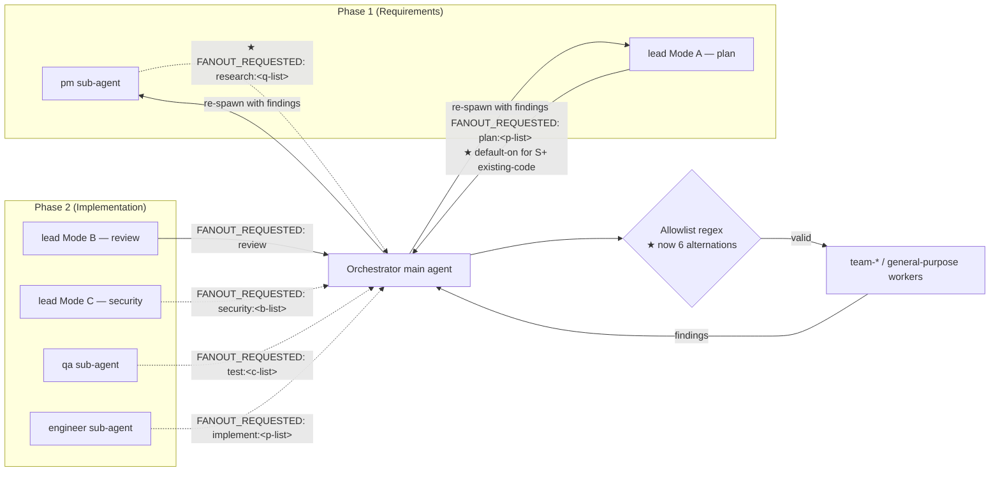

# Plan: Fanout default-on at safe parallel points

**Spec**: [./spec.md](./spec.md)
**Type**: feat
**Size**: S   <!-- 5 markdown files, surgical edits, one coordinated concept; no logic change, no schema, no public API. S-tier per `plan-writing > references/size-tiering.md`. -->
**Status**: draft

## Approach

Flip plan-mode fanout from opt-in to default-on by editing the trigger phrase at three coordinated sites (`lead.md` step 9, `fanout-team-agents/SKILL.md > When to use` Plan row, `WORKFLOW.md > Fanout availability` paragraph) and add a 5th payload shape `research:<question-list>` at two sites (orchestrator allowlist regex + the documented-payload-shapes table; mirrored row in `SKILL.md > When to use`). The obvious alternative — keep opt-in but lower the threshold — was rejected during the interview because the opt-in heuristic almost never fires in practice; default-on with two skip cases (XS, pure-greenfield) is simpler than a heuristic that gates on "disjoint" semantics nobody applies consistently.

## Current state

<!-- Required: this is feat editing existing markdown across 5 integration points. Per `plan-writing > principle 3`, non-greenfield work needs a current-state walk even at S tier. -->

**Entry point(s)**:
- `.claude/agents/lead.md:52` — the opt-in trigger phrase for plan-mode fanout (Mode A step 9). This is the source the other sites mirror.
- `.claude/orchestrator.md:100` — the allowlist regex the main agent uses to validate `FANOUT_REQUESTED:` return signals.

**Data / control flow** (5 hops, LSP- and grep-walked):
1. `lead` Mode A step 9 — `.claude/agents/lead.md:52` — decides whether to return `FANOUT_REQUESTED: plan:<point-list>`. Today's trigger phrase: "if `spec.md > Constraints > Integration points` lists ≥ 2 independent integration points whose code paths do not share files or symbols". Default = single-pass.
2. lead returns the signal as the first line of its response → orchestrator scans the first line at `.claude/orchestrator.md:97`.
3. Orchestrator validates against the allowlist regex at `.claude/orchestrator.md:100`. Today the regex has 5 alternations: `review | security:<...> | plan:<...> | test:<...> | implement:<...>`. A 6th alternation `research:<...>` does not exist.
4. If valid, orchestrator dispatches one worker per payload entry per `.claude/orchestrator.md:107-113` (the 5-shape table).
5. Workers return; orchestrator re-spawns the calling sub-agent for synthesis per `.claude/orchestrator.md:140-145`.

Sibling reference paths (touched by this plan but not on the dispatch flow):
- `.claude/skills/fanout-team-agents/SKILL.md:27-33` — the `When to use` table; Plan row at line 31 currently says "opt-in | `spec.md > Constraints > Integration points` lists ≥ 2 independent points".
- `.claude/skills/fanout-team-agents/SKILL.md:51-58` — the 4-documented-shapes block lists the same 5 shapes as `orchestrator.md:107-113`. No `research:` row.
- `.claude/skills/fanout-team-agents/SKILL.md:147-153` — second copy of the allowlist regex (the duplication noted as F0002 / AC8).
- `WORKFLOW.md:88` — the `Fanout availability` paragraph reads "plan-mode fanout is available at step 2 (opt-in per integration point)".
- `.claude/agents/pm.md:10,47,62,72` — pm.md mentions `BLOCKER:` return signals but has no clause authorising a `FANOUT_REQUESTED: research:<…>` return.

**Callers / blast radius**:
- The phrase `Default = single-pass` (`.claude/agents/lead.md:52`): 1 caller — lead Mode A itself. Removing it changes only this site's behaviour; no other file paraphrases it.
- The allowlist regex (`.claude/orchestrator.md:100` and mirrored at `.claude/skills/fanout-team-agents/SKILL.md:150`): 2 callers (orchestrator validation + skill documentation). Both must add the `research:<...>` alternation in lockstep — F0002 (single source of truth) is explicitly out of scope per spec; the duplication continues.
- The `When to use` table at `.claude/skills/fanout-team-agents/SKILL.md:27-33`: 0 callers in code; documentation-only — no symbol lookup. But the Plan row's phrasing must match the new `lead.md:52` phrase for AC2.
- The `Fanout availability` paragraph at `WORKFLOW.md:88`: 0 callers in code; user-facing prose. AC6 binds.
- `pm.md` return-signal mechanism: pm.md today documents only `BLOCKER:` returns (lines 10, 47, 62, 72). To support AC4 (pm "may also signal" research), one new clause is needed authorising the `FANOUT_REQUESTED: research:<…>` return path. Without it, the orchestrator regex would accept the signal but pm's contract would not document when pm may emit it.

**Invariants the current code relies on**:
- The first-line scan at `.claude/orchestrator.md:97` reads only the first line of a sub-agent return. Any new signal must be emittable as the first line — preserved (research returns the signal as the first line, identical to the existing 4 shapes).
- The allowlist regex anchors on `^` and `$` (`.claude/orchestrator.md:100`). Any new alternation must obey the `[a-z0-9,\-]+` payload character class — preserved (research-question slugs are kebab-case lowercase, identical to the existing 4 parameterised shapes).
- The `When to use` table in `SKILL.md` mirrors the orchestrator's dispatch table — preserved (every row added in one place gets a sibling row in the other).
- pm.md's spec-writing contract is "interview Q&A in, spec.md out" with `BLOCKER:` as the only return-signal class today (`pm.md:10,62,72`). Adding a `FANOUT_REQUESTED: research:<…>` return path extends — does not replace — this contract; pm still defaults to writing spec.md when interview answers are sufficient.
- `.workflow/_templates/spec.md` is untouched by every existing fanout-related change (verified: `git log -- .workflow/_templates/spec.md` history is independent of fanout commits). AC7 pins this invariant — preserved.

## Architecture diagram

To-be flow for the two new entries (plan default-on, research shape). Existing 4 shapes shown for context; `★` marks the new pieces.

Dotted = opt-in shapes; solid = mandatory or default-on shapes.

## Steps

1. Rewrite plan-mode fanout trigger phrase — `.claude/agents/lead.md:52` (edit) — verify: `grep -n "Default = single-pass" .claude/agents/lead.md` returns 0 matches AND `grep -n "Default = fanout for plan size" .claude/agents/lead.md` returns ≥ 1 match [AC1]
2. Update Plan row in `When to use` table — `.claude/skills/fanout-team-agents/SKILL.md:31` (edit) — verify: `grep -n "Phase 1 step 2 — plan" .claude/skills/fanout-team-agents/SKILL.md` shows the new phrasing "default-on for plan size ∈ {S, M, L} AND existing code; skip XS / pure-greenfield" [AC2]
3. Extend orchestrator allowlist regex to include `research:` — `.claude/orchestrator.md:100` (edit) — verify: `grep -nE "research:\[a-z0-9,\\\\-\]\+" .claude/orchestrator.md` returns 1 match on line 100 (mirror the existing alternation pattern at `.claude/orchestrator.md:100`) [AC3]
4. Mirror the allowlist regex update in the skill validator block — `.claude/skills/fanout-team-agents/SKILL.md:150` (edit) — verify: `grep -nE "research:\[a-z0-9,\\\\-\]\+" .claude/skills/fanout-team-agents/SKILL.md` returns 1 match on line 150 [AC3, AC8]
5. Add `FANOUT_REQUESTED: research:<question-list>` row to the documented-payload-shapes table — `.claude/orchestrator.md:107-113` (edit; insert new row after `implement:` row at line 113) — verify: `grep -n "FANOUT_REQUESTED: research:" .claude/orchestrator.md` returns ≥ 1 match and the row names "main agent at step 6 interview-prep; pm sub-agent via return-signal" as the caller set [AC4]
6. Add `research:<question-list>` row to `When to use` table in skill — `.claude/skills/fanout-team-agents/SKILL.md:27-33` (edit; insert new row after the `implement` row at line 33) — verify: `grep -n "research:<question-list>" .claude/skills/fanout-team-agents/SKILL.md` returns ≥ 1 match AND the row notes "research workers are `general-purpose` (no `team-<role>` constraint)" [AC5]
7. Add `research:<question-list>` line to the 4-documented-shapes block — `.claude/skills/fanout-team-agents/SKILL.md:51-58` (edit; append line and update the surrounding "Four documented shapes" heading to "Five documented shapes") — verify: `grep -n "FANOUT_REQUESTED: research:<question-list>" .claude/skills/fanout-team-agents/SKILL.md` returns ≥ 1 match [AC5, AC8]
8. Update `Fanout availability` paragraph — `WORKFLOW.md:88` (edit) — verify: `grep -n "default-on for S+ existing-code plans" WORKFLOW.md` returns ≥ 1 match AND `grep -n "opt-in per integration point" WORKFLOW.md` returns 0 matches [AC6]
9. Add pm.md clause authorising the `research:<question-list>` return-signal — `.claude/agents/pm.md:72` (edit; append a one-line rule under the existing `Done` section listing the new return shape alongside `BLOCKER:`) — verify: `grep -n "FANOUT_REQUESTED: research:" .claude/agents/pm.md` returns 1 match (resolves OQ1; mirrors the existing `BLOCKER:` return-signal pattern at `pm.md:10,62,72`) [AC4]
10. Confirm `.workflow/_templates/spec.md` was not modified — `.workflow/_templates/spec.md` (no change) — verify: `git diff -- .workflow/_templates/spec.md` is empty [AC7]
11. Capture smoke-evidence greps into the run's retro buffer — `.workflow/0003-feat-fanout-default-on/retro.md:new` (record for retro to lift; this step lands during the retro phase but the plan pre-commits the evidence shape) — verify: retro phase will record output of greps from steps 1, 2, 3, 4, 5, 6, 7, 8, 9 in `retro.md > Smoke evidence` so a future regression is bisectable [AC9]

## Files touched

| Path | Change | Why |
|------|--------|-----|
| `.claude/agents/lead.md` | edit | Rewrite plan-mode fanout trigger from opt-in to default-on at step 9 (line 52). AC1. |
| `.claude/orchestrator.md` | edit | Extend allowlist regex (line 100) to include `research:` alternation; add row for the new shape to the documented-payload-shapes table (lines 107–113). AC3, AC4. |
| `.claude/skills/fanout-team-agents/SKILL.md` | edit | Mirror the regex update (line 150); update Plan row in `When to use` table (line 31) and add Research row (around line 33); add `research:<…>` line to 4-documented-shapes block (lines 51–58) and update the heading. AC2, AC3, AC5, AC8. |
| `WORKFLOW.md` | edit | Update `Fanout availability` paragraph (line 88) to reflect default-on plan-mode + opt-in research. AC6. |
| `.claude/agents/pm.md` | edit | Add one-line clause authorising the `FANOUT_REQUESTED: research:<…>` return-signal alongside the existing `BLOCKER:` mechanism (around line 72). AC4. Resolves OQ1. |
| `.workflow/_templates/spec.md` | (no change) | Pinned invariant — AC7. |

## Risks

| Risk | Likelihood | Mitigation |
|------|------------|------------|
| Regex update lands in one of the two duplicated sites but not the other (orchestrator OR skill, not both) | med | Steps 3 and 4 are sequenced and each carries its own grep verify; review-mode rechecks both files. AC3 grep is the canonical evidence — if either site lacks the alternation the AC fails. |
| Trigger phrasing drifts between `lead.md` and `SKILL.md`/`WORKFLOW.md` (one says "default-on for S+", another says "default-on for ≥ S") | med | The verify clauses on steps 1, 2, 8 all grep for the literal phrase "default-on for S+ existing-code" (or close variant per AC text). Mismatch breaks the grep. AC9 retro grep captures all four sites at once for bisectability. |
| `pm.md` clause makes pm's contract incoherent (pm has two return paths but no example of when to pick which) | low | Step 9 mirrors the existing `BLOCKER:` pattern at `pm.md:10,62,72` (one-line clause, same shape). The orchestrator already handles `FANOUT_REQUESTED:` for other sub-agents; pm is the 4th caller, not a new mechanism. |
| Future run's plan-mode fanout silently fails because the new default-on rule isn't picked up (cached lead.md from a previous session) | low | AC9 retro grep-evidence makes this bisectable; first /dev run after this ships will exercise the new path; future regressions will fail at the AC1/AC6 grep checks. F0002 (single source of truth) is acknowledged as out-of-scope per spec — the duplication continues but both sites are now grep-verified. |

## Observability

N/A — this run edits markdown agent/skill/workflow files; no runtime code, no logs, no metrics. Smoke-evidence greps in `retro.md` (AC9) are the only "observability" artefact and they're documented in step 11 + the Risks table.

## Rollback

N/A — change is reversible by reverting the commit. All 5 file edits are in one logical commit; `git revert <sha>` restores the opt-in trigger phrase and removes the `research:<…>` alternation in lockstep.

## Out of scope

- **F0002** — single source of truth for the `FANOUT_REQUESTED:` allowlist regex. The duplication between `.claude/orchestrator.md:100` and `.claude/skills/fanout-team-agents/SKILL.md:150` continues; this run adds the new payload shape to both, it does not refactor the duplication away. Acknowledged in AC8 and surfaced in retro.
- **F0004** — `implement:<phase-list>` race with `state.json` Case 3 guard. Out per spec.
- **F0015** — trigger-heuristic phrasing normalised across all 5 fanout callsites. Only the plan-explore row is updated here; phrasing drift in the other 4 rows is left as-is.
- **Mid-implement reviewer fanout** — dropped at interview Q1; the existing Mode B review fanout at step 5 covers this.
- **Backwards-compat shims for the old opt-in phrase** — the change is a hard cut; the old phrase is removed, not aliased.
- **`.workflow/_templates/spec.md` changes** — none (AC7).
- **OQ3** — XS / pure-greenfield definition precision. Plan accepts the existing informal threshold (option (a) per the parent prompt); no new definition clause is added.
