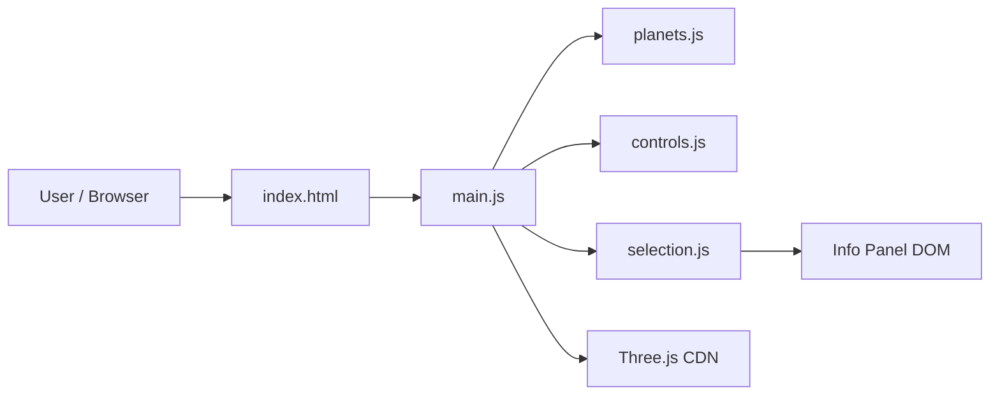

# Plan: Solar System 3D Three.js

**Spec**: [./spec.md](./spec.md)
**Type**: feat
**Size**: S
**Field**: greenfield
**Status**: draft

## Summary

Build a single self-contained HTML page that uses Three.js (CDN) to render a stylized 3D solar system with OrbitControls camera and raycaster-based planet selection. Each planet is a colored MeshStandardMaterial sphere on a circular orbit path, animated in requestAnimationFrame. Selection uses Raycaster to detect planet clicks, animates the camera with manual lerp, and toggles an absolutely-positioned HTML info panel. Vanilla JS over React Three Fiber because this is a single-page demo with no component hierarchy or state management needs.

## Technical Context

**Language**: JavaScript (ES2020+, no transpilation) · **Framework**: Three.js (CDN, r160+), OrbitControls (Three.js addon)
**Storage**: none · **Testing**: manual browser verification (unit tests for planet data module)
**Target**: modern desktop browsers (Chrome/Firefox/Edge latest) · **Perf**: 60fps animation (SC-001), < 3s load (SC-004) · **Scale**: single user, client-only

## Gate check

- **Trust boundary**: none — no external input, no user-submitted data, no server
- **Ponytail**: Three.js CDN is the only dependency; OrbitControls ships with Three.js addons; no build tooling needed; CSS is inline

## Folder structure

```
solar-system/
  index.html        # Entry point, inline CSS, info panel markup
  js/
    main.js         # Scene setup, animation loop, resize handler
    planets.js      # Planet data array + factory function
    controls.js     # OrbitControls setup + camera animation
    selection.js    # Raycaster click handling + info panel logic
```

## Phases for this task

Matrix defaults for type=feat, size=S — no deviations:
1. Spec (combined) 2. Plan (combined) 3. Gate 4. Implement 5. Test 6. Review 7. Security (trigger-based) 8. Docs+Ship (merged) 9. Retro (inline)

## Fanout plan

No fanout — single-pass.

## Architecture diagram


