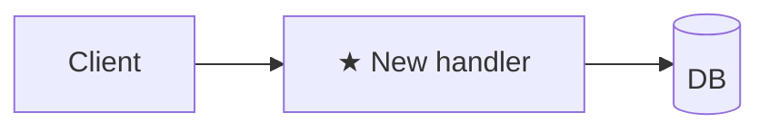

# Plan: <title>

**Spec**: [./spec.md](./spec.md) · **Type**: feat | fix | refactor | chore | docs | spike · **Size**: XS | S | M | L · **Status**: draft | approved | done

## Outcome
The 30-second read before the technical detail — plain language, no `path#anchor` (the cited walk is `## Current state` when present). Always rendered; one short line per bullet is fine on XS.

- **Before:** <how the system / flow behaves today — one line>
- **After:** <how it behaves once these Steps land>
- **Benefit:** → `spec.md > Outcome` (link the product win; don't restate it here)

<!--
## Reviewer summary
TRIGGER: Size=L OR ≥3 decisions need gate sign-off. Comes BEFORE ## Approach. Max 10 lines.

**Root cause / goal**: one sentence.

**Decisions needing sign-off**:
- Decision 1: <what was chosen> — <why, and what was rejected>
- Decision 2: …

**Top risks**:
- High: …
- Medium: …
-->

## Approach
2–3 sentences: strategy + why this over the obvious alternative.
<!-- Type-specific: fix → state the root cause; step 1 of Steps is a failing regression test vs spec.md > Reproduction · refactor → one-line behaviour-equivalence statement (what stays identical + how it's verified); when the touched behaviour isn't already covered by a test, step 1 of Steps = capture a characterization baseline (golden-master/snapshot of current behaviour) BEFORE the structural change · spike → name the question + what evidence counts as an answer. -->

## Architecture diagram
<!-- ALWAYS required. Mark new pieces ★. Type picks the diagram: feat=flowchart · fix=sequenceDiagram · refactor=before/after · chore/docs=one-line or N/A · spike=question-marked. XS may be a single line. -->

## Steps
Format: `<action> — path#anchor (new|edit|delete) — verify: <command or observable> [AC#]` (or `[DoD]` when the step delivers a `spec.md > Definition of Done` item rather than an acceptance criterion)

`path#anchor` is a **re-resolvable** location, not a raw line number: the **symbol** for code (`src/users.ts#getUserById`), or a **unique quoted snippet/heading** for shell/markdown/config (`dev-state-mark.sh#"command -v jq"`). A reader must be able to re-find it with LSP or `grep` after earlier steps shift the file — a bare `:42` goes stale the moment a step above it edits the file and makes the whole plan read as untrustworthy. Append a line only as a write-time hint (`#getUserById (~L42)`), never as the sole handle; use `path (new)` for new files.

`verify` must be runnable or a concrete observable — never "manually check". Split until each piece verifies atomically. For L plans >12 steps, group under `### Phase N: <name>` (grouping, not gates). When phases are used, ALL cross-references elsewhere in the document (Risks, prose, other sections) MUST use `P<phase>.<step>` notation (e.g., `P3.2`) — never a bare global step number, since phases restart at 1.

**Parallelizable phases (feat-only)**: a `feat` plan MAY mark phases for concurrent implementation. Each parallel phase declares, under its heading before its Steps: `**Parallelizable:** yes` · `**Files touched (exclusive):** <paths>` (no other parallel phase may list any of these — overlap or a shared barrel/router/DI/lockfile makes the orchestrator refuse fanout) · `**Depends on:** none` (a dependency edge also refuses fanout). Such a plan MUST end with a sequential `### Phase <last>: integration` (`**Parallelizable:** no`) that owns the shared glue + dependency installs + running the verifies + acceptance reconciliation — the parallel phase-engineers are write-only. Never mark `fix`/`refactor`/`spike` phases parallel (step-1 ordering forbids it). Full contract: `plan-writing > Parallelizable phases`.

**Error/boundary coverage**: when a step's `[AC#]` carries an `on error / at boundary:` clause in the spec, the happy path is not enough — either that step's `verify` exercises the unhappy path too, or a separate step delivers + verifies it. An AC whose error clause has no delivering+verifying step is covered on paper only.

**Dependency hygiene**: any new third-party dependency a step introduces MUST be named with an exact version that exists, and the step's `verify` confirms it resolves (present in the lockfile / `npm ls <pkg>@<version>` / equivalent) — never an unpinned or assumed package name (guards against hallucinated and typo-squatted packages).

1. <action> — `path/to/file.ext#symbolOrSnippet` (new) — verify: `npm test path/to/foo.test.ts` [AC1]

<!--
Outcome + Approach + Architecture diagram + Steps are the always-required sections. Add the sections below ONLY when this task needs them, then DELETE the rest (no empty headers, no "N/A"). These triggers are authoritative — lead.md reads them. Size picker lives in plan-writing > size-tiering.

Optional sections — include WHEN:
- Hard-to-reverse decisions — the plan commits to anything expensive to undo once shipped: schema/migration shape, public API or event contract, architecture/topology choice, data backfill / destructive script (one line each: decision · why now · cost to reverse). Comes right AFTER ## Approach; the gate lifts each line for explicit human confirmation.
- Step order — Size ∈ {S, M, L} and order matters (`foundation-first | riskiest-first | outside-in | inside-out` — because <reason>)
- Current state — M/L OR refactor OR fix (LSP-walk existing code, cite `path#anchor`: entry points · data/control flow 3–7 hops · callers/blast radius · invariants. refactor→Anti-goals that must stay identical, noting which already have test coverage vs which need a characterization baseline captured first; fix→Bug path line). This is the `path#anchor`-cited detail; the plain-language one-liner already lives in `## Outcome > Before` — complement it, don't duplicate it.
- References / examples to follow — `spec.md` carries a `References / examples to follow` section (the user gave an artifact to model after). Restate each repo ref as `path#anchor` and tag the Step(s) that use it (e.g. `[ref: src/legacy/foo.ts#handler]`) so the engineer opens the example at the moment it's needed; inlined URL excerpts / pasted samples stay in `spec.md` — point to them, don't duplicate. Comes BEFORE Steps.
- Scaffold — REQUIRED for M/L; optional mini version for S that touches existing code; skip XS. The concrete skeleton the gate surfaces and the engineer builds first: one fenced block with the target file tree (★ new · ~ edited) and each new/changed file's key exported signature(s) inline (interface/type/function — params → return/error), plus the definition of any consumed type whose shape is itself a decision (discriminated union / value object / state enum — not just the signature that takes it; the illegal-state-representable check the reviewer should see). Signatures + type shapes + one-line stubs only (no real bodies). Subsumes Folder structure for M/L (the tree lives here — don't write both). Comes AFTER Architecture diagram, BEFORE Steps. Lets the reviewer approve the shape before a long build and the engineer fill defined signatures instead of inventing them.
- Folder structure — new project OR feat adding ≥3 new packages/modules (directory tree with one-line purpose per node; omit unchanged subtrees). Comes AFTER Architecture diagram, BEFORE Steps. For M/L, fold the tree into ## Scaffold instead — write this standalone section only for new-project / S cases where Scaffold isn't required.
- API / event contracts — feat/fix that introduces or changes public HTTP endpoints, event schemas, cross-service message formats, OR a new internal port/interface boundary (e.g. a hexagonal port between application and an adapter). For transport: method · path · request fields · response fields · error codes, one block per endpoint. For an internal port: the interface name + method signatures (params → return/error) the Steps must satisfy. Name the contract here BEFORE the Steps that implement it, so the engineer fills a defined signature instead of inventing one (and the adapter can't drift from the port). Comes AFTER Scaffold / Folder structure (if present), BEFORE Steps. For M/L the signature already appears in ## Scaffold — write this section only when a contract needs field-level / error-code detail richer than that one-line signature.
- UI component & state plan — feat/refactor shipping UI (screens/components). Component or screen tree (hierarchy · one-line purpose · `[AC#]`) · state ownership (which state is server-state vs local UI-state, and where each lives) · data source per screen (which API contract above it calls) · routes→screens if multi-screen · one-line design direction (which design system/skill drives the visual layer + any a11y target). Comes AFTER API / event contracts, BEFORE Steps. The WHAT-side user flow lives in `spec.md > User journey`; this section is the HOW (the build structure), not a re-statement of the flow.
- Research notes — spec/plan fanout ran (per worker: **Dispatched-as** + finding · plan impact)
- Alternatives considered — M/L when approach is non-obvious (name the evidence for each rejection)
- Files touched — >2 files OR load-bearing paths the reviewer should see at a glance (table: Path | Change | Why)
- Risks — M/L OR fix with unclear root cause OR migration (table: Risk | Likelihood | Mitigation)
- Observability — feat/fix ships runtime code adding a new failure mode / op surface (new log line + metric)
- Dependencies (WHEN) — can't ship until something else lands first (WHEN-only; WHAT lives in spec.md > Constraints)
- Rollback — DB migration / destructive script / prod config flag / binary cutover / public API contract (Trigger + ordered Steps + Data loss?)
- Out of scope — real risk of scope creep (spike: "no production code lands — engineer writes recommendations.md only")
-->
