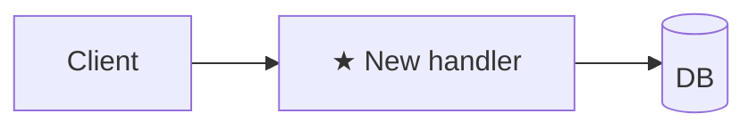

# Plan: <title>

**Spec**: [./spec.md](./spec.md)
**Type**: feat | fix | refactor | chore | docs | spike
**Size**: XS | S | M | L   <!-- XS=trivial · S=1 subsystem ≤2 files · M=multi-file 1 subsystem · L=cross-subsystem / schema / public API. See `plan-writing` skill > size-tiering for the picker. -->
**Status**: draft | approved | done

## Approach
2–3 sentences: the strategy + *why this over the obvious alternative*. If there is no obvious alternative, say so in one line.

**Step order**: foundation-first | riskiest-first | outside-in | inside-out — because <reason>   <!-- skip for XS -->

Type-specific:
- **fix** → step 1 of `Steps` MUST be "write failing regression test for <bug>", encoded against `spec.md > Reproduction`. State the *root cause* in `Approach` — if the fix is a guard or a catch, name why the bad input arrives.
- **refactor** → 1-line *behaviour-equivalence statement* — what stays identical and how it gets verified (existing tests / new char-test / golden file).
- **spike** → name the question being answered and the evidence that will count as an answer.

## Architecture diagram
ALWAYS REQUIRED. Pick the cheapest form that conveys the change. Mark new pieces with ★. See `plan-writing` skill > diagrams for templates per Type.

- **XS** → one line: `<component> (<change>)` OR `**Impact:** N/A — <reason>`
- **S** → mermaid 3–5 nodes
- **M / L** → full mermaid by Type (feat=flowchart, fix=sequenceDiagram, refactor=before/after, spike=question-marked)

## Steps
Format: `<action> — path:line (new|edit|delete) — verify: <command or observable> [AC#]`

- **verify** must be a runnable command or a concrete observable. `manually check`, `visually inspect`, `looks correct` are NOT verifies — split the step until each piece is verifiable atomically. See `plan-writing` skill > self-review (scan 4).
- When the change mimics an existing pattern, cite the precedent inline (e.g., `mirror src/handlers/orders.ts:42-78`) — it gives the engineer a working reference.
- For L plans with >12 steps, group under `### Phase N: <name>` headers (e.g., `### Phase 1: schema migration`). Phases are *grouping*, not gates.

1. <action> — `path/to/file.ext:line` (new) — verify: `npm test path/to/foo.test.ts` [AC1]
2. ...

## Files touched
| Path | Change | Why |
|------|--------|-----|
| `path/to/file.ext` | new/edit | ... |

## Alternatives considered   <!-- required for M/L feat|refactor when approach is non-obvious. Skip otherwise. -->
- <approach X> — rejected: <reason>

## Risks   <!-- M/L: required · S: optional · XS: skip -->
| Risk | Likelihood | Mitigation |
|------|------------|------------|
| ... | low/med/high | ... |

## Observability   <!-- feat|fix shipping runtime code: required · others: "N/A — <reason>" -->
- Log: <new log line / level>
- Metric: <new counter / gauge>
- Or: N/A — <reason>

## Dependencies   <!-- include only when present -->
- External: <lib version | API | infra>
- Internal: <sibling slice | prior PR | migration that must land first>

## Rollback
Required for any step that touches: a database migration, a destructive script, a config flag in prod, a binary cutover, or a public API contract. Otherwise write "N/A — change is reversible by reverting the commit."

- Trigger: <what tells us we need to roll back>
- Steps: <ordered, copy-pasteable>
- Data loss?: <none | partial — describe>

## Out of scope
What this plan explicitly does NOT cover. For **spike** runs, this is where you say "no production code lands from this run — `engineer` writes `recommendations.md` only".
