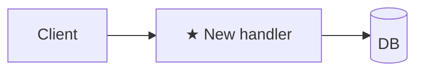

# Plan: <title>

**Spec**: [./spec.md](./spec.md) · **Type**: feat | fix | refactor | chore | docs | spike · **Size**: XS | S | M | L · **Status**: draft | approved | done

<!--
## Reviewer summary
TRIGGER: Size=L OR ≥3 decisions need gate sign-off. Comes BEFORE ## Approach. Max 10 lines.

**Root cause / goal**: one sentence.

**Decisions needing sign-off**:
- Decision 1: <what was chosen> — <why, and what was rejected>
- Decision 2: …

**Top risks**:
- High: …
- Medium: …
-->

## Approach
2–3 sentences: strategy + why this over the obvious alternative.
<!-- Type-specific: fix → state the root cause; step 1 of Steps is a failing regression test vs spec.md > Reproduction · refactor → one-line behaviour-equivalence statement (what stays identical + how it's verified) · spike → name the question + what evidence counts as an answer. -->

## Architecture diagram
<!-- ALWAYS required. Mark new pieces ★. Type picks the diagram: feat=flowchart · fix=sequenceDiagram · refactor=before/after · chore/docs=one-line or N/A · spike=question-marked. XS may be a single line. -->

## Steps
Format: `<action> — path#anchor (new|edit|delete) — verify: <command or observable> [AC#]`

`path#anchor` is a **re-resolvable** location, not a raw line number: the **symbol** for code (`src/users.ts#getUserById`), or a **unique quoted snippet/heading** for shell/markdown/config (`dev-state-mark.sh#"command -v jq"`). A reader must be able to re-find it with LSP or `grep` after earlier steps shift the file — a bare `:42` goes stale the moment a step above it edits the file and makes the whole plan read as untrustworthy. Append a line only as a write-time hint (`#getUserById (~L42)`), never as the sole handle; use `path (new)` for new files.

`verify` must be runnable or a concrete observable — never "manually check". Split until each piece verifies atomically. For L plans >12 steps, group under `### Phase N: <name>` (grouping, not gates). When phases are used, ALL cross-references elsewhere in the document (Risks, prose, other sections) MUST use `P<phase>.<step>` notation (e.g., `P3.2`) — never a bare global step number, since phases restart at 1.

1. <action> — `path/to/file.ext#symbolOrSnippet` (new) — verify: `npm test path/to/foo.test.ts` [AC1]

<!--
Approach + Architecture diagram + Steps are the ONLY always-required sections. Add the sections below ONLY when this task needs them, then DELETE the rest (no empty headers, no "N/A"). These triggers are authoritative — lead.md reads them. Size picker lives in plan-writing > size-tiering.

Optional sections — include WHEN:
- Step order — Size ∈ {S, M, L} and order matters (`foundation-first | riskiest-first | outside-in | inside-out` — because <reason>)
- Current state — M/L OR refactor OR fix (LSP-walk existing code, cite `path#anchor`: entry points · data/control flow 3–7 hops · callers/blast radius · invariants. refactor→Anti-goals that must stay identical; fix→Bug path line)
- Folder structure — new project OR feat adding ≥3 new packages/modules (directory tree with one-line purpose per node; omit unchanged subtrees). Comes AFTER Architecture diagram, BEFORE Steps.
- API / event contracts — feat/fix that introduces or changes public HTTP endpoints, event schemas, or cross-service message formats (method · path · request fields · response fields · error codes; one block per endpoint). Comes AFTER Folder structure (if present), BEFORE Steps.
- UI component & state plan — feat/refactor shipping UI (screens/components). Component or screen tree (hierarchy · one-line purpose · `[AC#]`) · state ownership (which state is server-state vs local UI-state, and where each lives) · data source per screen (which API contract above it calls) · routes→screens if multi-screen · one-line design direction (which design system/skill drives the visual layer + any a11y target). Comes AFTER API / event contracts, BEFORE Steps. The WHAT-side user flow lives in `spec.md > User journey`; this section is the HOW (the build structure), not a re-statement of the flow.
- Research notes — spec/plan fanout ran (per worker: **Dispatched-as** + finding · plan impact)
- Alternatives considered — M/L when approach is non-obvious (name the evidence for each rejection)
- Files touched — >2 files OR load-bearing paths the reviewer should see at a glance (table: Path | Change | Why)
- Risks — M/L OR fix with unclear root cause OR migration (table: Risk | Likelihood | Mitigation)
- Observability — feat/fix ships runtime code adding a new failure mode / op surface (new log line + metric)
- Dependencies (WHEN) — can't ship until something else lands first (WHEN-only; WHAT lives in spec.md > Constraints)
- Rollback — DB migration / destructive script / prod config flag / binary cutover / public API contract (Trigger + ordered Steps + Data loss?)
- Out of scope — real risk of scope creep (spike: "no production code lands — engineer writes recommendations.md only")
-->
