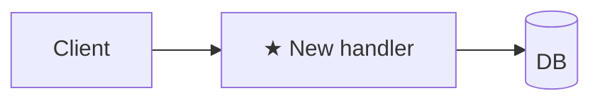

# Plan: <title>

**Spec**: [./spec.md](./spec.md) · **Type**: feat | fix | refactor | chore | docs | spike · **Size**: XS | S | M | L · **Status**: draft | approved | done

## Approach
2–3 sentences: strategy + why this over the obvious alternative.
<!-- Type-specific: fix → state the root cause; step 1 of Steps is a failing regression test vs spec.md > Reproduction · refactor → one-line behaviour-equivalence statement (what stays identical + how it's verified) · spike → name the question + what evidence counts as an answer. -->

## Architecture diagram
<!-- ALWAYS required. Mark new pieces ★. Type picks the diagram: feat=flowchart · fix=sequenceDiagram · refactor=before/after · chore/docs=one-line or N/A · spike=question-marked. XS may be a single line. -->

## Steps
Format: `<action> — path:line (new|edit|delete) — verify: <command or observable> [AC#]`

`verify` must be runnable or a concrete observable — never "manually check". Split until each piece verifies atomically. For L plans >12 steps, group under `### Phase N: <name>` (grouping, not gates).

1. <action> — `path/to/file.ext:line` (new) — verify: `npm test path/to/foo.test.ts` [AC1]

<!--
Approach + Architecture diagram + Steps are the ONLY always-required sections. Add the sections below ONLY when this task needs them, then DELETE the rest (no empty headers, no "N/A"). These triggers are authoritative — lead.md reads them. Size picker lives in plan-writing > size-tiering.

Optional sections — include WHEN:
- Step order — Size ∈ {S, M, L} and order matters (`foundation-first | riskiest-first | outside-in | inside-out` — because <reason>)
- Current state — M/L OR refactor OR fix (LSP-walk existing code, cite `path:line`: entry points · data/control flow 3–7 hops · callers/blast radius · invariants. refactor→Anti-goals that must stay identical; fix→Bug path line)
- Research notes — spec/plan fanout ran (per worker: **Dispatched-as** + finding · plan impact)
- Alternatives considered — M/L when approach is non-obvious (name the evidence for each rejection)
- Files touched — >2 files OR load-bearing paths the reviewer should see at a glance (table: Path | Change | Why)
- Risks — M/L OR fix with unclear root cause OR migration (table: Risk | Likelihood | Mitigation)
- Observability — feat/fix ships runtime code adding a new failure mode / op surface (new log line + metric)
- Dependencies (WHEN) — can't ship until something else lands first (WHEN-only; WHAT lives in spec.md > Constraints)
- Rollback — DB migration / destructive script / prod config flag / binary cutover / public API contract (Trigger + ordered Steps + Data loss?)
- Out of scope — real risk of scope creep (spike: "no production code lands — engineer writes recommendations.md only")
-->
