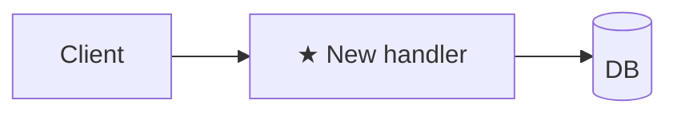

# Plan: <title>

**Spec**: [./spec.md](./spec.md) · **Type**: feat | fix | refactor | chore | docs | spike · **Size**: XS | S | M | L · **Field**: greenfield | brownfield · **Status**: draft | approved | done

## Outcome *(required)*

- **Before:** <how the system behaves today>
- **After:** <how it behaves once these Steps land>
- **Benefit:** → spec.md > Outcome

## Approach *(required)*

2–3 sentences: strategy + why this over the obvious alternative.

## Phases for this task *(required)*

Matrix defaults for `type=<feat|fix|refactor|chore|docs|spike>` — no deviations.

## Fanout plan *(required)*

No fanout — single-pass.

## Architecture diagram *(required)*

## Steps *(required)*

Format: `<action> — path#anchor (new|edit|delete) — verify: <command or observable> [AC#]` (`[DoD]` for a Definition-of-Done item).

1. <action> — `path/to/file.ext#symbolOrSnippet` (new) — verify: `npm test path/to/foo.test.ts` [AC1]

<!--
Optional sections — add only when the trigger fires; delete the rest (no empty headers, no "N/A").
Trigger + placement list (Folder structure, Scaffold, Current state, Risks, Rollback, …):
  plan-writing > references/plan-sections.md  (size-axis: plan-writing > SKILL.md > Section gating by Size)
Strict Steps format + self-review scans: lead.md > Mode A (Plan).
-->
