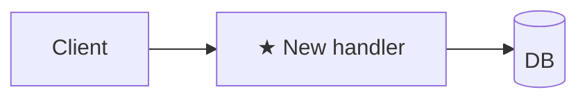

# Plan: <title>

**Spec**: [./spec.md](./spec.md) · **Type**: feat | fix | refactor | chore | docs | spike · **Size**: XS | S | M | L · **Status**: draft | approved | done

<!--
Keep Approach + Steps + Architecture diagram always (one-line diagram is fine on XS). All other sections are optional — include when they apply, DELETE entirely when they don't. No empty headers, no "N/A".
Size picker (XS/S/M/L) lives in `plan-writing` skill > size-tiering.
-->

## Approach
2–3 sentences: strategy + why this over the obvious alternative.

Type-specific:
- **fix** — step 1 of Steps MUST be a failing regression test against `spec.md > Reproduction`. State the root cause.
- **refactor** — 1-line behaviour-equivalence statement (what stays identical + how it's verified).
- **spike** — name the question + the evidence that counts as an answer.

## Architecture diagram
<!-- ALWAYS required. Mark new pieces ★. Diagram type by Type (feat=flowchart, fix=sequenceDiagram, refactor=before/after, chore/docs=one-line or N/A, spike=question-marked). XS may be a single line. -->



## Steps
Format: `<action> — path:line (new|edit|delete) — verify: <command or observable> [AC#]`

`verify` must be runnable or a concrete observable — never "manually check". Split until each piece is verifiable atomically. For L plans >12 steps, group under `### Phase N: <name>` (grouping, not gates).

1. <action> — `path/to/file.ext:line` (new) — verify: `npm test path/to/foo.test.ts` [AC1]

---

## Step order
<!-- Include when Size ∈ {S, M, L} and order matters. -->
`foundation-first | riskiest-first | outside-in | inside-out` — because <reason>

## Current state
<!-- Include for M/L OR refactor OR fix. Walk existing code with LSP (go-to-definition + find-references); cite `path:line`. -->

**Entry point(s)**:
- `path:line` — <one-line role>

**Data / control flow** (3–7 hops):
1. `path:line` — <hop> → calls `<symbol>` at `path:line`

**Callers / blast radius**:
- `<symbol>` (`path:line`): N callers — <summary>

**Invariants**:
- <one-line invariant> — `path:line` <why load-bearing>

<!-- refactor only --> **Anti-goals** (must stay identical):
- <behaviour>, verified by <existing test / golden file>

<!-- fix only --> **Bug path**:
```
<input> → step1 (`path:line`) → step2 ← BUG: <wrong-data step> → <symptom>
```

## Research notes
<!-- Include when spec/plan fanout ran. -->

### Codebase exploration
- **Dispatched-as**: team-codebase-explorer | general-purpose fallback
- Finding · Plan impact

### Best-practice research
- **Dispatched-as**: team-best-practice-researcher | general-purpose fallback
- Finding · Plan impact

## Alternatives considered
<!-- Include for M/L when approach is non-obvious. Name evidence for each rejection. -->

- **<approach>** — rejected: <reason>. Evidence: <load test / prior incident / spike-NNN>.

## Files touched
<!-- Include when >2 files OR touches load-bearing paths the reviewer should see at a glance. -->

| Path | Change | Why |
|------|--------|-----|
| `path/to/file.ext` | new/edit | ... |

## Risks
<!-- Include for M/L OR `fix` with unclear root cause OR migration. -->

| Risk | Likelihood | Mitigation |
|------|------------|------------|
| ... | low/med/high | ... |

## Observability
<!-- Include when feat/fix ships runtime code that adds a new failure mode or op surface. -->

- Log: <new log line / level>
- Metric: <new counter / gauge name + where it lives>

## Dependencies (WHEN)
<!-- Include when this plan cannot ship until something else lands first. WHEN-only — WHAT-constraints live in spec.md > Constraints. -->

- PR #NNN must merge first — needs <reason>

## Rollback
<!-- Include for DB migration / destructive script / prod config flag / binary cutover / public API contract. -->

- Trigger: <what tells us to roll back>
- Steps: <ordered>
- Data loss?: <none | partial>

## Out of scope
<!-- Include when there's a real risk of scope creep during implementation. For `spike`: "no production code lands — engineer writes `recommendations.md` only". -->
