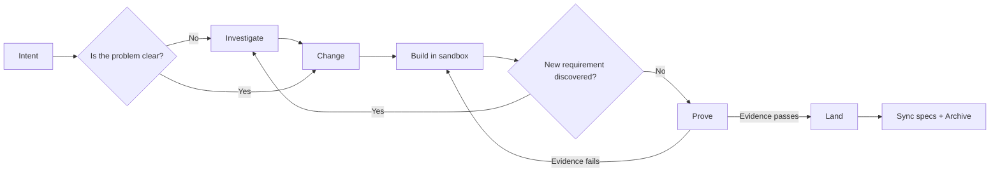

# Claude Foundation

**English** | [ภาษาไทย](README.th.md)

Foundation is an OpenSpec-native software-change harness for AI coding agents.
OpenSpec stores the agreement, the native agent implements it, and deterministic
evidence decides whether the change is safe to bring into the main project.

```text
Investigate? → Change → Build → Prove → Land
```

The goal is to preserve the quality mechanisms that matter while removing the
latency and cost of a fixed phase orchestrator, lifecycle agents, task mirroring,
repeated full-suite runs, and unnecessary browser calls.

## Installation

Requirements:

- Node.js 20.19 or later
- Git for worktree isolation
- OpenSpec CLI 1.7.0 for semantic spec sync and archive
- `jq` to merge Claude settings during installation

```bash
npm install -g @fission-ai/openspec@1.7.0

cd /path/to/claude-foundation
./install.sh /path/to/your-project
```

Or use the packaged CLI:

```bash
claude-foundation init /path/to/your-project
```

Open a new Claude Code session in the target project after installation so the
new slash commands are registered.

The installer preserves:

- project-owned current specs and active changes under `openspec/`;
- machine state under `.foundation/`;
- project-specific agents and hooks;
- legacy `.workflow/` history as a read-only migration source.

Foundation-owned commands, schemas, harness code, rules, skills, and hooks are
refreshed during upgrades.

`protect-secrets.sh` and `lint.sh` are wired by default.
`no-direct-main-commit.sh` is intentionally opt-in because some repositories
allow controlled commits on their default branch; `claude-foundation doctor`
reports whether that policy is enabled.

## The workflow



This is not a waterfall. Work can move backward while the agreement or
implementation is still evolving:

```text
Investigate ⇄ Change ⇄ Build ⇄ Prove → Land
```

`Land` is the completion boundary. Requirements discovered after landing should
normally become a new change.

## Command map

| Command | Purpose | Use it when | Changes main project code? |
|---|---|---|---|
| `/investigate` | Explore a problem and compare options | The outcome or approach is unclear | No |
| `/change` | Create or revise the agreement | The desired outcome is known | No |
| `/build` | Implement inside an isolated sandbox | Change artifacts are ready | Sandbox only |
| `/prove` | Produce evidence and a content-bound proof | Implementation tasks are complete | No |
| `/land` | Apply a proven change and archive it | Proof passes and the change is accepted | Yes |
| `/changes` | List active changes and readiness | You need portfolio or resume context | No |
| `/dev` | Run Change → Build → Prove | You want the compatibility one-shot flow | Does not land |
| `/migrate-workflow` | Prepare legacy migration candidates | Moving knowledge from `.workflow/` | No automatic promotion |

Slash commands drive the AI workflow. Deterministic operator commands use the
native CLI:

```bash
claude-foundation providers
claude-foundation doctor
claude-foundation changes
claude-foundation packet <change>
claude-foundation validate <change>
claude-foundation proof plan <change>
claude-foundation proof finalize <change>
claude-foundation evidence run <change> <provider> --claims declared -- <command>
claude-foundation sandbox create <change>
claude-foundation land check <change>
```

The CLI finds the project from the current directory or `--project <path>` and
uses that project's installed runtime. Run `claude-foundation help` for the full
surface. Direct source installations may call the runtime file as a compatibility
fallback when the packaged CLI is unavailable.

`packet <change>` is the compact handoff between Change, Build, and Prove. It
contains paths, revision, claims, required providers, task count, hash, and
budget—not the accumulated conversation—so a new execution context can resume
without making the orchestrator replay the whole run.

## `/investigate` — explore without committing

### When to use it

- The root cause is unknown.
- Several approaches would produce materially different behavior.
- Scope, compatibility, or migration requirements are unclear.
- Brownfield code must be understood before choosing a direction.
- A new assumption appears during Build.

### Examples

```text
/investigate why profile updates occasionally overwrite newer data
```

For an active change:

```text
/investigate add-profile: should we use last-write-wins or optimistic locking?
```

When the change already has a sandbox, the investigation reads the sandbox
implementation rather than the older main working tree.

### Output

An investigation separates:

- code-grounded facts;
- hypotheses;
- constraints;
- options and tradeoffs;
- unknowns that require a decision.

It ends with one of:

```text
ready for /change
needs user decision
not worth changing
```

Investigation does not edit product code and does not revise the formal change
automatically. Accepted findings move into the agreement through `/change`.

## `/change` — create or revise the agreement

### When to use it

- The desired outcome is known.
- A new change needs to be opened.
- Requirements, design, tasks, or evidence for an existing change must change.
- Investigation findings are ready to become an agreement.

### Create a change

```text
/change allow an account owner to edit their profile
```

Foundation creates:

```text
openspec/changes/add-profile/
├── .openspec.yaml
├── proposal.md
├── specs/
│   └── change/spec.md
├── design.md
├── tasks.md
└── evidence.yaml
```

Machine-owned state is stored separately:

```text
.foundation/runtime/add-profile.json
```

### Revise an existing change

```text
/change add-profile
```

Only affected artifacts should change:

- `proposal.md` — motivation, scope, and impact;
- `specs/**/*.md` — behavior and observable scenarios;
- `design.md` — technical decisions, compatibility, and rollback;
- `tasks.md` — the sole implementation ledger;
- `evidence.yaml` — claims and required provider capabilities.

If Build is already active, `/change` synchronizes the revision with:

```bash
claude-foundation sandbox sync add-profile
```

Synchronization:

- sends the revised change packet into the sandbox;
- preserves completed tasks only when the task line is unchanged;
- resets tasks whose meaning changed;
- increments the change revision;
- makes previous proof and receipts stale.

### Rapid and standard changes

`foundation-rapid` is eligible only when every condition holds:

- low impact;
- isolated coupling;
- no public contract change;
- no persistent migration;
- no semantic security trigger;
- no irreversible effect;
- unit or static evidence is sufficient.

Everything else uses `foundation-standard`. A rapid change upgrades in place if
authentication, access control, migration, high impact, or coupling is
discovered.

## `/build` — implement in isolation

### When to use it

- The proposal and scenarios are clear.
- Load-bearing design decisions have been made.
- Tasks and evidence obligations are ready.

```text
/build add-profile
```

The harness chooses an isolated workspace:

- clean Git repository → detached worktree;
- Git repository with existing local changes → isolated copy;
- non-Git repository → isolated copy with before/after manifests.

During Build:

- the main project remains unchanged;
- the agent edits the sandbox path;
- `tasks.md` is the only task ledger;
- focused checks run during convergence;
- there is no PM/Lead/Engineer/QA/Retro lifecycle chain;
- subagents are reserved for genuinely independent, verifiable work packages.

### Inspect the code being built

Read the sandbox path:

```bash
jq -r '.workspace.path' .foundation/runtime/add-profile.json
```

For a Git worktree:

```bash
git -C .foundation/sandboxes/add-profile status
git -C .foundation/sandboxes/add-profile diff
code .foundation/sandboxes/add-profile
```

For an isolated copy, open the `/tmp` path recorded in runtime state.

### A requirement changes during Build

Pause Build, investigate if necessary, and revise the same change:

```text
/investigate add-profile: how does existing email verification work?
/change add-profile
/build add-profile
```

`/change` synchronizes the new revision into the active sandbox. A second change
is not required merely because the agreement evolved before landing.

## `/prove` — establish that the change is correct

### When to use it

- Implementation tasks are complete.
- Focused checks pass.
- The change is ready for its declared evidence providers.

```text
/prove add-profile
```

Prove:

1. validates the OpenSpec artifacts;
2. computes the relevant workspace hash;
3. resolves claims from `evidence.yaml`;
4. reuses receipts whose hash and provider version still match;
5. executes missing or stale providers;
6. verifies test discovery;
7. runs the required full suite after convergence;
8. invokes independent review only when risk triggers it;
9. creates `proof.json`.

`tasks.md` contains implementation work only. `/prove` and `/land` are
lifecycle commands, not checkboxes; putting them in the ledger creates a
self-referential gate and validation rejects it.

Supported evidence capabilities:

| Provider ID | Use it to prove |
|---|---|
| `test` | Executable behavior |
| `discovery` | The expected tests were found |
| `browser` | Rendered behavior and real browser input |
| `mutation` | Tests detect a deliberate behavioral fault |
| `state-identity` | Actor, revision, or before/after state identity |
| `integration` | Components or external boundaries work together |
| `compatibility` | Public or persisted contracts remain compatible |
| `performance` | Measured latency, throughput, resource, or size budgets |
| `security-static` | Static security checks for changed boundaries and sinks |
| `cross-repo-contract` | Producer and consumer repositories agree |
| `review` | Independent risk review |
| `static-analysis` | Compile, type, lint, and static quality gates |
| `data-migration` | Forward migration, mixed-version safety, and rollback |
| `accessibility` | Semantics, keyboard, focus, contrast, and assistive access |
| `resilience` | Timeout, retry, partial failure, recovery, and degradation |
| `observability` | Required logs, metrics, traces, and alerts |
| `deployment` | Packaging, configuration, rollout health, and rollback |
| `dependency-supply-chain` | Vulnerability, license, lockfile, and provenance policy |

Inspect the exact catalog installed in a project:

```bash
claude-foundation providers
```

These providers are evidence contracts, not bundled vendor tools. Prove can run
the repository's existing tool with `run-provider`, or record a receipt from an
external system. A change selects only the providers justified by its observable
claims; it does not run all providers by default.

For an executable provider, declare the claim scope before the command:

```bash
claude-foundation evidence run add-profile test --claims declared -- npm test
```

`declared` means only claims whose `capabilities` include that provider.
Receipts cannot claim unrelated outcomes. A receipt is reusable only while its
workspace hash, provider protocol, provider version/fingerprint, status, and
claim coverage remain valid.

For browser evidence, record requirement and availability separately:

```bash
claude-foundation evidence record add-profile browser pass \
  --claims declared --input-mode os-input \
  --foreground-required yes --foreground-available yes
```

Receipts are stored under:

```text
.foundation/receipts/add-profile/
├── test.json
├── discovery.json
├── browser.json
├── review.json
└── proof.json
```

A successful result looks like:

```text
PROVEN add-profile
next: /land add-profile
```

Landing is blocked when:

- a required receipt is missing;
- test discovery is zero or below its declared minimum;
- a provider reports `fail`, `error`, or `inconclusive`;
- a browser provider lacks the required input or foreground capability;
- a mutation crash is presented as a behavioral kill;
- receipts do not cover every required claim;
- relevant code, tests, configuration, specs, or the change revision moved after proof.

If Prove fails, fix the implementation in the sandbox and run `/prove` again.

## `/land` — bring proven code into the main project

### When to use it

- `/prove` passes.
- The code is accepted for the main working tree.
- No other work has changed the same target paths.

```text
/land add-profile
```

The transaction is:

```text
Verify proof freshness
→ Verify required receipts
→ Detect target conflicts
→ Apply the proven sandbox diff
→ Verify target identity matches the sandbox
→ Synchronize delta specs
→ Archive the change
```

Land never:

- overwrites a target path changed after sandbox creation;
- accepts stale proof;
- archives incomplete evidence;
- commits, pushes, or opens a pull request without explicit authorization.

OpenSpec CLI 1.7.0 currently owns semantic spec synchronization and archive.
Foundation owns proof guards, sandbox application, and state-identity checks.
`land archive` is idempotent: an already archived change reports its archived
state without trying to synchronize specs again.

Check archive readiness before starting a run:

```bash
claude-foundation doctor --require-archive
```

Without `--require-archive`, a missing OpenSpec CLI is a warning because Change,
Build, and Prove still work; archive remains blocked.

## `/changes` — inspect active work

```text
/changes
```

Use it to see:

- active change IDs;
- each change's schema;
- whether a change is in progress, proven, stale, or ready to land;
- the next useful operation.

This is useful when resuming work in a new session or managing several active
changes.

## `/dev` — compatibility one-shot

```text
/dev add authenticated profile editing
```

Equivalent to:

```text
/change → /build → /prove
```

`/dev` deliberately stops before `/land`. It does not change the main project,
commit, push, or open a pull request.

Use it when intent is reasonably clear and a one-shot flow is preferable. Use
the individual commands when you want explicit control or per-operation cost
measurement.

## Example flows

### Small, clear change

```text
/change rename the Save button to Update Profile
/build update-profile-button-copy
/prove update-profile-button-copy
/land update-profile-button-copy
```

This may use the rapid lane and only the evidence required by the behavior.

### Authentication and profile work

```text
/investigate current profile ownership and session behavior
/change add profile editing for the authenticated owner
/build authenticated-profile-editing
/prove authenticated-profile-editing
/land authenticated-profile-editing
```

Authentication triggers the standard lane, security evidence, and independent
review.

### Requirement revision during Build

```text
/build add-profile

# We discover that email changes require verification.
/investigate add-profile: how does existing email verification work?
/change add-profile
/build add-profile
/prove add-profile
/land add-profile
```

The revised change automatically invalidates older proof.

### Multiple active changes

Each change has its own sandbox:

```text
/build change-a
/change change-b
```

If they touch the same files or public contract, declare a landing order. After
the first change lands, the other may need synchronization, rebasing, and new
proof.

## What evidence means

`evidence.yaml` answers:

> How do we know this behavior is correct, beyond the agent saying it is done?

```text
Requirement
    ↓
Evidence claim
    ↓
Provider
    ↓
Receipt
    ↓
Proof
```

Example:

```json
{
  "version": 1,
  "claims": [
    {
      "id": "other-user-cannot-update-profile",
      "scenario": "A user cannot update another user's profile",
      "impact": "high",
      "capabilities": ["test", "security-static"]
    }
  ]
}
```

Receipts are bound to the workspace hash. They can be reused while relevant
inputs remain unchanged and become stale as soon as the implementation or
agreement changes.

## Sources of truth

| Information | Source of truth |
|---|---|
| Intent and behavioral agreement | `openspec/` |
| Implementation | Code and tests |
| Task progress | Active change `tasks.md` |
| Runtime lifecycle | `.foundation/runtime/` |
| Evidence | `.foundation/receipts/` |
| Provider logs and metrics | `.foundation/logs/` |
| Legacy history | Read-only `.workflow/` |

Runtime state must not be duplicated in narrative Markdown.

## Migration from the phase workflow

List migration candidates:

```bash
claude-foundation migrate
```

Create a reviewable candidate for one legacy run:

```bash
claude-foundation migrate 0003-fix-example --apply
```

Legacy narrative is never promoted into current specifications automatically.
A statement must be corroborated by code, tests, or an accepted contract.

## Verify Foundation

```bash
claude-foundation version
claude-foundation runtime version
sh .claude/tests/run-all.sh

npx --yes @fission-ai/openspec@1.7.0 \
  schema validate foundation-standard

npx --yes @fission-ai/openspec@1.7.0 \
  schema validate foundation-rapid
```

Preview installation without writing:

```bash
./install.sh /tmp/foundation-demo --dry-run
```

See [WORKFLOW.md](WORKFLOW.md) for provider contracts, sandbox safety,
watchdog behavior, and lower-level operator commands.

## License

MIT
