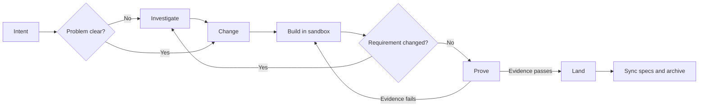

# Claude Foundation

**English** | [ภาษาไทย](README.th.md)

Claude Foundation is a software-change harness for AI coding agents. It gives
the agent a repeatable way to agree on a change, implement it away from your
working tree, prove it with real evidence, and only then bring it into the
project.

```text
Investigate? → Change → Build → Prove → Land
```

Foundation uses [OpenSpec](https://github.com/Fission-AI/OpenSpec) for durable
requirements and the repository's own tools for implementation and testing. It
does not replace your coding agent, test framework, CI system, or Git workflow.

**Version 3.2.17** — runtime API 19, provider protocol 7. Receipts recorded by
earlier versions read as `provider-version-stale` and must be re-proven.

## How the AI and harness divide responsibility

Foundation is not an AI and does not write code itself. It is a deterministic
control plane around the native coding agent.

| Part | Responsibility |
|---|---|
| User | Defines intent, makes consequential decisions, reviews the result, and explicitly authorizes Land |
| AI coding agent | Investigates, writes the agreement, implements code and tests, and fixes failures reported by evidence |
| Foundation harness | Controls lifecycle state, scope, sandboxes, evidence, proof freshness, budgets, and Land guards |
| OpenSpec | Stores the durable, human-reviewable requirements and change agreement |
| Project tools | Test runners, linters, Playwright, scanners, and other providers produce executable evidence |
| Git and CI | Handle version control and automation through the project's existing process |

```text
User defines intent
        ↓
AI investigates and implements
        ↓
Harness bounds and checks the lifecycle
        ↓
Project tools produce evidence
        ↓
Harness verifies proof
        ↓
User explicitly authorizes Land
```

The harness does not accept “the agent says it is done” as evidence. It may
produce a bounded execution plan and recommend a model tier, but the runtime
does not invoke a model itself; the native agent host remains responsible for
running agents and models.

## Why use it?

An AI agent can write plausible code and still misunderstand the requirement,
test the wrong thing, or modify your main working tree before you have reviewed
the result. Foundation separates those concerns:

- **OpenSpec records the agreement.** Intent does not disappear with chat
  history.
- **Build happens in isolation.** A Git worktree or copied directory protects
  the main project while the agent works.
- **Evidence decides readiness.** Tests, static analysis, browser checks, or
  other project-owned tools produce receipts bound to the exact workspace.
- **Land is explicit.** Foundation never commits, pushes, or opens a pull
  request unless you separately authorize it.
- **Work can be resumed.** Tasks, runtime state, receipts, and recovery journals
  survive a new agent session.

The intended result is less ceremony than a fixed multi-agent phase pipeline,
without relying on “the agent says it is done” as proof.

## Install

Requirements:

- Node.js 20.19 or later
- Git, for worktree isolation
- OpenSpec CLI 1.7.0, for spec synchronization and archive
- `jq`, used by the installer to merge Claude settings

```bash
npm install -g @fission-ai/openspec@1.7.0

cd /path/to/claude-foundation
./install.sh /path/to/your-project
```

Or, when the packaged command is available:

```bash
claude-foundation init /path/to/your-project
```

Open a new Claude Code session in the target project after installation so the
slash commands are registered. Check the installation with:

```bash
claude-foundation version
claude-foundation doctor --stage change
```

The installer preserves project-owned specs, active changes, runtime state,
custom agents, and hooks. Upgrades refresh only Foundation-owned commands,
schemas, harness code, rules, skills, and hooks recorded in the install
manifest.

## Investigate before committing to a change

Use `/investigate` when you do not yet know enough to write a reliable change
agreement. Typical reasons are an unknown root cause, several approaches with
different tradeoffs, unclear compatibility or migration constraints, or an
unfamiliar brownfield code path.

Start with the decision or uncertainty—not a request to implement a solution:

```text
/investigate why profile updates occasionally overwrite newer data
```

For an existing change, include its ID and the new question:

```text
/investigate add-profile: should updates use last-write-wins or optimistic locking?
```

The agent reads the relevant code and separates its output into:

- verified, code-grounded facts;
- hypotheses that are not yet proven;
- constraints and affected boundaries;
- viable options with tradeoffs;
- unknowns that still require a user decision.

It should finish with one of these outcomes:

```text
ready for /change
needs user decision
not worth changing
```

If it is `ready for /change`, turn the accepted findings into the durable
agreement:

```text
/change add-profile
```

Investigation does not edit product code and does not silently rewrite the
formal change. When the change already has a Build sandbox, it examines that
sandbox rather than an older main working tree. You may investigate again at
any point before Land when implementation reveals a new assumption.

## Your first change

Suppose an account owner should be able to edit their display name.

### 1. Create the agreement

In your agent session, run:

```text
/change allow an account owner to edit their display name
```

The agent inspects the project, asks only for decisions that materially affect
the result, and creates `openspec/changes/<change-id>/`. Review the proposal,
observable scenarios, tasks, and evidence claims before moving on.

Why this step exists: a concrete agreement prevents implementation details from
silently redefining the requested behavior.

### 2. Build in an isolated workspace

```text
/build <change-id>
```

Foundation creates a detached Git worktree when the repository is clean. If the
repository already has local changes, or is not a Git repository, it uses an
isolated copy instead. The agent edits that workspace and marks verified items
in `tasks.md`; the main project is not changed.

To find the workspace:

```bash
jq -r '.workspace.path' .foundation/runtime/<change-id>.json
```

Why this step exists: you can inspect or discard implementation work without
mixing it with your current checkout.

### 3. Prove the result

```text
/prove <change-id>
```

Foundation validates the agreement, checks that implementation tasks are
complete, runs the evidence providers required by the claims, and stores
content-bound receipts. A successful run ends with:

```text
PROVEN <change-id>
next: /land <change-id>
```

Why this step exists: passing proof means the declared behavior was checked on
the same code that will be landed, rather than on an earlier or unrelated
workspace.

### 4. Land the proven change

```text
/land <change-id>
```

Land verifies that proof is still fresh, checks for conflicting target edits,
applies only the proven sandbox diff, synchronizes the accepted delta specs,
and archives the change. If the code, tests, configuration, agreement, or
relevant target paths moved after Prove, Land stops instead of overwriting them.

Why this step exists: applying code and updating the durable requirements are
one guarded, resumable completion boundary.

### 5. Commit using your normal Git process

Foundation stops after applying and archiving. Review the result, then commit,
push, and open a pull request using your project's normal process.

## The workflow in one picture



This is not a waterfall. Before Land, use the same change when learning changes
the agreement:

```text
Investigate ⇄ Change ⇄ Build ⇄ Prove → Land
```

After Land, a new requirement should normally become a new change.

| Phase | What the AI does | What the harness does |
|---|---|---|
| Investigate | Establishes facts, hypotheses, options, and tradeoffs | Selects the correct workspace and keeps investigation non-mutating |
| Change | Writes the proposal, scenarios, design, tasks, and evidence claims | Validates schema, risk policy, scope, and revision state |
| Build | Implements code and tests, runs focused checks, and completes tasks | Creates an isolated workspace, bounds authority, and persists progress |
| Prove | Diagnoses and fixes failures exposed by evidence | Runs providers, validates claim coverage and receipts, and creates content-bound proof |
| Land | Helps resolve a conflict when human judgment or implementation changes are needed | Checks freshness, applies the proven diff, supports rollback/resume, syncs specs, and archives |

## Which command should I use?

| Command | Use it when | Result |
|---|---|---|
| `/investigate` | The cause, scope, or approach is unclear; add `--compare` for 3–5 disposable alternatives | Code-grounded facts, options, tradeoffs, and open decisions; no product edits |
| `/change` | The desired outcome is known, or an active agreement must change | Creates or revises OpenSpec artifacts; no product edits |
| `/build` | The agreement is ready to implement | Edits and focused checks in an isolated workspace |
| `/prove` | Implementation tasks and focused checks are complete | Required receipts and a content-bound `proof.json` |
| `/land` | Proof passes and you accept the change | Applies the proven diff, syncs specs, and archives |
| `/changes` | You are resuming work or managing several changes | Active states and the next useful operation |
| `/dev` | The intent is clear and you want Change → Build → Prove in one run | A proven candidate; deliberately stops before Land |

Each slash command has two cooperating layers:

- **Agent layer:** performs work that requires understanding, such as analyzing
  requirements, writing artifacts, and implementing code.
- **Harness layer:** performs deterministic control operations, such as
  validation, sandbox creation, provider execution, hashing, and lifecycle
  transitions.

For example, `/prove` does not ask the AI to decide whether the implementation
is correct. The harness runs the declared providers and checks their receipts
against every required claim.

Use the separate commands when you want to review each boundary. Use `/dev`
for a small, clear request where a one-shot run is easier:

```text
/dev rename the Save button to Update Profile
```

After choosing a prototype, turn only the selected decision into the agreement:

```text
/change <intent-or-change-id> --prototype-selection <selection-path>
```

Prototype files remain disposable and cannot be cited as evidence.

## Understanding `openspec/`

`openspec/` is the human-reviewable agreement. It contains requirements and
active change artifacts, never transient runtime status or test logs.

```text
openspec/
├── config.yaml
├── repositories.yaml
├── specs/
├── changes/
│   ├── <change-id>/
│   └── archive/
└── schemas/
    ├── foundation-standard/
    └── foundation-rapid/
```

| Path | What it is | Why it exists |
|---|---|---|
| `config.yaml` | Project OpenSpec configuration and rules | Gives every change the same project context and default schema |
| `repositories.yaml` | Project-wide repository topology and access policy | Makes cross-repository scope explicit and reviewable |
| `specs/` | Current accepted product requirements | Records what the landed system is expected to do |
| `changes/<change-id>/` | Agreement for one active change | Keeps proposed behavior separate from current behavior until Land |
| `changes/archive/` | Completed change history | Preserves why and how accepted behavior changed |
| `schemas/` | Foundation-owned schemas and templates | Defines the required artifacts for standard and rapid work |

### Files in an active change

```text
openspec/changes/<change-id>/
├── .openspec.yaml
├── proposal.md
├── specs/<area>/spec.md       # standard lane only
├── design.md                  # standard lane only
├── tasks.md
├── evidence.yaml
├── execution.yaml
└── repositories.yaml
```

| File | What it answers | Why the harness needs it |
|---|---|---|
| `.openspec.yaml` | Is this `foundation-standard` or `foundation-rapid`? | Selects the artifact workflow for this change |
| `proposal.md` | Why change, what changes, and what is excluded? | Prevents scope and impact from being implicit |
| `specs/<area>/spec.md` | What observable behavior is added, modified, or removed? | Gives Prove stable requirements and `WHEN`/`THEN` scenarios; Land merges the deltas into current specs |
| `design.md` | Which technical decisions constrain implementation and rollback? | Records only load-bearing current-state facts, compatibility, migration, risks, and rejected alternatives |
| `tasks.md` | What implementation work remains? | The sole implementation ledger; stable IDs and checkboxes make Build resumable |
| `evidence.yaml` | Which behavioral claims must be proven? | Separates the proof obligation from whichever tool happens to run it |
| `execution.yaml` | How does this project produce the evidence? | Wires commands, reports, services, timeouts, and readiness checks |
| `repositories.yaml` | Which repositories may this change read or write? | Bounds agent authority and establishes dependency order |

Do not add `/prove` or `/land` as checkboxes in `tasks.md`; they are lifecycle
commands, not implementation tasks.

### Standard and rapid lanes

`foundation-standard` includes proposal, delta specs, design, tasks, evidence,
and execution. Use it for public contracts, authentication, data or migrations,
coupled behavior, high impact, irreversible effects, or any change needing more
than unit/static evidence.

`foundation-rapid` intentionally omits delta specs and design. It is eligible
only for low-impact, isolated work with no public contract, persistent
migration, security trigger, or irreversible effect. If stronger requirements
appear, `/change` upgrades the same change to standard.

## Understanding change states

Run `/changes` or:

```bash
claude-foundation changes
```

| State | Meaning | What to do next |
|---|---|---|
| `untracked` | OpenSpec has an active change but Foundation has no runtime record | Use `/change <change-id>` to bring it under the harness and validate it |
| `change` | The agreement exists; no Build sandbox is active | Complete the artifacts, then `/build` |
| `building` | An isolated workspace is active; proof has not succeeded yet | Continue `/build`, or `/prove` when ready |
| `ready-to-land` | Passing proof still matches the agreement and workspace | `/land` |
| `stale-proof` | Proof once passed but no longer matches current inputs | Finish any required Build work and `/prove` again |
| `applied` | Code was applied but spec sync/archive did not finish | Retry `/land`; the transaction is resumable |
| `archived` | Code was applied, specs synchronized, and change archived | The change is complete and is no longer listed as active |

`ready-to-land` is the user-facing form of the internal `proven` lifecycle
state. Evidence values such as `pass`, `fail`, `error`, `inconclusive`, or
`stale` describe a provider receipt, not the whole change.

Runtime state lives in `.foundation/runtime/<change-id>.json`. Do not duplicate
or manually edit it in OpenSpec Markdown.

## What evidence means

Evidence answers:

> How do we know this behavior is correct, beyond the agent saying it is done?

```text
Requirement → Claim → Provider → Receipt → Proof
```

`evidence.yaml` declares stable behavioral claims and required capabilities:

```json
{
  "version": 2,
  "claims": [
    {
      "id": "other-user-cannot-update-profile",
      "scenario": "A user cannot update another user's profile",
      "impact": "high",
      "capabilities": ["test", "security-static"]
    }
  ]
}
```

`execution.yaml` then connects those capabilities to project-owned tools. This
separation lets you replace a test command without silently weakening the
behavior that must be proven.

Common capabilities include `test`, `discovery`, `static-analysis`, `browser`,
`integration`, `compatibility`, `performance`, `security-static`,
`accessibility`, `data-migration`, `resilience`, `observability`, `deployment`,
`dependency-supply-chain`, `cross-repo-contract`, and `review`. Inspect the
installed catalog and exact configuration shape with:

```bash
claude-foundation providers
```

When `execution.yaml` is empty or incomplete, inspect project-owned commands
without running them, preview high-confidence wiring, and write it explicitly:

```bash
claude-foundation evidence detect <change-id>
claude-foundation evidence init <change-id>
claude-foundation evidence init <change-id> --write
claude-foundation evidence doctor <change-id>
```

Detection reads repository manifests and configuration only. It does not run
scripts, install dependencies, overwrite configured providers, create receipts,
or turn an ambiguous command into passing evidence.

Audit end-to-end traceability before Build or after editing the agreement:

```bash
claude-foundation change audit <change-id>
```

Tasks link to claims with `[claims:<claim-id>]`. The audit detects missing or
unknown links, claims without tasks/providers, scenario mismatches, missing
security negative paths, and incomplete migration rollback/integrity coverage.

Remote CI can be configured with an issuer and Ed25519 public key, then imported
with `evidence verify-ci`. Review and acceptance can cross an external boundary
through `authority request`, `authority status`, and `authority record`. Both
paths bind evidence to the current workspace and still use the normal receipt
validator; stale, mismatched, unsigned, or replayed responses fail closed.

Foundation does not install a test framework or browser. It runs the tools your
repository declares and stores receipts under
`.foundation/receipts/<change-id>/`. Receipts are reusable only while the
workspace hash, agreement, provider protocol/version, and claim coverage remain
valid.

Useful diagnostics:

```bash
claude-foundation doctor --stage prove --change <change-id>
claude-foundation proof readiness <change-id>
claude-foundation proof run <change-id>
```

For changes that also require external review, collect project-owned evidence
first with `claude-foundation proof collect <change-id>`. The agent then creates
an authority request, explains the review packet in ordinary language, and asks
whether to inspect it, send it to an independent reviewer, or pause. After a real
response is recorded, `proof run` reuses the collected receipts and finalizes.

Users never need to construct receipt commands, provenance JSON, provider
metadata, or workspace hashes. Those remain machine protocol and are shown only
when technical detail is requested.

A provider returns one of four statuses. Only `pass` lands; `fail`, `error`, and
`inconclusive` all block. `inconclusive` is the one worth knowing about — it
means the provider ran but produced no verdict for your claim, so it usually
signals wiring that reports against the wrong thing rather than broken code.

See [Executable evidence adapters](.claude/harness/EVIDENCE.md) when wiring a
new provider or browser workflow. The documentation site covers the same ground
for readers rather than agents:

- [Receipts, statuses, and staleness](https://claude-foundation.dev/docs/evidence/receipts/)
  — what a receipt binds itself to, why a hand-written pass is refused, and what
  expires proof.
- [Adapters and wiring](https://claude-foundation.dev/docs/evidence/adapters/)
  — all five adapters, declared inputs, services, and readiness identity.
- [What Foundation writes](https://claude-foundation.dev/docs/artifacts/)
  — every artifact the harness produces and which of them you are meant to read.

## When the requirement changes during Build

Do not create a second change merely because you learned something before Land.
Revise the same agreement:

```text
/investigate <change-id>: how does the existing verification flow work?
/change <change-id>
/build <change-id>
/prove <change-id>
```

`/change` synchronizes the new revision into the active sandbox, preserves
completed tasks whose stable IDs and meaning did not change, and invalidates
proof affected by the revision.

## Multiple repositories

`openspec/repositories.yaml` declares the durable project topology. The
`repositories.yaml` inside a change selects only the repositories that change
may read or write. A missing selection remains compatible with a single `root`
repository.

Annotate multi-repository tasks so authority and dependencies remain explicit:

```markdown
- [ ] **T001** Implement API [repo:api] [kind:implementation] [paths:internal/profile]
- [ ] **T002** Implement App [repo:app] [kind:implementation] [depends:T001]
- [ ] **T003** Verify contract [repo:app] [kind:contract] [depends:T001,T002]
```

Foundation treats multi-remote landing as an ordered, resumable saga. It verifies
explicit child commits and CI state; it does not claim atomicity across remotes.
Use `claude-foundation land resume <change-id>` to inspect and advance the order. See
[WORKFLOW.md](WORKFLOW.md) for the full control-plane protocol.

## How Foundation scopes agents and skills

Foundation supplies a small, task-scoped packet to the native agent host; it is
not a resident orchestrator that copies the entire conversation into every
worker. A single-repository change with at most two ordinary tasks normally
stays with one agent. Independent workers are useful only when their tasks,
repository access, dependencies, and evidence can be separated cleanly.

The agent loads one primary construction skill for the layer being changed and
adds security or observability guidance only when the change crosses those
boundaries. Domain-boundary work begins with `ddd-strategic`; ordinary UI,
backend, data, or documentation work should not preload that entire skill chain.

`foundation.json` maps portable `fast`, `standard`, and `deep` tiers to model
families and defines execution budgets. Inventory and mechanical work use fast,
normal implementation uses standard, and architecture, security, migration, or
independent review uses deep. High-risk work cannot be downgraded to fast.

## What Foundation owns

| Information | Source of truth |
|---|---|
| Intent and behavioral agreement | `openspec/` |
| Implementation | Code and tests |
| Implementation progress | Active change `tasks.md` |
| Runtime lifecycle and sandboxes | `.foundation/runtime/` and `.foundation/sandboxes/` |
| Evidence receipts and immutable proof bundles | `.foundation/receipts/` and `.foundation/evidence/` |
| Provider logs, metrics, and telemetry | `.foundation/logs/` |
| Model tiers and execution limits | `foundation.json` |
| Legacy workflow history | Read-only `.workflow/` |

`.foundation/` is machine-owned. Inspect it for diagnostics, but do not treat it
as product requirements or manually repair state unless the operator guide tells
you to.

## Safety boundaries

- A worktree or copied directory protects workspace integrity; it is not a
  process-security sandbox.
- Unattended execution fails closed without a trusted host-owned attestation.
- The host obtains a short-lived challenge with `sandbox challenge`, signs its
  project, agreement, nonce, expiry, and exact permissions, then supplies the
  single-use envelope with `--attestation`. Exposed host-control sockets or
  credentials still block execution.
- Land refuses stale proof and conflicting edits on touched target paths.
- Apply uses backups and a journal; an interrupted Land can be retried.
- Foundation never commits, pushes, opens a pull request, or grants those powers
  to a worker agent without explicit authorization.
- `protect-secrets.sh` and `lint.sh` are enabled by default.
- `no-direct-main-commit.sh` is opt-in because some projects allow controlled
  commits on their default branch; `doctor` reports whether it is enabled.

### Human approval

A standard change starts with acceptance **undecided**, and `change validate`
fails until somebody decides. This is deliberate — silence is never read as
consent — but it is also the blocker people hit first, so decide it explicitly:

```bash
claude-foundation change resolve <change-id> --acceptance-not-required
claude-foundation change resolve <change-id> \
  --acceptance-required --acceptance-reason "<why a person must judge this>"
```

Independent review is a separate boundary and becomes required by policy — high
impact, a coupled non-low change, a security trigger, or a claim that spans
repositories. A reviewer may be a human or a different AI, but never the
implementer: independence cannot be waived, and after two AI rounds a third is
refused and escalated to a person.

Land itself gates on evidence rather than consent. The agent is instructed to
explain the effects and offer to inspect, proceed, or pause first, and the
continuation commands (`land record`, `budget continue`, `change abandon`) each
require a `--decision-ref` naming the decision you actually made.

[Human approval](https://claude-foundation.dev/docs/approval/) covers all four
boundaries, including how `authority request`, `authority status --template`,
and `authority record` turn a verdict into a receipt.

## Operator commands and troubleshooting

Most users only need the slash commands. These native CLI commands are useful
for inspection and recovery:

```bash
claude-foundation doctor --stage change
claude-foundation changes
claude-foundation change validate <change-id>
claude-foundation change audit <change-id>
claude-foundation packet <change-id> --phase build|prove|review
claude-foundation metrics <change-id>
claude-foundation budget continue <change-id> --reason "finish required proof" --decision-ref <host-user-decision>
claude-foundation proof readiness <change-id>
claude-foundation proof run <change-id>
claude-foundation land check <change-id>
claude-foundation land archive <change-id>
claude-foundation change abandon <change-id> --reason "evidence contract cannot be satisfied" --decision-ref <host-user-decision>
```

A change that cannot be proven is retired with `change abandon`, which releases
its leases, cleans up its sandbox, and moves its record into
`.foundation/recovery/abandoned/<id>/` with an audit line. It quarantines rather
than deletes and never touches Git. Guards that end a run — exhausted AI review
rounds, a spent budget continuation, an apply that could not finish rolling
back — report their options rather than a bare refusal.

Host telemetry can be imported from `generic`, `codex`, `cursor`, `otel`, or
`claude` JSON/JSONL. OpenTelemetry GenAI/LLM token and model attributes normalize
into the same append-only usage events used by `metrics` and budget accounting.

The CLI finds the installed project from the current directory or from
`--project <path>`. Run `claude-foundation help` for the complete command
surface.

Common problems:

| Symptom | What it usually means | Action |
|---|---|---|
| Slash command is missing | The agent session started before installation | Open a new session in the target project |
| Build cannot start | Required OpenSpec artifacts or provider wiring are incomplete | Run `doctor --stage build --change <change-id>` and fix the reported artifact |
| Proof is stale | Relevant code, tests, configuration, claims, or provider inputs changed | Finish the edits and run `/prove` again |
| Test discovery is zero | The configured command did not find the expected tests/report | Fix `execution.yaml` or the project test command; do not record a manual pass |
| Land reports a conflict | A touched path in the main project changed after sandbox creation | Review/rebase or synchronize the change, then produce fresh proof |
| Archive cannot run | OpenSpec is missing or not version 1.7.0 | Install the pinned CLI and retry `/land` |
| Land stopped after apply | Code is present but sync/archive was interrupted | Do not reapply manually; retry `/land` to resume from the journal |

Execution budgets are scoped to an autonomous run while lifetime usage remains
visible in metrics. At 85% the run enters completion-only mode: speculative
exploration, scope expansion, optional refactors, and new subagents stop, while
focused fixes and required proof continue. At 100% the harness recommends
splitting or rescoping but does not fail telemetry or block deterministic
packet, readiness, provider, receipt-reuse, proof-resume, metrics, Land recovery,
or archive commands. `budget continue` opens a fresh operator-approved window
with an audit record only for required model-completable code or configuration
work, at most once per run. Active leases, external evidence, infrastructure
failures, and already-ready deterministic work do not qualify. The reason is
audit context rather than a text-based policy gate; prior usage and evidence
requirements remain intact.

## Verify or upgrade an installation

```bash
claude-foundation version
claude-foundation runtime version
sh .claude/tests/run-all.sh

npx --yes @fission-ai/openspec@1.7.0 schema validate foundation-standard
npx --yes @fission-ai/openspec@1.7.0 schema validate foundation-rapid
```

Preview a source installation without writing:

```bash
./install.sh /tmp/foundation-demo --dry-run
```

For provider contracts, review policy, invalidation rules, sandbox mechanics,
watchdog behavior, telemetry, multi-repository landing, and the full native CLI,
see [WORKFLOW.md](WORKFLOW.md) and the
[harness operator guide](.claude/harness/README.md).

## License

MIT
