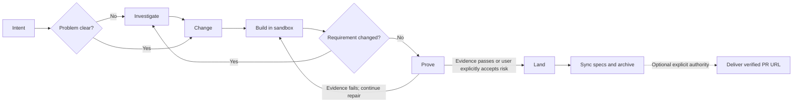

# Change Loop

**English** | [ภาษาไทย](README.th.md)

Change Loop is a software-change harness for AI coding agents. It gives
the agent a repeatable way to agree on a change, implement it away from your
working tree, prove it with real evidence, and only then bring it into the
project.

```text
Investigate? → Change → Build → Prove → Land
```

Change Loop uses [OpenSpec](https://github.com/Fission-AI/OpenSpec) for durable
requirements and the repository's own tools for implementation and testing. It
does not replace your coding agent, test framework, CI system, or Git workflow.
The product is **Change Loop**; the installed package and CLI remain
`claude-foundation`, so existing commands do not change.

**Version 3.5.20** — runtime API 41, provider protocol 13. Receipts recorded by
earlier versions read as `provider-version-stale` and must be re-proven.
`claude-foundation metrics <change-id>` also reports the exact runtime source
cohort: semantic version, the loaded protocol bundle, and a SHA-256 digest of
the installed `.claude/harness` files. Use the complete cohort—not the version
label alone—when comparing reports from installations that may be on different
patches or source revisions.

## Where to start

Build and Prove completion report `TARGET_REACHED`; only an archived change is
`DELIVERED`. Read current readiness with `feedback <change-id>`, export
allowlisted local metadata with `feedback <change-id> --diagnostics`, or recover
bounded current context with `packet <change-id> --resume`. These inspection
views do not execute lifecycle work; see the [harness guide](.claude/harness/README.md).

- To use Change Loop, follow [Your first change](#your-first-change).
- To understand lifecycle behavior, read [The workflow in one picture](#the-workflow-in-one-picture); use [WORKFLOW.md](WORKFLOW.md) only as the detailed contract.
- To extend evidence or the runtime, use [the harness guide](.claude/harness/README.md) and [evidence reference](.claude/harness/EVIDENCE.md).
- To prepare a release, start with [RELEASING.md](RELEASING.md) and the current [scenario release status](docs/reports/user-scenario-release-status.md).

## How the AI and harness divide responsibility

Change Loop is not an AI and does not write code itself. It is a deterministic
control plane around the native coding agent.

| Part | Responsibility |
|---|---|
| User | Defines intent, makes consequential decisions, reviews the result, and explicitly authorizes Land |
| AI coding agent | Investigates, writes the agreement, implements code and tests, and fixes failures reported by evidence |
| Change Loop harness | Controls lifecycle state, scope, tool preparation, sandboxes, evidence, proof freshness, budgets, permissions integration, recoverable Apply, and archive |
| OpenSpec | Stores the durable, human-reviewable requirements and change agreement |
| Project tools | Test runners, linters, Playwright, scanners, and other providers produce executable evidence |
| Git and CI | Handle version control and automation through the project's existing process |

```text
User defines intent
        ↓
AI investigates and implements
        ↓
Harness bounds and checks the lifecycle
        ↓
Project tools produce evidence
        ↓
Harness verifies proof
        ↓
User explicitly authorizes Land
```

The harness does not accept “the agent says it is done” as evidence. It may
produce a bounded execution plan and recommend a model tier, but the runtime
does not invoke a model itself; the native agent host remains responsible for
running agents and models.

## Why use it?

An AI agent can write plausible code and still misunderstand the requirement,
test the wrong thing, or modify your main working tree before you have reviewed
the result. Change Loop separates those concerns:

- **OpenSpec records the agreement.** Intent does not disappear with chat
  history.
- **Build happens in isolation.** A Git worktree or copied directory protects
  the main project while the agent works.
- **Evidence decides readiness.** Tests, static analysis, browser checks, or
  other project-owned tools produce receipts bound to the exact workspace.
- **Land is explicit.** It applies the proven diff to every writable target and
  archives the change, leaving HEAD, the index, and the delivered diff
  uncommitted for your review. It never pushes or opens a pull request.
- **Work can be resumed.** Tasks, runtime state, receipts, and recovery journals
  survive a new agent session.

An in-flight pre-graph-v3 Build also resumes after an upgrade. The Harness
reuses persisted multi-task single-session authority only while its task and
contract identities still match; otherwise it automatically returns the
affected completed tasks and their dependency descendants to leased verification
without rewriting `tasks.md`.

The intended result is less ceremony than a fixed multi-agent phase pipeline,
without relying on “the agent says it is done” as proof.

When concurrent changes move the target, sync can reuse an unchanged review
in either a worktree or a copy sandbox. Copy mode compares the change's
baseline-to-current file identities; same-file reconciliation remains
conservative. No-op sync keeps existing proof, and `proof plan` explains
why a review cannot be reused. See the [binding rules](.claude/harness/EVIDENCE.md).

## Install

Requirements:

- Node.js 20.19 or later
- npm access when the pinned OpenSpec CLI is not already available

Git is recommended for worktree isolation; dirty or non-Git projects use an
isolated copy. `jq` is recommended for merging existing Claude settings.
Without it, the installer preserves the existing file and writes a companion
file for review. The harness verifies OpenSpec early and, when necessary,
installs the pinned CLI project-locally under `.foundation/tools`; no global
installation command is part of the user workflow.

Install with Homebrew:

```bash
brew tap maximumsoft-co-ltd/claude-foundation \
  https://github.com/Maximumsoft-Co-LTD/claude-foundation
brew install claude-foundation
claude-foundation init /path/to/your-project --yes
```

Or install from a source checkout:

```bash
git clone https://github.com/Maximumsoft-Co-LTD/claude-foundation.git
cd claude-foundation
./install.sh /path/to/your-project
```

Claude Code needs no adapter. For other agent hosts, `--host` layers one over
the same shared install:

```bash
claude-foundation init /path/to/your-project --host cursor    # or opencode, codex
```

Cursor gets the seven primary lifecycle prompts plus `/changes` and the `/feature`
compatibility alias, and the always-on skill router as an
`alwaysApply` rule; OpenCode gets the commands plus a guard plugin that replays
the shipped hooks live; Codex gets the nine prompts in `$CODEX_HOME/prompts`
with an ownership marker — Codex has no tool hooks, so Land gates remain the
enforcement there.

Open a new Claude Code session in the target project after installation so the
slash commands are registered. Check the installation with:

```bash
claude-foundation version
claude-foundation doctor --stage change
```

In a Git project, review and commit the setup files staged by the installer
before the first `/change`. The installer does not take commit authority:

```bash
git status
git commit -m "chore: install Change Loop"
```

The installer preserves project-owned specs, active changes, runtime state,
custom agents, and hooks. Upgrades refresh only Change Loop-owned commands,
schemas, harness code, rules, skills, and hooks recorded in the install
manifest.

Installation checks writable destinations before changing files. A symlink in a
managed destination is preserved and reported: choose a real installation
directory or explicitly relocate shared configuration, then retry. Host adapters
also check their destinations before installing the shared runtime.

## Investigate before committing to a change

Use `/investigate` when you do not yet know enough to write a reliable change
agreement. Typical reasons are an unknown root cause, several approaches with
different tradeoffs, unclear compatibility or migration constraints, or an
unfamiliar brownfield code path.

Start with the decision or uncertainty—not a request to implement a solution:

```text
/investigate why profile updates occasionally overwrite newer data
```

For an existing change, include its ID and the new question:

```text
/investigate add-profile: should updates use last-write-wins or optimistic locking?
```

You receive a short summary and a readable
`openspec/investigations/<id>.report.md` in your language. JSON remains the
machine-readable record. The report explains the result and next step without
starting Change; existing authored notes are preserved.

The agent reads the relevant code and separates its output into:

- verified, code-grounded facts;
- hypotheses that are not yet proven;
- constraints and affected boundaries;
- viable options with tradeoffs;
- unknowns that still require a user decision.

It should finish with one of these outcomes:

```text
ready for /change
needs user decision
not worth changing
```

The agent starts from `claude-foundation investigate --template` and submits
the maintained JSON record to `claude-foundation investigate <record.json>`.
The harness discovers and hashes sources, validates fact and hypothesis links,
persists no-progress and effectiveness metrics, and returns the next typed
action. A ready result carries a digest-bound handoff that Change verifies.

If it is `ready for /change`, turn the accepted findings into the durable
agreement:

```text
/change add-profile
```

Investigation does not edit product code and does not silently rewrite the
formal change. When the change already has a Build sandbox, it examines that
sandbox rather than an older main working tree: set the record's optional
`activeChange` field to that change ID. The handoff binds the sandbox identity,
base, and source root and fails closed if they are stale or missing. You may investigate again at
any point before Land when implementation reveals a new assumption.

## Your first change

After Change, inspect the compiled spec and explicitly approve it before Build;
this also applies to `/dev`. Review shares a 30-minute window across retries,
fallbacks, and delta review. If repair cannot progress or review time expires,
choose further work, Land with explicitly accepted remaining risks, or pause.
Failed and missing evidence remains visible. See [the workflow](WORKFLOW.md)
for approval, continuation, and content-bound waiver semantics.

Suppose an account owner should be able to edit their display name.

### 1. Create the agreement

In your agent session, run:

```text
/change allow an account owner to edit their display name
```

The agent interprets the relevant project sources and writes observable
requirements. The harness derives the risk-relevant discovery dimensions,
validates decision prerequisites, and refuses unresolved coverage; only
consequential choices are returned to you, one dependency-ready frontier at a
time with source-supported recommendations. The harness automatically discovers
and ranks relevant specs, tests, callers, integrations, persistence, and
permission boundaries under fixed enumeration safety limits, then applies a
risk-adaptive budget to the selected read-set. Intake stores one
machine-owned snapshot bound to the draft and selected local-source digests,
using Git's tracked/non-ignored file set when available. The agent acknowledges
the returned `discovery.sourceDigest`; keyed facts and recommendation evidence
must bind a selected path and digest. Intake also retains coverage and
question-effectiveness measurements in the change runtime; a source change reopens coverage
instead of compiling stale requirements. It then compiles one semantic draft into
`openspec/changes/<change-id>/`, deriving stable IDs and links between
requirements, scenarios, tasks, claims, and providers. Review the proposal,
observable scenarios, tasks, and evidence claims before moving on; the compiled
OpenSpec packet—not chat or the temporary draft—is the source of truth.

The agreement explains the current problem, intended behavior, scope, relevant
failure cases, and how the result will be verified. Its authored content uses
your language unless you request another document language; OpenSpec syntax
and stable identifiers stay unchanged. See the [Change workflow](WORKFLOW.md#change-intent).
Change carries forward relevant conversation decisions and latest corrections.
Affected diagrams and folder mappings live in the agreement when needed;
Build and resumed sessions read the full relevant scenarios and design context.
The compiled proposal also records which discovery dimensions were covered or
source-grounded as not applicable, so no settled answer has to live only in chat.

The agent answers in your language and leads with the outcome. It performs safe
recovery and routine commands itself, then reports what it changed and checked.
You are asked only when behavior, risk, authority, or an unresolved conflict
needs your judgment; machine JSON, hashes, and receipt metadata stay internal
unless you ask for diagnostic detail.

Why this step exists: a concrete agreement prevents implementation details from
silently redefining the requested behavior.

### 2. Build in an isolated workspace

```text
/build <change-id>
```

Change Loop creates a detached Git worktree when the repository is clean. If the
repository already has local changes, or is not a Git repository, it uses an
isolated copy instead. The agent edits that workspace and marks verified items
in `tasks.md`; the main project is not changed.

To find the workspace:

```bash
jq -r '.workspace.path' .foundation/runtime/<change-id>.json
```

A worktree carries tracked files only. If providers need dependencies
installed, declare `sandbox.setupCommand` (plus `setupTimeoutMs`) in
`foundation.json`, or a per-repository `setupCommand` in
`openspec/repositories.yaml`. A successful setup is reused; a failed one keeps
the sandbox and is retried by the harness without repeating ready siblings or
handing a recovery command to the user. When a lockfile is present and no setup
command is declared, sandbox creation prints a NOTE with the exact
`foundation.json` snippet; linking or copying the checkout's `node_modules`
into the workspace is refused by the phase guard.

For direct Bash use during Build, start an obviously mutating command with
`cd <workspace-or-subdirectory> && ...`. On Claude Code the phase guard pins
the shell's reported directory as that anchor when it is already inside the
workspace, so a forgotten prefix costs nothing; other hosts refuse the
command. The phase guard blocks unanchored package-manager
or formatter mutations, `..` escapes, later `cd` escapes, absolute filesystem
operands, and writes through symlinks outside the workspace before the shell
starts. `claude-foundation exec` derives the phase from runtime state, applies
the same policy, and starts Build commands in the canonical workspace.
Structured Edit/Write operations remain the preferred mutation path; host
process isolation is still required for indirect script effects.

Why this step exists: you can inspect or discard implementation work without
mixing it with your current checkout.

The agent drives Build with `claude-foundation advance <change-id> --through
build`. That one coordinator validates, prepares isolation, chooses runnable
work, and returns one bounded action; users do not assemble sandbox, packet,
plan, lease, or dispatch commands.

### 3. Prove the result

```text
/prove <change-id>
```

Change Loop validates the agreement, checks that implementation tasks are
complete, runs the evidence providers required by the claims, and stores
content-bound receipts. A successful run ends with:

```text
PROVEN <change-id>
next: /land <change-id>
```

Why this step exists: passing proof means the declared behavior was checked on
the same code that will be landed, rather than on an earlier or unrelated
workspace.

The agent uses `advance <change-id> --through proven`; compatible `proof ...`
commands remain available for diagnostics and integrations.

### 4. Land the current change

```text
/land <change-id>
```

Land has one visible goal: move the exact current work into its declared main
workspace. Passing, failed, stale, inconclusive, or missing proof is recorded as
assurance rather than used as authority. The Harness checks for conflicting
target edits, applies only the authorized sandbox diff, then performs spec sync,
archive, recovery, and cleanup as internal automation. If the code, tests,
configuration, agreement, or
relevant target paths moved, Land stops instead of overwriting them.
If the target branch simply advanced, the agent synchronizes the existing
sandbox, re-proves it, and continues Land. Your work is preserved and you do
not create a new change. A real replay conflict still stops for your judgment.
Several changes can be active at once, even on the same files: none waits for
another during Build, Prove, or Land, and whichever lands later synchronizes
and re-proves. Only a shared resource declared with `[resources:]` serializes.

Why this step exists: applying code and updating the durable requirements are
one guarded, resumable completion boundary.

The agent uses internal `land advance <change-id>`. `/land` is the only
user-facing Land operation; interrupted internal checkpoints resume without a
manual check, recovery, or archive command. Land is complete only at `archived`;
it still grants no authority to commit, push, publish, or open a pull request.

### 5. Optionally deliver a pull request

```text
/deliver <change-id>
```

The normal workflow remains complete at `archived`. If you explicitly invoke
Deliver, one command creates an isolated feature branch from the archived,
proven projection, prepares the company-standard PR body from OpenSpec and
proof receipts, commits, pushes, opens or reuses the PR, verifies it through the
provider, and returns its URL. It does not touch your checkout's HEAD or index,
and it never force-pushes, pushes a default branch, merges, deploys, publishes,
or edits product code.

Deliver is a cold path: if it is not invoked, Change, Build, Prove, and Land do
no PR-specific prompting, evidence collection, or validation. Missing optional
presentation evidence can make the PR a draft according to project policy;
missing or stale required proof blocks Deliver without undoing `archived`.
Staged files and final commits are checked against the proven projection, including
after interruption or Git hooks. The fetched PR base must contain the Land base;
unrelated branch history blocks publication. Sibling repositories keep separate
PRs, while only submodules update root gitlinks. See the [Deliver contract](WORKFLOW.md).

Deliver preserves dangling symlinks and verifies normal Git CRLF/LF conversion.
It checks effective push destinations, the actual remote default branch, and
Land-bound file modes. Old archives missing mode evidence and custom clean
filters/LFS or working-tree encodings require a separate review and Git
publication decision; automatic Deliver does not support those cases. The work
remains archived, and project conversion settings are preserved.

## The workflow in one picture



This is not a waterfall. Before Land, use the same change when learning changes
the agreement:

```text
Investigate ⇄ Change ⇄ Build ⇄ Prove → Land
```

After Land, a new requirement should normally become a new change.

| Phase | What the AI does | What the harness does |
|---|---|---|
| Investigate | Establishes facts, hypotheses, options, and tradeoffs | Selects the correct workspace and keeps investigation non-mutating |
| Change | States intent, requirements, scenarios, task outcomes, and evidence needs | Compiles stable links and validates schema, risk, scope, and revision state |
| Build | Implements code and tests, runs focused checks, and completes tasks | Creates an isolated workspace, bounds authority, and persists progress |
| Prove | Diagnoses and fixes failures exposed by evidence | Runs providers, validates claim coverage and receipts, and creates content-bound proof |
| Land | Decides whether the current workspace should enter the main workspace | Records assurance, applies the authorized diff, supports rollback/resume, syncs specs, and archives |
| Deliver (optional) | Composes bounded reviewer-facing narrative from archived sources | Reconstructs the proven projection in isolation, commits, pushes, opens/reuses and verifies the PR |

## Which command should I use?

| Command | Use it when | Result |
|---|---|---|
| `/investigate` | The cause, scope, or approach is unclear; add `--compare` for 3–5 disposable alternatives | Code-grounded facts, options, tradeoffs, and open decisions; no product edits |
| `/change` | The desired outcome is known, or an active agreement must change | Creates or revises OpenSpec artifacts; no product edits |
| `/build` | The agreement is ready to implement | Edits and focused checks in an isolated workspace |
| `/prove` | Implementation tasks and focused checks are complete | Required receipts and a content-bound `proof.json` |
| `/land` | Proof passes and you accept the change | Applies the proven diff, syncs specs, and archives |
| `/deliver` | An archived change should be sent for review | Optional isolated commit, feature-branch push, and verified PR URL |
| `/changes` | You are resuming work or managing several changes | Active states and the next useful operation |
| `/dev` | The intent is clear and you want Change → Build → Prove in one run | Normally stops with a proven candidate; a pre-authorized automation lane may continue through Land to `archived` |

Each slash command has two cooperating layers:

- **Agent layer:** performs work that requires understanding, such as analyzing
  requirements, writing artifacts, and implementing code.
- **Harness layer:** performs deterministic control operations, such as
  validation, sandbox creation, provider execution, hashing, and lifecycle
  transitions.

For example, `/prove` does not ask the AI to decide whether the implementation
is correct. The harness runs the declared providers and checks their receipts
against every required claim.

Use the separate commands when you want to review each boundary. Use `/dev`
for a small, clear request where a one-shot run is easier:

```text
/dev rename the Save button to Update Profile
```

After choosing a prototype, turn only the selected decision into the agreement:

```text
/change <intent-or-change-id> --prototype-selection <selection-path>
```

Prototype files remain disposable and cannot be cited as evidence.

## Understanding `openspec/`

`openspec/` is the human-reviewable agreement. It contains requirements and
active change artifacts, never transient runtime status or test logs.

```text
openspec/
├── config.yaml
├── repositories.yaml
├── specs/
├── changes/
│   ├── <change-id>/
│   └── archive/
└── schemas/
    ├── foundation-standard/
    └── foundation-rapid/
```

| Path | What it is | Why it exists |
|---|---|---|
| `config.yaml` | Project OpenSpec configuration and rules | Gives every change the same project context and default schema |
| `repositories.yaml` | Project-wide repository topology and access policy | Makes cross-repository scope explicit and reviewable |
| `specs/` | Current accepted product requirements | Records what the landed system is expected to do |
| `changes/<change-id>/` | Agreement for one active change | Keeps proposed behavior separate from current behavior until Land |
| `changes/archive/` | Completed change history | Preserves why and how accepted behavior changed |
| `schemas/` | Change Loop-owned schemas and templates | Defines the required artifacts for standard and rapid work |

### Files in an active change

```text
openspec/changes/<change-id>/
├── .openspec.yaml
├── proposal.md
├── tasks.md
├── evidence.yaml
├── specs/<area>/spec.md       # standard lane
├── design.md                  # only when durable design context exists
├── grounding.yaml             # only when a material decision must be locked
├── execution.yaml             # only for custom provider/service wiring
├── repositories.yaml          # only for explicit multi-repository scope
└── handoffs.yaml              # only for permission-bound operations
```

| File | What it answers | Why the harness needs it |
|---|---|---|
| `.openspec.yaml` | Is this `foundation-standard` or `foundation-rapid`? | Selects the artifact workflow for this change |
| `proposal.md` | Why change, what changes, and what is excluded? | Prevents scope and impact from being implicit |
| `specs/<area>/spec.md` | What observable behavior is added, modified, or removed? | Gives Prove stable requirements and `WHEN`/`THEN` scenarios; Land merges the deltas into current specs |
| `design.md` | Which technical decisions, diagrams, integrations, or prototype selection constrain implementation? | Records only load-bearing context instead of forcing an empty design document |
| `tasks.md` | What implementation work remains? | The sole implementation ledger; stable IDs and checkboxes make Build resumable |
| `evidence.yaml` | Which behavioral claims must be proven? | Separates the proof obligation from whichever tool happens to run it |
| `grounding.yaml` | Which material decisions were settled up front? | Semantic v3 stores non-derived decisions only; legacy grounding remains readable |
| `execution.yaml` | Does this change override derived evidence wiring? | Appears only for custom commands, reports, services, timeouts, or readiness checks |
| `repositories.yaml` | Which repositories may this change read or write? | Bounds agent authority and establishes dependency order |
| `handoffs.yaml` | Which permission-bound operations belong to an external owner? | Keeps AWS, secret, Terraform, deploy, restart, and environment work out of the developer task ledger without losing activation safety |

Do not add `/prove` or `/land` as checkboxes in `tasks.md`; they are lifecycle
commands, not implementation tasks.

### Standard and rapid lanes

`foundation-standard` includes proposal, delta specs, tasks, and evidence;
design and other extensions appear only when their concern exists. Use it for public contracts, authentication, data or migrations,
coupled behavior, high impact, irreversible effects, or any change needing more
than unit/static evidence.

`foundation-rapid` intentionally omits delta specs and normally omits design. It is eligible
only for low-impact, isolated work with no public contract, persistent
migration, security trigger, or irreversible effect. If stronger requirements
appear, `/change` upgrades the same change to standard.

## Understanding change states

Run `/changes` or:

```bash
claude-foundation changes
```

| State | Meaning | What to do next |
|---|---|---|
| `untracked` | OpenSpec has an active change but Change Loop has no runtime record | Use `/change <change-id>` to bring it under the harness and validate it |
| `change` | The agreement exists; no Build sandbox is active | Complete the artifacts, then `/build` |
| `building` | An isolated workspace is active; proof has not succeeded yet | Continue `/build`, or `/prove` when ready |
| `ready-to-land` | Passing proof still matches the agreement and workspace | `/land` |
| `stale-proof` | Proof once passed but no longer matches current inputs | Finish any required Build work and `/prove` again |
| `applied` | Code was applied but spec sync/archive did not finish | Retry `/land`; the transaction is resumable |
| `archived` | Code was applied, specs synchronized, and change archived | The change is complete and is no longer listed as active |

`ready-to-land` is the user-facing form of the internal `proven` lifecycle
state. Evidence values such as `pass`, `fail`, `error`, `inconclusive`, or
`stale` describe a provider receipt, not the whole change.

Runtime state lives in `.foundation/runtime/<change-id>.json`. Do not duplicate
or manually edit it in OpenSpec Markdown.

## What evidence means

Evidence connects the agreed behavior to results from the project's real tools:

```text
Requirement → Claim → Provider → Receipt → Proof
```

The compiler derives ordinary provider wiring from task verification commands.
Custom tools, reports, services, or readiness rules use `execution.yaml`.
Change Loop runs the declared tools; it does not replace the project's test
framework or turn an unavailable measurement into a pass.

Use `/prove <change-id>`. The coordinator reuses identity-valid receipts,
repairs the current batch, and reruns only invalidated checks. A passing command
must still cover its required claims. Failed, inconclusive, stale, or missing
evidence cannot satisfy proof. A waiver requires a recorded user decision;
the agent cannot manufacture one.

Users never need to construct receipt commands, provenance JSON, provider
metadata, or workspace hashes. Those remain machine protocol and are shown only
when technical detail is requested.

Read the relevant reference when configuring or diagnosing evidence:

- [Adapters, execution wiring, and signed evidence](.claude/harness/EVIDENCE.md)
- [Receipt reuse](.claude/harness/EVIDENCE.md#receipt-reuse)
- [A gate that executed and failed](.claude/harness/EVIDENCE.md#a-gate-that-executed-and-failed)
- [Recovery and user decisions](WORKFLOW.md#recovery-and-user-decisions)
- [Optional changed-code quality checks](docs/consumer-quality.md)

## When the requirement changes during Build

Do not create a second change merely because you learned something before Land.
Revise the same agreement. The agent submits one semantic amendment and resumes
the coordinator:

The ownership boundary stays simple: the user decides the product outcome, the
agent writes the amendment, code, tests, and documentation, and the harness
automates validation, invalidation, evidence, recovery, and lifecycle state.
Users do not write amendment JSON, edit `tasks.md`, or run recovery commands.
An already-approved outcome that was implemented incorrectly is repaired without
an amendment. A newly requested color or control position, filter/search mode,
validation rule, accessibility outcome, API or data contract, permission,
performance target, notification, integration, compatibility rule, or rollout
behavior is amended before implementation. Ambiguous requests ask only for the
unresolved product choice; independent work after archive starts a successor
Change. See the complete [follow-up classification](WORKFLOW.md#follow-up-requests-during-an-active-change).

```text
/investigate <change-id>: how does the existing verification flow work?
/change <change-id>
/build <change-id>
/prove <change-id>
```

For a version-4 agreement, first run `change amend <change-id> <amendment.json>
--inspect`, follow its intake/source-digest action, then replace `--inspect` with
`--consume-amendment` after `DONE`. The runtime applies the amendment
transactionally. It
preserves completed tasks and manual Markdown sections, validates before keeping
the revision, rolls back a rejected amendment, and invalidates only claims it
adds, revises, or removes before resuming `advance`. An amendment can revise an
existing requirement in place (`reviseRequirements`, with an open task) or
remove one (`removeRequirements`, with a migration) instead of abandoning the
change. Version-4 amendments must include discovery coverage for the added and
revised requirements; the validated delta remains in the compiled proposal.
Before Build starts, `change revise <change-id> <draft.json> --inspect` then
`--consume-draft` recompiles the whole agreement under the same id. Either
route reports the added/revised/removed requirement delta, and only that delta
needs re-approval. Unaffected passing receipts survive only when their
declared provider, claim, and input bindings remain exact; every ambiguous or
affected provider is routed back through Prove.
The result prints the exact `advance <change-id> --through proven` recovery
command; a missing or stale receipt reruns only its provider.
After approval, `advance` continues with the isolated amended packet until Land;
base-move sync preserves it, while competing target agreement edits require an
explicit resolution. See [the amendment contract](WORKFLOW.md).

## Multiple repositories

`openspec/repositories.yaml` declares project topology; the change's own
`repositories.yaml` selects its read and write scope. Even one selected child
without `root` uses composite isolation. Read-only dependencies contribute to
proof but never become Land targets.

One `/land` prepares every writable target and applies dependency waves as
uncommitted diffs. It preserves every Git HEAD and index and resumes verified
work after interruption.

Start with the [multi-repository guide](https://claude-foundation.dev/docs/multi-repository/).
For exact isolation and scheduling rules, see
[Sandbox and repository safety](WORKFLOW.md#sandbox-and-repository-safety) and
[repository execution](.claude/harness/README.md#repository-and-model-execution).

## How Change Loop scopes agents and skills

Change Loop supplies a small, task-scoped packet to the native agent host; it is
not a resident orchestrator that copies the entire conversation into every
worker. A single-task change without shared external authority stays with one
agent. Independent workers are useful only when
their tasks, repository access, dependencies, and evidence can be separated
cleanly.

The agent loads one primary construction skill for the layer being changed and
adds security or observability guidance only when the change crosses those
boundaries. Domain-boundary work begins with `ddd-strategic`; ordinary UI,
backend, data, or documentation work should not preload that entire skill chain.

### Execution policy in `foundation.json`

`foundation.json` is committed, project-owned policy for model routing,
concurrency, isolation, review, and execution budgets. Limits are ceilings;
small changes stay in the current session.

The defaults `independence: "self"` and `diversity: "single-model"` are explicit
assurance waivers. Risk-tiered routing does not restore reviewer independence or model diversity.
Projects requiring separate identities or model families must configure those
assurances explicitly.

See [Configure foundation.json](https://claude-foundation.dev/docs/foundation-config/)
for fields, validation ranges, model defaults, and review profiles, and
[Budgets and progress](WORKFLOW.md#budgets-and-progress) for continuation rules.

## What Change Loop owns

| Information | Source of truth |
|---|---|
| Intent and behavioral agreement | `openspec/` |
| Implementation | Code and tests |
| Implementation progress | Active change `tasks.md` |
| Runtime lifecycle and sandboxes | `.foundation/runtime/` and `.foundation/sandboxes/` |
| Evidence receipts and immutable proof bundles | `.foundation/receipts/` and `.foundation/evidence/` |
| Provider logs, metrics, and telemetry | `.foundation/logs/` |
| Model tiers and execution limits | `foundation.json` |
| Legacy workflow history | Read-only `.workflow/` |

`.foundation/` is machine-owned. Inspect it for diagnostics, but do not treat it
as product requirements or manually repair state unless the operator guide tells
you to.

## Safety boundaries

- A worktree or copied directory protects workspace integrity; it is not a
  process-security sandbox.
- Unattended execution fails closed without a trusted host-owned attestation.
- The host obtains a short-lived challenge with `sandbox challenge`, signs its
  project, agreement, nonce, expiry, and exact permissions, then supplies the
  single-use envelope with `--attestation`. Exposed host-control sockets or
  credentials still block execution.
- Land records missing, failed, inconclusive, invalid, or stale proof as
  assurance; those outcomes do not override an explicit user decision. Apply
  still refuses conflicts and uncommitted edits on touched target paths — it
  names the clobbered paths instead of letting the last writer win.
- Apply uses backups and a journal; an interrupted Land can be retried.
- Land warns — without blocking — when the target is checked out on
  `main`/`master`; every land guard stays commit-based.
- Land never commits, pushes, or opens a pull request. Only an explicit optional
  `/deliver` grants narrow authority to commit the proven projection in an
  isolated feature branch, push it, and open or reuse a verified PR; workers
  never infer that authority.
- `protect-secrets.sh` and `lint.sh` are enabled by default.
- `no-direct-main-commit.sh` is opt-in because some projects allow controlled
  commits on their default branch; `doctor` reports whether it is enabled.

### Human approval

The user owns consequential requirement choices and approval of the compiled
OpenSpec packet before Build. Approving a PRD Decision Sheet settles its choices;
it does not approve a packet that has not yet been compiled. Settled answers
carry forward without another interview.

Subjective acceptance is separate. A standard change starts with acceptance
undecided; the agent records the user's choice with `--acceptance-required` or
`--acceptance-not-required`. Review routing and reviewer assurance are also
separate from that choice.

Missing cloud access does not stop Build or evidence collection. Land blocks
unresolved pre-Land or activation-coupled operations. A declared post-Land
operation with proof that the merged artifact is safe before activation needs
no acknowledgement or accepted tracking reference before Land. Its obligation
remains visible after archive.

Explicit Land authority is separate from Git and external-side-effect authority.
Archive means code delivery, not deployment or production verification.
See [Review, acceptance, and external authority](WORKFLOW.md#review-acceptance-and-external-authority)
and the [human approval guide](https://claude-foundation.dev/docs/approval/).

## Operator commands and troubleshooting

The agent executes routine setup and recovery. Users supply decisions and
authority; they do not need to assemble harness commands.

For operator inspection, `claude-foundation help` lists primary commands,
`help --all` includes compatibility primitives, and `describe <command>`
explains one command. The CLI finds the project from the current directory or
`--project <path>`.

| Symptom | Next step |
|---|---|
| Slash command is missing | Open a new agent session after installation |
| Build cannot start | The agent follows doctor findings and repairs setup or the agreement |
| Proof is stale | Finish the edits and resume `/prove`; valid evidence is reused |
| Test discovery is zero | Repair the provider/report wiring; never record a manual pass |
| Land reports a conflict | Resolve the named paths, then let the coordinator revalidate |
| Archive cannot run | The harness checks and prepares the supported OpenSpec CLI |
| Land stopped after apply | Resume `/land`; do not create a new change or reapply manually |

See the [operator command reference](.claude/harness/README.md#advanced-operator-and-compatibility-commands),
[recovery choices](WORKFLOW.md#recovery-and-user-decisions), and
[budget continuation rules](WORKFLOW.md#budgets-and-progress).
For a readable overview, the `harness-html-report` skill renders state, evidence,
timing, and available cost measurements as an HTML report.

## Verify or upgrade an installation

```bash
claude-foundation version
claude-foundation update check
claude-foundation runtime version
PATH="$PWD/node_modules/.bin:$PATH" sh .claude/tests/run-all.sh

npx --yes @fission-ai/openspec@1.7.0 schema validate foundation-standard
npx --yes @fission-ai/openspec@1.7.0 schema validate foundation-rapid
```

Change Loop checks the latest stable release only when an agent enters
Investigate or Change, and immediately before Build. Results are shared in a
24-hour user cache; Prove and Land never perform an automatic check. An update
advisory does not block work or alter proof identity, and Change Loop never
applies the update without user authority. Set `FOUNDATION_UPDATE_CHECK=0` to
disable release discovery, or use `update check --refresh --json` for an
explicit machine-readable refresh.

Upgrade diagnostics preserve project-owned policy. A historical
`land.riskBasedCi=true` is reported as ambiguous unless an active change has
configured signed CI or `foundation.json` records an intentional acknowledgement
at `upgradeAcknowledgements["land.riskBasedCi"]` with `value: true` and a bounded
`decisionRef`; the installer never rewrites the value silently.

Preview a source installation without writing:

```bash
./install.sh /tmp/foundation-demo --dry-run
```

For provider contracts, review policy, invalidation rules, sandbox mechanics,
watchdog behavior, telemetry, multi-repository landing, and the full native CLI,
see [WORKFLOW.md](WORKFLOW.md) and the
[harness operator guide](.claude/harness/README.md).

## Contributing

Bug reports and pull requests are welcome. See
[CONTRIBUTING.md](CONTRIBUTING.md) for setup, the exact command for running the
deterministic test suite, and the DCO sign-off we require on commits.
Security issues go through [SECURITY.md](SECURITY.md) — never a public issue.
The [Code of Conduct](CODE_OF_CONDUCT.md) applies to all project spaces.

## License

MIT
