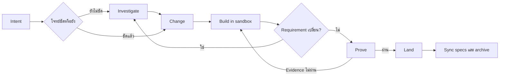

# Change Loop

[English](README.md) | **ภาษาไทย**

Change Loop คือ software-change harness สำหรับ AI coding agent ช่วยให้
agent ทำงานเป็นขั้นตอนที่ตรวจสอบและกลับมาทำต่อได้ ตั้งแต่ตกลงว่าจะเปลี่ยนอะไร
ลงมือในพื้นที่แยก พิสูจน์ผลด้วย evidence จริง และค่อยนำงานเข้า project หลัก

```text
Investigate? → Change → Build → Prove → Land
```

Change Loop ใช้ [OpenSpec](https://github.com/Fission-AI/OpenSpec) เก็บ requirement
ที่ต้องคงอยู่ และใช้เครื่องมือของ repository เองสำหรับ implement กับ test ระบบนี้
ไม่ได้มาแทน coding agent, test framework, CI หรือ Git workflow ของคุณ
ชื่อผลิตภัณฑ์และ workflow คือ **Change Loop** ส่วน package และ CLI ที่ติดตั้งยังใช้
`claude-foundation` เหมือนเดิม จึงไม่ต้องเปลี่ยนคำสั่งที่ใช้อยู่

**Version 3.5.4** — runtime API 30, provider protocol 13 receipt ที่บันทึกด้วย
เวอร์ชันก่อนหน้าจะอ่านได้เป็น `provider-version-stale` และต้องพิสูจน์ใหม่
`claude-foundation metrics <change-id>` จะแสดง source cohort ของ runtime แบบ
เจาะจงด้วย ได้แก่ semantic version, protocol bundle ที่โหลดจริง และ SHA-256
digest ของไฟล์ที่ติดตั้งใต้ `.claude/harness` เมื่อต้องเทียบรายงานจากคนละ
installation ให้ใช้ cohort ครบชุดแทนการดูเลข version เพียงอย่างเดียว

## เริ่มอ่านตรงไหน

- ถ้าจะใช้งาน ให้เริ่มที่ [สอนทำ Change แรก](#สอนทำ-change-แรก)
- ถ้าจะเข้าใจ lifecycle ให้อ่าน [ภาพรวม Workflow](#ภาพรวม-workflow) และเปิด [WORKFLOW.md](WORKFLOW.md) เมื่อต้องการ contract แบบละเอียด
- ถ้าจะพัฒนา evidence หรือ runtime ให้อ่าน [คู่มือ harness](.claude/harness/README.md) และ [เอกสาร evidence](.claude/harness/EVIDENCE.md)
- ถ้าจะเตรียม release ให้เริ่มที่ [RELEASING.md](RELEASING.md) และ [สถานะ scenario ปัจจุบัน](docs/reports/user-scenario-release-status.md)

## AI กับ Harness แบ่งหน้าที่กันอย่างไร

Change Loop ไม่ใช่ AI และไม่ได้เขียน code เอง แต่เป็น deterministic control plane
ที่ควบคุมการทำงานรอบ native coding agent

| ส่วน | หน้าที่ |
|---|---|
| ผู้ใช้ | กำหนด intent ตัดสินใจเรื่องสำคัญ review ผลลัพธ์ และอนุญาต Land อย่างชัดเจน |
| AI coding agent | Investigate, เขียนข้อตกลง, implement code และ test และแก้ failure ที่ evidence รายงาน |
| Change Loop harness | ควบคุม lifecycle state, scope, sandbox, evidence, proof freshness, budget และ Land guard |
| OpenSpec | เก็บ requirement และ change agreement แบบถาวรที่คน review ได้ |
| Tool ของ project | Test runner, linter, Playwright, scanner และ provider อื่นสร้าง executable evidence |
| Git และ CI | ดูแล version control และ automation ตาม process เดิมของ project |

```text
ผู้ใช้กำหนด Intent
        ↓
AI วิเคราะห์และ Implement
        ↓
Harness จำกัดขอบเขตและตรวจ Lifecycle
        ↓
Tool ของ project สร้าง Evidence
        ↓
Harness ตรวจ Proof
        ↓
ผู้ใช้อนุญาต Land อย่างชัดเจน
```

Harness ไม่ถือว่าคำพูดว่า “เสร็จแล้ว” ของ AI เป็น evidence ระบบอาจสร้าง execution
plan แบบจำกัดขอบเขตและแนะนำ model tier แต่ runtime ไม่ได้เรียก model เอง การเรียก
agent และ model ยังเป็นหน้าที่ของ native agent host

## ทำไมต้องใช้

AI agent อาจเขียน code ที่ดูถูกต้อง แต่เข้าใจ requirement ผิด ทดสอบไม่ตรงจุด
หรือแก้ working tree หลักก่อนที่คุณจะได้ review Change Loop จึงแยกหน้าที่เหล่านี้:

- **OpenSpec เก็บข้อตกลง** ทำให้ intent ไม่หายไปพร้อม chat history
- **Build ทำในพื้นที่แยก** โดยใช้ Git worktree หรือ directory copy เพื่อไม่ให้
  งานระหว่างทางปนกับ project หลัก
- **Evidence เป็นตัวตัดสินความพร้อม** Test, static analysis, browser check หรือ
  tool ของ project จะสร้าง receipt ที่ผูกกับ workspace จริง
- **Land ต้องสั่งอย่างชัดเจน** Change Loop ไม่ commit, push หรือเปิด pull request
  เอง ถ้าคุณไม่ได้อนุญาตแยกต่างหาก
- **กลับมาทำต่อได้** Task, runtime state, receipt และ recovery journal ยังคงอยู่
  แม้เปลี่ยน agent session

เป้าหมายคือรักษาความน่าเชื่อถือโดยไม่ต้องใช้ phase pipeline หรือ agent หลายบทบาท
ตลอดเวลา และไม่ถือว่าคำพูดว่า “เสร็จแล้ว” ของ agent เป็นหลักฐาน

## ติดตั้ง

สิ่งที่ต้องมี:

- Node.js 20.19 ขึ้นไป
- OpenSpec CLI 1.7.0 สำหรับ sync spec และ archive

แนะนำให้มี Git สำหรับ worktree isolation; ถ้าโปรเจกต์ dirty หรือไม่ใช่ Git จะใช้
isolated copy และแนะนำให้มี `jq` สำหรับ merge Claude settings เดิม หากไม่มี
installer จะรักษาไฟล์เดิมและสร้าง companion file ให้ตรวจและ merge เอง

```bash
npm install -g @fission-ai/openspec@1.7.0
```

ติดตั้งด้วย Homebrew:

```bash
brew tap maximumsoft-co-ltd/claude-foundation \
  https://github.com/Maximumsoft-Co-LTD/claude-foundation
brew install claude-foundation
claude-foundation init /path/to/your-project --yes
```

หรือติดตั้งจาก source checkout:

```bash
git clone https://github.com/Maximumsoft-Co-LTD/claude-foundation.git
cd claude-foundation
./install.sh /path/to/your-project
```

Claude Code ไม่ต้องใช้ adapter ส่วน agent host อื่นใช้ `--host` วาง adapter
ทับการติดตั้งชุดเดียวกัน:

```bash
claude-foundation init /path/to/your-project --host cursor    # หรือ opencode, codex
```

Cursor ได้หก lifecycle prompt หลัก พร้อม `/changes`, alias `/feature` และ skill router เป็น rule แบบ `alwaysApply`;
OpenCode ได้ command พร้อม guard plugin ที่ replay hook ที่ ship มาแบบ live;
Codex ได้หก prompt หลักพร้อม utility/alias อีกสองตัวใน `$CODEX_HOME/prompts` พร้อม ownership marker —
Codex ไม่มี tool hook การบังคับใช้ที่นั่นจึงเหลือ Land gate

หลังติดตั้ง ให้เปิด Claude Code session ใหม่ใน project เป้าหมายเพื่อโหลด slash
commands แล้วตรวจ installation ด้วย:

```bash
claude-foundation version
claude-foundation doctor --stage change
```

ถ้าเป็น Git project ให้ตรวจและ commit ไฟล์ setup ที่ installer stage ไว้ก่อน
`/change` แรก เพราะ installer ไม่มีอำนาจ commit แทนผู้ใช้:

```bash
git status
git commit -m "chore: install Change Loop"
```

Installer จะรักษา specs, active changes, runtime state, custom agents และ hooks
ของ project ไว้ การ upgrade จะ refresh เฉพาะ command, schema, harness, rule,
skill และ hook ที่ Change Loop เป็นเจ้าของตาม install manifest

## ใช้ Investigate ก่อนตกลงว่าจะเปลี่ยนอะไร

ใช้ `/investigate` เมื่อข้อมูลยังไม่พอสำหรับเขียน change agreement ที่เชื่อถือได้
เช่น ยังไม่รู้ root cause, มีหลายแนวทางที่ tradeoff ต่างกัน, compatibility หรือ
migration constraint ยังไม่ชัด หรือยังไม่เข้าใจ brownfield code path เดิม

เริ่มจาก decision หรือสิ่งที่ยังไม่รู้ ไม่ใช่สั่งให้ implement solution ไปก่อน:

```text
/investigate why profile updates occasionally overwrite newer data
```

ถ้าเป็นคำถามของ active change ให้ใส่ change ID และคำถามใหม่:

```text
/investigate add-profile: should updates use last-write-wins or optimistic locking?
```

Agent จะอ่าน code ที่เกี่ยวข้องแล้วแยกผลลัพธ์เป็น:

- Fact ที่ตรวจยืนยันจาก code แล้ว
- Hypothesis ที่ยังไม่ได้พิสูจน์
- Constraint และ boundary ที่ได้รับผล
- ทางเลือกที่ทำได้พร้อม tradeoff
- เรื่องที่ยังต้องให้ user ตัดสินใจ

ตอนจบควรได้ outcome อย่างใดอย่างหนึ่ง:

```text
ready for /change
needs user decision
not worth changing
```

ถ้าได้ `ready for /change` ให้นำ finding ที่ยอมรับแล้วเข้า durable agreement:

```text
/change add-profile
```

Investigation ไม่แก้ product code และไม่แก้ formal change โดยเงียบ ๆ ถ้า change
มี Build sandbox แล้ว ระบบจะสำรวจ sandbox นั้นแทน main working tree รุ่นเก่า
และสามารถ Investigate ซ้ำได้ทุกเวลาก่อน Land เมื่อ implementation ทำให้พบ
assumption ใหม่

## สอนทำ Change แรก

สมมติว่าต้องการให้เจ้าของ account แก้ display name ของตัวเองได้

### 1. สร้างข้อตกลง

เรียกใน agent session:

```text
/change allow an account owner to edit their display name
```

Agent จะสำรวจ project ถามเฉพาะ decision ที่มีผลต่อ outcome และเขียน semantic
draft ขนาดเล็กหนึ่งชุด Harness compile เป็น `openspec/changes/<change-id>/`
พร้อมสร้าง stable ID และ link ระหว่าง requirement, scenario, task, claim และ
provider ก่อนทำต่อ ให้ review proposal, observable scenario, task และ evidence
claim ว่าตรงกับสิ่งที่ต้องการ OpenSpec packet ที่ compile แล้ว—not chat หรือ draft
ชั่วคราว—คือ source of truth

Agent จะตอบด้วยภาษาของคุณและเริ่มจากผลลัพธ์ งานกู้คืนที่ปลอดภัยกับคำสั่งปกติ
Agent จะทำให้เอง แล้วบอกว่าแก้อะไรและตรวจอะไรแล้ว คุณจะถูกถามเฉพาะเมื่อ behavior,
ความเสี่ยง, authority หรือ conflict ต้องใช้การตัดสินใจ ส่วน JSON, hash และข้อมูล
receipt เป็น protocol ภายในจนกว่าคุณจะขอดูเพื่อวิเคราะห์

ทำไมต้องมีขั้นนี้: ข้อตกลงที่ชัดช่วยไม่ให้รายละเอียดตอน implement ค่อย ๆ
เปลี่ยนความหมายของ requirement โดยไม่มีใครสังเกต

### 2. Build ในพื้นที่แยก

```text
/build <change-id>
```

ถ้า Git repository สะอาด Change Loop จะสร้าง detached worktree ถ้ามี local
change อยู่แล้วหรือไม่ใช่ Git repository จะใช้ isolated copy แทน Agent แก้ code
ในพื้นที่นั้นและติ๊ก task ที่ verify ผ่านใน `tasks.md` โดยไม่แก้ project หลัก

หา path ของ workspace ได้ด้วย:

```bash
jq -r '.workspace.path' .foundation/runtime/<change-id>.json
```

worktree มีแค่ไฟล์ที่ Git ติดตาม ถ้า provider ต้องติดตั้ง dependency ก่อน ให้
ประกาศ `sandbox.setupCommand` (พร้อม `setupTimeoutMs`) ใน `foundation.json`
หรือ `setupCommand` รายรีโปใน `openspec/repositories.yaml` มันจะรันหนึ่งครั้ง
ในทุก workspace ใหม่ และถ้า setup ล้มเหลว sandbox จะถูกเก็บไว้พร้อมพิมพ์วิธีกู้คืน

ถ้าต้องใช้ Bash โดยตรงระหว่าง Build ให้เริ่มคำสั่งที่แก้ไฟล์ด้วย
`cd <exact-workspace> && ...` phase guard จะบล็อก package manager หรือ formatter
ที่ไม่ได้ผูกกับ workspace, path ที่หนีด้วย `..`, การ `cd` ออกภายหลัง, filesystem
operand แบบ absolute และการเขียนผ่าน symlink ออกนอก workspace ก่อน shell เริ่ม
ทำงาน `claude-foundation exec` จะ derive phase จาก runtime state ใช้นโยบายเดียวกัน
และเริ่มคำสั่ง Build ใน canonical workspace ควรใช้ Edit/Write แบบ structured เมื่อ
ทำได้ และยังต้องพึ่ง process isolation ของ host สำหรับผลข้างเคียงทางอ้อมจาก script

ทำไมต้องมีขั้นนี้: คุณ inspect หรือทิ้ง implementation ที่ยังไม่พร้อมได้ โดยไม่
ปนกับ checkout ที่กำลังใช้งาน

Agent ขับ Build ด้วย `claude-foundation advance <change-id> --through build`
Coordinator เดียวนี้ validate เตรียม isolation เลือกงานที่รันได้ และคืน action ที่
มีขอบเขตหนึ่งตัว ผู้ใช้ไม่ต้องประกอบ sandbox, packet, plan, lease หรือ dispatch เอง

### 3. Prove ผลลัพธ์

```text
/prove <change-id>
```

Change Loop จะ validate ข้อตกลง ตรวจว่า implementation task เสร็จ รัน evidence
provider ตาม claim และเก็บ receipt ที่ผูกกับ content ของ workspace ถ้าผ่านจะได้:

```text
PROVEN <change-id>
next: /land <change-id>
```

ทำไมต้องมีขั้นนี้: Passing proof ยืนยันว่า behavior ที่ประกาศไว้ถูกตรวจบน code
ชุดเดียวกับที่จะ Land ไม่ใช่บน workspace เก่าหรือคนละชุด

Agent ใช้ `advance <change-id> --through proven`; คำสั่ง `proof ...` เดิมยังอยู่
สำหรับ diagnostic และ integration

### 4. Land งานที่พิสูจน์แล้ว

```text
/land <change-id>
```

Land จะตรวจว่า proof ยัง fresh ตรวจ conflict ใน target apply เฉพาะ diff ที่
prove แล้ว sync delta spec ที่ยอมรับ และ archive change ถ้า code, test, config,
agreement หรือ target path ที่เกี่ยวข้องเปลี่ยนหลัง Prove ระบบจะหยุดแทนการเขียนทับ
ถ้า target branch แค่มี commit ใหม่ Agent จะ sync sandbox เดิม, Prove ใหม่ และ
Land ต่อให้เอง งานไม่หายและไม่ต้องเปิด Change ใหม่ แต่ถ้า replay conflict จริง
ระบบจะหยุดเพื่อให้คุณตัดสินใจ

ทำไมต้องมีขั้นนี้: การนำ code เข้า project กับการอัปเดต requirement ถาวรถูกผูก
เป็น completion boundary เดียวที่มี guard และ resume ได้

Agent ใช้ `advance <change-id> --through archived` งานจะเสร็จจริงเมื่อ state เป็น
`archived` และ Land ยังไม่ได้ให้อำนาจ commit, push, publish หรือเปิด pull request

### 5. Commit ตาม Git process ของ project

Change Loop หยุดหลัง apply และ archive ให้ review ผลลัพธ์ จากนั้น commit, push
และเปิด pull request ตาม process ปกติของ project

## ภาพรวม Workflow



Flow นี้ไม่ใช่ waterfall ก่อน Land สามารถแก้ change เดิมเมื่อพบข้อมูลใหม่:

```text
Investigate ⇄ Change ⇄ Build ⇄ Prove → Land
```

หลัง Land แล้ว requirement ใหม่ควรเปิดเป็น change ใหม่

| Phase | AI ทำอะไร | Harness ทำอะไร |
|---|---|---|
| Investigate | หา fact, hypothesis, ทางเลือก และ tradeoff | เลือก workspace ที่ถูกต้องและควบคุมไม่ให้แก้ product |
| Change | ระบุ intent, requirement, scenario, task outcome และ evidence ที่ต้องใช้ | Compile stable link และ validate schema, risk, scope กับ revision state |
| Build | Implement code และ test, รัน focused check และทำ task ให้เสร็จ | สร้าง isolated workspace จำกัดอำนาจ และเก็บความคืบหน้า |
| Prove | วิเคราะห์และแก้ failure ที่ evidence พบ | รัน provider ตรวจ claim coverage และ receipt แล้วสร้าง content-bound proof |
| Land | ช่วยแก้ conflict เมื่อจำเป็นต้องใช้ judgment หรือแก้ implementation | ตรวจ freshness, apply proven diff, รองรับ rollback/resume, sync spec และ archive |

## ควรใช้ Command ไหน

| Command | ใช้เมื่อ | ผลลัพธ์ |
|---|---|---|
| `/investigate` | ยังไม่รู้สาเหตุ scope หรือแนวทาง; เพิ่ม `--compare` เมื่อต้องเปรียบเทียบ 3–5 ทางเลือก | Fact ที่ตรวจจาก code, ทางเลือก, tradeoff และ decision ที่ยังขาด โดยไม่แก้ product |
| `/change` | รู้ outcome แล้ว หรือต้องแก้ active agreement | สร้างหรือแก้ OpenSpec artifact โดยไม่แก้ product |
| `/build` | ข้อตกลงพร้อม implement | Code และ focused check ใน isolated workspace |
| `/prove` | Implementation task และ focused check เสร็จ | Required receipts และ `proof.json` ที่ผูกกับ content |
| `/land` | Proof ผ่านและคุณยอมรับ change | Apply proven diff, sync specs และ archive |
| `/changes` | กลับมาทำงานต่อหรือมีหลาย active changes | State ปัจจุบันและ operation ที่ควรทำต่อ |
| `/dev` | Intent ชัดและต้องการ Change → Build → Prove ครั้งเดียว | ปกติหยุดที่ proven candidate; automation lane ที่มี Land authority ล่วงหน้าอาจทำต่อถึง `archived` |

Slash command แต่ละคำสั่งมีสองชั้นที่ทำงานร่วมกัน:

- **Agent layer:** ทำงานที่ต้องใช้ความเข้าใจ เช่น วิเคราะห์ requirement,
  เขียน artifact และ implement code
- **Harness layer:** ทำงาน deterministic เช่น validate, สร้าง sandbox,
  รัน provider, ทำ hash และเปลี่ยน lifecycle state

ตัวอย่างเช่น `/prove` ไม่ได้ให้ AI ตัดสินเองว่า implementation ถูกต้อง แต่ให้
harness รัน provider ที่ประกาศไว้และตรวจ receipt ให้ครอบคลุมทุก required claim

ใช้ command แยกเมื่อต้องการ review ทุก boundary ใช้ `/dev` กับงานเล็กที่ชัดและ
ต้องการ one-shot flow:

```text
/dev rename the Save button to Update Profile
```

เมื่อเลือก prototype แล้ว ให้นำเฉพาะ decision ที่เลือกเข้า agreement:

```text
/change <intent-or-change-id> --prototype-selection <selection-path>
```

ไฟล์ prototype ยังเป็นของชั่วคราวและอ้างเป็น evidence ไม่ได้

## ทำความเข้าใจ `openspec/`

`openspec/` คือข้อตกลงที่คน review ได้ มี current requirement และ artifact ของ
active change แต่ไม่มี runtime status หรือ test log ชั่วคราว

```text
openspec/
├── config.yaml
├── repositories.yaml
├── specs/
├── changes/
│   ├── <change-id>/
│   └── archive/
└── schemas/
    ├── foundation-standard/
    └── foundation-rapid/
```

| Path | คืออะไร | มีไว้ทำไม |
|---|---|---|
| `config.yaml` | OpenSpec config และ rules ระดับ project | ทำให้ทุก change ใช้ project context และ default schema เดียวกัน |
| `repositories.yaml` | Topology และ access policy ของ repository ทั้ง project | ทำให้ cross-repository scope ชัดและ review ได้ |
| `specs/` | Current product requirements ที่ยอมรับแล้ว | บันทึกว่าระบบหลัง Land ควรทำอะไร |
| `changes/<change-id>/` | ข้อตกลงของ active change หนึ่งรายการ | แยก proposed behavior จาก current behavior จนกว่าจะ Land |
| `changes/archive/` | ประวัติ change ที่เสร็จแล้ว | เก็บเหตุผลและวิธีที่ accepted behavior เปลี่ยนไป |
| `schemas/` | Schema และ template ที่ Change Loop ดูแล | กำหนด artifact ที่ standard และ rapid lane ต้องมี |

### ไฟล์ใน Active Change

```text
openspec/changes/<change-id>/
├── .openspec.yaml
├── proposal.md
├── tasks.md
├── evidence.yaml
├── specs/<area>/spec.md       # standard lane
├── design.md                  # เมื่อมี durable design context
├── grounding.yaml             # เมื่อมี material decision ที่ต้อง lock
├── execution.yaml             # เมื่อ override provider/service wiring
├── repositories.yaml          # เมื่อประกาศ multi-repository scope
└── handoffs.yaml              # เมื่อมี permission-bound operation
```

| File | ตอบคำถามอะไร | Harness ต้องใช้ทำไม |
|---|---|---|
| `.openspec.yaml` | ใช้ `foundation-standard` หรือ `foundation-rapid` | เลือก artifact workflow ของ change |
| `proposal.md` | เปลี่ยนทำไม เปลี่ยนอะไร และไม่ทำอะไร | ทำให้ scope กับ impact ไม่ถูกซ่อนไว้เป็น assumption |
| `specs/<area>/spec.md` | Observable behavior ใดถูกเพิ่ม แก้ หรือลบ | ให้ Prove มี requirement และ `WHEN`/`THEN` scenario ที่คงที่ และให้ Land merge delta เข้า current specs |
| `design.md` | Technical decision, diagram, integration หรือ prototype selection ใดบังคับวิธี implement | เก็บเฉพาะ context สำคัญ ไม่บังคับสร้าง design ว่าง |
| `tasks.md` | Implementation ใดยังเหลือ | เป็น implementation ledger เพียงที่เดียว Stable ID และ checkbox ทำให้ Build resume ได้ |
| `evidence.yaml` | Behavioral claim ใดต้องพิสูจน์ | แยก proof obligation ออกจาก tool ที่นำมารัน |
| `grounding.yaml` | Material decision ใดถูกตกลงไว้ล่วงหน้า | Semantic v3 เก็บเฉพาะ non-derived decision ส่วน grounding รุ่นเดิมยังอ่านได้ |
| `execution.yaml` | Change นี้ override evidence wiring ที่ derive แล้วหรือไม่ | มีเมื่อใช้ custom command, report, service, timeout หรือ readiness เท่านั้น |
| `repositories.yaml` | Change อ่านหรือเขียน repository ใดได้ | จำกัดอำนาจของ agent และกำหนด dependency order |
| `handoffs.yaml` | Operation ใดต้องส่งต่อเจ้าของสิทธิ์ | ย้าย AWS, secret, Terraform, deploy, restart และงาน environment ออกจาก task ของ developer โดยยังคุม activation safety |

ห้ามใส่ `/prove` หรือ `/land` เป็น checkbox ใน `tasks.md` เพราะสองอย่างนี้เป็น
lifecycle command ไม่ใช่ implementation task

### Standard กับ Rapid Lane

`foundation-standard` มี proposal, delta specs, tasks และ evidence ส่วน design
กับ extension อื่นสร้างเมื่อมี concern จริง ใช้กับ public contract,
authentication, data หรือ migration, behavior
ที่ coupled, impact สูง, irreversible effect หรืองานที่ต้องใช้ evidence มากกว่า
unit/static

`foundation-rapid` จงใจไม่มี delta specs และปกติไม่มี design ใช้ได้เฉพาะงาน impact ต่ำ
แยกขาด ไม่มี public contract, persistent migration, security trigger หรือ
irreversible effect หากพบ requirement ที่เข้มขึ้น `/change` จะ upgrade change เดิม
เป็น standard

## ทำความเข้าใจ State

เรียก `/changes` หรือ:

```bash
claude-foundation changes
```

| State | หมายถึงอะไร | ทำอะไรต่อ |
|---|---|---|
| `untracked` | OpenSpec มี active change แต่ Change Loop ไม่มี runtime record | ใช้ `/change <change-id>` เพื่อนำเข้า harness และ validate |
| `change` | มีข้อตกลงแล้ว แต่ยังไม่มี Build sandbox | ทำ artifact ให้ครบ แล้ว `/build` |
| `building` | มี isolated workspace และ proof ยังไม่ผ่าน | ทำ `/build` ต่อ หรือ `/prove` เมื่อพร้อม |
| `ready-to-land` | Passing proof ยังตรงกับ agreement และ workspace ปัจจุบัน | `/land` |
| `stale-proof` | Proof เคยผ่าน แต่ไม่ตรงกับ input ปัจจุบันแล้ว | ทำ Build ที่จำเป็นให้เสร็จ แล้ว `/prove` ใหม่ |
| `applied` | Code ถูก apply แล้ว แต่ spec sync/archive ยังไม่เสร็จ | เรียก `/land` ซ้ำ Transaction resume ได้ |
| `archived` | Code ถูก apply, specs ถูก sync และ change ถูก archive | งานเสร็จและไม่แสดงใน active changes |

`ready-to-land` คือชื่อที่ user เห็นสำหรับ lifecycle state ภายใน `proven` ส่วน
`pass`, `fail`, `error`, `inconclusive` หรือ `stale` เป็นสถานะของ evidence receipt
ไม่ใช่สถานะของ change ทั้งก้อน

Runtime state อยู่ใน `.foundation/runtime/<change-id>.json` ห้ามเขียนซ้ำหรือแก้
ด้วยมือใน OpenSpec Markdown

## Evidence คืออะไร

Evidence ใช้ตอบคำถามว่า:

> เรารู้ได้อย่างไรว่า behavior นี้ถูกต้อง นอกเหนือจากการที่ agent บอกว่าเสร็จแล้ว

```text
Requirement → Claim → Provider → Receipt → Proof
```

`evidence.yaml` ประกาศ behavioral claim ที่มี stable ID และ capability ที่ต้องใช้:

```json
{
  "version": 2,
  "claims": [
    {
      "id": "other-user-cannot-update-profile",
      "scenario": "A user cannot update another user's profile",
      "impact": "high",
      "capabilities": ["test", "security-static"]
    }
  ]
}
```

สำหรับ semantic draft compiler จะ derive provider wiring ปกติไว้ใน
`evidence.yaml` จาก verify command ของ task และสร้าง `execution.yaml` เฉพาะเมื่อ
ต้องใช้ custom provider, report, service, timeout หรือ readiness การแยกนี้ยังทำให้
เปลี่ยน wiring ได้โดยไม่ลด behavior ที่ต้องพิสูจน์

Capability ที่พบบ่อยคือ `test`, `discovery`, `static-analysis`, `browser`,
`integration`, `compatibility`, `performance`, `security-static`,
`accessibility`, `data-migration`, `resilience`, `observability`, `deployment`,
`dependency-supply-chain`, `cross-repo-contract` และ `review` ดู catalog และ
รูปแบบ config จริงที่ติดตั้งด้วย:

```bash
claude-foundation providers
```

ถ้า derived หรือ custom wiring ยังไม่ครบ ให้ตรวจ command ที่ project เป็นเจ้าของ
โดยไม่รัน จากนั้น preview wiring ที่มีความมั่นใจสูงก่อนเขียนอย่างชัดเจน:

```bash
claude-foundation evidence detect <change-id>
claude-foundation evidence init <change-id>
claude-foundation evidence init <change-id> --write
claude-foundation evidence doctor <change-id>
```

Detection อ่านเฉพาะ manifest และ configuration ใน repository โดยไม่รัน script,
ติดตั้ง dependency, เขียนทับ provider เดิม, สร้าง receipt หรือเปลี่ยน command ที่
กำกวมให้กลายเป็น passing evidence

ตรวจ traceability ตั้งแต่ต้นจนจบก่อน Build หรือหลังแก้ข้อตกลง:

```bash
claude-foundation change audit <change-id>
```

Task เชื่อม claim ด้วย `[claims:<claim-id>]` Audit จะตรวจ link ที่หายหรือไม่รู้จัก,
claim ที่ไม่มี task/provider, scenario ที่ไม่ตรง, security negative path ที่ขาด
และ migration ที่ไม่มี rollback/integrity coverage

Remote CI ตั้งค่า issuer กับ Ed25519 public key แล้ว import ด้วย `evidence
verify-ci` ได้ ทางปกติของ agent คือ `advance <change-id> --through proven` ส่วน
`proof advance` เป็น compatible primitive ที่ coordinator เรียกภายใน ทุกทางผูก evidence กับ
workspace ปัจจุบัน จึงปฏิเสธ response ที่ stale, ไม่ตรง, ไม่มีลายเซ็น หรือถูก replay

Change Loop ไม่ติดตั้ง test framework หรือ browser ให้ แต่รัน tool ที่ repository
ประกาศและเก็บ receipt ใต้ `.foundation/receipts/<change-id>/` Receipt reuse ได้
เฉพาะเมื่อ workspace hash, agreement, provider protocol/version และ claim coverage
ยังตรงกัน

Repository ของผู้ใช้เปิด changed-code CRAP และ mutation quality lane ได้ด้วย
`claude-foundation quality init` โดยผลแต่ละ repository ไม่ถูกเฉลี่ยรวม ภาษา/เครื่องมือ
ที่ยังไม่รองรับจะแสดงสถานะตรงไปตรงมา และ finding ไม่มีอำนาจให้แก้ code นอก change
อ่านวิธีตั้งค่า adapter, baseline, CI และ rollout ที่
[Consumer Quality](docs/consumer-quality.th.md)

```bash
claude-foundation quality discover                 # สำรวจ capability แบบ read-only
claude-foundation quality init                     # preview config ที่จะ commit
claude-foundation quality init --write --ci github
claude-foundation quality doctor
claude-foundation quality run --change <change-id> # pilot แบบ report-only
```

ค่าเริ่มต้นยังเป็น report-only ให้ตรวจ mapping และสร้าง baseline ที่อนุมัติชัดเจน
ก่อนเพิ่ม `--enforce`; nightly ดูแล full debt inventory ส่วน PR จำกัดอยู่ใน Change

คำสั่งวิเคราะห์ที่ใช้บ่อย:

```bash
claude-foundation doctor --stage prove --change <change-id>
claude-foundation proof readiness <change-id>
claude-foundation proof run <change-id>
```

ให้ใช้ `claude-foundation advance <change-id> --through proven` เป็น boundary ของ Prove
แต่ละ gate จะรวม finding ที่ทำงานแยกกันได้ แก้ทุกข้อใน contract เป็น batch แล้ว
รันซ้ำเฉพาะ evidence ที่ invalidated จนผ่าน โดยไม่จำกัดจำนวนรอบแก้ product
ถ้าต้องตัดสินใจ ขอ authority/resource แก้ conflict หรือไม่มี progress ระบบจะเก็บ
change เดิมและคืนทางเลือกพร้อมคำสั่ง resume การเรียกซ้ำตอน workspace และ request
ไม่เปลี่ยนจะไม่รัน provider หรือ dispatch reviewer ซ้ำ ส่วน `proof collect`, authority commands โดยตรง และ
`proof run` เก็บไว้สำหรับการวิเคราะห์หรือ integration ที่ตั้งใจใช้ ความล้มเหลวภายใน
Build, Prove และ Land จะคืน six-action envelope เดิมพร้อมสาเหตุจริง และ chain ที่ยัง
มี progress จะไม่ถูกหยุดด้วยจำนวนรอบตายตัว

`claude-foundation advance <change-id>` จะเลือก next action ที่มีขอบเขตชัดเจน
เพียงหนึ่งรายการตลอด Build, Prove, repair และ Land โดย host ยังเป็นผู้เรียก model
และ user ยังถือ authority สำหรับ commit, push, publish, เปิด PR และ waiver
ก่อนคืน `RUN_PROOF` คำสั่งนี้จะตรวจ Proof readiness และส่ง blocker ด้าน code,
contract, resource หรือ decision ไปยัง typed next action ที่ถูกต้อง
ส่วน `claude-foundation feedback <change-id>` จะแยกเวลาที่ reviewer ทำงาน,
เวลาซ่อมที่มีหลักฐานจาก workspace, human wait และเวลาที่ยังระบุสาเหตุไม่ได้
พร้อมแสดง evidence reuse, action ที่ resume ต่อได้ และ provider ที่ receipt
มาจาก command execution เดียวกันแทนที่จะเป็น observation อิสระ

Playwright test ผูก evidence ได้ด้วย annotation `claim` และผูก stable case ด้วย
annotation `critical-case` โดย test ที่ถูก skip จะไม่ผ่าน requirement ทั้งสองแบบ
นอกจากนี้ `Impact` และ `Coupling` ใน proposal ต้องตรงกับ agreement ที่ machine
เป็นเจ้าของ เพื่อไม่ให้ classification ที่คนอ่านกับที่ระบบบังคับใช้คลาดกัน

Build packet มี `authorityPreflight` ด้วย งานเสี่ยงสูงที่ต้องใช้ signed CI จะหยุด
ก่อน dispatch หรือแก้ product ถ้ายังไม่มี external CI provider ที่เชื่อถือได้ โดย
ระบุ issuer/public-key ที่ขาดและทาง resume Change ส่วน Land จะตรวจ signed receipt
ซ้ำอย่างอิสระ

Proof สามารถกำหนด provider `semantic-acceptance` ที่มีลายเซ็นได้ด้วย โดยผูก case
ID และ input partition ที่คงที่เข้ากับ workspace จริง แต่ไม่เปิด hidden input
หรือโค้ด oracle ให้ agent เห็น ถ้า required case หาย, ถูก skip, ซ้ำ, ถูกแก้ไข,
stale หรือ fail ระบบจะบล็อก Proof และ review ไม่สามารถ override ได้ สำหรับ npm
repository เดียว ระบบจะเปิด lockfile consistency provider อัตโนมัติเมื่อมีทั้ง
`package.json` และ `package-lock.json` จึงตรวจพบ lockfile ที่ไม่ตรงก่อน Proof
สุดท้ายโดยไม่ต้องเพิ่ม wiring เอง

เบื้องหลัง packet, planning, readiness และ mutation guard ใช้ compiled execution
contract ชุดเดียวและเปลี่ยน lifecycle ผ่าน reducer กลาง เพื่อลด policy ซ้ำซ้อน
โดยไม่เปลี่ยนคำสั่งผู้ใช้ หลังอัปเกรดเป็น provider protocol 13 receipt protocol
12 เดิมจะ stale ให้เก็บ active change ไว้ แก้ config ตาม diagnostics แล้วรัน
`advance <change-id> --through proven` ใหม่ หากจำเป็นต้อง rollback ให้ย้อนเวอร์ชันที่ติดตั้ง
เท่านั้น ห้ามคัดลอกหรือแก้ receipt JSON เอง

ผู้ใช้ไม่ต้องประกอบ receipt command, provenance JSON, provider metadata หรือ
workspace hash เอง รายละเอียดเหล่านี้เป็น protocol ภายในและจะแสดงเมื่อผู้ใช้
ขอดูข้อมูลเชิงเทคนิคเท่านั้น

ถ้า provider ที่ตั้งค่าไว้รันไม่ได้ `proof readiness` จะคืน
`INFRASTRUCTURE_ERROR` พร้อม `next` ที่มีทางเลือกแบบ structured ได้แก่ ตรวจ
environment ด้วย doctor, retry, ใช้ external evidence ที่มี artifact ตรวจสอบ
ย้อนหลังได้ หรือเปลี่ยนเป็น project-owned command ที่พิสูจน์ claims เดิมได้
Harness จะไม่ลด claim coverage หรือเปลี่ยน provider ที่ล่มให้เป็น `pass`

สถานะที่ยังไม่พร้อมทุกแบบมี recovery path โดย `NEEDS_CODE_CHANGE` จะคืนคำสั่ง
`/build` และ pending tasks ส่วน `CONFIGURATION_ERROR` จะคืน doctor, `/change`,
ไฟล์ config ที่เกี่ยวข้อง และคำสั่ง validate ถ้า `changes` แสดง
`orphan-runtime` หมายถึง runtime ยังอยู่แต่ active OpenSpec directory หาย ให้กู้
directory เดิมหรือย้าย runtime JSON ไป `.foundation/recovery/orphaned-runtime/`
เพื่อ quarantine แบบย้อนกลับได้

provider คืนสถานะหนึ่งในสี่ มีแค่ `pass` ที่ land ได้ ส่วน `fail`, `error` และ
`inconclusive` บล็อกทั้งหมด ตัวที่ควรรู้จักคือ `inconclusive` มันแปลว่า provider
รันแล้วแต่ไม่ได้ให้คำตัดสินกับ claim ของคุณ ซึ่งมักหมายถึงการต่อสายที่รายงานผิดที่
ไม่ใช่ code พัง

gate ที่รันแล้ว fail มีทางออกสามทาง และ blocker พิมพ์ให้ครบ: แก้ code, ต่อสาย
provider ใหม่ หรือ waive capability ตัวนั้นด้วยการตัดสินใจที่บันทึกไว้ผ่าน
`change waive <change-id> --capability <c> --reason <why> --decision-ref <ref>`
(`--revoke` คืนข้อบังคับ) waiver เดินทางเป็น advisory `user-waived` ผ่าน proof,
archive และบรรทัด `LAND READY` มันเป็นการหักออกเท่านั้น receipt ที่ได้มาแล้ว
ยังใช้ได้ และไม่มีเส้นทางที่พา proof ที่ fail ไป land ส่วน review กับ acceptance
มีเส้นทาง waiver ของตัวเองจึงถูกปฏิเสธที่นี่

หากต้อง wire provider หรือ browser workflow ใหม่ ดู
[Executable evidence adapters](.claude/harness/EVIDENCE.md)
ส่วนเว็บเอกสารครอบคลุมเรื่องเดียวกันสำหรับคนอ่าน ไม่ใช่สำหรับ agent

- [Receipt และความ stale](https://claude-foundation.dev/docs/th/evidence/receipts/)
  — receipt ผูกกับอะไร ทำไม pass ที่เขียนด้วยมือถูกปฏิเสธ และอะไรทำให้ proof หมดอายุ
- [Adapter และการต่อสาย](https://claude-foundation.dev/docs/th/evidence/adapters/)
  — adapter ทั้งห้าตัว การประกาศ input, service และตัวระบุ readiness
- [Change Loop เขียนอะไรบ้าง](https://claude-foundation.dev/docs/th/artifacts/)
  — artifact ทุกตัวที่ harness สร้าง และตัวไหนที่ตั้งใจให้คุณอ่าน

## ถ้า Requirement เปลี่ยนระหว่าง Build

ไม่ต้องเปิด change ที่สองเพียงเพราะพบข้อมูลใหม่ก่อน Land ให้แก้ agreement เดิม
Agent ส่ง semantic amendment หนึ่งชุดแล้ว resume coordinator:

```text
/investigate <change-id>: how does the existing verification flow work?
/change <change-id>
/build <change-id>
/prove <change-id>
```

Runtime ใช้ `change amend <change-id> <amendment.json>` แบบ transaction โดยรักษา
task ที่เสร็จและ manual Markdown section, validate ก่อนเก็บ revision, rollback
amendment ที่ไม่ผ่าน และ invalidate เฉพาะ claim ใหม่ก่อน resume `advance`

## การใช้หลาย Repository

ถ้าเพิ่งตั้งค่าครั้งแรก ให้อ่าน
[Workflow หลาย Repository](https://claude-foundation.dev/docs/th/multi-repository/)
ตามลำดับก่อนต่อ provider หรือแบ่ง worker ขนาน ส่วนเนื้อหาด้านล่างเป็นฉบับอ้างอิง
ย่อสำหรับผู้ที่คุ้นเคยแล้ว

`openspec/repositories.yaml` ประกาศ topology ถาวรของ project ส่วน
`repositories.yaml` ภายใน change เลือกเฉพาะ repository ที่ change นั้นอ่านหรือ
เขียนได้ ถ้าไม่มี selection จะยังทำงานแบบ repository เดียวชื่อ `root`

ถ้า selection ระบุ non-root แม้เพียง child เดียวและไม่ได้เลือก `root` ระบบยัง
ถือว่าเป็น composite หลัง Build สร้าง isolation แล้ว Change Loop ต้องพบ worktree,
target, access mode และ base head ที่บันทึกไว้ครบทุก child โดยจะไม่ fallback ไปยัง
live checkout หรือเงียบแล้วลดรูปเป็น root-only ใช้ `sandbox inspect <change-id>`
เพื่อดู record ที่หาย/ใช้ไม่ได้ แล้วรัน `sandbox create <change-id> --all` ซ้ำ
คำสั่งเดิมจะซ่อม binding ที่หายโดยรักษา worktree ที่ยังใช้ได้

Repository ที่จำเป็นเฉพาะตอน integration test ให้เลือกด้วย `mode: read`
ระบบจะสร้าง detached worktree ที่ล็อก commit ให้ read dependency, รวม content
ไว้ใน proof แต่ไม่สร้าง Land node ให้ Provider ที่รันจาก repo หนึ่งแต่ต้องใช้
หลาย repo ระบุ cwd ด้วย `repository` และระบุ dependency ทั้งหมดด้วย
`repositories`; command จะได้รับ path ผ่าน `FOUNDATION_REPOSITORIES_FILE` และ
ระบบจะปฏิเสธ tracked write ที่เกิดใน read-only worktree

ใส่ annotation ใน multi-repository task เพื่อให้ authority และ dependency ชัด:

```markdown
- [ ] **T001** Implement API [repo:api] [kind:implementation] [paths:internal/profile]
- [ ] **T002** Implement App [repo:app] [kind:implementation] [depends:T001]
- [ ] **T003** Verify contract [repo:app] [kind:contract] [depends:T001,T002]
```

Change Loop มอง multi-remote landing เป็น ordered resumable saga โดยตรวจ child
commit และ CI state ที่ระบุชัด ไม่อ้างว่า atomic ข้าม remote ใช้
`claude-foundation land resume <change-id>` เพื่อตรวจและเดินลำดับต่อ และดู protocol เต็มใน
[WORKFLOW.md](WORKFLOW.md)

ระหว่าง Build ระบบจะ compile repository, task, evidence provider และ Land
declaration เป็น execution graph แบบ deterministic โดยผู้ใช้ไม่ต้องเขียน graph
เพิ่มเอง งานข้าม repository เชื่อมกันด้วย producer/consumer contract ที่มี version
และ consumer จะไม่ถูก dispatch หาก schema ไม่เข้ากัน หลาย active change ทำงานใน
repository เดียวกันได้เฉพาะเมื่อ path, contract และ shared resource ที่ประกาศไว้
ไม่ทับกันอย่างพิสูจน์ได้ หาก scope ไม่ชัดจะกลับไป lock ทั้ง repository ตามเดิม
เมื่อบาง branch ล้ม Prove จะรักษางานอิสระที่เสร็จแล้ว แต่ Land ยังต้องมี aggregate
graph proof ที่ fresh และตรวจสถานะใหม่ก่อน mutation ของทุก remote wave

ระหว่าง Build คำสั่ง `advance` จะแปลง graph ปัจจุบันและ live lease เป็น
native-host action เพียงหนึ่งรายการ ส่วน compatible primitive `agents dispatch`
อยู่ใน `help --all` งานเล็กหรืองานที่ coupling กันยังอยู่ใน
parent session รวมถึง frontier ที่เลือกได้เพียง task เดียว ส่วน bounded spawn
group จะเกิดเมื่อ frontier มี task อิสระที่เลือกได้พร้อมกันหลายงานเท่านั้น
งาน singleton ที่อยู่ในแผนยังต้อง acquire lease และสร้าง task packet ใหม่ก่อนรัน
ใน parent Change Loop ไม่เรียกโมเดลเอง และจะคืน `wait` แทนการสร้าง executor ซ้ำ
เมื่อ host restart ขณะที่ lease เดิมยังไม่หมดอายุ

## Change Loop จำกัด Scope ของ Agent และ Skill อย่างไร

Change Loop ส่ง packet ขนาดเล็กตาม scope ของ task ให้ native agent host ไม่ใช่
resident orchestrator ที่คัดลอก conversation ทั้งหมดให้ worker ทุกตัว Change
repository เดียวที่ไม่มี shared external authority จะใช้ agent เดียวโดยไม่ขึ้นกับ
จำนวน task Worker หลายตัวมีประโยชน์เฉพาะเมื่องาน, repository access, dependency
และ evidence แยกจากกันได้ชัด

Agent จะโหลด construction skill หลักหนึ่งตัวตาม layer ที่แก้ และเพิ่ม security
หรือ observability guidance เฉพาะเมื่อ change ข้าม boundary เหล่านั้น งานที่ต้อง
ตัดสิน domain boundary เริ่มจาก `ddd-strategic` ส่วนงาน UI, backend, data หรือ
documentation ปกติไม่ควร preload skill chain ทั้งหมด

`foundation.json` map tier แบบ portable คือ `fast`, `standard` และ `deep` เข้ากับ
model family พร้อมกำหนด execution budget งาน inventory หรือ mechanical ใช้ fast,
implementation ปกติใช้ standard และ architecture, security, migration หรือ
independent review ใช้ deep โดยงาน risk สูงลดลงเป็น fast ไม่ได้
Validation จะปรับทั้ง request และ token lane จาก factor ที่กว้างที่สุดของ impact,
size, coupling, review, security, repository, provider, task, claim หรือ critical
case โดยไม่เปิดเผยข้อมูลลับ คำสั่ง `metrics` จะแสดง input, scale ที่เลือก และ
limiting factor ส่วน continuation ที่ผู้ใช้อนุมัติไว้จะคง allowance เดิม

`foundation.json` ที่มากับระบบ commit `independence: "self"` และ
`diversity: "single-model"` ไว้ชัดเจน ทั้งสองค่าเป็น assurance waiver:
review อาจใช้ identity หรือ session เดียวกับผู้แก้ และอาจใช้ model family เดียวกัน
`doctor` กับ `change validate` จะแสดงชื่อ waiver พร้อมผลที่ตามมา และ review receipt
จะบันทึกไว้ด้วย การแบ่งรอบ review ตามระดับความเสี่ยงกำหนดจำนวนรอบเท่านั้น ไม่ได้ทำให้ reviewer กลับมาเป็นอิสระหรือทำให้เกิด model diversity หากต้องการ separation
of duties ให้ commit `independence: "required"`; หากต้องการ cross-family review
ให้ commit `diversity: "required"`

## อะไรเป็น Source of Truth

| ข้อมูล | Source of truth |
|---|---|
| Intent และ behavioral agreement | `openspec/` |
| Implementation | Code และ tests |
| ความคืบหน้า implementation | `tasks.md` ของ active change |
| Runtime lifecycle และ sandbox | `.foundation/runtime/` และ `.foundation/sandboxes/` |
| Evidence receipt และ immutable proof bundle | `.foundation/receipts/` และ `.foundation/evidence/` |
| Provider log, metrics และ telemetry | `.foundation/logs/` |
| Model tier และ execution limit | `foundation.json` |
| Workflow history รุ่นเก่า | `.workflow/` แบบ read-only |

`.foundation/` เป็นพื้นที่ที่เครื่องดูแล เปิดอ่านเพื่อวิเคราะห์ได้ แต่อย่าใช้เป็น
product requirement หรือซ่อม state ด้วยมือถ้า operator guide ไม่ได้ระบุ

## Safety Boundary

- Worktree หรือ directory copy ป้องกัน workspace แต่ไม่ใช่ process-security
  sandbox
- Unattended execution จะ fail closed ถ้าไม่มี trusted attestation จาก host
- Host สร้าง challenge อายุสั้นด้วย `sandbox challenge` แล้วเซ็น project,
  agreement, nonce, expiry และ permission ที่แน่นอน ก่อนส่ง envelope แบบใช้ครั้ง
  เดียวผ่าน `--attestation`; ถ้ายังเปิด host-control socket หรือ credential ระบบ
  จะ block ต่อไป
- Land ปฏิเสธ stale proof และ conflicting edit ใน target path ที่แตะ และ apply
  ปฏิเสธที่จะทับ edit ใน target ที่ยังไม่ commit — มันระบุ path ที่จะถูกทับแทน
  ที่จะปล่อยให้คนเขียนทีหลังชนะ
- Apply มี backup และ journal ทำให้ Land ที่ถูกขัดจังหวะ retry ได้
- Land เตือน — โดยไม่บล็อก — เมื่อ target checkout อยู่บน `main`/`master`
  โดย guard ของ land ทุกตัวยังอิง commit
- Change Loop ไม่ commit, push, เปิด pull request หรือมอบอำนาจเหล่านั้นให้ worker
  agent โดยไม่ได้รับอนุญาตชัดเจน
- `protect-secrets.sh` และ `lint.sh` เปิดเป็นค่าเริ่มต้น
- `no-direct-main-commit.sh` เป็น opt-in เพราะบาง project อนุญาต controlled
  commit บน default branch โดย `doctor` จะรายงานว่าเปิดอยู่หรือไม่

### การอนุมัติโดยคน

standard change เริ่มต้นด้วย acceptance ที่ **ยังไม่ตัดสิน** และ `change validate`
จะไม่ผ่านจนกว่าจะมีคนตัดสิน นี่เป็นความตั้งใจ เพราะความเงียบไม่เคยถูกอ่านว่ายินยอม
แต่มันก็เป็นตัวบล็อกที่คนเจอเป็นอย่างแรก จึงควรตัดสินให้ชัดเจน

```bash
claude-foundation change resolve <change-id> --acceptance-not-required
claude-foundation change resolve <change-id> \
  --acceptance-required --acceptance-reason "<ทำไมต้องให้คนตัดสิน>"
```

การ route review เป็นคนละจุดและแบ่งตามความเสี่ยง งาน low ใช้ AI full review หนึ่งรอบ
งาน medium ใช้ full review หนึ่งรอบ และหลังแก้รวมหนึ่ง batch จึงใช้ fresh-session
delta ได้อีกหนึ่งรอบเพื่อปิด finding IDs เดิม งาน high ถาม material risk ใน
Decision Sheet ต้นทางและใช้ full/delta circuit แบบมีเพดาน โดยไม่มี human approval
บังคับและไม่มี AI รอบสาม ค่าเริ่มต้นใช้ Claude Code Opus ใน session ใหม่แบบ
read-only/non-persistent ถ้าเกิด infrastructure `error` เช่น CLI, auth, timeout
หรือ output schema พัง `infraFailureThreshold` จะจำกัดจำนวนครั้งต่อ reviewer และ
`fallbackReviewers` จะสลับ configured reviewer อัตโนมัติก่อนใช้ `main-session`
เป็นทางสุดท้าย ทุก attempt ที่พังยังอยู่ใน review chain และคง full/delta scope เดิม
การใส่ `main-session` ต้องใช้ `independence: "self"` และผล review แบบ `fail`
หรือ `inconclusive` จะไม่ fallback
ทีมที่ใช้ Codex ล้วนหรือ Claude Code ล้วนตั้ง reviewer ให้ตรงและ commit
`diversity: "single-model"` โดยยังต้องใช้ reviewer identity และ session ใหม่
ถ้า reviewer infrastructure ล้มเหลวจะ handback มาที่ main session ได้หนึ่งครั้ง เมื่อใช้รอบ review ครบแล้วจะไม่ถาม redesign/split/pause: defect ใน contract เข้า deterministic repair closure, ความขัดแย้งจริงจึงเปิด Decision Sheet แบบ batch อีกครั้ง และถ้าขาดสิทธิ์จะสร้าง external handoff

Build และ Prove ไม่รอ operator เพียงเพราะ developer ไม่มีสิทธิ์ cloud; `handoff packet` ส่ง operation ไปยัง owner ที่ระบุ หรือใช้ `workflow.handoffDefaultOwner` (`devops-team`) เมื่อไม่ระบุ Land จะรอเฉพาะงาน pre-Land หรือ activation-coupled; งาน post-Land ที่มี ticket และพิสูจน์ว่ายังไม่ activate สามารถ Land ได้

ตัว Land เองตรวจที่หลักฐาน ไม่ใช่ที่ความยินยอม agent ถูกสั่งให้อธิบายผลกระทบ
และเสนอให้ตรวจดู ไปต่อ หรือหยุดก่อน ส่วนคำสั่งต่อเนื่อง (`land record`,
`budget continue`, `change abandon`) แต่ละตัวต้องมี `--decision-ref`
ระบุการตัดสินใจที่คุณทำจริง

[การอนุมัติโดยคน](https://claude-foundation.dev/docs/th/approval/)
ครอบคลุมทั้งสี่จุด รวมถึง `authority run`, การ dispatch review ที่ชัดเจน และการ
เปลี่ยนคำตัดสินจริงของคนให้เป็น receipt

## Operator Commands และการแก้ปัญหา

ผู้ใช้ทั่วไปใช้ slash commands เป็นหลัก Native CLI เหล่านี้ช่วย inspect และ
recover:

```bash
claude-foundation doctor --stage change
claude-foundation changes
claude-foundation change start --template
claude-foundation change amend <change-id> <amendment.json>
claude-foundation advance <change-id> --through build|proven|archived
claude-foundation change validate <change-id>
claude-foundation change audit <change-id>
claude-foundation packet <change-id> --phase build|prove|review
claude-foundation metrics <change-id>
claude-foundation budget continue <change-id> --reason "ทำ required proof ให้จบ" --decision-ref <host-user-decision>
claude-foundation proof readiness <change-id>
claude-foundation proof advance <change-id>
claude-foundation proof run <change-id>
claude-foundation land check <change-id>
claude-foundation land archive <change-id>
claude-foundation change waive <change-id> --capability <c> --reason "gate ไม่เหมาะกับ change นี้" --decision-ref <host-user-decision>
claude-foundation change abandon <change-id> --reason "evidence contract ทำให้ผ่านไม่ได้" --decision-ref <host-user-decision>
```

change ที่พิสูจน์ไม่ได้เลิกด้วย `change abandon` ซึ่งปลด lease ล้าง sandbox และย้าย
record ไปไว้ที่ `.foundation/recovery/abandoned/<id>/` พร้อม audit line โดย
quarantine ไม่ได้ลบ และไม่แตะ Git ส่วน guard ที่หยุดงาน เช่น ใช้ review route ตาม risk tier ครบแล้ว
budget continuation ที่ใช้ไปแล้ว หรือ apply ที่ rollback ไม่จบ จะรายงานทางเลือกที่มี
แทนการปฏิเสธเปล่า ๆ

Host import telemetry แบบ `generic`, `codex`, `cursor`, `otel` หรือ `claude`
จาก JSON/JSONL ได้ โดย OpenTelemetry GenAI/LLM token และ model attributes จะถูก
normalize เป็น usage event แบบ append-only ชุดเดียวกับที่ `metrics` และ budget ใช้

CLI หา installed project จาก directory ปัจจุบันหรือ `--project <path>` ใช้
`claude-foundation help` เพื่อดู surface หลักของ agent, `help --all` เพื่อดู
compatible primitive หรือ
`claude-foundation describe [command]` เพื่อดูทีละตัว — รวม slash command
หกคำสั่งหลักพร้อม utility/alias อีกสองตัว เรียกได้ทั้งชื่อเปล่าและแบบ `/slash` ส่วน skill `harness-html-report`
ที่ ship มาด้วยจะ render สถานะ harness — gate, receipt, เวลาต่อ phase และ
ต้นทุน — เป็นรายงาน HTML ในไฟล์เดียว เมื่ออยากอ่านรอบงานเป็นเรื่องเล่า
มากกว่ารายการสถานะ

ปัญหาที่พบบ่อย:

| อาการ | มักหมายถึง | วิธีแก้ |
|---|---|---|
| ไม่พบ slash command | Agent session เปิดก่อนติดตั้ง | เปิด session ใหม่ใน target project |
| Build เริ่มไม่ได้ | OpenSpec artifact หรือ provider wiring ยังไม่ครบ | รัน `doctor --stage build --change <change-id>` แล้วแก้ artifact ที่รายงาน |
| Proof stale | Code, test, config, claim หรือ provider input ที่เกี่ยวข้องเปลี่ยน | ทำ edit ให้เสร็จแล้ว `/prove` ใหม่ |
| Test discovery เป็นศูนย์ | Command ไม่พบ test/report ที่คาดไว้ | แก้ `execution.yaml` หรือ test command ห้ามบันทึก manual pass แทน |
| Land แจ้ง conflict | Target path ใน project หลักเปลี่ยนหลังสร้าง sandbox | Review/rebase หรือ sync change แล้วสร้าง proof ใหม่ |
| Archive รันไม่ได้ | ไม่มี OpenSpec หรือ version ไม่ใช่ 1.7.0 | ติดตั้ง pinned CLI แล้วลอง `/land` ใหม่ |
| Land หยุดหลัง apply | Code เข้าแล้ว แต่ sync/archive ถูกขัดจังหวะ | ห้าม apply ซ้ำด้วยมือ ให้เรียก `/land` เพื่อ resume journal |

Execution budget คิดต่อ autonomous run ส่วน usage ตลอดอายุ change ยังอยู่ใน
metrics เมื่อถึง 85% ระบบเข้า completion-only mode โดยหยุด speculative
exploration, การขยาย scope, optional refactor และการเปิด subagent ใหม่ แต่ยังทำ
focused fix และ required proof ต่อได้ เมื่อถึง 100% ระบบจะหยุด model work ใหม่
และถามผู้ใช้ให้เลือก continue, แก้ scope อย่างชัดเจน หรือ pause โดยไม่ block
deterministic packet, readiness, provider, receipt reuse, proof-resume, metrics,
Land recovery หรือ archive คำสั่ง `budget continue` เปิด window ใหม่พร้อม audit
record เฉพาะ code/configuration ที่ AI ยังต้องทำ ทุก window ที่หมดจะถามใหม่จนถึง
เพดาน continuation ที่ตั้งไว้ Active lease, external evidence, infrastructure
failure และงาน deterministic ที่พร้อมอยู่แล้วจะไม่ผ่าน gate โดย reason ใช้บันทึก
audit ไม่ได้ใช้ตัดสิน policy ระบบไม่ลบ usage เดิมและไม่ลด evidence requirement
ใช้ `claude-foundation budget checkpoint <change>` เพื่อดู allowance ที่วัดได้
งานที่เหลือ คำถามสำหรับผู้ใช้ และคำสั่ง resume ที่ตรงกับ checkpoint

## ตรวจหรือ Upgrade Installation

```bash
claude-foundation version
claude-foundation update check
claude-foundation runtime version
PATH="$PWD/node_modules/.bin:$PATH" sh .claude/tests/run-all.sh

npx --yes @fission-ai/openspec@1.7.0 schema validate foundation-standard
npx --yes @fission-ai/openspec@1.7.0 schema validate foundation-rapid
```

Change Loop จะตรวจ stable release ล่าสุดเฉพาะตอน agent เริ่ม Investigate,
เข้า Change และก่อน Build โดยทุก project ใช้ user cache อายุ 24 ชั่วโมงร่วมกัน
Prove และ Land จะไม่ตรวจอัตโนมัติ Advisory ไม่ block งาน ไม่เปลี่ยน proof
identity และ Change Loop จะไม่อัปเดตให้เองหาก user ยังไม่อนุญาต ตั้ง
`FOUNDATION_UPDATE_CHECK=0` เพื่อปิด release discovery หรือใช้
`update check --refresh --json` เมื่อต้องการ refresh แบบ machine-readable

การวิเคราะห์ upgrade จะรักษา policy ที่ project เป็นเจ้าของ หากพบ
`land.riskBasedCi=true` ซึ่งเคยเป็นค่า default ระบบจะรายงานว่าแยกเจตนาไม่ได้
ยกเว้น active change ตั้ง signed CI แล้ว หรือ `foundation.json` บันทึกการยืนยัน
โดยตั้ง `upgradeAcknowledgements["land.riskBasedCi"]` เป็น `value: true` พร้อม
`decisionRef` ที่มีขอบเขตชัดเจน ตัว installer จะไม่เปลี่ยนค่านี้เงียบ ๆ

Preview source installation โดยไม่เขียนไฟล์:

```bash
./install.sh /tmp/foundation-demo --dry-run
```

รายละเอียด provider contract, review policy, invalidation rule, sandbox,
watchdog, telemetry, multi-repository landing และ native CLI ทั้งหมดอยู่ใน
[WORKFLOW.md](WORKFLOW.md) และ
[harness operator guide](.claude/harness/README.md)

## การมีส่วนร่วม

ยินดีรับ bug report และ pull request — อ่าน
[CONTRIBUTING.md](CONTRIBUTING.md) สำหรับการติดตั้ง, คำสั่งรันชุดเทสต์
deterministic ที่ถูกต้อง และการ sign-off commit แบบ DCO ที่เราต้องการ
ปัญหาความปลอดภัยให้รายงานผ่าน [SECURITY.md](SECURITY.md) — ห้ามเปิดเป็น
issue สาธารณะ และ [Code of Conduct](CODE_OF_CONDUCT.md) ครอบคลุมทุกพื้นที่ของโปรเจกต์

## License

MIT
