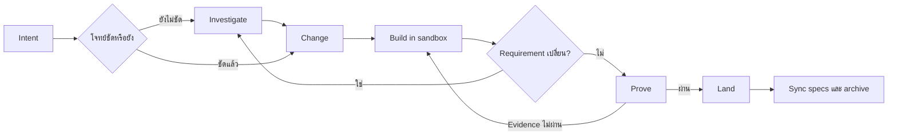

# Claude Foundation

[English](README.md) | **ภาษาไทย**

Claude Foundation คือ software-change harness สำหรับ AI coding agent ช่วยให้
agent ทำงานเป็นขั้นตอนที่ตรวจสอบและกลับมาทำต่อได้ ตั้งแต่ตกลงว่าจะเปลี่ยนอะไร
ลงมือในพื้นที่แยก พิสูจน์ผลด้วย evidence จริง และค่อยนำงานเข้า project หลัก

```text
Investigate? → Change → Build → Prove → Land
```

Foundation ใช้ [OpenSpec](https://github.com/Fission-AI/OpenSpec) เก็บ requirement
ที่ต้องคงอยู่ และใช้เครื่องมือของ repository เองสำหรับ implement กับ test ระบบนี้
ไม่ได้มาแทน coding agent, test framework, CI หรือ Git workflow ของคุณ

**Version 3.2.16** — runtime API 17, provider protocol 7 receipt ที่บันทึกด้วย
เวอร์ชันก่อนหน้าจะอ่านได้เป็น `provider-version-stale` และต้องพิสูจน์ใหม่

## AI กับ Harness แบ่งหน้าที่กันอย่างไร

Foundation ไม่ใช่ AI และไม่ได้เขียน code เอง แต่เป็น deterministic control plane
ที่ควบคุมการทำงานรอบ native coding agent

| ส่วน | หน้าที่ |
|---|---|
| ผู้ใช้ | กำหนด intent ตัดสินใจเรื่องสำคัญ review ผลลัพธ์ และอนุญาต Land อย่างชัดเจน |
| AI coding agent | Investigate, เขียนข้อตกลง, implement code และ test และแก้ failure ที่ evidence รายงาน |
| Foundation harness | ควบคุม lifecycle state, scope, sandbox, evidence, proof freshness, budget และ Land guard |
| OpenSpec | เก็บ requirement และ change agreement แบบถาวรที่คน review ได้ |
| Tool ของ project | Test runner, linter, Playwright, scanner และ provider อื่นสร้าง executable evidence |
| Git และ CI | ดูแล version control และ automation ตาม process เดิมของ project |

```text
ผู้ใช้กำหนด Intent
        ↓
AI วิเคราะห์และ Implement
        ↓
Harness จำกัดขอบเขตและตรวจ Lifecycle
        ↓
Tool ของ project สร้าง Evidence
        ↓
Harness ตรวจ Proof
        ↓
ผู้ใช้อนุญาต Land อย่างชัดเจน
```

Harness ไม่ถือว่าคำพูดว่า “เสร็จแล้ว” ของ AI เป็น evidence ระบบอาจสร้าง execution
plan แบบจำกัดขอบเขตและแนะนำ model tier แต่ runtime ไม่ได้เรียก model เอง การเรียก
agent และ model ยังเป็นหน้าที่ของ native agent host

## ทำไมต้องใช้

AI agent อาจเขียน code ที่ดูถูกต้อง แต่เข้าใจ requirement ผิด ทดสอบไม่ตรงจุด
หรือแก้ working tree หลักก่อนที่คุณจะได้ review Foundation จึงแยกหน้าที่เหล่านี้:

- **OpenSpec เก็บข้อตกลง** ทำให้ intent ไม่หายไปพร้อม chat history
- **Build ทำในพื้นที่แยก** โดยใช้ Git worktree หรือ directory copy เพื่อไม่ให้
  งานระหว่างทางปนกับ project หลัก
- **Evidence เป็นตัวตัดสินความพร้อม** Test, static analysis, browser check หรือ
  tool ของ project จะสร้าง receipt ที่ผูกกับ workspace จริง
- **Land ต้องสั่งอย่างชัดเจน** Foundation ไม่ commit, push หรือเปิด pull request
  เอง ถ้าคุณไม่ได้อนุญาตแยกต่างหาก
- **กลับมาทำต่อได้** Task, runtime state, receipt และ recovery journal ยังคงอยู่
  แม้เปลี่ยน agent session

เป้าหมายคือรักษาความน่าเชื่อถือโดยไม่ต้องใช้ phase pipeline หรือ agent หลายบทบาท
ตลอดเวลา และไม่ถือว่าคำพูดว่า “เสร็จแล้ว” ของ agent เป็นหลักฐาน

## ติดตั้ง

สิ่งที่ต้องมี:

- Node.js 20.19 ขึ้นไป
- Git สำหรับ worktree isolation
- OpenSpec CLI 1.7.0 สำหรับ sync spec และ archive
- `jq` สำหรับ merge Claude settings ตอนติดตั้ง

```bash
npm install -g @fission-ai/openspec@1.7.0

cd /path/to/claude-foundation
./install.sh /path/to/your-project
```

หรือใช้ packaged command:

```bash
claude-foundation init /path/to/your-project
```

หลังติดตั้ง ให้เปิด Claude Code session ใหม่ใน project เป้าหมายเพื่อโหลด slash
commands แล้วตรวจ installation ด้วย:

```bash
claude-foundation version
claude-foundation doctor --stage change
```

Installer จะรักษา specs, active changes, runtime state, custom agents และ hooks
ของ project ไว้ การ upgrade จะ refresh เฉพาะ command, schema, harness, rule,
skill และ hook ที่ Foundation เป็นเจ้าของตาม install manifest

## ใช้ Investigate ก่อนตกลงว่าจะเปลี่ยนอะไร

ใช้ `/investigate` เมื่อข้อมูลยังไม่พอสำหรับเขียน change agreement ที่เชื่อถือได้
เช่น ยังไม่รู้ root cause, มีหลายแนวทางที่ tradeoff ต่างกัน, compatibility หรือ
migration constraint ยังไม่ชัด หรือยังไม่เข้าใจ brownfield code path เดิม

เริ่มจาก decision หรือสิ่งที่ยังไม่รู้ ไม่ใช่สั่งให้ implement solution ไปก่อน:

```text
/investigate why profile updates occasionally overwrite newer data
```

ถ้าเป็นคำถามของ active change ให้ใส่ change ID และคำถามใหม่:

```text
/investigate add-profile: should updates use last-write-wins or optimistic locking?
```

Agent จะอ่าน code ที่เกี่ยวข้องแล้วแยกผลลัพธ์เป็น:

- Fact ที่ตรวจยืนยันจาก code แล้ว
- Hypothesis ที่ยังไม่ได้พิสูจน์
- Constraint และ boundary ที่ได้รับผล
- ทางเลือกที่ทำได้พร้อม tradeoff
- เรื่องที่ยังต้องให้ user ตัดสินใจ

ตอนจบควรได้ outcome อย่างใดอย่างหนึ่ง:

```text
ready for /change
needs user decision
not worth changing
```

ถ้าได้ `ready for /change` ให้นำ finding ที่ยอมรับแล้วเข้า durable agreement:

```text
/change add-profile
```

Investigation ไม่แก้ product code และไม่แก้ formal change โดยเงียบ ๆ ถ้า change
มี Build sandbox แล้ว ระบบจะสำรวจ sandbox นั้นแทน main working tree รุ่นเก่า
และสามารถ Investigate ซ้ำได้ทุกเวลาก่อน Land เมื่อ implementation ทำให้พบ
assumption ใหม่

## สอนทำ Change แรก

สมมติว่าต้องการให้เจ้าของ account แก้ display name ของตัวเองได้

### 1. สร้างข้อตกลง

เรียกใน agent session:

```text
/change allow an account owner to edit their display name
```

Agent จะสำรวจ project ถามเฉพาะ decision ที่มีผลต่อ outcome และสร้าง
`openspec/changes/<change-id>/` ก่อนทำต่อ ให้ review proposal, observable
scenario, task และ evidence claim ว่าตรงกับสิ่งที่ต้องการ

ทำไมต้องมีขั้นนี้: ข้อตกลงที่ชัดช่วยไม่ให้รายละเอียดตอน implement ค่อย ๆ
เปลี่ยนความหมายของ requirement โดยไม่มีใครสังเกต

### 2. Build ในพื้นที่แยก

```text
/build <change-id>
```

ถ้า Git repository สะอาด Foundation จะสร้าง detached worktree ถ้ามี local
change อยู่แล้วหรือไม่ใช่ Git repository จะใช้ isolated copy แทน Agent แก้ code
ในพื้นที่นั้นและติ๊ก task ที่ verify ผ่านใน `tasks.md` โดยไม่แก้ project หลัก

หา path ของ workspace ได้ด้วย:

```bash
jq -r '.workspace.path' .foundation/runtime/<change-id>.json
```

ทำไมต้องมีขั้นนี้: คุณ inspect หรือทิ้ง implementation ที่ยังไม่พร้อมได้ โดยไม่
ปนกับ checkout ที่กำลังใช้งาน

### 3. Prove ผลลัพธ์

```text
/prove <change-id>
```

Foundation จะ validate ข้อตกลง ตรวจว่า implementation task เสร็จ รัน evidence
provider ตาม claim และเก็บ receipt ที่ผูกกับ content ของ workspace ถ้าผ่านจะได้:

```text
PROVEN <change-id>
next: /land <change-id>
```

ทำไมต้องมีขั้นนี้: Passing proof ยืนยันว่า behavior ที่ประกาศไว้ถูกตรวจบน code
ชุดเดียวกับที่จะ Land ไม่ใช่บน workspace เก่าหรือคนละชุด

### 4. Land งานที่พิสูจน์แล้ว

```text
/land <change-id>
```

Land จะตรวจว่า proof ยัง fresh ตรวจ conflict ใน target apply เฉพาะ diff ที่
prove แล้ว sync delta spec ที่ยอมรับ และ archive change ถ้า code, test, config,
agreement หรือ target path ที่เกี่ยวข้องเปลี่ยนหลัง Prove ระบบจะหยุดแทนการเขียนทับ

ทำไมต้องมีขั้นนี้: การนำ code เข้า project กับการอัปเดต requirement ถาวรถูกผูก
เป็น completion boundary เดียวที่มี guard และ resume ได้

### 5. Commit ตาม Git process ของ project

Foundation หยุดหลัง apply และ archive ให้ review ผลลัพธ์ จากนั้น commit, push
และเปิด pull request ตาม process ปกติของ project

## ภาพรวม Workflow



Flow นี้ไม่ใช่ waterfall ก่อน Land สามารถแก้ change เดิมเมื่อพบข้อมูลใหม่:

```text
Investigate ⇄ Change ⇄ Build ⇄ Prove → Land
```

หลัง Land แล้ว requirement ใหม่ควรเปิดเป็น change ใหม่

| Phase | AI ทำอะไร | Harness ทำอะไร |
|---|---|---|
| Investigate | หา fact, hypothesis, ทางเลือก และ tradeoff | เลือก workspace ที่ถูกต้องและควบคุมไม่ให้แก้ product |
| Change | เขียน proposal, scenario, design, task และ evidence claim | Validate schema, risk policy, scope และ revision state |
| Build | Implement code และ test, รัน focused check และทำ task ให้เสร็จ | สร้าง isolated workspace จำกัดอำนาจ และเก็บความคืบหน้า |
| Prove | วิเคราะห์และแก้ failure ที่ evidence พบ | รัน provider ตรวจ claim coverage และ receipt แล้วสร้าง content-bound proof |
| Land | ช่วยแก้ conflict เมื่อจำเป็นต้องใช้ judgment หรือแก้ implementation | ตรวจ freshness, apply proven diff, รองรับ rollback/resume, sync spec และ archive |

## ควรใช้ Command ไหน

| Command | ใช้เมื่อ | ผลลัพธ์ |
|---|---|---|
| `/investigate` | ยังไม่รู้สาเหตุ scope หรือแนวทาง; เพิ่ม `--compare` เมื่อต้องเปรียบเทียบ 3–5 ทางเลือก | Fact ที่ตรวจจาก code, ทางเลือก, tradeoff และ decision ที่ยังขาด โดยไม่แก้ product |
| `/change` | รู้ outcome แล้ว หรือต้องแก้ active agreement | สร้างหรือแก้ OpenSpec artifact โดยไม่แก้ product |
| `/build` | ข้อตกลงพร้อม implement | Code และ focused check ใน isolated workspace |
| `/prove` | Implementation task และ focused check เสร็จ | Required receipts และ `proof.json` ที่ผูกกับ content |
| `/land` | Proof ผ่านและคุณยอมรับ change | Apply proven diff, sync specs และ archive |
| `/changes` | กลับมาทำงานต่อหรือมีหลาย active changes | State ปัจจุบันและ operation ที่ควรทำต่อ |
| `/dev` | Intent ชัดและต้องการ Change → Build → Prove ครั้งเดียว | Proven candidate และจงใจหยุดก่อน Land |

Slash command แต่ละคำสั่งมีสองชั้นที่ทำงานร่วมกัน:

- **Agent layer:** ทำงานที่ต้องใช้ความเข้าใจ เช่น วิเคราะห์ requirement,
  เขียน artifact และ implement code
- **Harness layer:** ทำงาน deterministic เช่น validate, สร้าง sandbox,
  รัน provider, ทำ hash และเปลี่ยน lifecycle state

ตัวอย่างเช่น `/prove` ไม่ได้ให้ AI ตัดสินเองว่า implementation ถูกต้อง แต่ให้
harness รัน provider ที่ประกาศไว้และตรวจ receipt ให้ครอบคลุมทุก required claim

ใช้ command แยกเมื่อต้องการ review ทุก boundary ใช้ `/dev` กับงานเล็กที่ชัดและ
ต้องการ one-shot flow:

```text
/dev rename the Save button to Update Profile
```

เมื่อเลือก prototype แล้ว ให้นำเฉพาะ decision ที่เลือกเข้า agreement:

```text
/change <intent-or-change-id> --prototype-selection <selection-path>
```

ไฟล์ prototype ยังเป็นของชั่วคราวและอ้างเป็น evidence ไม่ได้

## ทำความเข้าใจ `openspec/`

`openspec/` คือข้อตกลงที่คน review ได้ มี current requirement และ artifact ของ
active change แต่ไม่มี runtime status หรือ test log ชั่วคราว

```text
openspec/
├── config.yaml
├── repositories.yaml
├── specs/
├── changes/
│   ├── <change-id>/
│   └── archive/
└── schemas/
    ├── foundation-standard/
    └── foundation-rapid/
```

| Path | คืออะไร | มีไว้ทำไม |
|---|---|---|
| `config.yaml` | OpenSpec config และ rules ระดับ project | ทำให้ทุก change ใช้ project context และ default schema เดียวกัน |
| `repositories.yaml` | Topology และ access policy ของ repository ทั้ง project | ทำให้ cross-repository scope ชัดและ review ได้ |
| `specs/` | Current product requirements ที่ยอมรับแล้ว | บันทึกว่าระบบหลัง Land ควรทำอะไร |
| `changes/<change-id>/` | ข้อตกลงของ active change หนึ่งรายการ | แยก proposed behavior จาก current behavior จนกว่าจะ Land |
| `changes/archive/` | ประวัติ change ที่เสร็จแล้ว | เก็บเหตุผลและวิธีที่ accepted behavior เปลี่ยนไป |
| `schemas/` | Schema และ template ที่ Foundation ดูแล | กำหนด artifact ที่ standard และ rapid lane ต้องมี |

### ไฟล์ใน Active Change

```text
openspec/changes/<change-id>/
├── .openspec.yaml
├── proposal.md
├── specs/<area>/spec.md       # standard lane เท่านั้น
├── design.md                  # standard lane เท่านั้น
├── tasks.md
├── evidence.yaml
├── execution.yaml
└── repositories.yaml
```

| File | ตอบคำถามอะไร | Harness ต้องใช้ทำไม |
|---|---|---|
| `.openspec.yaml` | ใช้ `foundation-standard` หรือ `foundation-rapid` | เลือก artifact workflow ของ change |
| `proposal.md` | เปลี่ยนทำไม เปลี่ยนอะไร และไม่ทำอะไร | ทำให้ scope กับ impact ไม่ถูกซ่อนไว้เป็น assumption |
| `specs/<area>/spec.md` | Observable behavior ใดถูกเพิ่ม แก้ หรือลบ | ให้ Prove มี requirement และ `WHEN`/`THEN` scenario ที่คงที่ และให้ Land merge delta เข้า current specs |
| `design.md` | Technical decision ใดบังคับวิธี implement และ rollback | เก็บเฉพาะ current-state fact, compatibility, migration, risk และ rejected alternative ที่สำคัญ |
| `tasks.md` | Implementation ใดยังเหลือ | เป็น implementation ledger เพียงที่เดียว Stable ID และ checkbox ทำให้ Build resume ได้ |
| `evidence.yaml` | Behavioral claim ใดต้องพิสูจน์ | แยก proof obligation ออกจาก tool ที่นำมารัน |
| `execution.yaml` | Project จะสร้าง evidence อย่างไร | Wire command, report, service, timeout และ readiness check |
| `repositories.yaml` | Change อ่านหรือเขียน repository ใดได้ | จำกัดอำนาจของ agent และกำหนด dependency order |

ห้ามใส่ `/prove` หรือ `/land` เป็น checkbox ใน `tasks.md` เพราะสองอย่างนี้เป็น
lifecycle command ไม่ใช่ implementation task

### Standard กับ Rapid Lane

`foundation-standard` มี proposal, delta specs, design, tasks, evidence และ
execution ใช้กับ public contract, authentication, data หรือ migration, behavior
ที่ coupled, impact สูง, irreversible effect หรืองานที่ต้องใช้ evidence มากกว่า
unit/static

`foundation-rapid` จงใจไม่มี delta specs และ design ใช้ได้เฉพาะงาน impact ต่ำ
แยกขาด ไม่มี public contract, persistent migration, security trigger หรือ
irreversible effect หากพบ requirement ที่เข้มขึ้น `/change` จะ upgrade change เดิม
เป็น standard

## ทำความเข้าใจ State

เรียก `/changes` หรือ:

```bash
claude-foundation changes
```

| State | หมายถึงอะไร | ทำอะไรต่อ |
|---|---|---|
| `untracked` | OpenSpec มี active change แต่ Foundation ไม่มี runtime record | ใช้ `/change <change-id>` เพื่อนำเข้า harness และ validate |
| `change` | มีข้อตกลงแล้ว แต่ยังไม่มี Build sandbox | ทำ artifact ให้ครบ แล้ว `/build` |
| `building` | มี isolated workspace และ proof ยังไม่ผ่าน | ทำ `/build` ต่อ หรือ `/prove` เมื่อพร้อม |
| `ready-to-land` | Passing proof ยังตรงกับ agreement และ workspace ปัจจุบัน | `/land` |
| `stale-proof` | Proof เคยผ่าน แต่ไม่ตรงกับ input ปัจจุบันแล้ว | ทำ Build ที่จำเป็นให้เสร็จ แล้ว `/prove` ใหม่ |
| `applied` | Code ถูก apply แล้ว แต่ spec sync/archive ยังไม่เสร็จ | เรียก `/land` ซ้ำ Transaction resume ได้ |
| `archived` | Code ถูก apply, specs ถูก sync และ change ถูก archive | งานเสร็จและไม่แสดงใน active changes |

`ready-to-land` คือชื่อที่ user เห็นสำหรับ lifecycle state ภายใน `proven` ส่วน
`pass`, `fail`, `error`, `inconclusive` หรือ `stale` เป็นสถานะของ evidence receipt
ไม่ใช่สถานะของ change ทั้งก้อน

Runtime state อยู่ใน `.foundation/runtime/<change-id>.json` ห้ามเขียนซ้ำหรือแก้
ด้วยมือใน OpenSpec Markdown

## Evidence คืออะไร

Evidence ใช้ตอบคำถามว่า:

> เรารู้ได้อย่างไรว่า behavior นี้ถูกต้อง นอกเหนือจากการที่ agent บอกว่าเสร็จแล้ว

```text
Requirement → Claim → Provider → Receipt → Proof
```

`evidence.yaml` ประกาศ behavioral claim ที่มี stable ID และ capability ที่ต้องใช้:

```json
{
  "version": 2,
  "claims": [
    {
      "id": "other-user-cannot-update-profile",
      "scenario": "A user cannot update another user's profile",
      "impact": "high",
      "capabilities": ["test", "security-static"]
    }
  ]
}
```

จากนั้น `execution.yaml` เชื่อม capability เหล่านั้นเข้ากับ tool ของ project การ
แยกสองไฟล์นี้ทำให้เปลี่ยน test command ได้โดยไม่ลด behavior ที่ต้องพิสูจน์

Capability ที่พบบ่อยคือ `test`, `discovery`, `static-analysis`, `browser`,
`integration`, `compatibility`, `performance`, `security-static`,
`accessibility`, `data-migration`, `resilience`, `observability`, `deployment`,
`dependency-supply-chain`, `cross-repo-contract` และ `review` ดู catalog และ
รูปแบบ config จริงที่ติดตั้งด้วย:

```bash
claude-foundation providers
```

ถ้า `execution.yaml` ว่างหรือยังไม่ครบ ให้ตรวจ command ที่ project เป็นเจ้าของ
โดยไม่รัน จากนั้น preview wiring ที่มีความมั่นใจสูงก่อนเขียนอย่างชัดเจน:

```bash
claude-foundation evidence detect <change-id>
claude-foundation evidence init <change-id>
claude-foundation evidence init <change-id> --write
claude-foundation evidence doctor <change-id>
```

Detection อ่านเฉพาะ manifest และ configuration ใน repository โดยไม่รัน script,
ติดตั้ง dependency, เขียนทับ provider เดิม, สร้าง receipt หรือเปลี่ยน command ที่
กำกวมให้กลายเป็น passing evidence

ตรวจ traceability ตั้งแต่ต้นจนจบก่อน Build หรือหลังแก้ข้อตกลง:

```bash
claude-foundation change audit <change-id>
```

Task เชื่อม claim ด้วย `[claims:<claim-id>]` Audit จะตรวจ link ที่หายหรือไม่รู้จัก,
claim ที่ไม่มี task/provider, scenario ที่ไม่ตรง, security negative path ที่ขาด
และ migration ที่ไม่มี rollback/integrity coverage

Remote CI ตั้งค่า issuer กับ Ed25519 public key แล้ว import ด้วย `evidence
verify-ci` ได้ ส่วน review/acceptance ข้าม external boundary ผ่าน `authority
request`, `authority status` และ `authority record` ทั้งสองทางผูก evidence กับ
workspace ปัจจุบันและยังผ่าน receipt validator เดิม จึงปฏิเสธ response ที่ stale,
ไม่ตรง, ไม่มีลายเซ็น หรือถูก replay

Foundation ไม่ติดตั้ง test framework หรือ browser ให้ แต่รัน tool ที่ repository
ประกาศและเก็บ receipt ใต้ `.foundation/receipts/<change-id>/` Receipt reuse ได้
เฉพาะเมื่อ workspace hash, agreement, provider protocol/version และ claim coverage
ยังตรงกัน

คำสั่งวิเคราะห์ที่ใช้บ่อย:

```bash
claude-foundation doctor --stage prove --change <change-id>
claude-foundation proof readiness <change-id>
claude-foundation proof run <change-id>
```

ถ้า change ต้องใช้ external review ให้รัน
`claude-foundation proof collect <change-id>` ก่อน เพื่อเก็บหลักฐานที่รันได้ใน
project โดยยังไม่ finalize จากนั้น Agent จะสร้าง authority request อธิบาย
review packet เป็นภาษาปกติ และถามว่าจะตรวจเอง ส่งให้ผู้ตรวจอิสระ หรือหยุดไว้ก่อน
เมื่อมีผลตรวจจริงแล้ว Agent จึงบันทึก response และใช้ `proof run` เพื่อ reuse
receipts และปิด proof

ผู้ใช้ไม่ต้องประกอบ receipt command, provenance JSON, provider metadata หรือ
workspace hash เอง รายละเอียดเหล่านี้เป็น protocol ภายในและจะแสดงเมื่อผู้ใช้
ขอดูข้อมูลเชิงเทคนิคเท่านั้น

ถ้า provider ที่ตั้งค่าไว้รันไม่ได้ `proof readiness` จะคืน
`INFRASTRUCTURE_ERROR` พร้อม `next` ที่มีทางเลือกแบบ structured ได้แก่ ตรวจ
environment ด้วย doctor, retry, ใช้ external evidence ที่มี artifact ตรวจสอบ
ย้อนหลังได้ หรือเปลี่ยนเป็น project-owned command ที่พิสูจน์ claims เดิมได้
Harness จะไม่ลด claim coverage หรือเปลี่ยน provider ที่ล่มให้เป็น `pass`

สถานะที่ยังไม่พร้อมทุกแบบมี recovery path โดย `NEEDS_CODE_CHANGE` จะคืนคำสั่ง
`/build` และ pending tasks ส่วน `CONFIGURATION_ERROR` จะคืน doctor, `/change`,
ไฟล์ config ที่เกี่ยวข้อง และคำสั่ง validate ถ้า `changes` แสดง
`orphan-runtime` หมายถึง runtime ยังอยู่แต่ active OpenSpec directory หาย ให้กู้
directory เดิมหรือย้าย runtime JSON ไป `.foundation/recovery/orphaned-runtime/`
เพื่อ quarantine แบบย้อนกลับได้

provider คืนสถานะหนึ่งในสี่ มีแค่ `pass` ที่ land ได้ ส่วน `fail`, `error` และ
`inconclusive` บล็อกทั้งหมด ตัวที่ควรรู้จักคือ `inconclusive` มันแปลว่า provider
รันแล้วแต่ไม่ได้ให้คำตัดสินกับ claim ของคุณ ซึ่งมักหมายถึงการต่อสายที่รายงานผิดที่
ไม่ใช่ code พัง

หากต้อง wire provider หรือ browser workflow ใหม่ ดู
[Executable evidence adapters](.claude/harness/EVIDENCE.md)
ส่วนเว็บเอกสารครอบคลุมเรื่องเดียวกันสำหรับคนอ่าน ไม่ใช่สำหรับ agent

- [Receipt และความ stale](https://claude-foundation.dev/docs/th/evidence/receipts/)
  — receipt ผูกกับอะไร ทำไม pass ที่เขียนด้วยมือถูกปฏิเสธ และอะไรทำให้ proof หมดอายุ
- [Adapter และการต่อสาย](https://claude-foundation.dev/docs/th/evidence/adapters/)
  — adapter ทั้งห้าตัว การประกาศ input, service และตัวระบุ readiness
- [Foundation เขียนอะไรบ้าง](https://claude-foundation.dev/docs/th/artifacts/)
  — artifact ทุกตัวที่ harness สร้าง และตัวไหนที่ตั้งใจให้คุณอ่าน

## ถ้า Requirement เปลี่ยนระหว่าง Build

ไม่ต้องเปิด change ที่สองเพียงเพราะพบข้อมูลใหม่ก่อน Land ให้แก้ agreement เดิม:

```text
/investigate <change-id>: how does the existing verification flow work?
/change <change-id>
/build <change-id>
/prove <change-id>
```

`/change` จะ sync revision ใหม่เข้า active sandbox รักษา completed task ที่ stable
ID และความหมายไม่เปลี่ยน และ invalidate proof ที่ได้รับผลจาก revision

## การใช้หลาย Repository

`openspec/repositories.yaml` ประกาศ topology ถาวรของ project ส่วน
`repositories.yaml` ภายใน change เลือกเฉพาะ repository ที่ change นั้นอ่านหรือ
เขียนได้ ถ้าไม่มี selection จะยังทำงานแบบ repository เดียวชื่อ `root`

ใส่ annotation ใน multi-repository task เพื่อให้ authority และ dependency ชัด:

```markdown
- [ ] **T001** Implement API [repo:api] [kind:implementation] [paths:internal/profile]
- [ ] **T002** Implement App [repo:app] [kind:implementation] [depends:T001]
- [ ] **T003** Verify contract [repo:app] [kind:contract] [depends:T001,T002]
```

Foundation มอง multi-remote landing เป็น ordered resumable saga โดยตรวจ child
commit และ CI state ที่ระบุชัด ไม่อ้างว่า atomic ข้าม remote ใช้
`claude-foundation land resume <change-id>` เพื่อตรวจและเดินลำดับต่อ และดู protocol เต็มใน
[WORKFLOW.md](WORKFLOW.md)

## Foundation จำกัด Scope ของ Agent และ Skill อย่างไร

Foundation ส่ง packet ขนาดเล็กตาม scope ของ task ให้ native agent host ไม่ใช่
resident orchestrator ที่คัดลอก conversation ทั้งหมดให้ worker ทุกตัว Change
repository เดียวที่มี task ปกติไม่เกินสองงานมักใช้ agent เดียว Worker หลายตัวมี
ประโยชน์เฉพาะเมื่องาน, repository access, dependency และ evidence แยกจากกันได้ชัด

Agent จะโหลด construction skill หลักหนึ่งตัวตาม layer ที่แก้ และเพิ่ม security
หรือ observability guidance เฉพาะเมื่อ change ข้าม boundary เหล่านั้น งานที่ต้อง
ตัดสิน domain boundary เริ่มจาก `ddd-strategic` ส่วนงาน UI, backend, data หรือ
documentation ปกติไม่ควร preload skill chain ทั้งหมด

`foundation.json` map tier แบบ portable คือ `fast`, `standard` และ `deep` เข้ากับ
model family พร้อมกำหนด execution budget งาน inventory หรือ mechanical ใช้ fast,
implementation ปกติใช้ standard และ architecture, security, migration หรือ
independent review ใช้ deep โดยงาน risk สูงลดลงเป็น fast ไม่ได้

## อะไรเป็น Source of Truth

| ข้อมูล | Source of truth |
|---|---|
| Intent และ behavioral agreement | `openspec/` |
| Implementation | Code และ tests |
| ความคืบหน้า implementation | `tasks.md` ของ active change |
| Runtime lifecycle และ sandbox | `.foundation/runtime/` และ `.foundation/sandboxes/` |
| Evidence receipt และ immutable proof bundle | `.foundation/receipts/` และ `.foundation/evidence/` |
| Provider log, metrics และ telemetry | `.foundation/logs/` |
| Model tier และ execution limit | `foundation.json` |
| Workflow history รุ่นเก่า | `.workflow/` แบบ read-only |

`.foundation/` เป็นพื้นที่ที่เครื่องดูแล เปิดอ่านเพื่อวิเคราะห์ได้ แต่อย่าใช้เป็น
product requirement หรือซ่อม state ด้วยมือถ้า operator guide ไม่ได้ระบุ

## Safety Boundary

- Worktree หรือ directory copy ป้องกัน workspace แต่ไม่ใช่ process-security
  sandbox
- Unattended execution จะ fail closed ถ้าไม่มี trusted attestation จาก host
- Host สร้าง challenge อายุสั้นด้วย `sandbox challenge` แล้วเซ็น project,
  agreement, nonce, expiry และ permission ที่แน่นอน ก่อนส่ง envelope แบบใช้ครั้ง
  เดียวผ่าน `--attestation`; ถ้ายังเปิด host-control socket หรือ credential ระบบ
  จะ block ต่อไป
- Land ปฏิเสธ stale proof และ conflicting edit ใน target path ที่แตะ
- Apply มี backup และ journal ทำให้ Land ที่ถูกขัดจังหวะ retry ได้
- Foundation ไม่ commit, push, เปิด pull request หรือมอบอำนาจเหล่านั้นให้ worker
  agent โดยไม่ได้รับอนุญาตชัดเจน
- `protect-secrets.sh` และ `lint.sh` เปิดเป็นค่าเริ่มต้น
- `no-direct-main-commit.sh` เป็น opt-in เพราะบาง project อนุญาต controlled
  commit บน default branch โดย `doctor` จะรายงานว่าเปิดอยู่หรือไม่

### การอนุมัติโดยคน

standard change เริ่มต้นด้วย acceptance ที่ **ยังไม่ตัดสิน** และ `change validate`
จะไม่ผ่านจนกว่าจะมีคนตัดสิน นี่เป็นความตั้งใจ เพราะความเงียบไม่เคยถูกอ่านว่ายินยอม
แต่มันก็เป็นตัวบล็อกที่คนเจอเป็นอย่างแรก จึงควรตัดสินให้ชัดเจน

```bash
claude-foundation change resolve <change-id> --acceptance-not-required
claude-foundation change resolve <change-id> \
  --acceptance-required --acceptance-reason "<ทำไมต้องให้คนตัดสิน>"
```

Review อิสระเป็นคนละจุดกัน และถูกบังคับโดยนโยบาย — impact สูง, change แบบ coupled
ที่ไม่ใช่ low, มี security trigger หรือ claim ที่ครอบคลุมหลาย repository
ผู้รีวิวเป็นคนหรือ AI ตัวอื่นก็ได้ แต่ต้องไม่ใช่ผู้ implement
ความเป็นอิสระยกเว้นไม่ได้ และหลัง AI รีวิวสองรอบ รอบที่สามจะถูกปฏิเสธและส่งต่อให้คน

ตัว Land เองตรวจที่หลักฐาน ไม่ใช่ที่ความยินยอม agent ถูกสั่งให้อธิบายผลกระทบ
และเสนอให้ตรวจดู ไปต่อ หรือหยุดก่อน ส่วนคำสั่งต่อเนื่อง (`land record`,
`budget continue`, `change abandon`) แต่ละตัวต้องมี `--decision-ref`
ระบุการตัดสินใจที่คุณทำจริง

[การอนุมัติโดยคน](https://claude-foundation.dev/docs/th/approval/)
ครอบคลุมทั้งสี่จุด รวมถึงวิธีที่ `authority request`,
`authority status --template` และ `authority record` เปลี่ยนคำตัดสินให้เป็น receipt

## Operator Commands และการแก้ปัญหา

ผู้ใช้ทั่วไปใช้ slash commands เป็นหลัก Native CLI เหล่านี้ช่วย inspect และ
recover:

```bash
claude-foundation doctor --stage change
claude-foundation changes
claude-foundation change validate <change-id>
claude-foundation change audit <change-id>
claude-foundation packet <change-id> --phase build|prove|review
claude-foundation metrics <change-id>
claude-foundation budget continue <change-id> --reason "ทำ required proof ให้จบ" --decision-ref <host-user-decision>
claude-foundation proof readiness <change-id>
claude-foundation proof run <change-id>
claude-foundation land check <change-id>
claude-foundation land archive <change-id>
claude-foundation change abandon <change-id> --reason "evidence contract ทำให้ผ่านไม่ได้" --decision-ref <host-user-decision>
```

change ที่พิสูจน์ไม่ได้เลิกด้วย `change abandon` ซึ่งปลด lease ล้าง sandbox และย้าย
record ไปไว้ที่ `.foundation/recovery/abandoned/<id>/` พร้อม audit line โดย
quarantine ไม่ได้ลบ และไม่แตะ Git ส่วน guard ที่หยุดงาน เช่น AI review ครบสองรอบ
budget continuation ที่ใช้ไปแล้ว หรือ apply ที่ rollback ไม่จบ จะรายงานทางเลือกที่มี
แทนการปฏิเสธเปล่า ๆ

Host import telemetry แบบ `generic`, `codex`, `cursor`, `otel` หรือ `claude`
จาก JSON/JSONL ได้ โดย OpenTelemetry GenAI/LLM token และ model attributes จะถูก
normalize เป็น usage event แบบ append-only ชุดเดียวกับที่ `metrics` และ budget ใช้

CLI หา installed project จาก directory ปัจจุบันหรือ `--project <path>` ใช้
`claude-foundation help` เพื่อดู command ทั้งหมด

ปัญหาที่พบบ่อย:

| อาการ | มักหมายถึง | วิธีแก้ |
|---|---|---|
| ไม่พบ slash command | Agent session เปิดก่อนติดตั้ง | เปิด session ใหม่ใน target project |
| Build เริ่มไม่ได้ | OpenSpec artifact หรือ provider wiring ยังไม่ครบ | รัน `doctor --stage build --change <change-id>` แล้วแก้ artifact ที่รายงาน |
| Proof stale | Code, test, config, claim หรือ provider input ที่เกี่ยวข้องเปลี่ยน | ทำ edit ให้เสร็จแล้ว `/prove` ใหม่ |
| Test discovery เป็นศูนย์ | Command ไม่พบ test/report ที่คาดไว้ | แก้ `execution.yaml` หรือ test command ห้ามบันทึก manual pass แทน |
| Land แจ้ง conflict | Target path ใน project หลักเปลี่ยนหลังสร้าง sandbox | Review/rebase หรือ sync change แล้วสร้าง proof ใหม่ |
| Archive รันไม่ได้ | ไม่มี OpenSpec หรือ version ไม่ใช่ 1.7.0 | ติดตั้ง pinned CLI แล้วลอง `/land` ใหม่ |
| Land หยุดหลัง apply | Code เข้าแล้ว แต่ sync/archive ถูกขัดจังหวะ | ห้าม apply ซ้ำด้วยมือ ให้เรียก `/land` เพื่อ resume journal |

Execution budget คิดต่อ autonomous run ส่วน usage ตลอดอายุ change ยังอยู่ใน
metrics เมื่อถึง 85% ระบบเข้า completion-only mode โดยหยุด speculative
exploration, การขยาย scope, optional refactor และการเปิด subagent ใหม่ แต่ยังทำ
focused fix และ required proof ต่อได้ เมื่อถึง 100% harness จะแนะนำให้ split หรือ
rescope โดยไม่ทำให้ telemetry ล้มเหลวและไม่ block deterministic packet,
readiness, provider, receipt reuse, proof-resume, metrics, Land recovery หรือ
archive คำสั่ง `budget continue` เปิด window ใหม่โดย operator พร้อม audit record
ได้หนึ่งครั้งต่อ run และเฉพาะ code/configuration ที่ AI ต้องทำให้เสร็จ Active
lease, external evidence, infrastructure failure และงาน deterministic ที่พร้อม
อยู่แล้วจะไม่ผ่าน gate โดย reason ใช้บันทึก audit ไม่ได้ใช้ตัดสิน policy ระบบไม่
ลบ usage เดิมและไม่ลด evidence requirement

## ตรวจหรือ Upgrade Installation

```bash
claude-foundation version
claude-foundation runtime version
sh .claude/tests/run-all.sh

npx --yes @fission-ai/openspec@1.7.0 schema validate foundation-standard
npx --yes @fission-ai/openspec@1.7.0 schema validate foundation-rapid
```

Preview source installation โดยไม่เขียนไฟล์:

```bash
./install.sh /tmp/foundation-demo --dry-run
```

รายละเอียด provider contract, review policy, invalidation rule, sandbox,
watchdog, telemetry, multi-repository landing และ native CLI ทั้งหมดอยู่ใน
[WORKFLOW.md](WORKFLOW.md) และ
[harness operator guide](.claude/harness/README.md)

## License

MIT
