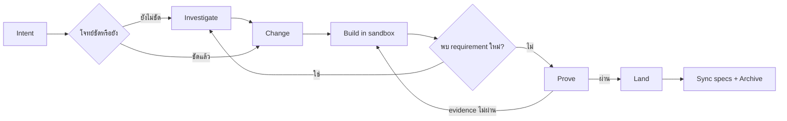

# Claude Foundation

[English](README.md) | **ภาษาไทย**

Foundation คือ software-change harness สำหรับ AI coding agents ที่ใช้ OpenSpec
เก็บข้อตกลงของงาน ใช้ native agent ลงมือเขียน code และใช้ deterministic
evidence ตัดสินว่างานพร้อมนำเข้า project หลักหรือยัง

```text
Investigate? → Change → Build → Prove → Land
```

เป้าหมายคือรักษาคุณภาพของ workflow เดิม แต่ลดเวลาและต้นทุนจาก phase
orchestrator, lifecycle agents, task mirroring, การรัน test ซ้ำ และ browser calls
ที่ไม่จำเป็น

## ติดตั้ง

สิ่งที่ต้องมี:

- Node.js 20.19 ขึ้นไป
- Git สำหรับ worktree isolation
- OpenSpec CLI 1.7.0 สำหรับ spec sync และ archive
- `jq` สำหรับ merge Claude settings ระหว่างติดตั้ง

```bash
npm install -g @fission-ai/openspec@1.7.0

cd /path/to/claude-foundation
./install.sh /path/to/your-project
```

หรือติดตั้งผ่าน packaged CLI:

```bash
claude-foundation init /path/to/your-project
```

หลังติดตั้งให้เปิด Claude Code session ใหม่ใน project เพื่อโหลด slash commands
ชุดใหม่

Installer จะรักษา:

- current specs และ active changes ใต้ `openspec/`
- runtime ใต้ `.foundation/`
- custom agents และ hooks ของ project
- `.workflow/` เดิมในฐานะ read-only migration history

Foundation-owned commands, schemas, harness, rules, skills และ hooks จะถูกอัปเดต
เป็นเวอร์ชันใหม่

## Flow ทำงานอย่างไร



Flow นี้ไม่ใช่ waterfall สามารถย้อนกลับได้:

```text
Investigate ⇄ Change ⇄ Build ⇄ Prove → Land
```

`Land` เป็นขอบเขตจบของ change หลังจาก land แล้ว requirement ใหม่ควรเปิดเป็น
change ใหม่

## Command map

| Command | ทำอะไร | ใช้เมื่อไร | แก้ product code หรือไม่ |
|---|---|---|---|
| `/investigate` | สำรวจปัญหาและทางเลือก | โจทย์หรือแนวทางยังไม่ชัด | ไม่ |
| `/change` | สร้างหรือแก้ข้อตกลงของงาน | รู้ outcome ที่ต้องการแล้ว | ไม่ |
| `/build` | ลงมือทำงานใน sandbox | Change artifacts พร้อม | แก้เฉพาะ sandbox |
| `/prove` | ตรวจ evidence และสร้าง proof | Build เสร็จและ tasks พร้อม | ไม่แก้ project หลัก |
| `/land` | นำ proven diff เข้า project หลัก | Proof ผ่านและพร้อมรับ change | แก้ project หลัก |
| `/changes` | แสดง active changes และ next action | ต้องการดูสถานะรวม | ไม่ |
| `/dev` | รัน Change → Build → Prove | ต้องการ one-shot compatibility flow | ไม่ land |
| `/migrate-workflow` | เตรียม migration จาก `.workflow/` เดิม | ย้ายงานหรือความรู้จากระบบเก่า | ไม่ยกข้อมูลเป็น truth อัตโนมัติ |

Slash commands ใช้ควบคุม AI workflow ส่วน deterministic operator commands
ใช้ native CLI:

```bash
claude-foundation providers
claude-foundation changes
claude-foundation validate <change>
claude-foundation proof plan <change>
claude-foundation proof finalize <change>
claude-foundation evidence run <change> <provider> -- <command>
claude-foundation sandbox create <change>
claude-foundation land check <change>
```

CLI จะค้น project จาก directory ปัจจุบันหรือ `--project <path>` แล้วใช้ runtime
ที่ติดตั้งอยู่ใน project นั้น ดูคำสั่งทั้งหมดด้วย `claude-foundation help`
ถ้าติดตั้งตรงจาก source และยังไม่มี packaged CLI บน `PATH` สามารถเรียก runtime
file โดยตรงเป็น compatibility fallback ได้

## `/investigate` — สำรวจโดยยังไม่ผูกมัด

### ใช้เมื่อไร

- ยังไม่รู้ root cause
- มีหลายแนวทางที่ให้ behavior ต่างกัน
- scope, compatibility หรือ migration ยังไม่ชัด
- ต้องอ่าน brownfield code ก่อนตัดสินใจ
- ระหว่าง Build พบ assumption ใหม่

### ตัวอย่าง

```text
/investigate ทำไม profile update บางครั้งเขียนทับข้อมูลใหม่กว่า
```

หรือระบุ active change:

```text
/investigate add-profile: ควรใช้ last-write-wins หรือ optimistic locking
```

ถ้า change มี sandbox แล้ว Investigation จะอ่าน code จาก sandbox ไม่ใช่
working tree เก่า

### ผลลัพธ์

Investigation แยก:

- facts ที่ยืนยันจาก code
- hypotheses
- constraints
- ทางเลือกและ tradeoffs
- unknowns ที่ต้องถาม

และจบด้วยหนึ่งใน:

```text
ready for /change
needs user decision
not worth changing
```

Investigation ไม่แก้ product code และไม่แก้ OpenSpec change ให้อัตโนมัติ
ข้อสรุปที่ยอมรับแล้วต้องนำไปปรับด้วย `/change`

## `/change` — สร้างข้อตกลงของงาน

### ใช้เมื่อไร

- รู้ outcome ที่ต้องการแล้ว
- ต้องเปิด change ใหม่
- ต้องแก้ requirement/design/evidence ของ change เดิม
- ต้องนำผลจาก `/investigate` มาเป็น agreement

### สร้าง Change ใหม่

```text
/change เพิ่มการแก้ไข profile สำหรับเจ้าของ account
```

ผลลัพธ์:

```text
openspec/changes/add-profile/
├── .openspec.yaml
├── proposal.md
├── specs/
│   └── change/spec.md
├── design.md
├── tasks.md
└── evidence.yaml
```

พร้อม machine state:

```text
.foundation/runtime/add-profile.json
```

### แก้ Change เดิม

```text
/change add-profile
```

ระบบจะปรับเฉพาะ artifacts ที่ได้รับผล:

- `proposal.md` — เหตุผล scope และ impact
- `specs/**/*.md` — behavior และ scenarios
- `design.md` — technical decisions, compatibility และ rollback
- `tasks.md` — implementation ledger
- `evidence.yaml` — สิ่งที่ต้องพิสูจน์

ถ้า change กำลัง Build อยู่ `/change` จะเรียก:

```bash
claude-foundation sandbox sync add-profile
```

Sync จะ:

- ส่ง artifacts เวอร์ชันใหม่เข้า sandbox
- รักษา completed task เฉพาะบรรทัดที่ยังเหมือนเดิม
- reset task ที่เปลี่ยนความหมาย
- เพิ่ม revision
- ทำให้ proof และ receipts เดิม stale

### Rapid กับ Standard

`foundation-rapid` ใช้เมื่อครบทุกข้อ:

- low impact
- isolated
- ไม่มี public contract change
- ไม่มี persistent migration
- ไม่มี security trigger
- ไม่มี irreversible effect
- unit/static evidence เพียงพอ

งานอื่นใช้ `foundation-standard` ถ้า rapid change ตรวจพบ auth, access,
migration, high impact หรือ coupling ระบบจะ upgrade เป็น standard โดยไม่ทิ้งงานเดิม

## `/build` — ลงมือใน isolated workspace

### ใช้เมื่อไร

- proposal และ scenarios ชัด
- design decisions สำคัญถูกตัดสินแล้ว
- tasks และ evidence obligations พร้อม

```text
/build add-profile
```

Harness จะสร้าง sandbox:

- Git repository สะอาด → detached worktree
- Git repository มี local changes → isolated copy
- Non-Git repository → isolated copy พร้อม before/after manifest

ระหว่าง Build:

- project หลักยังไม่ถูกแก้
- agent ทำงานที่ sandbox path
- `tasks.md` เป็น task ledger เดียว
- focused tests ใช้ระหว่าง convergence
- ไม่มี PM/Lead/Engineer/QA/Retro lifecycle chain
- subagents ใช้เฉพาะ work packages ที่แยกและตรวจได้จริง

### ดู code ที่กำลัง Build

ดู sandbox path:

```bash
jq -r '.workspace.path' .foundation/runtime/add-profile.json
```

ถ้าเป็น Git worktree:

```bash
git -C .foundation/sandboxes/add-profile status
git -C .foundation/sandboxes/add-profile diff
code .foundation/sandboxes/add-profile
```

ถ้าเป็น isolated copy ให้เปิด path ใน `/tmp` ที่ runtime แสดง

### พบ requirement ใหม่ระหว่าง Build

หยุด Build ก่อน:

```text
/investigate add-profile: <คำถามใหม่>
/change add-profile
/build add-profile
```

`/change` จะ sync revision เข้า sandbox จากนั้น Build ทำต่อได้ ไม่ต้องสร้าง
change ใหม่

## `/prove` — พิสูจน์ว่างานถูกต้อง

### ใช้เมื่อไร

- implementation tasks เสร็จ
- focused checks ผ่าน
- พร้อมรัน evidence ที่ change กำหนด

```text
/prove add-profile
```

Prove จะ:

1. validate OpenSpec artifacts
2. คำนวณ workspace hash
3. อ่าน claims จาก `evidence.yaml`
4. reuse receipts ที่ยังตรงกับ hash
5. รัน provider ที่หายหรือ stale
6. ตรวจ test discovery
7. รัน required full suite หลัง code converge
8. เรียก independent review เฉพาะเมื่อ risk trigger
9. สร้าง `proof.json`

Evidence providers ที่รองรับ:

| Provider ID | ใช้พิสูจน์ |
|---|---|
| `test` | behavior ที่รันตรวจได้ |
| `discovery` | test ที่คาดหวังถูกค้นพบจริง |
| `browser` | rendered behavior และ input ผ่าน browser จริง |
| `mutation` | test จับ behavioral fault ที่จงใจใส่ได้ |
| `state-identity` | actor, revision หรือ state ก่อนและหลังตรงกัน |
| `integration` | component หรือ external boundary ทำงานร่วมกัน |
| `compatibility` | public/persisted contract ยัง compatible |
| `performance` | latency, throughput, resource หรือ size budget ที่วัดได้ |
| `security-static` | static security check ของ boundary และ unsafe sink |
| `cross-repo-contract` | producer และ consumer ต่าง repository ใช้ contract ตรงกัน |
| `review` | independent risk review |
| `static-analysis` | compile, type, lint และ static quality gate |
| `data-migration` | forward migration, mixed-version safety และ rollback |
| `accessibility` | semantics, keyboard, focus, contrast และ assistive access |
| `resilience` | timeout, retry, partial failure, recovery และ degraded dependency |
| `observability` | log, metric, trace และ alert ที่จำเป็น |
| `deployment` | packaging, configuration, rollout health และ rollback |
| `dependency-supply-chain` | vulnerability, license, lockfile และ provenance policy |

ดู canonical catalog ที่ติดตั้งอยู่ใน project:

```bash
claude-foundation providers
```

Provider เหล่านี้คือ evidence contract ไม่ใช่ vendor tool ที่ bundle มากับ
harness ทั้งหมด Prove สามารถเรียก tool เดิมของ repository ด้วย `run-provider`
หรือบันทึก receipt จาก external system ได้ แต่ละ change เลือกเฉพาะ provider
ที่ observable claim ต้องใช้ ไม่ได้รันทั้งหมดโดยอัตโนมัติ

Receipts อยู่ที่:

```text
.foundation/receipts/add-profile/
├── test.json
├── discovery.json
├── browser.json
├── review.json
└── proof.json
```

ผลที่ผ่าน:

```text
PROVEN add-profile
next: /land add-profile
```

สิ่งต่อไปนี้จะ block:

- required receipt หาย
- test discovery เป็นศูนย์หรือต่ำกว่า minimum
- provider `fail`, `error` หรือ `inconclusive`
- browser ไม่มี input/foreground capability ที่ scenario ต้องใช้
- mutation crash ถูกอ้างเป็น kill
- receipt cover claims ไม่ครบ
- code, tests, config, specs หรือ change revision เปลี่ยนหลัง proof

ถ้า Prove ไม่ผ่าน ให้แก้ใน sandbox แล้ว `/prove` อีกครั้ง

## `/land` — นำ proven code เข้า project หลัก

### ใช้เมื่อไร

- `/prove` ผ่าน
- พร้อมให้ code เปลี่ยนใน working tree หลัก
- ไม่มีงานอื่นแก้ target files ชนกัน

```text
/land add-profile
```

ลำดับ:

```text
ตรวจ proof freshness
→ ตรวจ required receipts
→ ตรวจ target conflicts
→ apply proven sandbox diff
→ ตรวจ target identity ตรงกับ sandbox
→ sync delta specs
→ archive change
```

Land จะไม่:

- overwrite target ที่เปลี่ยนหลังสร้าง sandbox
- ใช้ stale proof
- archive เมื่อ evidence ไม่ครบ
- commit, push หรือเปิด PR โดยไม่ได้รับอนุญาต

ตอนนี้ OpenSpec CLI 1.7.0 ใช้สำหรับ semantic spec sync และ archive ส่วน
sandbox apply และ proof guards เป็นของ Foundation

## `/changes` — ดูสถานะงานทั้งหมด

```text
/changes
```

ใช้ดู:

- active changes
- schema ของแต่ละ change
- กำลัง change/build/prove หรือ proven
- proof stale หรือพร้อม land
- next useful action

เหมาะสำหรับกลับมาทำงานข้าม session หรือมีหลาย changes พร้อมกัน

## `/dev` — One-shot compatibility command

```text
/dev เพิ่ม authenticated profile editing
```

เท่ากับ:

```text
/change → /build → /prove
```

`/dev` จงใจหยุดก่อน `/land` จึงไม่แก้ project หลัก ไม่ commit และไม่เปิด PR

ใช้ `/dev` เมื่อต้องการ flow เดียวจบและ intent ค่อนข้างชัด หากต้องการดูต้นทุน
หรือควบคุมแต่ละ operation ให้ใช้คำสั่งแยก

## ตัวอย่าง Flow

### งานเล็กและชัด

```text
/change เปลี่ยนข้อความปุ่ม Save เป็น Update Profile
/build update-profile-button-copy
/prove update-profile-button-copy
/land update-profile-button-copy
```

ระบบสามารถเลือก rapid lane และใช้เฉพาะ evidence ที่จำเป็น

### งาน Auth/Profile

```text
/investigate ownership และ session behavior ของ profile ปัจจุบัน
/change เพิ่ม profile editing สำหรับ authenticated owner
/build authenticated-profile-editing
/prove authenticated-profile-editing
/land authenticated-profile-editing
```

Auth จะ trigger standard lane, security evidence และ independent review

### Requirement เปลี่ยนกลาง Build

```text
/build add-profile

# พบว่า email change ต้องยืนยันใหม่
/investigate add-profile: flow การยืนยัน email เดิมเป็นอย่างไร
/change add-profile
/build add-profile
/prove add-profile
/land add-profile
```

Change revision ใหม่จะทำให้ proof เก่าหมดอายุโดยอัตโนมัติ

### หลาย Change พร้อมกัน

แต่ละ change มี sandbox แยก:

```text
/build change-a
/change change-b
```

หากแตะไฟล์หรือ contract เดียวกัน ต้องกำหนดลำดับ land เมื่อ change แรก land
แล้ว change ที่เหลืออาจต้อง sync/rebase และ prove ใหม่

## Evidence คืออะไร

`evidence.yaml` ตอบคำถามว่า:

> เรารู้ได้อย่างไรว่าพฤติกรรมนี้ถูกต้องจริง ไม่ใช่เพียง agent บอกว่าทำเสร็จแล้ว

```text
Requirement
    ↓
Evidence claim
    ↓
Provider
    ↓
Receipt
    ↓
Proof
```

ตัวอย่าง:

```json
{
  "version": 1,
  "claims": [
    {
      "id": "other-user-cannot-update-profile",
      "scenario": "A user cannot update another user's profile",
      "impact": "high",
      "capabilities": ["test", "security-static"]
    }
  ]
}
```

Receipt ผูกกับ workspace hash จึง reuse ได้เมื่อ relevant inputs ไม่เปลี่ยน และ
stale ทันทีเมื่อ code หรือ agreement เปลี่ยน

## Sources of truth

| ข้อมูล | Source of truth |
|---|---|
| Intent และ behavior agreement | `openspec/` |
| Implementation | code และ tests |
| Task progress | active change `tasks.md` |
| Runtime lifecycle | `.foundation/runtime/` |
| Evidence | `.foundation/receipts/` |
| Provider logs และ metrics | `.foundation/logs/` |
| Legacy history | `.workflow/` แบบ read-only |

Runtime status ไม่ควรถูกเขียนซ้ำใน narrative Markdown

## Migration จาก Workflow เดิม

ดู migration candidates:

```bash
claude-foundation migrate
```

สร้าง candidate สำหรับ run เดิม:

```bash
claude-foundation migrate 0003-fix-example --apply
```

ระบบไม่ยกข้อความจาก `.workflow/` เป็น current spec อัตโนมัติ ต้องยืนยันกับ
code, tests หรือ accepted contract ก่อน

## ตรวจระบบ Foundation

```bash
claude-foundation version
claude-foundation runtime version
sh .claude/tests/run-all.sh

npx --yes @fission-ai/openspec@1.7.0 \
  schema validate foundation-standard

npx --yes @fission-ai/openspec@1.7.0 \
  schema validate foundation-rapid
```

ทดสอบ installer โดยไม่เขียนไฟล์:

```bash
./install.sh /tmp/foundation-demo --dry-run
```

รายละเอียด provider contracts, sandbox safety, watchdog และ operator commands
อยู่ใน [WORKFLOW.md](WORKFLOW.md)

## License

MIT
