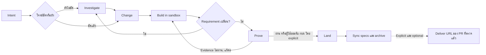

# Change Loop

[English](README.md) | **ภาษาไทย**

Change Loop คือ software-change harness สำหรับ AI coding agent ช่วยให้
agent ทำงานเป็นขั้นตอนที่ตรวจสอบและกลับมาทำต่อได้ ตั้งแต่ตกลงว่าจะเปลี่ยนอะไร
ลงมือในพื้นที่แยก พิสูจน์ผลด้วย evidence จริง และค่อยนำงานเข้า project หลัก

```text
Investigate? → Change → Build → Prove → Land
```

Change Loop ใช้ [OpenSpec](https://github.com/Fission-AI/OpenSpec) เก็บ requirement
ที่ต้องคงอยู่ และใช้เครื่องมือของ repository เองสำหรับ implement กับ test ระบบนี้
ไม่ได้มาแทน coding agent, test framework, CI หรือ Git workflow ของคุณ
ชื่อผลิตภัณฑ์และ workflow คือ **Change Loop** ส่วน package และ CLI ที่ติดตั้งยังใช้
`claude-foundation` เหมือนเดิม จึงไม่ต้องเปลี่ยนคำสั่งที่ใช้อยู่

**Version 3.5.20** — runtime API 41, provider protocol 13 receipt ที่บันทึกด้วย
เวอร์ชันก่อนหน้าจะอ่านได้เป็น `provider-version-stale` และต้องพิสูจน์ใหม่
`claude-foundation metrics <change-id>` จะแสดง source cohort ของ runtime แบบ
เจาะจงด้วย ได้แก่ semantic version, protocol bundle ที่โหลดจริง และ SHA-256
digest ของไฟล์ที่ติดตั้งใต้ `.claude/harness` เมื่อต้องเทียบรายงานจากคนละ
installation ให้ใช้ cohort ครบชุดแทนการดูเลข version เพียงอย่างเดียว

## เริ่มอ่านตรงไหน

เมื่อถึงขั้น Build หรือ Prove ระบบแสดง `TARGET_REACHED`; เฉพาะ change ที่
archived แล้วจึงแสดง `DELIVERED` ใช้ `feedback <change-id>` ดู readiness ปัจจุบัน,
`feedback <change-id> --diagnostics` ส่งออก metadata ที่ผ่าน allowlist ในเครื่อง
และ `packet <change-id> --resume` อ่าน context ล่าสุดภายในขนาดที่กำหนด
คำสั่งตรวจเหล่านี้ไม่ทำงาน lifecycle ต่อ ดูรายละเอียดใน [คู่มือ harness](.claude/harness/README.md)

- ถ้าจะใช้งาน ให้เริ่มที่ [สอนทำ Change แรก](#สอนทำ-change-แรก)
- ถ้าจะเข้าใจ lifecycle ให้อ่าน [ภาพรวม Workflow](#ภาพรวม-workflow) และเปิด [WORKFLOW.md](WORKFLOW.md) เมื่อต้องการ contract แบบละเอียด
- ถ้าจะพัฒนา evidence หรือ runtime ให้อ่าน [คู่มือ harness](.claude/harness/README.md) และ [เอกสาร evidence](.claude/harness/EVIDENCE.md)
- ถ้าจะเตรียม release ให้เริ่มที่ [RELEASING.md](RELEASING.md) และ [สถานะ scenario ปัจจุบัน](docs/reports/user-scenario-release-status.md)

## AI กับ Harness แบ่งหน้าที่กันอย่างไร

Change Loop ไม่ใช่ AI และไม่ได้เขียน code เอง แต่เป็น deterministic control plane
ที่ควบคุมการทำงานรอบ native coding agent

| ส่วน | หน้าที่ |
|---|---|
| ผู้ใช้ | กำหนด intent ตัดสินใจเรื่องสำคัญ review ผลลัพธ์ และอนุญาต Land อย่างชัดเจน |
| AI coding agent | Investigate, เขียนข้อตกลง, implement code และ test และแก้ failure ที่ evidence รายงาน |
| Change Loop harness | ควบคุม lifecycle state, scope, เตรียม tool, sandbox, evidence, proof freshness, budget, permission integration, Apply ที่กู้คืนได้ และ archive |
| OpenSpec | เก็บ requirement และ change agreement แบบถาวรที่คน review ได้ |
| Tool ของ project | Test runner, linter, Playwright, scanner และ provider อื่นสร้าง executable evidence |
| Git และ CI | ดูแล version control และ automation ตาม process เดิมของ project |

```text
ผู้ใช้กำหนด Intent
        ↓
AI วิเคราะห์และ Implement
        ↓
Harness จำกัดขอบเขตและตรวจ Lifecycle
        ↓
Tool ของ project สร้าง Evidence
        ↓
Harness ตรวจ Proof
        ↓
ผู้ใช้อนุญาต Land อย่างชัดเจน
```

Harness ไม่ถือว่าคำพูดว่า “เสร็จแล้ว” ของ AI เป็น evidence ระบบอาจสร้าง execution
plan แบบจำกัดขอบเขตและแนะนำ model tier แต่ runtime ไม่ได้เรียก model เอง การเรียก
agent และ model ยังเป็นหน้าที่ของ native agent host

## ทำไมต้องใช้

AI agent อาจเขียน code ที่ดูถูกต้อง แต่เข้าใจ requirement ผิด ทดสอบไม่ตรงจุด
หรือแก้ working tree หลักก่อนที่คุณจะได้ review Change Loop จึงแยกหน้าที่เหล่านี้:

- **OpenSpec เก็บข้อตกลง** ทำให้ intent ไม่หายไปพร้อม chat history
- **Build ทำในพื้นที่แยก** โดยใช้ Git worktree หรือ directory copy เพื่อไม่ให้
  งานระหว่างทางปนกับ project หลัก
- **Evidence เป็นตัวตัดสินความพร้อม** Test, static analysis, browser check หรือ
  tool ของ project จะสร้าง receipt ที่ผูกกับ workspace จริง
- **Land ต้องสั่งอย่างชัดเจน** ระบบ apply diff ที่พิสูจน์แล้วไปทุก writable target
  และ archive โดยปล่อย HEAD, index และ diff ที่ส่งมอบไว้แบบยังไม่ commit ให้คุณ
  ตรวจเอง ระบบไม่ push หรือเปิด pull request
- **กลับมาทำต่อได้** Task, runtime state, receipt และ recovery journal ยังคงอยู่
  แม้เปลี่ยน agent session

Build ที่เริ่มก่อน execution graph v3 กลับมาทำต่อหลังอัปเกรดได้เช่นกัน Harness
จะใช้สิทธิ์แบบหลาย task ใน session เดียวจาก plan เดิมเฉพาะเมื่อ identity ของ task
และ contract ยังตรงกัน หากพิสูจน์ไม่ได้ ระบบจะส่งเฉพาะ task ที่เสร็จแล้วแต่ต้องตรวจใหม่
รวมถึง task ปลายทางที่พึ่งพามันกลับเข้า leased verification อัตโนมัติ โดยไม่เขียน
`tasks.md` ใหม่

เป้าหมายคือรักษาความน่าเชื่อถือโดยไม่ต้องใช้ phase pipeline หรือ agent หลายบทบาท
ตลอดเวลา และไม่ถือว่าคำพูดว่า “เสร็จแล้ว” ของ agent เป็นหลักฐาน

เมื่อทำหลาย change พร้อมกันแล้ว target เปลี่ยน sync สามารถใช้ review เดิมได้ทั้ง
worktree และ copy sandbox หาก binding ยังครบ โดย copy mode เทียบ identity ของไฟล์
ระหว่าง baseline กับงานปัจจุบัน และยังถือว่าการ reconcile ไฟล์เดียวกันต้องตรวจใหม่
sync ที่ไม่เปลี่ยน input จะเก็บ proof เดิม ส่วน `proof plan` อธิบายเหตุที่ใช้ review
เดิมไม่ได้ ดู [กติกา binding](.claude/harness/EVIDENCE.md)

## ติดตั้ง

สิ่งที่ต้องมี:

- Node.js 20.19 ขึ้นไป
- npm access เมื่อยังไม่มี OpenSpec CLI เวอร์ชันที่ pin ไว้

แนะนำให้มี Git สำหรับ worktree isolation; ถ้าโปรเจกต์ dirty หรือไม่ใช่ Git จะใช้
isolated copy และแนะนำให้มี `jq` สำหรับ merge Claude settings เดิม หากไม่มี
installer จะรักษาไฟล์เดิมและสร้าง companion file ให้ตรวจเอง Harness ตรวจ OpenSpec
ตั้งแต่ต้น และถ้าจำเป็นจะติดตั้ง CLI ที่ pin ไว้เฉพาะ project ใต้
`.foundation/tools`; user workflow ไม่มีคำสั่งติดตั้ง global

ติดตั้งด้วย Homebrew:

```bash
brew tap maximumsoft-co-ltd/claude-foundation \
  https://github.com/Maximumsoft-Co-LTD/claude-foundation
brew install claude-foundation
claude-foundation init /path/to/your-project --yes
```

หรือติดตั้งจาก source checkout:

```bash
git clone https://github.com/Maximumsoft-Co-LTD/claude-foundation.git
cd claude-foundation
./install.sh /path/to/your-project
```

Claude Code ไม่ต้องใช้ adapter ส่วน agent host อื่นใช้ `--host` วาง adapter
ทับการติดตั้งชุดเดียวกัน:

```bash
claude-foundation init /path/to/your-project --host cursor    # หรือ opencode, codex
```

Cursor ได้หก lifecycle prompt หลัก พร้อม `/changes`, alias `/feature` และ skill router เป็น rule แบบ `alwaysApply`;
OpenCode ได้ command พร้อม guard plugin ที่ replay hook ที่ ship มาแบบ live;
Codex ได้หก prompt หลักพร้อม utility/alias อีกสองตัวใน `$CODEX_HOME/prompts` พร้อม ownership marker —
Codex ไม่มี tool hook การบังคับใช้ที่นั่นจึงเหลือ Land gate

หลังติดตั้ง ให้เปิด Claude Code session ใหม่ใน project เป้าหมายเพื่อโหลด slash
commands แล้วตรวจ installation ด้วย:

```bash
claude-foundation version
claude-foundation doctor --stage change
```

ถ้าเป็น Git project ให้ตรวจและ commit ไฟล์ setup ที่ installer stage ไว้ก่อน
`/change` แรก เพราะ installer ไม่มีอำนาจ commit แทนผู้ใช้:

```bash
git status
git commit -m "chore: install Change Loop"
```

Installer จะรักษา specs, active changes, runtime state, custom agents และ hooks
ของ project ไว้ การ upgrade จะ refresh เฉพาะ command, schema, harness, rule,
skill และ hook ที่ Change Loop เป็นเจ้าของตาม install manifest

Installer ตรวจปลายทางที่จะเขียนก่อนเปลี่ยนไฟล์ หากพบ symlink ในปลายทางที่จัดการ
จะรักษา link ไว้และแจ้งสาเหตุ ให้เลือก directory จริงสำหรับติดตั้ง หรือย้าย shared
configuration ตามการตัดสินใจของผู้ใช้แล้วลองใหม่ ตัวติดตั้งของแต่ละ host ตรวจ
ปลายทางของตนก่อนติดตั้ง runtime ร่วมด้วย

## ใช้ Investigate ก่อนตกลงว่าจะเปลี่ยนอะไร

ใช้ `/investigate` เมื่อข้อมูลยังไม่พอสำหรับเขียน change agreement ที่เชื่อถือได้
เช่น ยังไม่รู้ root cause, มีหลายแนวทางที่ tradeoff ต่างกัน, compatibility หรือ
migration constraint ยังไม่ชัด หรือยังไม่เข้าใจ brownfield code path เดิม

เริ่มจาก decision หรือสิ่งที่ยังไม่รู้ ไม่ใช่สั่งให้ implement solution ไปก่อน:

```text
/investigate why profile updates occasionally overwrite newer data
```

ถ้าเป็นคำถามของ active change ให้ใส่ change ID และคำถามใหม่:

```text
/investigate add-profile: should updates use last-write-wins or optimistic locking?
```

ผู้ใช้จะได้รับสรุปสั้นพร้อมรายงานที่อ่านได้ในภาษาของตนที่
`openspec/investigations/<id>.report.md` ส่วน JSON ยังคงเป็น record สำหรับระบบ
รายงานอธิบายผลและขั้นตอนถัดไปโดยไม่เริ่ม Change และรักษา note ที่ผู้ใช้เขียนไว้

Agent จะอ่าน code ที่เกี่ยวข้องแล้วแยกผลลัพธ์เป็น:

- Fact ที่ตรวจยืนยันจาก code แล้ว
- Hypothesis ที่ยังไม่ได้พิสูจน์
- Constraint และ boundary ที่ได้รับผล
- ทางเลือกที่ทำได้พร้อม tradeoff
- เรื่องที่ยังต้องให้ user ตัดสินใจ

ตอนจบควรได้ outcome อย่างใดอย่างหนึ่ง:

```text
ready for /change
needs user decision
not worth changing
```

Agent เริ่มจาก `claude-foundation investigate --template` แล้วส่ง JSON record
ที่ปรับตามหลักฐานเข้า `claude-foundation investigate <record.json>` Harness จะ
ค้นและ hash source, ตรวจ link ของ fact กับ hypothesis, เก็บ no-progress และ
effectiveness metrics แล้วคืน typed action ถ้าพร้อมเข้า Change ผลลัพธ์จะมี
handoff ที่ผูก digest และ Change ต้องตรวจอีกครั้ง

ถ้าได้ `ready for /change` ให้นำ finding ที่ยอมรับแล้วเข้า durable agreement:

```text
/change add-profile
```

Investigation ไม่แก้ product code และไม่แก้ formal change โดยเงียบ ๆ ถ้า change
มี Build sandbox แล้ว ให้ตั้ง field `activeChange` ใน record เป็น change ID นั้น
ระบบจะสำรวจ sandbox แทน main working tree รุ่นเก่า พร้อมผูก identity, base และ
source root ไว้ใน handoff และหยุดแบบ fail closed หาก sandbox หายหรือ stale
และสามารถ Investigate ซ้ำได้ทุกเวลาก่อน Land เมื่อ implementation ทำให้พบ
assumption ใหม่

## สอนทำ Change แรก

หลัง Change ให้ตรวจ spec ที่ compile แล้วและยืนยันก่อนเข้า Build รวมถึง `/dev`
Review ใช้กรอบเวลารวม 30 นาที ครอบคลุม retry, fallback และการตรวจส่วนที่แก้
ถ้าซ่อมต่อไม่ได้หรือ review หมดเวลา ให้เลือกทำต่อ, Land โดยยอมรับปัญหาที่เหลือ
อย่างชัดเจน หรือพักงาน ผลตรวจที่ fail หรือหลักฐานที่ขาดยังแสดงตามจริง
ดูรายละเอียดการยืนยัน การต่อเวลา และ waiver ที่ผูกกับเนื้อหางานใน
[workflow](WORKFLOW.md)

สมมติว่าต้องการให้เจ้าของ account แก้ display name ของตัวเองได้

### 1. สร้างข้อตกลง

เรียกใน agent session:

```text
/change allow an account owner to edit their display name
```

Agent จะตีความ source ที่เกี่ยวข้องและเขียน requirement ที่สังเกตผลได้ ส่วน
Harness จะ derive มิติการค้น requirement ตามความเสี่ยง ตรวจ prerequisite ของ
decision และปฏิเสธ coverage ที่ยังไม่จบ โดยส่งกลับให้คุณเฉพาะ consequential
choice ใน frontier ที่พร้อมตาม dependency พร้อม recommendation ที่มี source รองรับ
Harness จะค้นและจัดอันดับ spec, test, caller, integration, persistence และ
permission boundary ที่เกี่ยวข้องโดยอัตโนมัติ โดย enumerate ภายใต้ hard safety
limit แล้วใช้ risk-adaptive budget กับ read-set
ที่เลือก และใช้ชุดไฟล์ tracked/non-ignored ของ Git เมื่อใช้ได้ จากนั้น agent ต้องยืนยัน
`discovery.sourceDigest` ที่ harness คืนมา ส่วน source fact และหลักฐาน recommendation
ต้องผูก path และ digest ของ local source ที่เลือก ระบบจะเก็บ measurement ด้าน
coverage และคุณภาพคำถามไว้ใน runtime ของ change หาก source เปลี่ยน coverage จะเปิดใหม่แทนการ compile requirement
ที่ stale แล้วจึง compile semantic draft หนึ่งชุดเป็น `openspec/changes/<change-id>/`
พร้อมสร้าง stable ID และ link ระหว่าง requirement, scenario, task, claim และ
provider ก่อนทำต่อ ให้ review proposal, observable scenario, task และ evidence
claim ว่าตรงกับสิ่งที่ต้องการ OpenSpec packet ที่ compile แล้ว—not chat หรือ draft
ชั่วคราว—คือ source of truth

ข้อตกลงจะอธิบายปัญหาปัจจุบัน พฤติกรรมที่ต้องการ ขอบเขต กรณีผิดพลาดที่เกี่ยวข้อง
และวิธีตรวจรับ เนื้อหาที่ agent เขียนจะใช้ภาษาของคุณ เว้นแต่คุณระบุภาษาเอกสารอื่น
โดยคง syntax ของ OpenSpec และตัวระบุเดิม ดูรายละเอียดใน [Change workflow](WORKFLOW.md#change-intent)
Change จะเก็บข้อสรุปจากบทสนทนาที่เกี่ยวข้องและคำแก้ไขล่าสุดไว้ในข้อตกลง
พร้อม diagram และ folder mapping เมื่อจำเป็น ส่วน Build และ session ที่กลับมาทำต่อ
ต้องอ่าน scenario ฉบับเต็มและ design context ที่เกี่ยวข้อง
Proposal ที่ compile แล้วจะบันทึกด้วยว่ามิติใดถูก cover หรือมี source รองรับว่า
ไม่เกี่ยวข้อง เพื่อไม่ให้คำตอบที่ตกลงแล้วอยู่เฉพาะใน chat

Agent จะตอบด้วยภาษาของคุณและเริ่มจากผลลัพธ์ งานกู้คืนที่ปลอดภัยกับคำสั่งปกติ
Agent จะทำให้เอง แล้วบอกว่าแก้อะไรและตรวจอะไรแล้ว คุณจะถูกถามเฉพาะเมื่อ behavior,
ความเสี่ยง, authority หรือ conflict ต้องใช้การตัดสินใจ ส่วน JSON, hash และข้อมูล
receipt เป็น protocol ภายในจนกว่าคุณจะขอดูเพื่อวิเคราะห์

ทำไมต้องมีขั้นนี้: ข้อตกลงที่ชัดช่วยไม่ให้รายละเอียดตอน implement ค่อย ๆ
เปลี่ยนความหมายของ requirement โดยไม่มีใครสังเกต

### 2. Build ในพื้นที่แยก

```text
/build <change-id>
```

ถ้า Git repository สะอาด Change Loop จะสร้าง detached worktree ถ้ามี local
change อยู่แล้วหรือไม่ใช่ Git repository จะใช้ isolated copy แทน Agent แก้ code
ในพื้นที่นั้นและติ๊ก task ที่ verify ผ่านใน `tasks.md` โดยไม่แก้ project หลัก

หา path ของ workspace ได้ด้วย:

```bash
jq -r '.workspace.path' .foundation/runtime/<change-id>.json
```

worktree มีแค่ไฟล์ที่ Git ติดตาม ถ้า provider ต้องติดตั้ง dependency ก่อน ให้
ประกาศ `sandbox.setupCommand` (พร้อม `setupTimeoutMs`) ใน `foundation.json`
หรือ `setupCommand` รายรีโปใน `openspec/repositories.yaml` setup ที่ผ่านแล้วจะถูก
reuse ส่วนตัวที่ล้มจะเก็บ sandbox ไว้และ Harness retry ให้โดยไม่รัน sibling ที่พร้อม
แล้วซ้ำหรือส่ง recovery command ให้ user ถ้ามี lockfile แต่ยังไม่ประกาศ setup command
ตอนสร้าง sandbox จะพิมพ์ NOTE พร้อม snippet ของ `foundation.json` ให้ ส่วนการ link
หรือ copy `node_modules` ของ checkout เข้า workspace จะถูก phase guard ปฏิเสธ

ถ้าต้องใช้ Bash โดยตรงระหว่าง Build ให้เริ่มคำสั่งที่แก้ไฟล์ด้วย
`cd <workspace-or-subdirectory> && ...` บน Claude Code phase guard จะปัก directory
ที่ shell รายงานมาเป็น anchor ให้เองเมื่ออยู่ใน workspace แล้ว ลืมใส่ prefix จึงไม่เสีย
turn ส่วน host อื่นจะปฏิเสธคำสั่ง phase guard จะบล็อก package manager หรือ formatter
ที่ไม่ได้ผูกกับ workspace, path ที่หนีด้วย `..`, การ `cd` ออกภายหลัง, filesystem
operand แบบ absolute และการเขียนผ่าน symlink ออกนอก workspace ก่อน shell เริ่ม
ทำงาน `claude-foundation exec` จะ derive phase จาก runtime state ใช้นโยบายเดียวกัน
และเริ่มคำสั่ง Build ใน canonical workspace ควรใช้ Edit/Write แบบ structured เมื่อ
ทำได้ และยังต้องพึ่ง process isolation ของ host สำหรับผลข้างเคียงทางอ้อมจาก script

ทำไมต้องมีขั้นนี้: คุณ inspect หรือทิ้ง implementation ที่ยังไม่พร้อมได้ โดยไม่
ปนกับ checkout ที่กำลังใช้งาน

Agent ขับ Build ด้วย `claude-foundation advance <change-id> --through build`
Coordinator เดียวนี้ validate เตรียม isolation เลือกงานที่รันได้ และคืน action ที่
มีขอบเขตหนึ่งตัว ผู้ใช้ไม่ต้องประกอบ sandbox, packet, plan, lease หรือ dispatch เอง

### 3. Prove ผลลัพธ์

```text
/prove <change-id>
```

Change Loop จะ validate ข้อตกลง ตรวจว่า implementation task เสร็จ รัน evidence
provider ตาม claim และเก็บ receipt ที่ผูกกับ content ของ workspace ถ้าผ่านจะได้:

```text
PROVEN <change-id>
next: /land <change-id>
```

ทำไมต้องมีขั้นนี้: Passing proof ยืนยันว่า behavior ที่ประกาศไว้ถูกตรวจบน code
ชุดเดียวกับที่จะ Land ไม่ใช่บน workspace เก่าหรือคนละชุด

Agent ใช้ `advance <change-id> --through proven`; คำสั่ง `proof ...` เดิมยังอยู่
สำหรับ diagnostic และ integration

### 4. Land งานปัจจุบัน

```text
/land <change-id>
```

Land มีเป้าหมายที่ผู้ใช้เห็นเพียงอย่างเดียว: นำงานปัจจุบันเข้า main workspace
ที่ประกาศไว้ Proof ที่ pass, fail, stale, inconclusive หรือ missing จะถูกบันทึกเป็น
assurance ไม่ใช่ authority Harness ตรวจ conflict ใน target และ apply เฉพาะ diff
จาก sandbox ที่ผู้ใช้อนุญาต จากนั้นจัดการ spec sync, archive, recovery
และ cleanup เป็น automation ภายใน ถ้า code, test, config, agreement หรือ target
path ที่เกี่ยวข้องเปลี่ยน ระบบจะหยุดแทนการเขียนทับ
ถ้า target branch แค่มี commit ใหม่ Agent จะ sync sandbox เดิม, Prove ใหม่ และ
Land ต่อให้เอง งานไม่หายและไม่ต้องเปิด Change ใหม่ แต่ถ้า replay conflict จริง
ระบบจะหยุดเพื่อให้คุณตัดสินใจ เปิดหลาย change พร้อมกันได้แม้แตะไฟล์เดียวกัน ไม่มี
change ไหนต้องรออีก change ระหว่าง Build, Prove หรือ Land ใครที่ land ทีหลังก็ sync
แล้ว prove ใหม่ มีแค่ resource ที่ประกาศด้วย `[resources:]` เท่านั้นที่ต้องต่อคิว

ทำไมต้องมีขั้นนี้: การนำ code เข้า project กับการอัปเดต requirement ถาวรถูกผูก
เป็น completion boundary เดียวที่มี guard และ resume ได้

Agent ใช้ internal `land advance <change-id>` โดย `/land` เป็น Land operation
เดียวที่ผู้ใช้ต้องเรียก checkpoint ภายในที่ถูกขัดจังหวะจะ resume เองโดยไม่ต้องสั่ง
check, recovery หรือ archive เพิ่ม งานจะเสร็จจริงเมื่อ state เป็น `archived` และ
Land ยังไม่ได้ให้อำนาจ commit, push, publish หรือเปิด pull request

### 5. เลือก Deliver เป็น pull request (ไม่บังคับ)

```text
/deliver <change-id>
```

Workflow ปกติยังจบสมบูรณ์ที่ `archived` ถ้าเรียก Deliver อย่างชัดเจน คำสั่งเดียว
จะสร้าง feature branch ใน isolated worktree จาก projection ที่ prove และ archive
แล้ว สร้าง PR body มาตรฐานจาก OpenSpec กับ proof receipt, commit, push, เปิดหรือ
ใช้ PR เดิม, ตรวจกลับผ่าน provider และคืน URL โดยไม่เปลี่ยน HEAD/index ของ checkout
ผู้ใช้ และไม่ force-push, push เข้า default branch, merge, deploy, publish หรือแก้
product code

Deliver เป็น cold path: ถ้าไม่เรียก Change, Build, Prove และ Land จะไม่มี prompt,
การเก็บ evidence หรือ validation เฉพาะ PR เพิ่ม หลักฐาน presentation ที่ไม่บังคับ
ซึ่งขาดได้อาจทำให้เปิดเป็น Draft ตาม policy ส่วน proof ที่บังคับแต่หายหรือ stale
จะ block เฉพาะ Deliver โดยไม่ย้อนสถานะ `archived`
ระบบตรวจไฟล์ที่ stage และ commit จริงเทียบกับ projection ที่ผ่าน Prove รวมถึงหลัง
การทำงานขัดจังหวะหรือ Git hook โดย PR base ที่ fetch มาต้องมี Land base อยู่ในประวัติ
หากพ่วงประวัติ branch ของงานอื่นจะหยุดการส่ง ส่วน sibling repository มี PR แยกกัน
และอัปเดต gitlink ใน root เฉพาะ submodule ดู [ข้อกำหนด Deliver](WORKFLOW.md)

Deliver รักษา dangling symlink และตรวจการแปลง CRLF/LF ตามปกติของ Git ได้
โดยตรวจปลายทาง push จริง, default branch ของ remote และ file mode ที่ผูกไว้ตอน Land
archive รุ่นเก่าที่ไม่มีหลักฐาน mode รวมถึง custom clean filter/LFS หรือ
working-tree encoding ยังไม่รองรับการ Deliver อัตโนมัติ ต้องตรวจ diff และขอสิทธิ์
ส่งผ่าน Git แยกต่างหาก หรือคงงานไว้ที่ archived โดยรักษา conversion settings เดิม

## ภาพรวม Workflow



Flow นี้ไม่ใช่ waterfall ก่อน Land สามารถแก้ change เดิมเมื่อพบข้อมูลใหม่:

```text
Investigate ⇄ Change ⇄ Build ⇄ Prove → Land
```

หลัง Land แล้ว requirement ใหม่ควรเปิดเป็น change ใหม่

| Phase | AI ทำอะไร | Harness ทำอะไร |
|---|---|---|
| Investigate | หา fact, hypothesis, ทางเลือก และ tradeoff | เลือก workspace ที่ถูกต้องและควบคุมไม่ให้แก้ product |
| Change | ระบุ intent, requirement, scenario, task outcome และ evidence ที่ต้องใช้ | Compile stable link และ validate schema, risk, scope กับ revision state |
| Build | Implement code และ test, รัน focused check และทำ task ให้เสร็จ | สร้าง isolated workspace จำกัดอำนาจ และเก็บความคืบหน้า |
| Prove | วิเคราะห์และแก้ failure ที่ evidence พบ | รัน provider ตรวจ claim coverage และ receipt แล้วสร้าง content-bound proof |
| Land | ตัดสินใจว่าจะนำ workspace ปัจจุบันเข้า main workspace หรือไม่ | บันทึก assurance, apply diff ที่ผู้ใช้อนุมัติ, รองรับ rollback/resume, sync spec และ archive |
| Deliver (optional) | เรียบเรียง narrative สำหรับ reviewer จาก archived source แบบมีขอบเขต | สร้าง proven projection ใน isolation, commit, push, เปิด/ใช้ PR เดิมและตรวจยืนยัน |

## ควรใช้ Command ไหน

| Command | ใช้เมื่อ | ผลลัพธ์ |
|---|---|---|
| `/investigate` | ยังไม่รู้สาเหตุ scope หรือแนวทาง; เพิ่ม `--compare` เมื่อต้องเปรียบเทียบ 3–5 ทางเลือก | Fact ที่ตรวจจาก code, ทางเลือก, tradeoff และ decision ที่ยังขาด โดยไม่แก้ product |
| `/change` | รู้ outcome แล้ว หรือต้องแก้ active agreement | สร้างหรือแก้ OpenSpec artifact โดยไม่แก้ product |
| `/build` | ข้อตกลงพร้อม implement | Code และ focused check ใน isolated workspace |
| `/prove` | Implementation task และ focused check เสร็จ | Required receipts และ `proof.json` ที่ผูกกับ content |
| `/land` | คุณต้องการนำ workspace ปัจจุบันเข้า main แม้ proof จะไม่ผ่านหรือไม่พร้อม | Apply diff ที่อนุมัติ, บันทึก assurance ตามจริง, sync specs และ archive |
| `/deliver` | ต้องการส่ง archived change ไป review | Commit แบบ isolated, push feature branch และคืน PR URL ที่ตรวจยืนยันแล้ว |
| `/changes` | กลับมาทำงานต่อหรือมีหลาย active changes | State ปัจจุบันและ operation ที่ควรทำต่อ |
| `/dev` | Intent ชัดและต้องการ Change → Build → Prove ครั้งเดียว | ปกติหยุดที่ proven candidate; automation lane ที่มี Land authority ล่วงหน้าอาจทำต่อถึง `archived` |

Slash command แต่ละคำสั่งมีสองชั้นที่ทำงานร่วมกัน:

- **Agent layer:** ทำงานที่ต้องใช้ความเข้าใจ เช่น วิเคราะห์ requirement,
  เขียน artifact และ implement code
- **Harness layer:** ทำงาน deterministic เช่น validate, สร้าง sandbox,
  รัน provider, ทำ hash และเปลี่ยน lifecycle state

ตัวอย่างเช่น `/prove` ไม่ได้ให้ AI ตัดสินเองว่า implementation ถูกต้อง แต่ให้
harness รัน provider ที่ประกาศไว้และตรวจ receipt ให้ครอบคลุมทุก required claim

ใช้ command แยกเมื่อต้องการ review ทุก boundary ใช้ `/dev` กับงานเล็กที่ชัดและ
ต้องการ one-shot flow:

```text
/dev rename the Save button to Update Profile
```

เมื่อเลือก prototype แล้ว ให้นำเฉพาะ decision ที่เลือกเข้า agreement:

```text
/change <intent-or-change-id> --prototype-selection <selection-path>
```

ไฟล์ prototype ยังเป็นของชั่วคราวและอ้างเป็น evidence ไม่ได้

## ทำความเข้าใจ `openspec/`

`openspec/` คือข้อตกลงที่คน review ได้ มี current requirement และ artifact ของ
active change แต่ไม่มี runtime status หรือ test log ชั่วคราว

```text
openspec/
├── config.yaml
├── repositories.yaml
├── specs/
├── changes/
│   ├── <change-id>/
│   └── archive/
└── schemas/
    ├── foundation-standard/
    └── foundation-rapid/
```

| Path | คืออะไร | มีไว้ทำไม |
|---|---|---|
| `config.yaml` | OpenSpec config และ rules ระดับ project | ทำให้ทุก change ใช้ project context และ default schema เดียวกัน |
| `repositories.yaml` | Topology และ access policy ของ repository ทั้ง project | ทำให้ cross-repository scope ชัดและ review ได้ |
| `specs/` | Current product requirements ที่ยอมรับแล้ว | บันทึกว่าระบบหลัง Land ควรทำอะไร |
| `changes/<change-id>/` | ข้อตกลงของ active change หนึ่งรายการ | แยก proposed behavior จาก current behavior จนกว่าจะ Land |
| `changes/archive/` | ประวัติ change ที่เสร็จแล้ว | เก็บเหตุผลและวิธีที่ accepted behavior เปลี่ยนไป |
| `schemas/` | Schema และ template ที่ Change Loop ดูแล | กำหนด artifact ที่ standard และ rapid lane ต้องมี |

### ไฟล์ใน Active Change

```text
openspec/changes/<change-id>/
├── .openspec.yaml
├── proposal.md
├── tasks.md
├── evidence.yaml
├── specs/<area>/spec.md       # standard lane
├── design.md                  # เมื่อมี durable design context
├── grounding.yaml             # เมื่อมี material decision ที่ต้อง lock
├── execution.yaml             # เมื่อ override provider/service wiring
├── repositories.yaml          # เมื่อประกาศ multi-repository scope
└── handoffs.yaml              # เมื่อมี permission-bound operation
```

| File | ตอบคำถามอะไร | Harness ต้องใช้ทำไม |
|---|---|---|
| `.openspec.yaml` | ใช้ `foundation-standard` หรือ `foundation-rapid` | เลือก artifact workflow ของ change |
| `proposal.md` | เปลี่ยนทำไม เปลี่ยนอะไร และไม่ทำอะไร | ทำให้ scope กับ impact ไม่ถูกซ่อนไว้เป็น assumption |
| `specs/<area>/spec.md` | Observable behavior ใดถูกเพิ่ม แก้ หรือลบ | ให้ Prove มี requirement และ `WHEN`/`THEN` scenario ที่คงที่ และให้ Land merge delta เข้า current specs |
| `design.md` | Technical decision, diagram, integration หรือ prototype selection ใดบังคับวิธี implement | เก็บเฉพาะ context สำคัญ ไม่บังคับสร้าง design ว่าง |
| `tasks.md` | Implementation ใดยังเหลือ | เป็น implementation ledger เพียงที่เดียว Stable ID และ checkbox ทำให้ Build resume ได้ |
| `evidence.yaml` | Behavioral claim ใดต้องพิสูจน์ | แยก proof obligation ออกจาก tool ที่นำมารัน |
| `grounding.yaml` | Material decision ใดถูกตกลงไว้ล่วงหน้า | Semantic v3 เก็บเฉพาะ non-derived decision ส่วน grounding รุ่นเดิมยังอ่านได้ |
| `execution.yaml` | Change นี้ override evidence wiring ที่ derive แล้วหรือไม่ | มีเมื่อใช้ custom command, report, service, timeout หรือ readiness เท่านั้น |
| `repositories.yaml` | Change อ่านหรือเขียน repository ใดได้ | จำกัดอำนาจของ agent และกำหนด dependency order |
| `handoffs.yaml` | Operation ใดต้องส่งต่อเจ้าของสิทธิ์ | ย้าย AWS, secret, Terraform, deploy, restart และงาน environment ออกจาก task ของ developer โดยยังคุม activation safety |

ห้ามใส่ `/prove` หรือ `/land` เป็น checkbox ใน `tasks.md` เพราะสองอย่างนี้เป็น
lifecycle command ไม่ใช่ implementation task

### Standard กับ Rapid Lane

`foundation-standard` มี proposal, delta specs, tasks และ evidence ส่วน design
กับ extension อื่นสร้างเมื่อมี concern จริง ใช้กับ public contract,
authentication, data หรือ migration, behavior
ที่ coupled, impact สูง, irreversible effect หรืองานที่ต้องใช้ evidence มากกว่า
unit/static

`foundation-rapid` จงใจไม่มี delta specs และปกติไม่มี design ใช้ได้เฉพาะงาน impact ต่ำ
แยกขาด ไม่มี public contract, persistent migration, security trigger หรือ
irreversible effect หากพบ requirement ที่เข้มขึ้น `/change` จะ upgrade change เดิม
เป็น standard

## ทำความเข้าใจ State

เรียก `/changes` หรือ:

```bash
claude-foundation changes
```

| State | หมายถึงอะไร | ทำอะไรต่อ |
|---|---|---|
| `untracked` | OpenSpec มี active change แต่ Change Loop ไม่มี runtime record | ใช้ `/change <change-id>` เพื่อนำเข้า harness และ validate |
| `change` | มีข้อตกลงแล้ว แต่ยังไม่มี Build sandbox | ทำ artifact ให้ครบ แล้ว `/build` |
| `building` | มี isolated workspace และ proof ยังไม่ผ่าน | ทำ `/build` ต่อ หรือ `/prove` เมื่อพร้อม |
| `ready-to-land` | Passing proof ยังตรงกับ agreement และ workspace ปัจจุบัน | `/land` |
| `stale-proof` | Proof เคยผ่าน แต่ไม่ตรงกับ input ปัจจุบันแล้ว | ทำ Build ที่จำเป็นให้เสร็จ แล้ว `/prove` ใหม่ |
| `applied` | Code ถูก apply แล้ว แต่ spec sync/archive ยังไม่เสร็จ | เรียก `/land` ซ้ำ Transaction resume ได้ |
| `archived` | Code ถูก apply, specs ถูก sync และ change ถูก archive | งานเสร็จและไม่แสดงใน active changes |

`ready-to-land` คือชื่อที่ user เห็นสำหรับ lifecycle state ภายใน `proven` ส่วน
`pass`, `fail`, `error`, `inconclusive` หรือ `stale` เป็นสถานะของ evidence receipt
ไม่ใช่สถานะของ change ทั้งก้อน

Runtime state อยู่ใน `.foundation/runtime/<change-id>.json` ห้ามเขียนซ้ำหรือแก้
ด้วยมือใน OpenSpec Markdown

## Evidence คืออะไร

Evidence เชื่อมพฤติกรรมที่ตกลงกันกับผลจากเครื่องมือจริงของโปรเจกต์:

```text
Requirement → Claim → Provider → Receipt → Proof
```

Compiler สร้าง provider wiring ทั่วไปจากคำสั่งตรวจของ task ส่วนเครื่องมือ
report, service หรือ readiness แบบเฉพาะกำหนดใน `execution.yaml`
Change Loop รันเครื่องมือที่ประกาศไว้ ไม่ได้แทน test framework ของโปรเจกต์
หรือเปลี่ยนค่าที่วัดไม่ได้ให้กลายเป็นผ่าน

ใช้ `/prove <change-id>` แล้ว coordinator จะ reuse receipt ที่ identity ยังตรง
แก้ finding เป็นชุด และรันเฉพาะ check ที่ใช้ไม่ได้แล้ว คำสั่งที่ผ่านยังต้องครอบคลุม
claim ที่กำหนด หลักฐานที่ fail, inconclusive, stale หรือขาดหายใช้ผ่าน proof ไม่ได้
การ waive ต้องอ้างอิงการตัดสินใจจริงของผู้ใช้ agent สร้างคำอนุมัติเองไม่ได้

ผู้ใช้ไม่ต้องประกอบ receipt command, provenance JSON, provider metadata หรือ
workspace hash ข้อมูลเหล่านี้เป็น machine protocol และแสดงเมื่อขอรายละเอียดทางเทคนิค

เมื่อจะตั้งค่าหรือวิเคราะห์ evidence ให้อ่านเฉพาะเรื่อง:

- [Adapter, execution wiring และ signed evidence](.claude/harness/EVIDENCE.md)
- [การ reuse receipt](.claude/harness/EVIDENCE.md#receipt-reuse)
- [เมื่อ gate รันแล้วไม่ผ่าน](.claude/harness/EVIDENCE.md#a-gate-that-executed-and-failed)
- [Recovery และการตัดสินใจของผู้ใช้](WORKFLOW.md#recovery-and-user-decisions)
- [การตรวจคุณภาพ changed code แบบเลือกใช้](docs/consumer-quality.md)

## ถ้า Requirement เปลี่ยนระหว่าง Build

ไม่ต้องเปิด change ที่สองเพียงเพราะพบข้อมูลใหม่ก่อน Land ให้แก้ agreement เดิม
Agent ส่ง semantic amendment หนึ่งชุดแล้ว resume coordinator:

ขอบเขตความรับผิดชอบยังคงเรียบง่าย: ผู้ใช้ตัดสินใจผลลัพธ์ของผลิตภัณฑ์ Agent เขียน
amendment, code, test และเอกสาร ส่วน Harness ทำ validation, invalidation,
evidence, recovery และ lifecycle state อัตโนมัติ ผู้ใช้ไม่ต้องเขียน amendment
JSON แก้ `tasks.md` หรือรันคำสั่ง recovery เอง Outcome ที่ approve แล้วแต่ทำผิด
ให้ repair โดยไม่ต้อง amend ส่วนสีหรือตำแหน่ง control ใหม่, filter/search,
validation, accessibility outcome, API หรือ data contract, permission,
performance target, notification, integration, compatibility หรือ rollout
ที่ขอเพิ่มต้อง amend ก่อน implementation คำขอที่กำกวมให้ถามเฉพาะ product choice
ที่ยังไม่ชัด และงานที่แยกส่งมอบได้หลัง archive ให้เปิด successor Change ดูตาราง
[การจำแนก follow-up ฉบับเต็ม](WORKFLOW.md#follow-up-requests-during-an-active-change)

```text
/investigate <change-id>: how does the existing verification flow work?
/change <change-id>
/build <change-id>
/prove <change-id>
```

สำหรับ agreement version 4 ให้รัน `change amend <change-id> <amendment.json>
--inspect` ก่อน ทำตาม intake/source-digest action แล้วเปลี่ยน `--inspect` เป็น
`--consume-amendment` เมื่อได้ `DONE` จากนั้น runtime จะ apply amendment แบบ
transaction โดยรักษา
task ที่เสร็จและ manual Markdown section, validate ก่อนเก็บ revision, rollback
amendment ที่ไม่ผ่าน และ invalidate เฉพาะ claim ใหม่ก่อน resume `advance`
Amendment ของ version 4 ต้องมี discovery coverage ของ requirement ที่เพิ่ม และ
delta ที่ผ่าน validation จะอยู่ใน compiled proposal receipt ที่ผ่านแล้วจะถูกเก็บ
ไว้เฉพาะเมื่อ provider, claim และ declared-input binding ไม่เปลี่ยน ส่วน provider
ที่ affected หรือคลุมเครือต้องกลับไปผ่าน Prove
ผลลัพธ์จะแสดงคำสั่ง recovery `advance <change-id> --through proven` ที่แน่นอน
โดย receipt ที่ขาดหรือ stale จะทำให้ rerun เฉพาะ provider นั้น
หลังอนุมัติ `advance` จะทำงานต่อจาก packet ที่แก้ไขใน sandbox จนถึง Land
การ sync เมื่อ base ขยับจะรักษา packet นี้ไว้ ส่วน agreement ใน target ที่ถูกแก้
พร้อมกันต้อง resolve อย่างชัดเจน ดู [ข้อกำหนด amendment](WORKFLOW.md)

## การใช้หลาย Repository

`openspec/repositories.yaml` ประกาศ topology ของโปรเจกต์ ส่วน
`repositories.yaml` ใน change เลือกขอบเขตอ่านและเขียน แม้เลือก child เพียงตัวเดียว
โดยไม่มี `root` ก็ใช้ composite isolation ส่วน dependency แบบ read-only
มีส่วนใน proof แต่ไม่เป็นเป้าหมายของ Land

`/land` ครั้งเดียวเตรียม writable target ทั้งหมดและ apply ตามลำดับ dependency
เป็น diff ที่ยังไม่ commit โดยรักษา Git HEAD และ index ของทุก repository
เมื่อขัดจังหวะจะ resume งานที่ตรวจไว้แล้ว

เริ่มจาก [คู่มือหลาย repository](https://claude-foundation.dev/docs/th/multi-repository/)
รายละเอียด isolation และ scheduling อยู่ใน
[Sandbox and repository safety](WORKFLOW.md#sandbox-and-repository-safety) และ
[Repository execution](.claude/harness/README.md#repository-and-model-execution)

## Change Loop จำกัด Scope ของ Agent และ Skill อย่างไร

Change Loop ส่ง packet ตามขอบเขต task ให้ native agent host
งานเล็กอยู่ใน session เดิม ใช้ worker แยกเมื่องาน ขอบเขต repository
dependency และ evidence แยกกันได้จริง agent โหลด skill หลักของชั้นที่แก้
แล้วเพิ่ม security หรือ observability เฉพาะเมื่อเกี่ยวข้อง

`foundation.json` เป็น policy ของโปรเจกต์ที่ commit ไว้ ใช้กำหนด model routing,
concurrency, isolation, review และ execution budget ค่าจำกัดเป็นเพดาน ไม่ใช่เป้าหมาย

ค่าเริ่มต้น `independence: "self"` และ `diversity: "single-model"` เป็นการยกเว้น
assurance อย่างชัดเจน การจัด review ตามความเสี่ยง
ไม่ได้ทำให้ reviewer กลับมาเป็นอิสระหรือทำให้เกิด model diversity
โปรเจกต์ที่ต้องการแยก identity หรือ model family ต้องตั้งค่าให้ชัดเจน

ดู field, ช่วงค่า, model เริ่มต้น และ review profile ใน
[Configure foundation.json](https://claude-foundation.dev/docs/th/foundation-config/)
และกติกาการต่อ budget ใน [Budgets and progress](WORKFLOW.md#budgets-and-progress)

## อะไรเป็น Source of Truth

| ข้อมูล | Source of truth |
|---|---|
| Intent และ behavioral agreement | `openspec/` |
| Implementation | Code และ tests |
| ความคืบหน้า implementation | `tasks.md` ของ active change |
| Runtime lifecycle และ sandbox | `.foundation/runtime/` และ `.foundation/sandboxes/` |
| Evidence receipt และ immutable proof bundle | `.foundation/receipts/` และ `.foundation/evidence/` |
| Provider log, metrics และ telemetry | `.foundation/logs/` |
| Model tier และ execution limit | `foundation.json` |
| Workflow history รุ่นเก่า | `.workflow/` แบบ read-only |

`.foundation/` เป็นพื้นที่ที่เครื่องดูแล เปิดอ่านเพื่อวิเคราะห์ได้ แต่อย่าใช้เป็น
product requirement หรือซ่อม state ด้วยมือถ้า operator guide ไม่ได้ระบุ

## Safety Boundary

- Worktree หรือ directory copy ป้องกัน workspace แต่ไม่ใช่ process-security
  sandbox
- Unattended execution จะ fail closed ถ้าไม่มี trusted attestation จาก host
- Host สร้าง challenge อายุสั้นด้วย `sandbox challenge` แล้วเซ็น project,
  agreement, nonce, expiry และ permission ที่แน่นอน ก่อนส่ง envelope แบบใช้ครั้ง
  เดียวผ่าน `--attestation`; ถ้ายังเปิด host-control socket หรือ credential ระบบ
  จะ block ต่อไป
- Land บันทึก proof ที่ missing, failed, inconclusive, invalid หรือ stale เป็น
  assurance โดยไม่ล้ม explicit decision ของผู้ใช้ ส่วน apply ยังปฏิเสธ conflict
  และ edit ใน target path ที่ยังไม่ commit — มันระบุ path ที่จะถูกทับแทนที่จะ
  ปล่อยให้คนเขียนทีหลังชนะ
- Apply มี backup และ journal ทำให้ Land ที่ถูกขัดจังหวะ retry ได้
- Land เตือน — โดยไม่บล็อก — เมื่อ target checkout อยู่บน `main`/`master`
  โดย guard ของ land ทุกตัวยังอิง commit
- Land ไม่ commit, push หรือเปิด pull request มีเพียง `/deliver` แบบ explicit และ
  optional ที่ให้อำนาจแคบ ๆ เพื่อ commit proven projection บน isolated feature
  branch, push และเปิดหรือใช้ PR เดิมที่ตรวจยืนยันแล้ว โดย worker ห้ามอนุมาน authority
- `protect-secrets.sh` และ `lint.sh` เปิดเป็นค่าเริ่มต้น
- `no-direct-main-commit.sh` เป็น opt-in เพราะบาง project อนุญาต controlled
  commit บน default branch โดย `doctor` จะรายงานว่าเปิดอยู่หรือไม่

### การอนุมัติโดยคน

ผู้ใช้ตัดสินใจเรื่อง requirement ที่มีผลสำคัญและอนุมัติ compiled OpenSpec packet
ก่อน Build การอนุมัติ PRD Decision Sheet ตกลงเฉพาะตัวเลือกในนั้น
ไม่ได้อนุมัติ packet ที่ยังไม่ compile คำตอบเดิมส่งต่อโดยไม่สัมภาษณ์ซ้ำ

Subjective acceptance เป็นอีกเรื่องหนึ่ง Standard change เริ่มที่ undecided
agent บันทึกการตัดสินใจของผู้ใช้ด้วย `--acceptance-required` หรือ
`--acceptance-not-required` ส่วน review routing และ reviewer assurance
ก็แยกจากการตัดสินใจนี้

การไม่มีสิทธิ์ cloud ไม่หยุด Build หรือเก็บ evidence Land รอเฉพาะงาน pre-Land
หรือ activation-coupled ที่ยังไม่เสร็จ งาน post-Land ที่ประกาศไว้และมี proof ว่า
artifact ปลอดภัยก่อน activation ไม่ต้องมี acknowledgement หรือ accepted tracking
reference ก่อน Land ภาระงานนั้นยังมองเห็นได้หลัง archive

สิทธิ์ Land แยกจากสิทธิ์ Git และผลกระทบภายนอก Archive หมายถึงส่งมอบโค้ด
ไม่ได้หมายถึง deploy หรือยืนยันผล production แล้ว ดู
[Review, acceptance, and external authority](WORKFLOW.md#review-acceptance-and-external-authority)
และ [คู่มือการอนุมัติ](https://claude-foundation.dev/docs/th/approval/)

## Operator Commands และการแก้ปัญหา

Agent รัน setup และ recovery ที่ทำได้เอง ผู้ใช้ให้การตัดสินใจและสิทธิ์
โดยไม่ต้องประกอบคำสั่ง harness

สำหรับ operator ใช้ `claude-foundation help` ดูคำสั่งหลัก,
`help --all` ดู compatibility primitive และ `describe <command>`
ดูคำสั่งหนึ่งรายการ CLI หาโปรเจกต์จาก current directory หรือ `--project <path>`

| อาการ | ขั้นถัดไป |
|---|---|
| ไม่มี slash command | เปิด agent session ใหม่หลังติดตั้ง |
| เริ่ม Build ไม่ได้ | Agent ทำตาม doctor และแก้ setup หรือ agreement |
| Proof เป็น stale | แก้งานให้เสร็จแล้ว resume `/prove`; reuse หลักฐานที่ยังใช้ได้ |
| Test discovery เป็นศูนย์ | แก้ provider/report wiring ห้ามบันทึก pass เอง |
| Land พบ conflict | แก้ path ที่รายงานแล้วให้ coordinator ตรวจใหม่ |
| Archive รันไม่ได้ | Harness ตรวจและเตรียม OpenSpec CLI รุ่นที่รองรับ |
| Land หยุดหลัง apply | Resume `/land` ไม่ต้องเปิด Change ใหม่หรือ reapply เอง |

ดู [คำสั่ง operator](.claude/harness/README.md#advanced-operator-and-compatibility-commands),
[ทางเลือก recovery](WORKFLOW.md#recovery-and-user-decisions) และ
[กติกาต่อ budget](WORKFLOW.md#budgets-and-progress)
หากต้องการภาพรวมที่อ่านง่าย skill `harness-html-report` แสดง state, evidence,
เวลา และค่าใช้จ่ายที่วัดได้เป็น HTML report

## ตรวจหรือ Upgrade Installation

```bash
claude-foundation version
claude-foundation update check
claude-foundation runtime version
PATH="$PWD/node_modules/.bin:$PATH" sh .claude/tests/run-all.sh

npx --yes @fission-ai/openspec@1.7.0 schema validate foundation-standard
npx --yes @fission-ai/openspec@1.7.0 schema validate foundation-rapid
```

Change Loop จะตรวจ stable release ล่าสุดเฉพาะตอน agent เริ่ม Investigate,
เข้า Change และก่อน Build โดยทุก project ใช้ user cache อายุ 24 ชั่วโมงร่วมกัน
Prove และ Land จะไม่ตรวจอัตโนมัติ Advisory ไม่ block งาน ไม่เปลี่ยน proof
identity และ Change Loop จะไม่อัปเดตให้เองหาก user ยังไม่อนุญาต ตั้ง
`FOUNDATION_UPDATE_CHECK=0` เพื่อปิด release discovery หรือใช้
`update check --refresh --json` เมื่อต้องการ refresh แบบ machine-readable

การวิเคราะห์ upgrade จะรักษา policy ที่ project เป็นเจ้าของ หากพบ
`land.riskBasedCi=true` ซึ่งเคยเป็นค่า default ระบบจะรายงานว่าแยกเจตนาไม่ได้
ยกเว้น active change ตั้ง signed CI แล้ว หรือ `foundation.json` บันทึกการยืนยัน
โดยตั้ง `upgradeAcknowledgements["land.riskBasedCi"]` เป็น `value: true` พร้อม
`decisionRef` ที่มีขอบเขตชัดเจน ตัว installer จะไม่เปลี่ยนค่านี้เงียบ ๆ

Preview source installation โดยไม่เขียนไฟล์:

```bash
./install.sh /tmp/foundation-demo --dry-run
```

รายละเอียด provider contract, review policy, invalidation rule, sandbox,
watchdog, telemetry, multi-repository landing และ native CLI ทั้งหมดอยู่ใน
[WORKFLOW.md](WORKFLOW.md) และ
[harness operator guide](.claude/harness/README.md)

## การมีส่วนร่วม

ยินดีรับ bug report และ pull request — อ่าน
[CONTRIBUTING.md](CONTRIBUTING.md) สำหรับการติดตั้ง, คำสั่งรันชุดเทสต์
deterministic ที่ถูกต้อง และการ sign-off commit แบบ DCO ที่เราต้องการ
ปัญหาความปลอดภัยให้รายงานผ่าน [SECURITY.md](SECURITY.md) — ห้ามเปิดเป็น
issue สาธารณะ และ [Code of Conduct](CODE_OF_CONDUCT.md) ครอบคลุมทุกพื้นที่ของโปรเจกต์

## License

MIT
