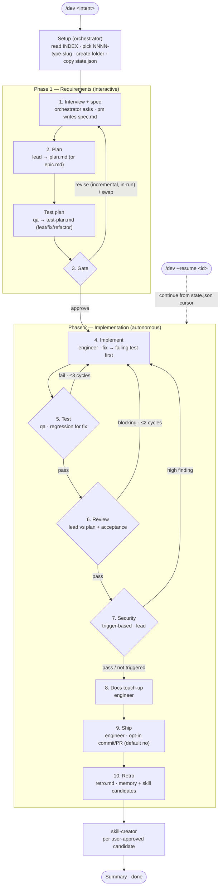

# Workflow

A spec-driven, two-phase pipeline (interview → plan → human gate → autonomous build) that scales its machinery to the work: think before coding, simplify first, change surgically, drive toward the spec's goal.

**Version 2.6.0** — tracks the release in [`VERSION`](VERSION) (source of truth) and [`CHANGELOG.md`](CHANGELOG.md).

Primary entry point: `/dev <intent>` (or `/dev --resume <id>`). The command detects context (new vs. existing codebase) and runs the same two-phase flow, branching on **run type** so a `chore` isn't dragged through e2e and a `fix` reproduces before it changes anything. Same artifacts either way, in `.workflow/<id>/`.

**Team mode** ([below](#team-mode--run-one-role-on-its-own)) splits that flow into role-scoped commands — `/spec` (pm), `/dev-plan` (lead), `/test-plan` (qa), `/uxui-plan` (uxui), `/implement` (Phase 2) — each writing into the **same** `.workflow/<id>/` run and sharing the gate, so the artifacts compose exactly as a one-shot `/dev` run; `/dev --resume <id>` (or `/implement`) carries a hand-assembled run the rest of the way.

> **Orchestration runs in the main agent, not a sub-agent.** A Claude Code sub-agent **cannot call `AskUserQuestion`**, so the `/dev` command loads [`.claude/orchestrator.md`](.claude/orchestrator.md) and the main agent runs the interview + drives the flow; sub-agents (`pm`, `lead`, `engineer`, `qa`, `retro`) do the file work. **Fan-out has two paths:** splittable agents (`pm`, `lead`, `qa`, `engineer`, the self-splitting `team-*` workers) hold `Agent` and **spawn helpers directly** when work is large (direct nesting, Claude Code v2.1.172+); the orchestrator-mediated `FANOUT_REQUESTED:` signal is the fallback (and the path for background implement-fanout). `state.json` stays single-writer (the orchestrator) regardless — helpers never write it.

## Flow at a glance

The happy path with its three feedback loops (test, review, security): diamonds are decision points, the dotted edge is the `--resume` re-entry, and phase numbers match the [type-aware matrix](#type-aware-phase-matrix) and the prose below. **Test runs before review** so reviewers judge a green suite; because every blocking finding loops back through implement → test, a review/security fix is always re-validated before ship.



## Naming convention

A stable, sortable run ID so every artifact, index row, and resume cursor points at the same run: **`NNNN-<type>-<kebab-slug>`**

- `NNNN` — 4-digit sequential counter; `orchestrator` reads `.workflow/INDEX.md` to pick the next.
- `<type>` — conventional-commits: `feat` | `fix` | `refactor` | `chore` | `docs` | `spike`
- `<kebab-slug>` — ≤5 words, lowercase, hyphenated. No dates (the index tracks them).

Examples: `0001-feat-todolist-app`, `0003-fix-login-redirect`, `0004-refactor-auth-middleware`.

## Folder layout

One self-contained folder per run, plus the shared registry and templates.

```
.workflow/
├── INDEX.md                       # registry: id, type, title, status, dates
├── FOLLOWUPS.md                   # carry-over items surfaced by past retros
├── _templates/                    # blueprints — copy, don't edit in place
│   ├── spec.md  plan.md  test-plan.md  uxui-plan.md
│   ├── review.md  tests.md  security.md  recommendations.md
│   ├── retro.md  epic.md
│   └── state.json                 # per-run resume cursor
├── 0001-feat-todolist-app/
│   ├── state.json  spec.md  plan.md  test-plan.md
│   ├── review.md  security.md     # security.md only if the review fired
│   ├── tests.md  retro.md
└── 0003-fix-login-redirect/ ...
```

Rules:
- One folder per run — never mix two pieces of work.
- `_templates/` is the source of truth for artifact shape: copy when starting, never write to it during a run.
- `INDEX.md` is append-only on start, status-updated as phases progress; `retro` writes the `Finished` date.
- `FOLLOWUPS.md` is shared — `retro` appends, `pm` reads on every new interview to ask if carry-overs are now in scope.
- `state.json` is the per-run cursor the orchestrator writes after each step, so `/dev --resume <id>` knows where to pick up.
- Parallel runs are fine (folder IDs make them independent); if two features touch the same files, `lead` flags it in `risks`.

## Artifacts

Every artifact has a template in [`.workflow/_templates/`](.workflow/_templates/) (filename = template name). Agents copy the template into the run folder and fill it in — never write freeform.

| File | Owner | Purpose |
|---------|---------------|----------|
| `spec.md` | `pm` | **Goal** (one line), **User Stories** (priority-ordered P1/P2/P3, each with Given/When/Then **acceptance scenarios** carrying `AC#` ids), **Functional Requirements** (FR-###), **Success Criteria** (SC-###), key entities, edge cases, users, scope, **Type**, bug-repro (fix), timebox (spike), assumptions |
| `context.md` | `/spec` or `/dev` main agent (via `team-codebase-explorer`) | **Shared brownfield-M/L understand map** — current state + UI surface + test infra, built **once** after the spec so `lead`/`qa`/`uxui` read it instead of each re-walking. Optional — greenfield / XS-S skip it (slices cold-walk) |
| `plan.md` | `lead` (plan mode) | **Summary** + **Technical Context** + **Gate check** (vs `rules/fundamentals.md`), **phases for this task**, architecture diagram, current-state + research notes, **scaffold skeleton** (M/L), files to touch (`path#anchor`), risks, **rollback** |
| `tasks.md` | `lead` (plan mode) | **Executable task breakdown** — phased (Setup → Foundational → one per User Story by priority → Polish) `T### [P] [AC#] … verify:` tasks, dependency-ordered, each tied to an acceptance scenario; the engineer builds from this |
| `test-plan.md` | `lead` combined (XS/S) or `qa` (M/L) | **Design-time test strategy** (feat/fix/refactor) — coverage plan (level per AC), edge cases, out-of-test-scope, fixtures/data/env, regression contract (fix) / baseline (refactor or brownfield feat editing uncovered code), coverage targets. Authored after `plan.md`, **signed off at the gate**; `qa` executes it at the test phase |
| `uxui-plan.md` | `uxui` (team mode) | **Design-time UX plan** for UI work — Scenes (screens/states), ASCII wireframes, Scenarios (flows), UX direction & components, AC↔scene mapping. Written by `/uxui-plan` (not part of the linear state machine); `frontend-design` builds from it, `qa > Visual verification` checks against it |
| `review.md` | `lead` (review mode) | Tasks-adherence + **acceptance verification** against `spec.md` |
| `security.md` | `lead` (security mode) | Security findings; only when the diff trips the sensitive-paths trigger |
| `tests.md` | `qa` (execute mode) | **Test execution record** — AC mapping (actual tests), run results, regression verification (fix), measured per-level diff coverage, edge-case gaps. Executes `test-plan.md` |
| `recommendations.md` | `engineer` (spike) | Spike deliverable — what we learned, recommended next step. Replaces test/ship phases. |
| `retro.md` | `retro` | What worked, what to change, memory + skill candidates, commit/PR refs |
| `epic.md` | `lead` (rare) | Decomposition into slices when `Ship as: staged` + ≥2 capabilities |
| `state.json` | `orchestrator` | Resume cursor: phase, step, cycle counters, run timestamps (`created_at`, `last_updated`, `done_at` just before the retro spawn) |

## Optional artifact gate

An off-by-default structural check. [`.claude/hooks/artifact-lint.sh`](.claude/hooks/artifact-lint.sh) validates a run's artifacts against the templates. It is *not* wired into the state machine — invoke it by hand, in a pre-commit step, or in CI.

```sh
sh .claude/hooks/artifact-lint.sh .workflow/<id>/
```

Checks, per directory:
- **Required sections** — `spec.md` declares a `**Type**:`, a `## Goal`, and a `## User Stories` (with `AC#` acceptance scenarios); `tasks.md` has ≥ 1 `T###` task with an inline AC tag (`[AC<n>]`/`[DoD]`) and a runnable verify (`verify:` clause); `plan.md` has a fenced `mermaid` block.
- **No leftover placeholder markers** — `TODO`/`TBD`/`FIXME`/`lorem` (word markers, case-insensitive) and `<...>` placeholders, in bare prose only — a marker inside a code span or fenced block is treated as documentation and ignored.

Prints a per-check report (`[OK]` / `[FAIL] <file>:<line>: …`) and **exits non-zero on any failure** (or a missing/empty/artifact-less path). Dependency-light (POSIX `sh` + `grep`/`awk`); the rules are encoded in the script, so it doesn't need `_templates/` at runtime. Fixtures: [`.claude/hooks/tests/run-artifact-lint-tests.sh`](.claude/hooks/tests/run-artifact-lint-tests.sh).

## Type-aware phase matrix

Type decides *which* phases run. The same numbered phases run for every type, but `orchestrator` **skips or specializes** some by `Type`: ✓ runs, `skip` records "skipped — type=<x>" and moves on, `light` is a thinner pass. (How *much* machinery each phase gets is orthogonal — `.claude/orchestrator/references/size-execution.md`.)

| Phase | feat | fix | refactor | chore | docs | spike |
|-------|------|-----|----------|-------|------|-------|
| 1. Interview + spec | ✓ | ✓ | ✓ | ✓ | ✓ | ✓ (timeboxed) |
| 2. Plan | ✓ | ✓ (task 1 = regression test) | ✓ (equivalence note; baseline-capture task 1 if coverage thin) | ✓ | ✓ | ✓ (exploration plan) |
| 2½. Test plan | ✓ | ✓ (regression contract) | ✓ (baseline contract) | skip | skip | skip |
| 3. Gate | ✓ | ✓ | ✓ | ✓ | ✓ | ✓ |
| 4. Implement | ✓ | ✓ (regression test FIRST, then fix) | ✓ | ✓ | ✓ | ✓ (exploration) |
| 5. Test | ✓ | ✓ (regression must pass) | ✓ (verify vs captured baseline) | skip | skip | skip |
| 6. Review | ✓ | ✓ | ✓ | ✓ · skip @XS | ✓ · skip @XS | light |
| 7. Security review | trigger-based | trigger-based | trigger-based | trigger-based | trigger-based | skip |
| 8. Docs touch-up | ✓ | optional | optional | optional | ✓ | skip |
| 9. Ship (stage + opt-in commit/PR) | ✓ | ✓ | ✓ | ✓ | ✓ | ✓ |
| 10. Retro | ✓ | ✓ | ✓ | ✓ | ✓ | ✓ |

**Ship commit — opt-in, asked every run (default `no`).** Phase 9 always runs (isolates the diff, scans secrets) but **the commit is the gate's call** (`state.json > commit_on_ship`, lever `commit on|off`): `no` → ship hands back a ready-to-run commit command, no push/PR (`open_pr_on_ship` forced `no`); `yes` → commit + optional PR. Independent of `fix`/`refactor`'s in-`implement` commits for the regression/baseline contract — those land at phase 4.

**Review at XS for `chore`/`docs` — default skip.** A `chore`/`docs` change sized **XS** (one file, pure text/config, no behaviour surface) skips phase 6 by default — the lint hook + the gate's per-line AC confirmation cover it. The gate's run-plan line shows it (`review:type=<chore|docs>@XS`); `run 6` keeps the pass. A **size×type matrix default** (not a per-line deviation): `chore`/`docs` at **S or larger** still review, every other type reviews at XS; the orchestrator enforces it at Review.

**Test plan.** Phase 2½ is the design-time half of testing: `test-plan.md` captures the coverage plan, edge cases, fixtures, and regression/baseline contract right after `plan.md`; the gate signs it off and phase 5 runs it. Runs for `feat`/`fix`/`refactor`, skipped for `chore`/`docs`/`spike`. **At XS/S the combined `lead` spawn writes spec + plan + test-plan in one pass**; at M/L a separate `qa` spawn writes it. Orchestrator-inline authorship is only a legacy/resume fallback.

**Greenfield vs brownfield (the `field`).** Orthogonal to type and size, every run is **greenfield** (new isolated code — nothing imports it, no published contract, no integration, first-party storage only; always XS/S) or **brownfield** (modifies/extends existing behaviour or wires into existing code — the default; every `fix`/`refactor` and every M/L run). The orchestrator records `field` at the digest; `lead` re-derives it at plan time and ratchets greenfield → brownfield (one-way) via `FIELD_UPGRADE: brownfield` if the code walk reveals integration. It gates the **brownfield discipline of understand → lock → change**: brownfield turns on the `Current state` map (`plan-writing > principle 3`) and the characterization baseline (`test-plan.md > Baseline`; `fix` locks via its regression contract); greenfield skips both. Canonical: `plan-writing > references/size-tiering.md > Greenfield vs brownfield`.

### Security trigger

Phase 7 runs when the diff touches any of: auth/session/token, password handling, crypto primitives, SQL/query building, raw HTML rendering, file/path handling, exec/shell, deserialisation of untrusted input, secret-bearing files (env/config), or new external network endpoints. **Not a trigger on its own — first-party browser-storage round-trip:** the app reading back its own single-user `localStorage`/`sessionStorage`/`IndexedDB` via `JSON.parse` is *not* untrusted deserialisation and does not fire phase 7 — **provided** the diff has no dangerous sink (`innerHTML`/`outerHTML`/`insertAdjacentHTML`/`document.write`/`eval`/`Function`/`dangerouslySetInnerHTML`/jQuery `.html()`/any HTML-injection sink — **open list**; any such sink is itself a "raw HTML rendering" trigger and fires regardless). It also fires when the stored data crosses a real trust boundary (multi-user/shared-device threat model, or data written by a server or another principal). `orchestrator` decides; `lead` executes in security mode via the inline checklist.

### E2E + visual (opt-in)

Browser-based **e2e** and the **visual + a11y verification** pass are **off by default**, turned on per-run via `e2e_visual` (`state.json > e2e_visual`, default `off`). The orchestrator asks a binary opt-in in the interview for feat/fix shipping a UI surface and surfaces it at the gate (`e2e on|off` lever); a still-unset flag resolves to `off` at approve. **Why opt-in:** a browser run's wall-clock is dominated by installing the browser binary + slow journeys, while unit/integration over jsdom/happy-dom already cover UI *logic*. **Effect:** `off` → test phase plans/runs **unit + integration only** (a user journey maps to integration), no e2e level, no Visual pass, no e2e floor, no browser install; `on` → the full browser path (e2e where a journey owns the behaviour, the visual/a11y pass reusing one session, the e2e floor). `chore`/`docs`/`spike` skip the test phase regardless. Canonical effect on the test steps: `qa.md > e2e_visual`.

### Per-task phase plan (deviation from the matrix)

The matrix is the **default, not the final word**. `lead` (plan mode) writes a reasoned **`## Phases for this task`** block in `plan.md` that starts from the matrix and may **deviate** when a discretionary phase isn't needed. Three phases are **discretionary**: **5 Test**, **6 Review**, **8 Docs**. A disposition turning a matrix-`✓` into `light`/`skip` is a **deviation**: tag it `(deviates from matrix)` with a one-line justification. No deviation → one line (`Matrix defaults for type=<T> — no deviations.`).

**Protected — never deviatable, at any size:** **1 Interview + spec**, **2 Plan**, **3 Gate**, the **7 security-trigger *check*** (the scan always runs; the plan may *predict* whether it fires, never suppress it), and **10 Retro** — plus state-discipline writes and the per-line AC confirmation. Implement (4) and Ship (9) aren't discretionary either.

**The gate owns the deviation, not the plan.** Every deviation is surfaced at the gate for **explicit per-line confirmation**; it does **not** ride a plain `approve`. `lead` proposes, the user disposes. Levers: `approve | skip <n> | run <n> | revise <notes>` — `skip <n>`/`run <n>` flip a discretionary phase directly (a `skip` of a protected phase is refused). Approved dispositions land in `state.json > phase_plan` (`test`/`review`/`docs` → `run|light|skip`; empty `{}` = matrix defaults); Phase 2 honours them (a skipped phase is recorded in `skipped_steps` as `<phase>:per-task-plan (user-approved)`). **Skipping `5 Test` on `fix`/`refactor` also waives that type's regression/baseline contract** — highest justification bar.

This subsection is the **canonical definition**; `plan.md`, `lead.md`, and `orchestrator.md` point here.

### Fanout plan & size-aware execution (split out)

Two canonical blocks live in their own reference files (gate-owned, unchanged in force):
- **Fanout plan** (the gated `## Fanout plan` block `lead` declares, the gate lever, telemetry) → [`.claude/orchestrator/references/fanout-plan.md`](.claude/orchestrator/references/fanout-plan.md).
- **Size-aware execution matrix** (how much machinery each phase gets per XS/S/M/L, the patch lane, fanout availability, the multi-repo boundary) → [`.claude/orchestrator/references/size-execution.md`](.claude/orchestrator/references/size-execution.md).

## Skill routing

Skills are phase-specific procedural knowledge, not extra agents — load the narrowest one that owns the current decision (within the budget below):

- Conduct on any code task: `coding-discipline` as the behavioral pre-flight — surface assumptions, keep the change minimal/surgical, set a verifiable goal. It wraps and routes to the skills below.
- Ambiguous product scope or trade-offs: `brainstorming` before `pm` writes `spec.md`.
- Unknown-cause failures: `debug-fundamentals` before construction skills, then encode the regression in `plan-writing`.
- Refactors: `refactoring-fundamentals` first (safe path + behaviour baseline — characterization test → `tasks.md` task 1), then the construction skill for the target shape.
- Construction: `ddd-strategic` first when business language/boundaries are unclear; then `programming-fundamentals`; then `concurrency-fundamentals`, `database-fundamentals`, `hexagonal-backend`, `api-design-fundamentals`, `architecture-fundamentals`, `queue-fundamentals`, and cross-cutting `security-fundamentals` / `observability-fundamentals` — each only when its layer is touched. Full run order: `.claude/rules/fundamentals.md`.
- Verification: `testing-fundamentals` for test strategy/design (`qa` designs it into `test-plan.md` at phase 2½, executes at phase 5); `debug-fundamentals` for an unknown-cause failure.
- Planning: `plan-writing` when `lead` drafts `plan.md`.
- UI: `ui-ux-pro-max` for UX/design decisions, `frontend-design` for polished UI code, `tailwind-design-system` only for Tailwind v4 token/component/migration mechanics.
- Parallel research/review/test slices: `fanout-team-agents`.
- Delivery: `git-workflow` before any staging/commit/rebase/PR; `delivery-engineering` for CI/CD/build/deploy/release.
- Retro skill creation: `skill-creator` only after `retro` proposes a candidate and the user approves.

### Skill-load budget (critical path)

A full skill body is the dominant avoidable cost on the hot path. On plan / implement / review the always-on `CLAUDE.md` rule summaries ARE the fundamentals pre-flight — a full `SKILL.md` is 30–114 KB of sequential Reads over a growing context. **Default: load no full skill body.** Read **at most one** targeted `references/<file>` section, and only for a specific friction the summary doesn't settle. **Exempt:** a user-cited `References / examples to follow` entry — always open every one. Each agent applies this budget in its own steps and points here.

Phase numbering below matches the matrix (1–10). The orchestrator runs setup actions (read INDEX, pick ID, create folder, copy state.json, append INDEX row) before phase 1 — internal, not numbered.

## Phase 1 — Requirements (interactive)

Turn a rough intent into a signed-off spec + plan + test plan before any code — ask only what's unspecified, let the human gate the contract.

1. **Interview + spec** — the **orchestrator (main agent)** reads `FOLLOWUPS.md`, then **distills the entire pre-`/dev` conversation into a requirements digest** and passes it to `pm` so nothing said before `/dev` is dropped. When existing code/APIs/security paths/unfamiliar terms or multiple research questions make guessing risky, it fans out spec-prep probes first (`team-codebase-explorer` maps current behaviour/invariants, `team-best-practice-researcher` gathers constraints); XS pure-greenfield skips this. It runs `AskUserQuestion` (≤4 per batch; one batch by default, a bounded dig loop of ≤3 narrowing batches when ambiguity is high), asking **only what the digest leaves unspecified** and closing with a free-text "anything I missed?", to capture: goal, users, scope, non-goals, constraints, **Type**, `Ship as`, a measurable NFR target (mandatory binary ask for runtime-shipping feat/fix — on `yes`, written as an AC whose verify is its `measured:` clause), a concrete `input → output` example AND the `on error / at boundary:` behaviour per consequential *behavioural* AC, and whether any open follow-up is now in scope. For `fix`, also a concrete reproduction. It then spawns `pm` with the full Q&A + fanout findings; `pm` writes `spec.md` (`Type`, `Discovery notes`, any `References / examples to follow` — external URLs fetched + inlined by the orchestrator first, since `pm`/`engineer` have no web access — and a Reproduction for `fix`).
2. **Plan** — `lead` (plan mode) reads `spec.md`, runs the scope check, then writes `plan.md` **+ `tasks.md`**:
   - *Always*: a `## Phases for this task` + a `## Fanout plan` block — matrix/single-pass defaults, deviating only with justification (gate confirms each — see `Per-task phase plan` above and `fanout-plan.md`).
   - *M/L*: a `## Scaffold` section — target file tree (`★` new) + each new file's key signature, surfaced at the gate. S touching existing code may include a mini version; XS skips it.
   - *New project*: proposes structure + stack.
   - *Existing code*: fans out for S/M/L plans with independently-researchable integration points **in disjoint surfaces** (separate modules/folders/repos — not ≥2 points in one cohesive module); synthesises `Current state`, `Research notes`, `Summary`, the `tasks.md` tasks with `path#anchor` refs, risks, verification.
   - *Fix*: `tasks.md` task 1 MUST be "write failing regression test for <bug>".
   - *Refactor*: a behaviour-equivalence note; when touched behaviour isn't covered, `tasks.md` task 1 captures a characterization baseline.
   - *Spike*: an exploration outline with a timebox; `Out of scope` says "no production code lands".
   - *Epic* (rare): writes `epic.md`, recommends a starting slice.
2½. **Test plan** (feat/fix/refactor) — `qa` (test-plan mode) writes `test-plan.md` from `spec.md` + `plan.md` + `tasks.md` + the codebase: a coverage plan mapping every acceptance scenario (happy path AND its boundary/error scenario) to the test **level** + what it asserts, edge cases to probe **before** code, out-of-test-scope, fixtures/data/env, and the type-specific lock (regression contract for `fix`, characterization baseline for `refactor`, and for a **brownfield `feat`** the lock around the uncovered existing code it modifies). Surfaced at the gate, executed at phase 5. See `Test plan` above for skip/fold rules.
3. **Gate** — `orchestrator` shows the `spec.md` summary with **acceptance scenarios as the contract for per-line confirmation** (each scenario, Given/When/Then, with its boundary/error scenario, grouped under its User Story by priority, framed "done when each is true — confirm or correct each"), any `Assumptions (inferred from repo — correct any that are wrong)`, the `plan.md` outline (or epic slices), the `## Scaffold` for M/L, the `test-plan.md` coverage + edge cases, and the **per-task phase plan** + **Fanout plan** ("will run: 1-2-2½-3-4-5-6-9-10; skipping 7,8 — type=fix, no sensitive paths, docs not in scope"), with **any deviation surfaced for explicit confirmation**. Wait for `approve` / `skip <n>` / `run <n>` / `fanout <phase> on|off` / `revise <notes>` / `swap <n>` (epic only). **Revise is an incremental, in-run edit — never a Phase 1 restart:** plan notes re-edit just the affected `plan.md` / `tasks.md` tasks (no re-fanout/LSP re-walk); requirement notes re-edit just the affected `spec.md` sections (re-interview only for a genuinely new slot) then propagate into the tasks; test-plan notes re-edit just the affected `test-plan.md` rows. Free-form "chat about this" is treated as `revise` for the **same** run; the orchestrator re-verifies consistency (AC ↔ tasks ↔ test-plan rows, no dangling cross-refs, no markers) before re-presenting only the changed parts.

## Phase 2 — Implementation (autonomous after approval)

Build the approved contract and prove it — implement, then close the test/review/security loops and ship. Runs without further prompts (the gate authorized the phase plan); a blocking finding bounces back to implement within its cycle budget.

4. **Implement** — `engineer` executes `tasks.md` task by task via `TaskCreate`, marking each done. **For `fix`, the first task must reproduce the bug via a failing test** (its own commit, so qa can verify the fail-on-pre-fix-code contract in phase 5). Before signalling done, it ticks each `spec.md` acceptance scenario checkbox or files a blocking note.
5. **Test** — `qa` (execute mode) runs the `test-plan.md` strategy **first, before review, so reviewers judge a suite that already passes**, writing the planned unit + integration tests (plus e2e only when `e2e_visual=on` — see `E2E + visual (opt-in)`; plus a **contract test** when `plan.md` declares `## API / event contracts`, consumer-driven when a separate consumer exists, folding into integration), maps each planned coverage row + every acceptance scenario (incl. its boundary/error scenario and any `measured:` target) to an actual test, and records `tests.md`. For `fix`, the step-4 regression test MUST fail on pre-fix code (`git checkout <fix-commit>^`) and pass now. For `refactor`, qa confirms a baseline existed, runs the suite, verifies it holds, and adds tests only for uncovered behaviours. It measures **diff coverage** against per-level floors — unit ≥ 80%, integration ≥ 70% (boundary-crossing lines only), e2e ≥ 50% of critical journeys (only when `e2e_visual=on`) — in `tests.md > Coverage (diff vs floor)`. Floors are **advisory ratchets**: a below-floor level is an escalated finding (accept → retro, or back to `engineer`), not a ship-block, never padded. The opt-in **Visual + a11y verification** pass (fires only when `e2e_visual=on` and the diff changes rendered UI) is owned by `qa.md > Visual verification pass`. Failing tests block step 9 (max 3 cycles). `chore`/`docs` → a one-line `tests.md` stub (inline at XS); `spike` skips the phase (`recommendations.md` is the deliverable).
6. **Review** — `lead` (review mode) reads the diff against `tasks.md` + `plan.md` AND the `spec.md` acceptance scenarios (each boundary/error scenario and any `measured:` target), AND the non-AC correctness slots — `Definition of Done` (artifact present?) and `Constraints` (diff honours each?). May fan out to the tiered review lenses (core 3 at M, full 6 at L/high-stakes); otherwise reviews directly. Writes `review.md`. Blocking issues → `engineer` fixes → **re-validate (re-run test, step 5) → re-review** (max 2 cycles before escalation), so a review-driven fix never ships untested.
7. **Security review** — *trigger-based* (see `Security trigger` above). If the diff trips the list, `orchestrator` spawns `lead` in security mode → `security.md`. `high` findings block; `medium` and below carry into `retro.md`. After a `high` fix, the change re-enters test (5) → review (6) → security (7) on the new diff — same cycle budget as review.
8. **Docs touch-up** — `engineer` updates inline comments where the *why* is non-obvious and any user-facing docs the change touches. No new docs unless the spec asked. Light for `fix`/`refactor`/`chore`; skipped for `spike`.
9. **Ship** — `engineer` (ship mode) isolates the diff + scans secrets. **Commit opted in at the gate, asked every run, default `no`:** off → leave uncommitted + hand back a ready-to-run commit command (no push/PR); on → commit (run ID + spec goal) + PR if remote and `Open PR on ship=yes`. Commit/PR URL → `state.json` → `retro.md`.
10. **Retro** — `retro` reads `plan.md` + `review.md` + `security.md` (if any) + `tests.md` + diff + commit, writes `retro.md`, appends new follow-ups to `FOLLOWUPS.md`, marks consumed ones closed. Surfaces *memory candidates* (facts) and *skill candidates* (procedures) for user confirmation; the orchestrator then asks which skill candidates to create and spawns `skill-creator` for each approved one, then prints the final summary (artifacts, files changed, commit, PR, open follow-ups, skills created) — the run's terminator, not a numbered phase.

After every step `orchestrator` updates `state.json` (`phase`, `step`, relevant `cycle` counter); if the session dies mid-run, `/dev --resume <id>` reads it and continues.

## Scope: when to split (rare path)

**Default:** one `/dev` run, regardless of file/step count or layers touched. Crossing DB + API + UI is normal full-stack work, NOT a reason to split.

`lead` enters epic mode **only when both are true**:
1. The spec lists ≥ 2 capabilities that can ship to users independently, **and**
2. `Ship as: staged` is set in `spec.md`.

If only one is true → one `plan.md`. A heavy plan (say >15 steps) gets a note in `plan.md > Risks` ("scope is on the larger side") — **do not split**. The `Ship as` answer is captured in the Phase 1 interview and recorded in `spec.md` frontmatter — the user's call, not the planner's.

### Epic mode flow

1. `lead` writes [`epic.md`](.workflow/_templates/epic.md) (2–5 vertical slices, each independently shippable) instead of `plan.md`.
2. `INDEX.md` status for this ID = `epic`. No implementation runs against this folder.
3. `lead` recommends a starting slice and opens a child `/dev` run (e.g. `0006-feat-audit-viewer`) with `Parent: 0005-feat-audit-system` in its `spec.md`.
4. Remaining slices are separate `/dev` runs later, each referencing the same parent.
5. User can `swap <n>` at the gate to pick a different first slice.

## Agent map

Five sub-agents drive the `/dev` file work, plus the team-mode `uxui` designer (spawned only by `/uxui-plan`). The **orchestrator is not a sub-agent** — it's the role the main agent plays when `/dev` (or a team-mode command) runs, following [`.claude/orchestrator.md`](.claude/orchestrator.md). Several sub-agents have multiple modes so the count stays low.

| Role | Where it runs | Phase steps | Reads | Writes | Primary tools |
|------|---------------|-------------|-------|--------|---------------|
| `orchestrator` | main agent (`/dev`) | drives all + runs the interview | user input, INDEX, FOLLOWUPS, state.json | INDEX status, state.json, follow-up cursor | `AskUserQuestion`, `Agent`, `Bash` |
| `pm` | sub-agent | 1 (spec) | intent + interview Q&A + FOLLOWUPS | `spec.md` | `Read`, `Write`, `Agent` |
| `lead` | sub-agent | 2 (plan), 6 (review), 7 (security) | `spec.md`, codebase, diff | `plan.md` + `tasks.md` / `epic.md`, `review.md`, `security.md` | `Read`, `Grep`, `LSP`, `Write`, `Edit`, `Bash`, `Agent` |
| `engineer` | sub-agent | 4 (implement), 8 (docs), 9 (ship) | `tasks.md`, `plan.md`, `spec.md`, diff | source, inline comments, commit, PR | `Read`, `Edit`, `Write`, `Bash`, `Grep`, `LSP`, `TaskCreate/Update/List`, `Agent` |
| `qa` | sub-agent | 2½ (test plan), 5 (test) | `spec.md`, `plan.md`, `tasks.md`, `test-plan.md`, source, diff | `test-plan.md`, tests + `tests.md` | `Read`, `Write`, `Edit`, `Bash`, `LSP`, `Grep`, `Agent` |
| `retro` | sub-agent | 10 | all artifacts + diff + existing memory/skills + FOLLOWUPS | `retro.md`, INDEX status, FOLLOWUPS append | `Read`, `Write`, `Edit`, `Bash` |
| `uxui` | sub-agent (team mode) | `/uxui-plan` only | `spec.md`, design system/components, `ui-ux-pro-max` | `uxui-plan.md` | `Read`, `Grep`, `LSP`, `Write`, `Edit`, `Agent` |
| `team-*` agents | sub-agents (workers) | dispatched from fanout phases (1, 2, 4, 5, 6, 7) | the spec question / codebase area / best-practice question / diff slice / bucket the orchestrator scopes | findings (returned to the calling sub-agent; no artifact write) | varies — see `.claude/agents/TEAM.md` |

Sub-agent constraints:
- **Direct nesting (v2.1.172+):** splittable agents are granted `Agent` and spawn helpers when work is large — `pm`, `lead`, `qa`, `engineer`, and the self-splitting `team-codebase-explorer` / `team-best-practice-researcher` / `team-code-reviewer`. Other `team-*` review workers stay read-only. Helpers do one level of split only and never write `state.json`.
- **Enforced by Claude Code:** sub-agents cannot call `AskUserQuestion` — any user prompt comes from the main agent. Sub-agents that hit ambiguity return a `BLOCKER:` line and the orchestrator surfaces the question.

External: when `retro` surfaces skill candidates and the user approves, the orchestrator invokes `skill-creator` for each. The handoff is explicit — no candidate is created silently.

### Anti-bias rule

Because `lead` reviews the plan they wrote, review mode is checklist-driven (one row per task, one per acceptance scenario incl. its boundary/error scenario, one per DoD item and Constraint, one verification per file). "Looks good overall" is banned.

## Team mode — run one role on its own

Build the same artifacts role-by-role instead of in one monolithic run — one specialist at a time, each writing into the **same `.workflow/<id>/` run folder** so they compose, and the run can be carried the rest of the way with `/dev --resume <id>`. **Cost note:** team mode deliberately skips the XS/S combined fast path (`/spec` always spawns `pm`; `/dev-plan` and `/test-plan` are separate slices), so for tiny or patch-lane work prefer one-shot `/dev`.

| Command | Role (agent) | Writes | Notes |
|---------|--------------|--------|-------|
| [`/spec`](.claude/commands/spec.md) | `pm` | `spec.md` | Main agent runs the Phase-1 interview, then `pm` writes the spec; run stops at `step=spec`. Always spawns `pm`. Pass a run id instead of an intent to refine an existing spec (spec-patch mode). |
| [`/dev-plan`](.claude/commands/dev-plan.md) | `lead` (plan mode) | `plan.md` / `epic.md` | Resolves a run, runs plan-prep fanout, then `lead` plans against `spec.md` (sonnet; opus for L). Needs a ready spec; stops at `step=plan`. No gate, no implement. |
| [`/test-plan`](.claude/commands/test-plan.md) | `qa` (test-plan mode) | `test-plan.md` | Resolves a run, reads `spec.md` + `plan.md`, designs the strategy. Needs a spec; warns if no plan yet. `chore`/`docs`/`spike` get none. |
| [`/uxui-plan`](.claude/commands/uxui-plan.md) | `uxui` | `uxui-plan.md` | UI work only. Reads `spec.md`, drives `ui-ux-pro-max` / `frontend-design`, writes Scenes + wireframes + Scenarios + UX direction + AC↔scene mapping. **Not a linear state-machine step** — leaves `step`/`next_step` untouched, records the artifact in `state.json > notes`. |
| [`/implement`](.claude/commands/implement.md) | `engineer` + `lead` + `qa` + `retro` | source, `review.md`, `tests.md`, `retro.md`, commit/PR | **Phase 2 entry point.** Confirms the run is ready (spec + plan + test-plan), runs the **gate** if not yet approved, then the whole autonomous build — implement → test → review → security → docs → ship → retro. Same Phase 2 and `state.json` as `/dev`, interchangeable with `/dev --resume <id>` mid-build. |

Mechanics shared with `/dev`: the command's **main agent plays the orchestrator** and the named worker does the file work. The spawn guard ([`dev-agent-guard.sh`](.claude/hooks/dev-agent-guard.sh)) still applies — spawn `pm`/`lead`/`engineer`/`qa`/`retro`/`uxui` by name, never `general-purpose`. Typical flow: `/spec` → then `/dev-plan`, `/test-plan`, `/uxui-plan` (if UI) **fired together** → `/implement` (gate → build → ship). **All three Phase-1 slices can run in parallel on one run** — each writes its own `state.<slice>.json` shard (carrying an `ac_covered` index so the gate fold is a cheap **set-compare**, not a full artifact re-read), and the gate folds them into `state.json` single-writer. `dev-plan`/`uxui-plan` need only `spec.md`; `test-plan` also consumes `plan.md`, so started first it runs **spec-only** (plan-derived rows `[pending plan]`) and the gate **backfills** them once `plan.md` exists — **inline for XS/S, a `qa` re-spawn only for M/L**. See [`.claude/orchestrator/references/team-mode-sharding.md`](.claude/orchestrator/references/team-mode-sharding.md).

## Example: `/dev create todolist app`

Phase 1 → interview (one merged batch — **Size S**: self-contained greenfield) → `lead` in **combined mode** (`pm` skipped, no scaffold for S greenfield) writes `spec.md` (Type=feat, CRUD tasks, single user, no auth, localStorage) + `plan.md` + `test-plan.md` in one spawn (each AC → unit/integration level; **e2e_visual=off**, so the UI journey maps to integration — no Visual row, no browser install) → **gate** ("Size: S → fast path"; "E2E + visual: off — say `e2e on` to add browser checks"; will run 1-2-2½-3-4-5-6-8-9-10; **skip 7** — a first-party localStorage round-trip rendered via `textContent` is no deserialise trigger, no dangerous sink) → `approve`.

Phase 2 → implement → tests pass (unit + integration; **no browser**) → review (sonnet) → merged docs+ship → `retro.md` (light) → done.

## Example: `/dev fix login redirect loop`

Phase 1 → interview → `spec.md` (Type=fix, reproduction = "log in from /admin, lands back on /login") → `lead` writes `plan.md` + `tasks.md` (T001 = "add failing test `auth.spec.ts:redirect-loop`", T002 = "fix the redirect") → `qa` writes `test-plan.md` (regression contract) → **gate** (will run 1-2-2½-3-4-5-6-7-9-10; security on — diff touches auth; skip 8) → `approve`.
Phase 2 → engineer writes failing test → fixes redirect → qa confirms regression test fails on pre-fix code, passes now → review → security (passes) → docs skipped → commit (no PR — flagged at gate) → `retro.md` → done.

## Example: `/dev spike compare bullmq vs sidekiq`

Phase 1 → interview → `spec.md` (Type=spike, timebox=1 day, deliverable=recommendation) → `lead` writes exploration plan → **gate** (will run 1-2-3-4-6-10; skip 5,7,8 always, skip 9 unless user opts to commit) → `approve`.
Phase 2 → engineer explores both → writes `recommendations.md` → light review → `retro.md` → user decides whether to open follow-up `feat` runs.

## Stop conditions

Where the run pauses, loops, or escalates instead of charging ahead.

- User says `revise` at the gate (or chats free-form about the spec/plan/test-plan) → targeted in-run edit of only the affected sections, then re-verify and re-present the changed parts. Never a fresh Phase 1 run.
- User says `skip <n>` / `run <n>` at the gate → flip that discretionary phase's disposition (5 Test / 6 Review / 8 Docs only; a `skip` of a protected phase is refused), record it in `state.json > phase_plan`, re-present, stay in the gate loop until `approve`.
- Test failures → fix → re-run, max 3 cycles, then escalate.
- Reviewer blocking issues → fix → re-run test (step 5) → re-review, max 2 cycles, then escalate.
- Security review `high` finding → fix → re-run test → re-review → re-security, counts against the review cycle budget.
- Any agent unsure → stop and ask the user, never invent requirements.
- Context exhaustion / cancel → next `/dev --resume <id>` reads `state.json` and continues from the recorded step.
