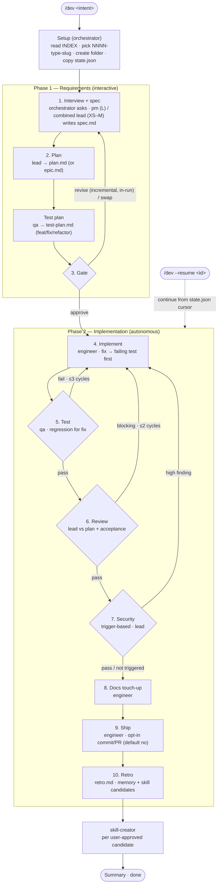

# Workflow

A spec-driven, two-phase pipeline (interview → plan → human gate → autonomous build) that scales its machinery to the work: think before coding, simplify first, change surgically, drive toward the spec's goal. **Fast first** — when two compliant paths exist, take the faster one; speed comes from cutting overhead (round-trips, re-reads, ceremony), never from cutting verification. **Floor (never cut, at any size):** the gate, the security-trigger *check*, state writes / `--resume`, the `fix` regression contract, and per-line AC confirmation.

**Version 2.12.0** — tracks the release in [`VERSION`](VERSION) (source of truth) and [`CHANGELOG.md`](CHANGELOG.md).

Primary entry point: `/dev <intent>` (or `/dev --resume <id>`). The command detects context (new vs. existing codebase) and runs the same two-phase flow, branching on **run type** so a `chore` isn't dragged through e2e and a `fix` reproduces before it changes anything. Same artifacts either way, in `.workflow/<id>/`.

**Team mode** ([below](#team-mode--run-one-role-on-its-own)) splits that flow into role-scoped commands — `/spec` (pm), `/dev-plan` (lead), `/test-plan` (qa), `/uxui-plan` (uxui), `/implement` (Phase 2) — each writing into the **same** `.workflow/<id>/` run so the artifacts compose exactly as a one-shot `/dev` run; `/dev --resume <id>` (or `/implement`) carries it the rest of the way.

> **Orchestration runs in the main agent, not a sub-agent** — a sub-agent **cannot call `AskUserQuestion`**, so `/dev` loads [`.claude/orchestrator.md`](.claude/orchestrator.md) and the main agent runs the interview + drives the flow; sub-agents (`pm`, `lead`, `engineer`, `qa`, `retro`) do the file work, mostly fanning out their own helpers directly (mechanics: [`fanout-dispatch.md`](.claude/orchestrator/references/fanout-dispatch.md)). `state.json` stays single-writer regardless — helpers never write it.

## Flow at a glance

The happy path with its three feedback loops (test, review, security): diamonds are decision points, the dotted edge is the `--resume` re-entry, and phase numbers match the [type-aware matrix](#type-aware-phase-matrix) below. **Test runs before review** so reviewers judge a green suite; every blocking finding loops back through implement → test before ship.



## Naming convention

A stable, sortable run ID so every artifact, index row, and resume cursor points at the same run: **`NNNN-<type>-<kebab-slug>`**

- `NNNN` — 4-digit sequential counter; `orchestrator` reads `.workflow/INDEX.md` to pick the next.
- `<type>` — conventional-commits: `feat` | `fix` | `refactor` | `chore` | `docs` | `spike`
- `<kebab-slug>` — ≤5 words, lowercase, hyphenated. No dates (the index tracks them).

Examples: `0001-feat-todolist-app`, `0003-fix-login-redirect`, `0004-refactor-auth-middleware`.

## Folder layout

One self-contained folder per run, plus the shared registry and templates.

```
.workflow/
├── INDEX.md                       # registry: id, type, title, status, dates
├── FOLLOWUPS.md                   # carry-over items surfaced by past retros
├── _templates/                    # blueprints — copy, don't edit in place
│   ├── spec.md  plan.md  test-plan.md  uxui-plan.md
│   ├── review.md  tests.md  security.md  recommendations.md
│   ├── retro.md  epic.md
│   └── state.json                 # per-run resume cursor
├── 0001-feat-todolist-app/
│   ├── state.json  spec.md  plan.md  test-plan.md
│   ├── review.md  security.md     # security.md only if the review fired
│   ├── tests.md  retro.md
└── 0003-fix-login-redirect/ ...
```

Rules:
- One folder per run — never mix work.
- `_templates/` is the source of truth for shape — copy on start, never edit in place.
- `INDEX.md` append-only on start, status-updated as phases progress; `retro` writes `Finished`.
- `FOLLOWUPS.md` shared — `retro` appends, `pm` reads each interview for in-scope carry-overs.
- `state.json` is the per-run resume cursor, written after each step.
- Parallel runs are independent (folder IDs); overlapping files → `lead` flags it in `risks`.

## Artifacts

Every artifact has a template in [`.workflow/_templates/`](.workflow/_templates/) (filename = template name). Agents copy the template into the run folder and fill it in — never write freeform.

| File | Owner | Purpose |
|---------|---------------|----------|
| `spec.md` | `pm` (L · `/spec`) · `lead` combined (XS–M) | **Goal**, **User Stories** (P1/P2/P3, Given/When/Then **acceptance scenarios** with `AC#` ids), **Functional Requirements** (FR-###), **Success Criteria** (SC-###), key entities/edge cases/users/scope, **Type**, bug-repro (fix), timebox (spike), assumptions |
| `run.md` | `lead` combined (XS micro-lane) | **Single XS artifact** replacing spec/plan/tasks/test-plan — same contract core (Goal, `**Type**:`, `AC#`, `T###`+`verify:`, Coverage); `SIZE_UPGRADE: S` re-emits the four files (`xs-s-fast-path.md`) |
| `context.md` | `/spec` or `/dev` main agent (via `team-codebase-explorer`) | **Shared brownfield-M/L understand map** — current state + UI surface + test infra, built once (M: digest-seeded, before the combined spawn; L: after the spec) so `lead`/`qa`/`uxui`/`engineer` skip re-walking (`engineer` reads its `## Current state`). Optional — greenfield/XS-S skip it |
| `plan.md` | `lead` (plan mode) | **Summary** + **Technical Context** + **Gate check** (vs `rules/fundamentals.md`), **phases for this task**, architecture diagram, current-state + research notes, **scaffold skeleton** (M/L), files to touch (`path#anchor`), risks, **rollback** |
| `tasks.md` | `lead` (plan mode) | **Executable task breakdown** — phased (Setup → Foundational → one per User Story by priority → Polish) `T### [P] [AC#] … verify:` tasks, dependency-ordered, each tied to an acceptance scenario; the engineer builds from this |
| `test-plan.md` | `lead` combined (XS–M) or `qa` (L) | **Design-time test strategy** (feat/fix/refactor) — coverage plan per AC, edge cases, out-of-scope, fixtures/env, regression (fix) / baseline (refactor) contract, coverage targets. Written after `plan.md`, signed off at the gate; `qa` executes it at Test |
| `uxui-plan.md` | `uxui` (team mode) | **Design-time UX plan** for UI work — Scenes, ASCII wireframes, Scenarios, UX direction & components, AC↔scene mapping. Written by `/uxui-plan` (not a linear state-machine step); `frontend-design` builds from it, `qa`'s Visual verification checks against it |
| `review.md` | `lead` (review mode) | Tasks-adherence + **acceptance verification** against `spec.md` |
| `security.md` | `lead` (security mode) | Security findings; only when the diff trips the sensitive-paths trigger |
| `tests.md` | `qa` (execute) · orchestrator inline at XS/S (`e2e_visual=off`) | **Test execution record** — AC↔test mapping, run results, regression check (fix), measured diff coverage, edge-case gaps. Executes `test-plan.md` |
| `recommendations.md` | `engineer` (spike) | Spike deliverable — what we learned, recommended next step. Replaces test/ship phases. |
| `retro.md` | `retro` | What worked, what to change, memory + skill candidates, commit/PR refs |
| `epic.md` | `lead` (rare) | Decomposition into slices when `Ship as: staged` + ≥2 capabilities |
| `state.json` | `orchestrator` | Resume cursor: phase, step, cycle counters, run timestamps (`created_at`, `last_updated`, `done_at` just before the retro spawn), per-step completion times (`phase_times.<step>` — retro turns the deltas into per-phase durations) |

## Optional artifact gate

Off-by-default structural check, not wired into the state machine — run by hand / pre-commit / CI:

```sh
sh .claude/hooks/artifact-lint.sh .workflow/<id>/
```

Per directory: **required sections, type-aware** (the `**Type**:` value picks the shape — `spec.md` a `**Type**:` + `## Goal` + the type's contract block (`feat` → `## User Stories`; `fix` → `Reproduction & Expected`; `refactor` → `Equivalence contract`; `chore` → `Checklist`; `docs` → `Docs scope`; `spike` → `Questions & Timebox`, non-feat blocks carrying ≥1 `AC#`); `tasks.md` ≥1 `T###` task with an `[AC<n>]`/`[DoD]` tag + `verify:`; `plan.md` a fenced `mermaid` block — `chore`/`docs` exempt; canonical lookup: `plan-writing > references/size-tiering.md > Artifact shape by Type`) and **no leftover placeholders** (`TODO`/`TBD`/`FIXME`/`lorem`, `<...>`, bare prose only — code spans/fences are ignored). Prints `[OK]`/`[FAIL] <file>:<line>: …`, exits non-zero on failure. POSIX `sh`+`grep`/`awk`, no `_templates/` at runtime. Fixtures: [`run-artifact-lint-tests.sh`](.claude/hooks/tests/run-artifact-lint-tests.sh).

## Type-aware phase matrix

Type decides *which* phases run: `orchestrator` **skips or specializes** some by `Type` — ✓ runs, `skip` records "skipped — type=<x>" and moves on, `light` is a thinner pass. (How *much* machinery each phase gets is orthogonal — `.claude/orchestrator/references/size-execution.md`.)

| Phase | feat | fix | refactor | chore | docs | spike |
|-------|------|-----|----------|-------|------|-------|
| 1. Interview + spec | ✓ | ✓ | ✓ | ✓ | ✓ | ✓ (timeboxed) |
| 2. Plan | ✓ | ✓ (task 1 = regression test) | ✓ (equivalence note; baseline-capture task 1 if coverage thin) | ✓ | ✓ | ✓ (exploration plan) |
| 2½. Test plan | ✓ | ✓ (regression contract) | ✓ (baseline contract) | skip | skip | skip |
| 3. Gate | ✓ | ✓ | ✓ | ✓ | ✓ | ✓ |
| 4. Implement | ✓ | ✓ (regression test FIRST, then fix) | ✓ | ✓ | ✓ | ✓ (exploration) |
| 5. Test | ✓ | ✓ (regression must pass) | ✓ (verify vs captured baseline) | skip | skip | skip |
| 6. Review | ✓ | ✓ | ✓ | ✓ · skip @XS | ✓ · skip @XS | light |
| 7. Security review | trigger-based | trigger-based | trigger-based | trigger-based | trigger-based | skip |
| 8. Docs touch-up | ✓ | optional | optional | optional | ✓ | skip |
| 9. Ship (stage + opt-in commit/PR) | ✓ | ✓ | ✓ | ✓ | ✓ | ✓ |
| 10. Retro | ✓ · **no `retro.md` @XS** | ✓ · **no `retro.md` @XS** | ✓ · **no `retro.md` @XS** | ✓ · **no `retro.md` @XS** | ✓ · **no `retro.md` @XS** | ✓ |

**Required vs optional — the phase contract.** Only four phases are **required** and
cannot be turned off: **Interview + spec · Plan · Gate · Implement**. They are the
run's spine — what you asked for, how it will be built, your approval, and the
code. Everything else — **Test plan · Test · Review · Security review · Docs ·
Ship · Retro** — is **optional**: the matrix below is its *default*, and the plan's
`## Phases for this task` or a gate `skip <n>` can set any of them to
`light`/`skip`, recorded in `state.json > phase_plan` + `skipped_steps`.

Two things stay on no matter what you skip, because both are near-free and cover a
failure you cannot see afterwards: **the `state.json` writes** (they are what
`--resume` keys off, and cutting them was measured to make runs drift — see
`orchestrator/references/fast-path-rationale.md`) and **the security-trigger scan**
(a name-only path check, not the review; it costs one pass over the changed-file
list and is the only thing standing between a trust-boundary diff and silence). If
you want the trigger scan off too, say so — it is one line — but it is off by
choice, never by default.

**Skipping Test on `fix`/`refactor` waives a contract you asked for.** `fix`'s
regression test is what stops the bug coming back; `refactor`'s baseline is what
makes "behaviour unchanged" checkable. Skipping them is allowed and recorded — just
know that is the thing being traded.

**Retro at XS writes no `retro.md` — and this one is safe to cut on argument, not just measurement.**
Close still runs: `done_at` is stamped, `INDEX` moves to done, follow-ups are appended, and the
run's deltas fold into `.workflow/KNOWLEDGE.md` (that fold is the part that pays — it is what makes
the *next* run cheaper). What goes is the retrospective *document* for a one-line change nobody
will reopen. **Why it is safe:** Close runs after Ship, so nothing it does can change the delivered
code — a retro cannot make the diff better or worse. Measured: Close is **22% of an XS run's
stamped wall clock**. When Review + Docs + Retro were skipped together the judge fell 9 → 8, so the
quality cost lived in Review or Docs; Retro is provably not where it came from, and it is the only
one of the three that can be cut on a proof rather than a hope. M/L keep the full retro.

**Ship commit — opt-in, default `no`.** Ship always runs (isolates the diff, scans secrets); whether it commits/pushes/PRs is the gate's call — lever + `commit_on_ship` mechanics: `.claude/orchestrator/references/gate.md`. Independent of `fix`/`refactor`'s in-`implement` commits for the regression/baseline contract — those land at Implement, not here.

**Review at XS for `chore`/`docs` — default skip.** A size×type default, not a per-line deviation. Mechanics: `.claude/orchestrator/references/size-execution.md` (Review row).

**Defaulting Review/Docs/Retro to `skip` at XS was measured and rejected** (n=6, fixed sandbox): cost $2.81 → $2.22 (−21%, *under* this suite's ~23% resolution floor) while judge median fell 9 → 8. Turning phases off does not make the run cheap, because the cost is not in the phases — boot is 44% of an XS run's wall clock and Design another 39%. They stay **optional** (you can skip any of them at the gate); they are just not off by default.

**Test plan.** Design-time coverage/edge-case/regression contract, signed off at the gate, run at Test. Authorship by size: `.claude/orchestrator/references/size-execution.md` (Test-plan row).

**Greenfield vs brownfield (the `field`).** Gates the brownfield **understand → lock → change** discipline (greenfield skips both). Canonical def + picker: `plan-writing > references/size-tiering.md > Greenfield vs brownfield`.

### Security trigger

Security review runs when the diff touches any of: auth/session/token, password handling, crypto primitives, SQL/query building, raw HTML rendering, file/path handling, exec/shell, deserialisation of untrusted input, secret-bearing files (env/config), or new external network endpoints. **Not a trigger on its own — first-party browser-storage round-trip:** the app reading back its own single-user `localStorage`/`sessionStorage`/`IndexedDB` via `JSON.parse` is *not* untrusted deserialisation and does not fire Security review — **provided** the diff has no dangerous sink (`innerHTML`/`outerHTML`/`insertAdjacentHTML`/`document.write`/`eval`/`Function`/`dangerouslySetInnerHTML`/jQuery `.html()`/any HTML-injection sink — **open list**; any such sink is itself a "raw HTML rendering" trigger and fires regardless). It also fires when the stored data crosses a real trust boundary (multi-user/shared-device threat model, or data written by a server or another principal). `orchestrator` decides; `lead` executes in security mode via the inline checklist. **One spawn:** the trigger check runs before Review, and a fired trigger extends the same `lead` review spawn with security mode (`review.md` + `security.md` from one spawn, opus) — the phase, its blocking semantics, and the matrix row are unchanged.

### E2E + visual (opt-in)

Browser **e2e** + **visual/a11y verification** are **off by default** (`state.json > e2e_visual`) — opt-in asked in the interview for a feat/fix UI surface, surfaced at the gate (`e2e on|off`); unset → `off`. **Why:** browser-binary install + slow journeys dominate wall-clock, and jsdom/happy-dom unit/integration already cover UI logic. `off` → unit+integration only (a journey maps to integration); `on` → full browser path, one reused session. `chore`/`docs`/`spike` skip regardless. Mechanics: `qa.md > e2e_visual`.

### Per-task phase plan (deviation from the matrix)

The matrix is the **default, not the final word**. `lead` (plan mode) writes a reasoned **`## Phases for this task`** block in `plan.md` that starts from the matrix and may **deviate** when a discretionary phase isn't needed. Three phases are **discretionary**: **Test**, **Review**, **Docs**. A disposition turning a matrix-`✓` into `light`/`skip` is a **deviation**: tag it `(deviates from matrix)` with a one-line justification. No deviation → one line (`Matrix defaults for type=<T> — no deviations.`).

**Protected — never deviatable, at any size:** **Interview + Spec**, **Plan**, **Gate**, the **security-trigger *check*** (the scan always runs; the plan may *predict* whether it fires, never suppress it), and **Retro** — plus state-discipline writes and the per-line AC confirmation. Implement and Ship aren't discretionary either.

**The gate owns the deviation, not the plan** — every deviation needs explicit per-line confirmation, never a plain `approve`; `lead` proposes, the user disposes. Lever syntax + `state.json > phase_plan` mechanics: `.claude/orchestrator/references/gate.md`. **Skipping `Test` on `fix`/`refactor` also waives that type's regression/baseline contract** — highest justification bar.

This subsection is the **canonical definition**; `plan.md`, `lead.md`, and `orchestrator.md` point here.

### Fanout plan & size-aware execution (split out)

Two canonical blocks live in their own reference files (gate-owned, unchanged in force):
- **Fanout plan** (the gated `## Fanout plan` block `lead` declares, the gate lever, telemetry) → [`.claude/orchestrator/references/fanout-dispatch.md`](.claude/orchestrator/references/fanout-dispatch.md).
- **Size-aware execution matrix** (how much machinery each phase gets per XS/S/M/L, the patch lane, fanout availability, the multi-repo boundary) → [`.claude/orchestrator/references/size-execution.md`](.claude/orchestrator/references/size-execution.md).

## Skill routing

Skill-per-decision routing, triggers, and full run order: `.claude/rules/fundamentals.md` (always-on router). Load the narrowest skill for the current decision.

### Skill-load budget (critical path)

Default: load no full skill body on the hot path — at most one targeted `references/<file>` section. Canonical: `.claude/rules/fundamentals.md` + `CLAUDE.md > Working agreements`.

Phase names below match the matrix; row numbers stay display-only in the table and diagram. The orchestrator runs setup actions (read INDEX, pick ID, create folder, copy state.json, append INDEX row) before phase 1 — its op 1 (Setup); the orchestrator script now counts **9 ops** (Setup · Interview · Design · Gate · Implement · Test · Review+Security · Ship · Close), local to that file.

## Phase 1 — Requirements (interactive)

Turn a rough intent into a signed-off spec + plan + test plan before any code — ask only what's unspecified, let the human gate the contract. **Interview + Spec** (`pm` writes `spec.md` at L; XS–M: `lead` combined) → **Plan** (`lead` writes `plan.md`+`tasks.md`) → **Test-plan** (`qa` writes `test-plan.md` at L; XS–M folded) → **Gate** (per-line AC confirmation; loops until `approve` — see [Stop conditions](#stop-conditions)). Script: `.claude/orchestrator.md` (Phase 1 ops).

## Phase 2 — Implementation (autonomous after approval)

Build the approved contract and prove it — implement, then close the test/review/security loops and ship, without further prompts (a blocking finding bounces back to implement). **Implement** → **Test** (`qa`, before review; diff-coverage floors are advisory ratchets, not ship-blocks) → **Review** (`lead`) → **Security** (trigger-based) → **Docs** → **Ship** (opt-in commit/PR) → **Retro**. Cycle budgets: [Stop conditions](#stop-conditions). `state.json` updates after every step; `/dev --resume <id>` continues a dead run. Script: `.claude/orchestrator.md` (Phase 2 ops).

## Scope: when to split (rare path)

**Default:** one `/dev` run, regardless of file/step count or layers touched. Crossing DB + API + UI is normal full-stack work, NOT a reason to split.

`lead` enters epic mode **only when both are true**:
1. The spec lists ≥ 2 capabilities that can ship to users independently, **and**
2. `Ship as: staged` is set in `spec.md`.

If only one is true → one `plan.md`. A heavy plan (say >15 steps) gets a note in `plan.md > Risks` ("scope is on the larger side") — **do not split**. The `Ship as` answer is captured in the Phase 1 interview and recorded in `spec.md` frontmatter — the user's call, not the planner's.

### Epic mode flow

1. `lead` writes [`epic.md`](.workflow/_templates/epic.md) (2–5 vertical slices, each independently shippable) instead of `plan.md`.
2. `INDEX.md` status for this ID = `epic`. No implementation runs against this folder.
3. `lead` recommends a starting slice and opens a child `/dev` run (e.g. `0006-feat-audit-viewer`) with `Parent: 0005-feat-audit-system` in its `spec.md`.
4. Remaining slices are separate `/dev` runs later, each referencing the same parent.
5. User can `swap <n>` at the gate to pick a different first slice.

## Agent map

Five sub-agents drive the `/dev` file work, plus the team-mode `uxui` designer (spawned only by `/uxui-plan`). The **orchestrator is not a sub-agent** — the main agent plays that role, per [`.claude/orchestrator.md`](.claude/orchestrator.md). Models + tools per agent: [`.claude/agents/INDEX.md`](.claude/agents/INDEX.md) (canonical).

| Role | Where it runs | Phase steps | Reads | Writes |
|------|---------------|-------------|-------|--------|
| `orchestrator` | main agent | drives all + interview | user input, INDEX, FOLLOWUPS, `state.json` | INDEX, `state.json`, follow-up cursor |
| `pm` | sub-agent | 1 (spec) | intent, interview Q&A, FOLLOWUPS | `spec.md` |
| `lead` | sub-agent | 2, 6, 7 | `spec.md`, codebase, diff | `plan.md`/`tasks.md`/`epic.md`, `review.md`, `security.md` |
| `engineer` | sub-agent | 4, 8, 9 | `tasks.md`, `plan.md`, `spec.md`, diff | source, commit, PR |
| `qa` | sub-agent | 2½, 5 | `spec.md`, `plan.md`, `tasks.md`, `test-plan.md`, diff | `test-plan.md`, `tests.md` |
| `retro` | sub-agent | 10 | all artifacts, diff, memory/skills, FOLLOWUPS | `retro.md`, INDEX, FOLLOWUPS |
| `uxui` | sub-agent (team) | `/uxui-plan` only | `spec.md`, design system | `uxui-plan.md` |
| `team-*` | workers | fanout phases (1,2,4,5,6,7) | scoped question/area/slice | findings only, no artifact write |

**Sub-agent constraints** (full mechanics: [`fanout-dispatch.md`](.claude/orchestrator/references/fanout-dispatch.md)): splittable agents (`pm`/`lead`/`qa`/`engineer`/self-splitting `team-*`) hold `Agent` and direct-nest helpers one level deep, never writing `state.json`; a multi-repo run additionally splits test/review/security one helper per changed repo (Implement/gate/ship stay pinned to `repo_root`). Sub-agents can't call `AskUserQuestion` — ambiguity returns `BLOCKER:` and the orchestrator surfaces it. **Skill handoff:** when `retro` surfaces candidates and the user approves, the orchestrator invokes `skill-creator` for each — never silently.

### Anti-bias rule

Because `lead` reviews the plan they wrote, review mode is checklist-driven (one row per task, one per acceptance scenario incl. its boundary/error scenario, one per DoD item and Constraint, one verification per file). "Looks good overall" is banned.

## Team mode — run one role on its own

Build the same artifacts role-by-role instead of one monolithic run, each writing into the **same `.workflow/<id>/` folder** so they compose; carry it the rest of the way with `/dev --resume <id>`. **Cost note:** team mode skips the XS–M combined fast path (`/spec` always spawns `pm`), so anything below L prefers one-shot `/dev` when a single flow will do.

| Command | Role | Writes | Notes |
|---------|------|--------|-------|
| [`/spec`](.claude/commands/spec.md) | `pm` | `spec.md` | Runs the interview, `pm` writes the spec; stops at `step=spec`. Pass a run id (not an intent) to refine an existing spec. |
| [`/dev-plan`](.claude/commands/dev-plan.md) | `lead` (plan) | `plan.md`/`epic.md` | Needs a ready spec; stops at `step=plan`. No gate, no implement. |
| [`/test-plan`](.claude/commands/test-plan.md) | `qa` (test-plan) | `test-plan.md` | Needs a spec; spec-only if no plan yet. None for `chore`/`docs`/`spike`. |
| [`/uxui-plan`](.claude/commands/uxui-plan.md) | `uxui` | `uxui-plan.md` | UI only — Scenes, wireframes, Scenarios, AC↔scene mapping; not a linear step. |
| [`/implement`](.claude/commands/implement.md) | `engineer`+`lead`+`qa`+`retro` | source, `review.md`, `tests.md`, `retro.md`, commit/PR | **Phase 2 entry point** — confirms spec+plan+test-plan ready, gates if unapproved, then runs the full autonomous build. Interchangeable with `/dev --resume <id>` mid-build. |

Same main-agent-as-orchestrator + spawn-guard mechanics as `/dev`. Typical flow: `/spec` → `/dev-plan`+`/test-plan`+`/uxui-plan` (if UI) fired together **in parallel**, each writing its own `state.<slice>.json` shard → `/implement` (gate folds the shards → build → ship). Full sharding + backfill mechanics: [`team-mode-sharding.md`](.claude/orchestrator/references/team-mode-sharding.md).

## Example: `/dev create todolist app`

S-size greenfield: one interview batch → the orchestrator writes `spec.md`+`plan.md`+`tasks.md`+`test-plan.md` inline (no design spawn at S) (feat, CRUD tasks, localStorage; `e2e_visual=off`) → gate (fast path; skip 7 — a localStorage round-trip via `textContent` trips no sink) → `approve` → implement **inline** (Phase 1 drafted warm, so the plan is retained rather than re-read; the planned tests are written alongside the code) → orchestrator runs the suite inline, green → review (cold `lead` spawn — the plan's author must not be its only reader) → merged docs+ship → inline retro → done. **Two spawns for the whole run.**

## Example: `/dev fix login redirect loop`

`spec.md` (fix, repro: admin login loops to `/login`) → `lead` writes `plan.md`+`tasks.md` (T001 = failing regression test, T002 = fix) → `qa` writes the regression contract → gate (security on — touches auth) → `approve` → engineer writes the failing test, fixes the redirect → qa confirms it fails pre-fix, passes now → review → security passes → commit (no PR) → retro → done.

## Example: `/dev refactor extract pricing engine from OrderService`

M-size brownfield: `spec.md` (refactor, equivalence contract — pricing output stays identical) → `lead` maps `## Current state` (entry `OrderService.total()` → 4-hop flow → blast radius `applyDiscount`/`roundTax`, invariants each `path#anchor`), coverage thin → `tasks.md` T001 = capture characterization baseline over those blast-radius symbols, T002+ = extract → `qa` writes the Baseline contract (golden-master on 8 order fixtures · how compared: exact) → gate (a `skip 5` here would waive the baseline — kept) → `approve` → engineer writes the golden-master first, green on unchanged code, commits it alone; a fixture exposes a rounding bug → pins the wrong output with a `pinned-bug:` marker + notes it, does NOT fix inline → extracts the engine in small green steps, golden-master stays green → qa verifies the baseline held before/after → review → commit → retro logs the pinned bug as a `fix` follow-up → done.

## Example: `/dev spike compare bullmq vs sidekiq`

`spec.md` (spike, 1-day timebox, deliverable=recommendation) → `lead` writes an exploration plan → gate (runs interview→plan→gate→implement→review→retro only) → `approve` → engineer explores both, writes `recommendations.md` → light review → retro → user decides on follow-up `feat` runs.

## Stop conditions

Where the run pauses, loops, or escalates instead of charging ahead.

- `revise` at the gate (or free-form chat) → targeted in-run edit of the affected sections only, re-verify, re-present. Never a fresh Phase 1.
- `skip <n>`/`run <n>` at the gate → flips any **optional** phase (Test plan / Test / Review / Security review / Docs / Ship / Retro), recorded in `state.json > phase_plan`, loop continues until `approve`. The four required phases (Interview+spec / Plan / Gate / Implement) refuse.
- Test failures → fix → re-run, ≤3 cycles, then escalate.
- Reviewer blocking issues → fix → re-test → re-review, ≤2 cycles, then escalate.
- Security `high` finding → fix → re-test → re-review → re-security, counts against the review budget.
- Any agent unsure → stop and ask, never invent requirements.
- Context exhaustion / cancel → `/dev --resume <id>` continues from `state.json`'s recorded step.
