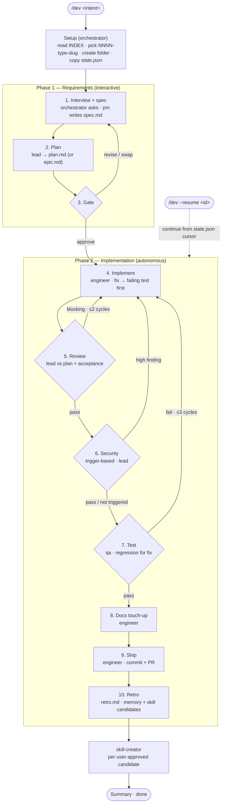

# Workflow

Single entry point: `/dev <intent>` (or `/dev --resume <id>` to pick up an interrupted run). The command detects context (new project vs. existing codebase) and runs the same two-phase flow, branching on **run type** so we don't drag a `chore` through e2e tests or implement a `fix` without first reproducing it. Same artifacts in both cases, written to `.workflow/<id>/`.

> **Orchestration runs in the main agent, not a sub-agent.** Claude Code sub-agents cannot use `Agent` (no nested spawns) or `AskUserQuestion` (sub-agents can't talk to the user). The `/dev` slash command therefore loads [`.claude/orchestrator.md`](.claude/orchestrator.md) and the main agent follows it directly. Sub-agents (`pm`, `lead`, `engineer`, `qa`, `retro`) are spawned from there for file work — they never spawn each other and they never interview the user. The interview step is run by the main agent (orchestrator) and passed to `pm` as input.

## Flow at a glance

The happy path with its three feedback loops (review, security, test). Diamonds are decision points; the dotted edge is the `--resume` re-entry. Phase numbers match the [type-aware matrix](#type-aware-phase-matrix) and the prose below.



## Naming convention

Each run gets an ID: **`NNNN-<type>-<kebab-slug>`**

- `NNNN` — 4-digit sequential counter (`0001`, `0002`, …). `orchestrator` reads `.workflow/INDEX.md` to pick the next number.
- `<type>` — conventional-commits style: `feat` | `fix` | `refactor` | `chore` | `docs` | `spike`
- `<kebab-slug>` — short, ≤5 words, lowercase, hyphen-separated. No dates in the slug — the index tracks dates.

Examples: `0001-feat-todolist-app`, `0002-feat-audit-log`, `0003-fix-login-redirect`, `0004-refactor-auth-middleware`.

## Folder layout

```
.workflow/
├── INDEX.md                       # registry: id, type, title, status, dates
├── FOLLOWUPS.md                   # carry-over items surfaced by past retros
├── _templates/                    # blueprints — copy, don't edit in place
│   ├── spec.md
│   ├── plan.md
│   ├── review.md
│   ├── tests.md
│   ├── security.md
│   ├── recommendations.md          # spike-only deliverable
│   ├── retro.md
│   ├── epic.md
│   └── state.json                  # per-run resume cursor
├── 0001-feat-todolist-app/
│   ├── state.json
│   ├── spec.md
│   ├── plan.md
│   ├── review.md
│   ├── security.md                 # only if security review fired
│   ├── tests.md
│   └── retro.md
└── 0003-fix-login-redirect/
    └── ...
```

Rules:
- One folder per `/dev` run. Never mix two pieces of work in one folder.
- `_templates/` is the source of truth for artifact shape. Copy when starting; never write to it during a run.
- `INDEX.md` is append-only on start, status-updated as phases progress. `retro` writes the `Finished` date.
- `FOLLOWUPS.md` is shared. `retro` appends; `pm` reads on every new interview to ask if any carry-overs are now in scope.
- `state.json` is the per-run cursor. The orchestrator writes it after each step so `/dev --resume <id>` knows where to pick up after a context exhaustion or cancel.
- Parallel work is fine — folder IDs make runs independent. If two features touch the same files, the `lead` flags the conflict in `risks`.

## Artifacts

All artifacts have a template in [`.workflow/_templates/`](.workflow/_templates/). Agents copy the template into the run folder and fill it in — never write freeform.

| File | Owner | Template | Purpose |
|---------|---------------|----------|---------|
| `spec.md` | `pm` | [`_templates/spec.md`](.workflow/_templates/spec.md) | Goal, users, scope, non-goals, acceptance criteria, **Type**, bug-repro (fix), timebox (spike), discovery notes from spec fanout |
| `plan.md` | `lead` (plan mode) | [`_templates/plan.md`](.workflow/_templates/plan.md) | Step-by-step plan, current-state + best-practice research notes, files to touch (`path#anchor`), risks, **rollback** |
| `review.md` | `lead` (review mode) | [`_templates/review.md`](.workflow/_templates/review.md) | Plan-adherence + **acceptance verification** against `spec.md` |
| `security.md` | `lead` (security mode) | [`_templates/security.md`](.workflow/_templates/security.md) | Security findings; only written when the diff trips the sensitive-paths trigger |
| `tests.md` | `qa` | [`_templates/tests.md`](.workflow/_templates/tests.md) | Test plan, regression test (fix), acceptance-criteria mapping, run results |
| `recommendations.md` | `engineer` (spike) | [`_templates/recommendations.md`](.workflow/_templates/recommendations.md) | Spike deliverable — what we learned, recommended next step. Replaces test/ship phases. |
| `retro.md` | `retro` | [`_templates/retro.md`](.workflow/_templates/retro.md) | What worked, what to change, memory + skill candidates, commit/PR refs |
| `epic.md` | `lead` (rare) | [`_templates/epic.md`](.workflow/_templates/epic.md) | Decomposition into slices when `Ship as: staged` + ≥2 capabilities |
| `state.json` | `orchestrator` | [`_templates/state.json`](.workflow/_templates/state.json) | Resume cursor: phase, step, cycle counters |

## Type-aware phase matrix

The same numbered phases run for every type, but `orchestrator` **skips or specializes** some of them based on `Type`. Everything ticked (✓) runs; `skip` means the orchestrator records "skipped — type=<x>" and moves on; `light` means a thinner pass.

| Phase | feat | fix | refactor | chore | docs | spike |
|-------|------|-----|----------|-------|------|-------|
| 1. Interview + spec | ✓ | ✓ | ✓ | ✓ | ✓ | ✓ (timeboxed) |
| 2. Plan | ✓ | ✓ (step 1 = regression test) | ✓ (behavior-equivalence note) | ✓ | ✓ | ✓ (exploration plan) |
| 3. Gate | ✓ | ✓ | ✓ | ✓ | ✓ | ✓ |
| 4. Implement | ✓ | ✓ (write regression test FIRST, then fix) | ✓ | ✓ | ✓ | ✓ (exploration) |
| 5. Review | ✓ | ✓ | ✓ | ✓ | ✓ | light |
| 6. Security review | trigger-based | trigger-based | trigger-based | trigger-based | trigger-based | skip |
| 7. Test | ✓ | ✓ (regression must pass) | ✓ (behavior-equiv check) | skip | skip | skip |
| 8. Docs touch-up | ✓ | optional | optional | optional | ✓ | skip |
| 9. Ship (commit + PR) | ✓ | ✓ | ✓ | ✓ | ✓ | optional (commit only) |
| 10. Retro | ✓ | ✓ | ✓ | ✓ | ✓ | ✓ |

**Security trigger** — phase 6 runs when the diff touches any of: auth/session/token code, password handling, crypto primitives, SQL/query building, raw HTML rendering, file/path handling, exec/shell calls, deserialisation of untrusted input, secret-bearing files (env, config), or new external network endpoints. `orchestrator` decides; `lead` executes in security mode using the inline checklist (no separate skill required).

**Fanout availability** — parallel team-agent fanout is available at phase steps 1 (spec prep / research — condition-based), 2 (plan — condition-based for unclear/high-risk S/M/L existing-code work), 4 (implement), 5 (review — condition-based), 6 (security — opt-in per bucket), and 7 (test — opt-in per category). Spec/plan research uses `team-codebase-explorer` for read-only codebase facts and `team-best-practice-researcher` for current best-practice probes when existing code, APIs, security-sensitive paths, unfamiliar domain terms, or multiple independent research questions make guessing risky; skip it for XS pure-greenfield and straightforward existing-code work. Review fanout uses the six review workers only when the diff is large, cross-module, critical, type/contract/test-sensitive, or uncertain enough to merit independent passes. Pattern + heuristics live in `.claude/skills/fanout-team-agents/SKILL.md`; the embedded team agents are documented in `.claude/agents/TEAM.md`. **Operational note**: Claude Code's agent registry is session-scoped — `team-*.md` files created mid-session (e.g., by `/dev` itself) are not discoverable as `subagent_type=team-<role>` until the session restarts. Until then, the orchestrator uses the inline-fallback path (`subagent_type="general-purpose"` with the worker's role contract read inline). Both paths are documented in the skill and in `.claude/orchestrator.md > Fanout dispatch`.

## Skill routing

The `/dev` workflow uses skills as phase-specific procedural knowledge, not as extra agents. Load the narrowest skill that owns the current decision:

- Conduct on any code task: `coding-discipline` as the behavioral pre-flight before producing or editing code — surface assumptions, keep the change minimal and surgical, set a verifiable goal. It wraps and routes to the skills below; it does not replace them.
- Ambiguous product scope or approach trade-offs: `brainstorming` before `pm` writes `spec.md`.
- Fixes with unknown cause: `debug-fundamentals` before construction skills, then encode the regression in `plan-writing`.
- Construction decisions: `ddd-strategic` first when business language/context boundaries are unclear; then `programming-fundamentals`; then `database-fundamentals`, `hexagonal-backend`, `architecture-fundamentals`, and `queue-fundamentals` only when their layer is actually touched.
- Planning: `plan-writing` when `lead` drafts `.workflow/<id>/plan.md`; it sequences the decisions produced by the construction skills.
- UI work: `ui-ux-pro-max` for UX/design decisions and review, `frontend-design` for implementing polished UI code, and `tailwind-design-system` only for Tailwind v4 shared tokens/components/migration mechanics.
- Parallel research/review/test slices: `fanout-team-agents`, dispatched only by the orchestrator.
- Ship: `git-workflow` before staging, committing, rebasing, or opening a PR.
- Retro skill creation: `skill-creator` only after `retro` proposes a candidate and the user approves it.

Phase numbering below matches the matrix above (1–10) so the gate output, prose, and agent docs all speak the same language. The orchestrator runs a few extra setup actions (read INDEX, pick ID, create folder, copy state.json, append INDEX row) before phase 1; those are internal to the orchestrator, not numbered phases.

## Phase 1 — Requirements (interactive)

1. **Interview + spec** — the **orchestrator (main agent)** reads `FOLLOWUPS.md` first. When existing code, APIs, security-sensitive paths, unfamiliar domain terms, or multiple independent research questions make guessing risky, it fans out spec-prep probes before the interview: `team-codebase-explorer` maps relevant current behaviour/invariants, and `team-best-practice-researcher` gathers focused best-practice constraints. It skips this fanout for XS pure-greenfield work. The orchestrator then uses `AskUserQuestion` (≤4 questions per batch; one batch by default, a bounded dig loop of at most 3 narrowing batches when ambiguity is genuinely high) to capture: goal, users, scope, non-goals, constraints, **Type**, `Ship as`, a measurable NFR target (mandatory binary ask for runtime-shipping feat/fix), a concrete `input → output` example per consequential AC, and whether any open follow-up is now in scope. For `fix`, it also asks for a concrete reproduction. The orchestrator then spawns `pm` with the full Q&A plus fanout findings in the prompt; `pm` writes `spec.md` from the answers — including the `Type` slot, `Discovery notes`, and (for `fix`) a Reproduction section. `pm` itself cannot call `AskUserQuestion` (sub-agent limitation), which is why the interview lives in the main agent.
2. **Plan** — `lead` (plan mode) reads `spec.md`, runs the scope check, then:
   - *New project*: proposes structure + stack in `plan.md`.
   - *Existing code*: may return `FANOUT_REQUESTED: plan:<point-list>` for unclear/high-risk S/M/L plans; orchestrator dispatches `team-codebase-explorer` and `team-best-practice-researcher` per integration point; `lead` synthesises the results into `Current state`, `Research notes`, `Approach`, steps with `path#anchor` references, risks, and verification. Straightforward existing-code plans are written directly.
   - *Fix type*: plan step 1 MUST be "write failing regression test for <bug>".
   - *Refactor type*: includes a behavior-equivalence note (what stays stable, how it gets verified).
   - *Spike type*: plan reads as an exploration outline with a timebox; `Out of scope` calls out "no production code lands from this run".
   - *Epic case* (rare): writes `epic.md` instead and recommends a starting slice.
3. **Gate** — `orchestrator` shows the `spec.md` summary with the **acceptance criteria presented as the contract for per-line confirmation** (each AC + its example, framed "done when each is true — confirm or correct each"), any `Assumptions (inferred from repo — correct any that are wrong)`, the `plan.md` outline (or epic slices), and the type-aware phase list ("will run: 1-2-3-4-6-8-9-10; skipping 5,7 — type=fix, no sensitive paths"). Wait for `approve` / `revise <notes>` / `swap <n>` (epic only). A correction to any AC line or inferred assumption is a `revise`; loop to step 1 with notes.

## Phase 2 — Implementation (autonomous after approval)

4. **Implement** — `engineer` executes `plan.md` step by step using `TaskCreate` to track progress. Marks each task done as it lands. **For `fix` runs, the very first task must be reproducing the bug via a failing test** (engineer writes it as its own commit so qa can verify the fail-on-pre-fix-code contract in phase 7). Before signalling done, engineer ticks each `spec.md > Acceptance criteria` checkbox or files a blocking note explaining why one cannot be ticked.
5. **Review** — `lead` (review mode) reads the diff against `plan.md` AND the `spec.md` acceptance criteria. It may fan out to the six review workers for large, cross-module, critical, type/contract/test-sensitive, or uncertain diffs; otherwise it reviews directly. Writes `review.md`. Blocking issues → `engineer` fixes → re-review (max 2 cycles before escalation).
6. **Security review** — *trigger-based*. If the diff matches the security-trigger list, `orchestrator` spawns `lead` in security mode. Writes `security.md`. Findings of severity `high` are blocking; `medium` and below are non-blocking and carry into `retro.md`. After an engineer fix for a `high` finding, orchestrator re-spawns lead in security mode on the new diff — same trigger, same cycle budget as review.
7. **Test** — `qa` writes/runs unit + integration + e2e, records in `tests.md`. For `fix`, the regression test from step 4 MUST fail on the pre-fix code (engineer should have committed the test separately so qa can `git checkout <fix-commit>^` and re-run; otherwise qa falls back to a scratch branch with the fix reverted) and pass on the current code. For `refactor`, qa runs the existing suite and adds tests only for behaviours that weren't already covered. Acceptance criteria are mapped to specific tests in `tests.md`. Failing tests block step 9 (max 3 fix-retry cycles before escalation). Skipped entirely for `chore` / `docs` / `spike` — qa writes a one-line stub in `tests.md` saying so.
8. **Docs touch-up** — `engineer` updates inline comments where the *why* is non-obvious and any user-facing docs the change actually touches. No new docs unless the spec asked. Light pass for `fix`/`refactor`/`chore`; skipped for `spike`.
9. **Ship** — `engineer` in ship mode stages the changed files, writes a commit message referencing the run ID + spec goal, and (if the repo has a remote and the user opted in at the gate) opens a PR. The commit hash + PR URL are recorded in `state.json` and lifted into `retro.md`. Skipped for `spike` unless the user explicitly asks to commit the exploration.
10. **Retro** — `retro` reads `plan.md` + `review.md` + `security.md` (if any) + `tests.md` + diff + commit, writes `retro.md`. Appends any new follow-ups to the shared `FOLLOWUPS.md` and marks any consumed ones closed. Surfaces *memory candidates* (facts) and *skill candidates* (procedures) for user confirmation. The orchestrator then asks the user which skill candidates to actually create and spawns `skill-creator` for each approved item. After this step the orchestrator prints the final summary (artifacts written, files changed, commit hash, PR URL, open follow-ups, skills created) — that summary is the run's terminator, not its own numbered phase.

After every step, `orchestrator` updates `.workflow/<id>/state.json` with `phase`, `step`, and the relevant `cycle` counter. If the session dies mid-run, `/dev --resume <id>` reads `state.json` and continues from the next step.

## Scope: when to split (rare path)

**Default**: one `/dev` run, regardless of file count, step count, or layers touched. Crossing DB + API + UI is normal full-stack work, NOT a reason to split.

`lead` enters epic mode **only when both are true**:
1. The spec lists ≥ 2 capabilities that can ship to users independently, **and**
2. `Ship as: staged` is set in `spec.md` — the user explicitly wants separate releases.

If only one is true → one `plan.md`. If the plan ends up heavy (say >15 steps), note it in `plan.md > Risks` ("scope is on the larger side, watch for fatigue") — **do not split**.

The `Ship as` answer is captured in the Phase 1 interview and recorded in `spec.md` frontmatter. It's the user's call, not the planner's.

### Epic mode flow

1. `lead` writes [`epic.md`](.workflow/_templates/epic.md) (decomposition into 2–5 vertical slices) instead of `plan.md`. Each slice must be independently shippable.
2. `INDEX.md` status for this ID = `epic`. No implementation runs against this folder.
3. `lead` recommends a starting slice and opens a child `/dev` run (e.g., `0006-feat-audit-viewer`) with `Parent: 0005-feat-audit-system` in its `spec.md`.
4. Remaining slices are separate `/dev` runs later. Each references the same parent.
5. User can `swap <n>` at the gate to pick a different slice as the first one.

## Agent map

Five sub-agents drive the file work. The **orchestrator is not a sub-agent** — it's the role the main agent plays when `/dev` runs, following [`.claude/orchestrator.md`](.claude/orchestrator.md). Several sub-agents have multiple modes so the count stays low.

| Role | Where it runs | Phase steps | Reads | Writes | Primary tools |
|------|---------------|-------------|-------|--------|---------------|
| `orchestrator` | main agent (`/dev` slash command) | drives all + runs the interview | user input, INDEX, FOLLOWUPS, state.json | INDEX status, state.json, follow-up cursor | `AskUserQuestion`, `Agent`, `Bash` |
| `pm` | sub-agent | 1 (spec) | intent + interview Q&A passed in prompt + FOLLOWUPS | `spec.md` | `Read`, `Write` |
| `lead` | sub-agent | 2 (plan), 5 (review), 6 (security) | `spec.md`, codebase, diff | `plan.md` / `epic.md`, `review.md`, `security.md` | `Read`, `Grep`, `LSP`, `Write`, `Edit` |
| `engineer` | sub-agent | 4 (implement), 8 (docs), 9 (ship) | `plan.md`, `spec.md`, diff | source, inline comments, commit, PR | `Read`, `Edit`, `Write`, `Bash`, `LSP`, `TaskCreate` |
| `qa` | sub-agent | 7 | `plan.md`, `spec.md`, source, diff | tests + `tests.md` | `Read`, `Write`, `Bash`, `LSP` |
| `retro` | sub-agent | 10 | all artifacts + diff + existing memory/skills + FOLLOWUPS | `retro.md`, INDEX status, FOLLOWUPS append | `Read`, `Write`, `Edit`, `Bash` |
| `team-*` agents | sub-agents (workers) | dispatched from fanout phases (steps 1, 2, 4, 5, 6, 7) | the spec question / codebase area / best-practice question / diff slice / bucket / path range the orchestrator scopes them to | findings (returned to the calling /dev sub-agent for synthesis; no artifact write) | varies by worker — see `.claude/agents/TEAM.md` |

Sub-agent constraints (enforced by Claude Code, not optional):
- Sub-agents cannot spawn other sub-agents (`Agent` is filtered out at runtime).
- Sub-agents cannot call `AskUserQuestion` — any user prompt has to come from the main agent. Sub-agents that hit ambiguity return a `BLOCKER:` line and the orchestrator surfaces the question.

External: when `retro` surfaces skill candidates and the user approves, the orchestrator (main agent) invokes the `skill-creator` skill (built-in) for each approved candidate. The handoff is explicit — no candidate is created silently.

**Anti-bias rule** — because `lead` reviews the plan they wrote, review mode is checklist-driven (one row per plan step, one row per acceptance criterion, one verification per file). "Looks good overall" is banned.

## Example: `/dev create todolist app`

Phase 1 → interview → `spec.md` (Type=feat, CRUD tasks, single user, no auth, localStorage) → `lead` proposes Vite + React + TS scaffold → `plan.md` (10 steps) → **gate** (will run 1-2-3-4-5-7-8-9-10; skip 6 — no sensitive paths) → `approve`.
<!-- step 6 = security review; localStorage-only spec has no auth/SQL/secrets so the trigger doesn't fire -->

Phase 2 → scaffold → implement (engineer ticks acceptance) → review → tests pass → docs → commit + PR → `retro.md` → user approves one skill candidate (`react-vite-bootstrap`) → `skill-creator` runs → done.

## Example: `/dev fix login redirect loop`

Phase 1 → interview → `spec.md` (Type=fix, reproduction = "log in from /admin, lands back on /login") → `lead` writes `plan.md` with step 1 = "add failing test `auth.spec.ts:redirect-loop`" and step 2 = "fix the redirect" → **gate** (will run 1-2-3-4-5-6-7-9-10; security review on — diff touches auth; skip 8 — docs not in scope) → `approve`.
Phase 2 → engineer writes failing test → engineer fixes redirect → review → security review (passes) → qa confirms regression test fails on pre-fix code, passes now → docs skipped → commit (no PR — flagged at gate) → `retro.md` → done.

## Example: `/dev spike compare bullmq vs sidekiq`

Phase 1 → interview → `spec.md` (Type=spike, timebox=1 day, deliverable=recommendation) → `lead` writes exploration plan → **gate** (will run 1-2-3-4-5-10; skip 6-7-8 always, skip 9 unless user opts to commit) → `approve`.
Phase 2 → engineer explores both → writes `recommendations.md` → light review → `retro.md` → user decides whether to open follow-up `feat` runs.

## Stop conditions

- User says `revise` at the gate → back to step 1.
- Reviewer blocking issues → fix → re-review, max 2 cycles, then escalate.
- Security review `high` finding → fix → re-review, counts against the review cycle budget.
- Test failures → fix → re-run, max 3 cycles, then escalate.
- Any agent unsure → stop and ask user, never invent requirements.
- Context exhaustion / cancel → next `/dev --resume <id>` reads `state.json` and continues from the recorded step.
