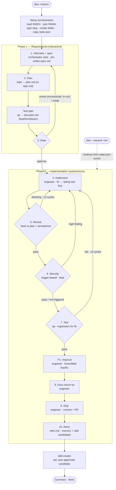

# Workflow

A spec-driven, two-phase pipeline (interview → plan → human gate → autonomous build) that scales its machinery to the work: think before coding, simplify first, change surgically, drive toward the spec's goal.

**Version 2.5.2** — tracks the release in [`VERSION`](VERSION) (source of truth) and [`CHANGELOG.md`](CHANGELOG.md).

Primary entry point: `/dev <intent>` (or `/dev --resume <id>` to pick up an interrupted run). The command detects context (new project vs. existing codebase) and runs the same two-phase flow, branching on **run type** so we don't drag a `chore` through e2e tests or implement a `fix` without first reproducing it. Same artifacts in both cases, written to `.workflow/<id>/`.

**Team mode** ([below](#team-mode--run-one-role-on-its-own)) splits that same flow into role-scoped commands — `/spec` (pm), `/dev-plan` (lead), `/test-plan` (qa), `/uxui-plan` (uxui), `/implement` (Phase 2) — so a team can divide the work by role. Each writes into the **same** `.workflow/<id>/` run and shares the gate, so the artifacts compose exactly as the one-shot `/dev` run produces them, and `/dev --resume <id>` (or `/implement`) carries a hand-assembled run the rest of the way.

> **Orchestration runs in the main agent, not a sub-agent.** A Claude Code sub-agent **cannot call `AskUserQuestion`** (it can't talk to the user), so the `/dev` slash command loads [`.claude/orchestrator.md`](.claude/orchestrator.md) and the main agent runs the interview + drives the flow. Sub-agents (`pm`, `lead`, `engineer`, `qa`, `retro`) do the file work. **Fan-out has two paths:** the splittable agents (`pm`, `lead`, `qa`, `engineer`, and the self-splitting `team-*` workers) hold `Agent` and **spawn their own helpers directly** when their work is large (direct nesting, Claude Code v2.1.172+); the orchestrator-mediated `FANOUT_REQUESTED:` signal is the fallback (and the path for background implement-fanout). `state.json` stays single-writer (the orchestrator) regardless — helpers never write it.

## Flow at a glance

One picture of the whole run, so the rest of the doc has a shared map. The happy path with its three feedback loops (review, security, test): diamonds are decision points, the dotted edge is the `--resume` re-entry, and phase numbers match the [type-aware matrix](#type-aware-phase-matrix) and the prose below.



## Naming convention

A stable, sortable run ID so every artifact, index row, and resume cursor points at the same run. Each run gets an ID: **`NNNN-<type>-<kebab-slug>`**

- `NNNN` — 4-digit sequential counter (`0001`, `0002`, …). `orchestrator` reads `.workflow/INDEX.md` to pick the next number.
- `<type>` — conventional-commits style: `feat` | `fix` | `refactor` | `chore` | `docs` | `spike`
- `<kebab-slug>` — short, ≤5 words, lowercase, hyphen-separated. No dates in the slug — the index tracks dates.

Examples: `0001-feat-todolist-app`, `0002-feat-audit-log`, `0003-fix-login-redirect`, `0004-refactor-auth-middleware`.

## Folder layout

Where each run lives on disk — one self-contained folder per run, plus the shared registry and templates.

```
.workflow/
├── INDEX.md                       # registry: id, type, title, status, dates
├── FOLLOWUPS.md                   # carry-over items surfaced by past retros
├── _templates/                    # blueprints — copy, don't edit in place
│   ├── spec.md
│   ├── plan.md
│   ├── test-plan.md
│   ├── uxui-plan.md                # team-mode UX plan (/uxui-plan, UI work)
│   ├── review.md
│   ├── tests.md
│   ├── security.md
│   ├── recommendations.md          # spike-only deliverable
│   ├── retro.md
│   ├── epic.md
│   └── state.json                  # per-run resume cursor
├── 0001-feat-todolist-app/
│   ├── state.json
│   ├── spec.md
│   ├── plan.md
│   ├── test-plan.md                # design-time test strategy (feat/fix/refactor)
│   ├── review.md
│   ├── security.md                 # only if security review fired
│   ├── tests.md
│   └── retro.md
└── 0003-fix-login-redirect/
    └── ...
```

Rules:
- One folder per `/dev` run — never mix two pieces of work in one folder.
- `_templates/` is the source of truth for artifact shape: copy when starting, never write to it during a run.
- `INDEX.md` is append-only on start, status-updated as phases progress; `retro` writes the `Finished` date.
- `FOLLOWUPS.md` is shared — `retro` appends, `pm` reads on every new interview to ask if any carry-overs are now in scope.
- `state.json` is the per-run cursor the orchestrator writes after each step, so `/dev --resume <id>` knows where to pick up after a context exhaustion or cancel.
- Parallel runs are fine (folder IDs make them independent); if two features touch the same files, `lead` flags the conflict in `risks`.

## Artifacts

All artifacts have a template in [`.workflow/_templates/`](.workflow/_templates/). Agents copy the template into the run folder and fill it in — never write freeform.

| File | Owner | Template | Purpose |
|---------|---------------|----------|---------|
| `spec.md` | `pm` | [`_templates/spec.md`](.workflow/_templates/spec.md) | **Outcome** (before → after → benefit), users, scope, non-goals, acceptance criteria, **Type**, bug-repro (fix), timebox (spike), discovery notes from spec fanout |
| `plan.md` | `lead` (plan mode) | [`_templates/plan.md`](.workflow/_templates/plan.md) | **Outcome** (before → after → benefit), **phases for this task** (matrix defaults + any justified deviation), step-by-step plan, current-state + best-practice research notes, **scaffold skeleton** (file tree + key signatures, M/L), files to touch (`path#anchor`), risks, **rollback** |
| `test-plan.md` | `lead` combined mode (XS/S) or `qa` (M/L test-plan mode) | [`_templates/test-plan.md`](.workflow/_templates/test-plan.md) | **Design-time test strategy** (feat/fix/refactor) — coverage plan (level per AC), edge cases to probe, out-of-test-scope, fixtures/data/env, regression contract (fix) / baseline (refactor, or a brownfield feat editing uncovered existing behaviour), coverage targets. Authored after `plan.md` (**folded into the combined `lead` spawn at XS/S; separate `qa` spawn at M/L**), **signed off at the gate**; `qa` executes it at the test phase |
| `uxui-plan.md` | `uxui` (team mode) | [`_templates/uxui-plan.md`](.workflow/_templates/uxui-plan.md) | **Design-time UX plan** for UI-bearing work — Scenes (screens/states), ASCII wireframes, Scenarios (user flows), UX direction & components, AC↔scene mapping. Written by the `/uxui-plan` team-mode command (not part of the linear `/dev` state machine); `frontend-design` builds from it and `qa > Visual verification` checks against it |
| `review.md` | `lead` (review mode) | [`_templates/review.md`](.workflow/_templates/review.md) | Plan-adherence + **acceptance verification** against `spec.md` |
| `security.md` | `lead` (security mode) | [`_templates/security.md`](.workflow/_templates/security.md) | Security findings; only written when the diff trips the sensitive-paths trigger |
| `tests.md` | `qa` (execute mode) | [`_templates/tests.md`](.workflow/_templates/tests.md) | **Test execution record** — acceptance-criteria mapping (actual tests), run results, regression verification (fix), measured per-level diff coverage, edge-case gaps found. Executes the strategy from `test-plan.md` |
| `recommendations.md` | `engineer` (spike) | [`_templates/recommendations.md`](.workflow/_templates/recommendations.md) | Spike deliverable — what we learned, recommended next step. Replaces test/ship phases. |
| `retro.md` | `retro` | [`_templates/retro.md`](.workflow/_templates/retro.md) | What worked, what to change, memory + skill candidates, commit/PR refs |
| `epic.md` | `lead` (rare) | [`_templates/epic.md`](.workflow/_templates/epic.md) | Decomposition into slices when `Ship as: staged` + ≥2 capabilities |
| `state.json` | `orchestrator` | [`_templates/state.json`](.workflow/_templates/state.json) | Resume cursor: phase, step, cycle counters, run timestamps (`created_at` at setup, `last_updated` per step, `done_at` just before the retro spawn so the build→ship duration is exact) |

## Optional artifact gate

An off-by-default structural check for when you want to confirm a run's artifacts are template-complete and placeholder-free. [`.claude/hooks/artifact-lint.sh`](.claude/hooks/artifact-lint.sh) validates a run's artifacts against the templates. It is *not* wired into the `/dev` state machine — it does not run automatically and never blocks a tool call. Invoke it by hand, in a pre-commit step, or in CI.

```sh
sh .claude/hooks/artifact-lint.sh .workflow/<id>/
```

What it checks, per directory:

- **Required sections** — `spec.md` must declare a `**Type**:` and an `## Acceptance criteria` section; `plan.md` must have a fenced `mermaid` block, at least one inline AC tag (`[AC<n>]` or `[DoD]`), and a runnable verify section (a `verify:` clause).
- **No leftover placeholder markers** — `TODO`, `TBD`, `FIXME`, `lorem` (word markers, case-insensitive) and `<...>` angle-bracket placeholders, in any recognised artifact. A marker that sits inside an inline code span (backticks) or a fenced code block is treated as documentation/example syntax and ignored — only bare-prose markers are flagged, so an artifact that *documents* the markers still passes.

It prints a per-check report (`[OK]` / `[FAIL] <file>:<line>: …`) and **exits non-zero on any failure, zero when clean** (and non-zero if the path is missing/empty or holds no recognised artifact). Dependency-light: POSIX `sh` + the base `grep`/`awk` toolchain, no new packages, and it does not read `.workflow/_templates/` at runtime (the rules are encoded in the script) so it works in an adopting repo that installs `.workflow/` without the templates. Its fixtures test suite is [`.claude/hooks/tests/run-artifact-lint-tests.sh`](.claude/hooks/tests/run-artifact-lint-tests.sh).

## Type-aware phase matrix

Type decides *which* phases run, so a `chore` isn't dragged through e2e and a `fix` reproduces before it changes anything. The same numbered phases run for every type, but `orchestrator` **skips or specializes** some based on `Type`: ✓ runs, `skip` records "skipped — type=<x>" and moves on, `light` is a thinner pass.

| Phase | feat | fix | refactor | chore | docs | spike |
|-------|------|-----|----------|-------|------|-------|
| 1. Interview + spec | ✓ | ✓ | ✓ | ✓ | ✓ | ✓ (timeboxed) |
| 2. Plan | ✓ | ✓ (step 1 = regression test) | ✓ (equivalence note; baseline-capture step 1 if coverage thin) | ✓ | ✓ | ✓ (exploration plan) |
| 2½. Test plan | ✓ | ✓ (regression contract) | ✓ (baseline contract) | skip | skip | skip |
| 3. Gate | ✓ | ✓ | ✓ | ✓ | ✓ | ✓ |
| 4. Implement | ✓ | ✓ (write regression test FIRST, then fix) | ✓ | ✓ | ✓ | ✓ (exploration) |
| 5. Review | ✓ | ✓ | ✓ | ✓ · skip @XS | ✓ · skip @XS | light |
| 6. Security review | trigger-based | trigger-based | trigger-based | trigger-based | trigger-based | skip |
| 7. Test | ✓ | ✓ (regression must pass) | ✓ (verify behaviour vs captured baseline) | skip | skip | skip |
| 7½. Improve | ✓ (brownfield only) | optional (brownfield, light) | skip (the refactor *is* the improvement) | skip | skip | skip |
| 8. Docs touch-up | ✓ | optional | optional | optional | ✓ | skip |
| 9. Ship (commit + PR) | ✓ | ✓ | ✓ | ✓ | ✓ | optional (commit only) |
| 10. Retro | ✓ | ✓ | ✓ | ✓ | ✓ | ✓ |

### Review at XS for `chore`/`docs` — default skip

A `chore`/`docs` change sized **XS** (one file, pure text/config, no behaviour surface) skips phase 5 by default — the lint hook and the gate's per-line AC confirmation already cover it. The gate's run-plan line shows it (`review:type=<chore|docs>@XS`); `run 5` keeps the pass. This is a **size×type matrix default** (shown like any type-skip, not a per-line deviation needing sign-off): `chore`/`docs` at **S or larger** still review (✓), every other type reviews at XS, and the orchestrator enforces it at the Review phase (`orchestrator.md` Phase-plan guard).

### Test plan

Phase 2½ is the design-time half of testing: `test-plan.md` captures the coverage plan, edge cases, fixtures, and regression/baseline contract right after `plan.md`; the gate signs it off and phase 7 (`qa` execute mode) runs it. It runs for exactly the types whose phase-7 test runs — `feat`/`fix`/`refactor` — and is skipped for `chore`/`docs`/`spike`. Numbered 2½ (folds into the Plan slot, surfaced at the Gate) rather than renumbering 3–10. **At XS/S the combined `lead` spawn writes `spec.md` + `plan.md` + `test-plan.md` in one pass**; at M/L a separate `qa` test-plan spawn writes it. Orchestrator-inline authorship is only a fallback for legacy/resume or targeted-revise cases.

### Greenfield vs brownfield (the `field`)

Orthogonal to type and size, every run is classified **greenfield** (new, isolated code — nothing imports it, no published contract, no integration, first-party storage only; always XS/S) or **brownfield** (modifies/extends existing behaviour or wires into existing code — the default; every `fix`/`refactor` and every M/L run is brownfield). The orchestrator records `field` in `state.json` at the digest; `lead` re-derives it at plan time and ratchets greenfield → brownfield (one-way) via a `FIELD_UPGRADE: brownfield` signal if the code walk reveals an integration. It is what gates the **brownfield discipline of understand → lock → change → improve**: brownfield turns on the `Current state` map (understand — `plan-writing > principle 3`), the characterization baseline (lock — `test-plan.md > Baseline` for feat/refactor; `fix` locks via its regression contract), and the improve phase below; greenfield skips all three ("nothing to preserve"). Canonical definition: `plan-writing > references/size-tiering.md > Greenfield vs brownfield`.

### Improve phase

Phase 7½ is the **improve** of understand → lock → change → improve: after the test phase passes, `engineer` (Mode D) makes a **bounded, behaviour-preserving, simplify-first** cleanup of *only the code this run changed to deliver spec/plan* — the footprint `plan.md` declared (`Files touched`); the scope is **spec/plan's, not the engineer's to extend** (pre-existing code the change merely *exposed* is a follow-up) — then re-runs the suite (green-or-revert). **Simplify first:** a simplification pass leads (the `team-code-simplifier` lens — shorten a long function, drop duplication/dead branches, flatten a tangled conditional), *then* lower-stakes cosmetics (rename, tighten a type). Reducing complexity is the point; cosmetics ride second. **Commit handling is type-aware:** a `fix` (already committed, clean tree) gets a separate `[improve]` commit; a `feat` (uncommitted until ship — the only such type that reaches this phase) leaves the edits in the working tree for ship to fold into the single run commit (the engineer must NOT commit here, or it would sweep up the uncommitted feature). It runs for a **brownfield `feat`** (and, lightly and optionally, a brownfield `fix`); `refactor` skips it (the refactor *was* the improvement), as do greenfield/chore/docs/spike. A `nothing to improve` no-op is normal. Because the diff is behaviour-preserving and re-verified green it does **not** re-trigger review or test — **security re-runs only if the cleanup touched a security sink** (a green suite is not a sufficient net on that axis). Safety contract: bounded scope + behaviour-preserving + the re-verified green suite (+ that security re-scan; + an independently-revertable commit for `fix`); anything that would spread beyond the touched code is deferred to a follow-up `refactor` run, never widened in place. Numbered 7½ (mirroring the 2½ slot). Discretionary (the gate can `skip 7½`) and the lowest-stakes one — a skip carries no contract waiver.

### Security trigger

Phase 6 runs when the diff touches any of: auth/session/token code, password handling, crypto primitives, SQL/query building, raw HTML rendering, file/path handling, exec/shell calls, deserialisation of untrusted input, secret-bearing files (env, config), or new external network endpoints. **Not a trigger on its own — first-party browser-storage round-trip:** the app reading back its own single-user `localStorage`/`sessionStorage`/`IndexedDB` data via `JSON.parse` is *not* untrusted deserialisation and does not fire phase 6 — **provided** the diff has no dangerous sink (`innerHTML`/`outerHTML`/`insertAdjacentHTML`/`document.write`/`eval`/`Function`/`dangerouslySetInnerHTML`/jQuery `.html()`/ any other HTML-injection sink — the list is **open, not closed**); the presence of any such sink is itself a "raw HTML rendering" trigger and fires regardless. It also fires when the stored data crosses a real trust boundary: a multi-user or shared-device threat model is in scope, or the data is written by a server or another principal. `orchestrator` decides; `lead` executes in security mode using the inline checklist (no separate skill required).

### E2E + visual (opt-in)

Browser-based **e2e** and the **visual + a11y verification** pass are **off by default**, turned on per-run via the `e2e_visual` flag (`state.json > e2e_visual`, default `off`). The orchestrator asks a binary opt-in in the interview for feat/fix that ship a UI surface and surfaces it at the gate (`e2e on|off` lever); a still-unset flag resolves to `off` at approve. **Why opt-in:** a browser run's wall-clock is dominated by installing the browser binary and slow journeys, while unit/integration over jsdom/happy-dom already cover UI *logic* without a browser. **Effect:** `off` → the test phase plans/runs **unit + integration only** (a user-observable journey maps to the integration level), with **no e2e level, no Visual verification plan/pass, no e2e coverage floor, and no browser install**; `on` → the full browser path (e2e where a journey owns the behaviour, the visual/a11y pass reusing one browser session, the e2e floor). `chore`/`docs`/`spike` skip the test phase regardless. Canonical effect on the test steps: `qa.md > e2e_visual`.

### Per-task phase plan (deviation from the matrix)

The matrix is the **default, not the final word**. `lead` (plan mode) writes a reasoned **`## Phases for this task`** block in `plan.md` that starts from the matrix and may **deviate** when a discretionary phase isn't needed. Four phases are **discretionary**: **5 Review**, **7 Test**, **7½ Improve**, **8 Docs** (7½ Improve is itself matrix-gated to brownfield `feat`/`fix` — a deviation only applies where the matrix would run it). A disposition that turns a matrix-`✓` into `light`/`skip` is a **deviation**: the block tags it `(deviates from matrix)` with a one-line justification. No deviation → one line (`Matrix defaults for type=<T> — no deviations.`).

**Protected — never deviatable, at any size, even with user confirmation:** **1 Interview + spec**, **2 Plan**, **3 Gate**, the **6 security-trigger *check*** (the trigger scan always runs; the plan may *predict* whether it fires but never suppress it), and **10 Retro** — plus state-discipline writes and the per-line AC confirmation. Implement (4) and Ship (9) aren't discretionary either (implement is the work; ship/PR is governed by `Ship as` + the gate's PR question).

**The gate owns the deviation, not the plan.** Every deviation is surfaced at the gate for **explicit per-line confirmation** (like `Hard-to-reverse decisions`); it does **not** ride a plain `approve`. `lead` proposes, the user disposes. Levers: `approve | skip <n> | run <n> | revise <notes>` — `skip <n>`/`run <n>` flip a discretionary phase's disposition directly (a `skip` of a protected phase is refused). Approved dispositions land in `state.json > phase_plan` (keyed `review`/`test`/`improve`/`docs` → `run|light|skip`; empty `{}` = matrix defaults), and Phase 2 honours them: a skipped phase is recorded in `skipped_steps` as `<phase>:per-task-plan (user-approved)` and not run. **Skipping `7 Test` on `fix`/`refactor` also waives that type's regression/baseline contract** — made explicit at the gate, so it carries the highest justification bar. Skipping `7½ Improve` waives nothing (pure behaviour-preserving cleanup) — the lowest-stakes deviation.

This subsection is the **canonical definition**; `plan.md` (the section), `lead.md` (authoring), and `orchestrator.md` (the gate + Phase-2 honouring) point here rather than restating it.

### Fanout plan (declared in the plan, signed off at the gate)

`/dev` is single-pass-first (`orchestrator.md > Single-pass-first`); the **Fanout plan** makes that stance explicit and gated — the sibling of the per-task phase plan above. `lead` declares the planned fanout strategy (single-pass by default, fanout only where the work clears the cost bar) in a `## Fanout plan` block in `plan.md`, the gate surfaces it for sign-off, and `state.json` records both the gated intent and the runtime outcome.

**What `lead` declares** — one row per **gate-authorized Phase-2 fanout phase**: **Review** (the 6 lenses), **Security** (per threat bucket), **Test** (per category), **Implement** (per parallelizable feat phase). These are what the gate is about to authorize for Phase 2, so they are what the user can steer. Each row: `Fanout` (yes/no) · `Workers (×N)` · `Reason`. Review/security/test rows are *predictions* (no diff exists yet) from the planned scope; the **Implement** row is **derived from the `Parallelizable: yes` phase markers in `## Steps`** — it mirrors them (those markers are the single source of truth the runtime reads), never an independent claim. **Plan-fanout and spec-prep-fanout run *before* the gate** (steps 8 and 6), so they aren't gate-steerable or in this table — their provenance lives in `## Research notes` / `spec.md > Discovery notes`, and their outcome is still in `fanout_log` (telemetry, below).

```
## Fanout plan
| Phase     | Fanout | Workers (×N)          | Reason          |
|-----------|--------|-----------------------|-----------------|
| Review    | yes    | 6 review lenses ×1    | cross-module    |
| Security  | yes    | code-reviewer ×2      | 2 buckets trip  |
| Test      | no     | —                     | 1 category      |
| Implement | no     | —                     | no ∥ phases     |
```

At XS / pure-greenfield / a single straightforward change the whole block is one line — `No fanout — single-pass (XS).`

**Same worker, N instances — horizontal scaling is first-class.** A fanout is **not** one-of-each-worker. The plan-prep, security, and test axes spawn **N copies of the *same* `team-*` worker** — one per independent unit (one `team-codebase-explorer` per integration point, one `team-code-reviewer` per security bucket, one `team-pr-test-analyzer` per test category), which is what the `×N` column records. Only Review spawns six *different* lenses ×1. Cap the total at **6 concurrent** and group beyond it; never spawn N for N's sake. **For the plan-prep (codebase-explorer) axis, "independent unit" means a *disjoint surface* — a separate module/folder/repo, not raw integration-point count:** two points inside one cohesive module is a single serial `lead` walk; the parallel cold-start only repays when surfaces are genuinely separate (the multi-repo control-plane run is the canonical strong case). Canonical trigger: `orchestrator.md` Phase-1 step 8.

**The gate owns it.** Surfaced alongside the phase plan; levers `fanout <phase> on` / `fanout <phase> off`, recorded in `state.json > fanout_plan.<review|security|test|implement>`. `off` forces single-pass; `on` forces the fanout even when the runtime heuristic would skip it (the user accepts the cost). A gated `on`/`off` is a **soft-guardrail override only** — it cannot defeat: (a) the **hard feasibility guardrails** — a forced `on` can't split work that isn't independent, and `fanout implement on` only **re-enables** parallel phases the plan already declared, never manufactures them; (b) the **size-tier machinery** — a forced `fanout review on` on an XS/S run (where review-fanout is refused as too heavy for the tier) becomes a `SIZE_UPGRADE` prompt, not a silent honour. When a forced `on` is blocked either way, surface it and record the blocked outcome in `fanout_log` (`fired:false, path:single, reason:"forced-on blocked: <guardrail>"`). **Runtime can still diverge from a signed-off prediction:** a phase approved `Fanout: yes` may still run single-pass (e.g. the diff turned out small) — the **runtime heuristic wins and the divergence is logged** (not re-surfaced at the gate; a forced `on` pins it). Absent a gated entry, the runtime heuristic decides (`orchestrator.md > Where fanout fires`).

**Telemetry — the outcome is recorded.** Every fanout point appends one entry to `state.json > fanout_log` as part of that step's terminal write (re-read the array and append — never regenerate from memory, same discipline as `impl_phases_done`): `{phase, eligible, fired, path, n, reason}`, keyed by **phase name**, `path` ∈ `direct` (self-dispatched direct-nesting, primary) / `signal` (`FANOUT_REQUESTED:` fallback) / `single` (no fanout). The log is **broader than the gated `fanout_plan`** — it records *every* fanout point, including `spec-prep` (step 6) and `plan` (step 8) that run before the gate, plus the four gate-steerable phases. `retro` surfaces it so under-firing is a measurable finding, not a vibe, and a gated-intent-vs-outcome divergence shows up with its reason.

**Registry & dispatch.** Whether a fanout runs as live `team-*` spawns or the inline `general-purpose` fallback is the **registry preflight** decision, made once per run and recorded in `state.json > team_registry` (`orchestrator.md > Fanout dispatch > Registry preflight`); a registry miss never downgrades a planned fanout to single-pass. Direct nesting (the worker self-dispatches its helpers, no orchestrator re-spawn) is the **primary** path for read/research fanout; the `FANOUT_REQUESTED:` signal is the fallback + background-implement path (`fanout-team-agents > Two dispatch paths`).

This subsection is the **canonical definition**; `plan.md` (the section), `lead.md` (authoring), `orchestrator.md` (the gate lever + telemetry + dispatch), and `retro.md` (surfacing the log) point here rather than restating it.

## Size-aware execution matrix

Type decides *which* phases run; **size decides how much machinery each phase gets** — the same contract, scaled. The orchestrator estimates size (XS/S/M/L — picker in `plan-writing > references/size-tiering.md`) right after the requirements digest and records it in `state.json`; for borderline or operationally risky work the same reference has a scorecard fallback (layers, data, cache, deploy, observability, security, test scope) that calibrates without replacing the hard picker overrides. The plan's `Size` field is a different knob: it governs plan *section gating* and `lead` sets it from the code walk (smaller than the estimate is fine), while `state.json > size` governs *machinery* and only moves up — a larger plan `Size` is a `SIZE_UPGRADE` signal, a smaller one never shrinks the machinery mid-run.

| Step | XS | S | M / L |
|------|----|---|-------|
| Setup + interview questions | one merged batch (≤4 questions) | one merged batch | setup batch + interview batch (+ bounded dig loop) |
| Spec + plan | one `lead` spawn (combined mode, `pm` skipped), no prep fanout | same as XS | `pm` + `lead` spawns, prep fanout default when independent points exist |
| Test plan (feat/fix/refactor) | folded into combined `lead` spawn | folded into combined `lead` spawn | `qa` test-plan spawn |
| Gate (per-line AC confirm) | full | full | full |
| Implement | one `engineer` spawn | one spawn | one spawn (+ parallel-phase fanout: default when the **L-tier** feat plan declares disjoint phases) |
| Review | `lead` sonnet, fanout refused (skipped for `chore`/`docs` at XS — size×type default) | sonnet, fanout refused | sonnet by default; M may use core 3-lens fanout when justified; L/high-stakes may use opus + full 6-lens |
| Security review | trigger-based (unchanged) | trigger-based | trigger-based |
| Test | per type matrix (unchanged; coverage floor accounting can be deferred) | per type matrix (unchanged; coverage floor accounting can be deferred) | per type matrix (+ category fanout only when suite splits enough to repay coordination) |
| Improve (brownfield feat/fix) | rarely applies — trivial diff / greenfield skips | `engineer` Mode D, light pass | `engineer` Mode D |
| Docs + ship | one merged `engineer` spawn | one merged spawn | two spawns |
| Retro | inline (orchestrator writes `retro.md`) | `retro` spawn, light pass | `retro` spawn, full |

**Never shrinks at any size:** the interview (merged, not skipped) · the gate + per-line AC confirmation · `state.json` discipline · the security trigger check · the type matrix. **Upgrades are one-way:** any worker can return `SIZE_UPGRADE: <S|M|L> — <reason>` as its first line; the orchestrator re-records `size` and runs the remaining steps with the bigger tier's machinery. Size never moves down mid-run. Mechanics: `.claude/orchestrator.md > Size-aware execution`.

**Patch lane (XS subtype)** — the "tiny but still worth tracking" case: one file per touched surface, no runtime behaviour surface, no persisted data / API / schema / dependency / security-sensitive path, no executable test surface, no cross-repo coupling. The run `Type` stays `chore`/`docs` (or another type only when `lead` proves no executable behaviour changes); `size` stays `XS`, and the contract still has a digest, one merged confirmation batch, gate, state writes, and security-trigger check. A **wide-but-shallow multi-repo sweep** — the same trivial independent edit across N repos, one file per repo, no shared contract — stays patch-lane, sized by the deepest single repo surface; repo count alone doesn't make it M/L. What shrinks is the machinery: combined `lead` writes compact artifacts, phase 5 review and phase 7 test default to skipped, the skipped-test stub is inline, docs+ship are merged, retro is inline. A worker that discovers executable behaviour, a contract change, multiple files in one repo, cross-repo coupling, or integration risk returns `SIZE_UPGRADE: S` and the run leaves the patch lane.

**Fanout availability** — `/dev` is **single-pass-first** (canonical stance: `.claude/orchestrator.md > Single-pass-first`): a phase *defaults* to one sequential pass and fans out only when its sub-investigations are independent, disjoint, AND substantial enough to repay the coordination + N× cold-start cost. Fanout points: spec-prep/research (step 1), plan (2), implement (4 — feat-only, one write-only `engineer` per disjoint `Parallelizable: yes` phase, then a sequential integration engineer; phase-granular resume via `state.json > impl_phases_done`), review (5 — lens fanout, tiered: core 3 at M, full 6 at L/high-stakes), security (6 — per bucket), test (7 — per category); the **per-size defaults are the fanout cells in the matrix above**. The **gate-steerable subset** (review/security/test/implement) is the canonical `### Fanout plan` above; per-step runtime heuristics + registry handling are `.claude/orchestrator.md > Where fanout fires` / `> Registry preflight`; pattern + worker roster live in `.claude/skills/fanout-team-agents/SKILL.md` and `.claude/agents/TEAM.md`. A third, orthogonal **surface (per-repo) axis** fans review/security/test out **one agent per changed repo** on a multi-repo control-plane run (`state.repos`) — full contract (incl. that branch/implement/gate/ship stay single-`repo_root`, so a blocking finding in a non-primary repo surfaces to the user — see the **Multi-repo boundary** note below) is `.claude/orchestrator.md > Surface (per-repo) fanout`. **Registry caveat:** the `team-*` registry is session-scoped — new `team-*.md` files (and edits to an existing agent's `.md`) aren't discoverable until a session restart, so restart after changing any `.claude/agents/*.md` before trusting it; inside a run the orchestrator decides the live-vs-inline path once and never drops a fanout to single-pass over a miss (`.claude/orchestrator.md > Fanout dispatch > Registry preflight`).

**Multi-repo boundary (important for speed).** A control-plane run can *read and judge* multiple repos in parallel, while full multi-repo branch/implement/ship support is still being built out from the original single-`repo_root` boundary. Do **not** size up an independent one-file-per-repo sweep just because it spans repos — it's a wide-but-shallow patch-lane/S-size task when every repo repeats the same trivial edit and no shared contract changes. If the implementation path can't safely write and ship every touched repo, surface that as a workflow-support limitation to fix, not a reason to reclassify the work as large or force N heavy runs. Use the heavier control-plane path only when one spec/gate must reason about coupled repo behaviour; expect review/security/test to fan out per repo, and any blocking finding outside the writable repo set to surface to the user rather than auto-fix.

## Skill routing

Skills are phase-specific procedural knowledge, not extra agents — load the narrowest one that owns the current decision (and no more than the budget below allows):

- Conduct on any code task: `coding-discipline` as the behavioral pre-flight before producing or editing code — surface assumptions, keep the change minimal and surgical, set a verifiable goal. It wraps and routes to the skills below, doesn't replace them.
- Ambiguous product scope or approach trade-offs: `brainstorming` before `pm` writes `spec.md`.
- Fixes with unknown cause: `debug-fundamentals` before construction skills, then encode the regression in `plan-writing`.
- Refactors: `refactoring-fundamentals` first — pick the safe path and capture the behaviour baseline (characterization test when coverage is thin, which becomes plan step 1 in `plan-writing`) — then the construction skill that owns the target shape.
- Construction decisions: `ddd-strategic` first when business language/context boundaries are unclear; then `programming-fundamentals`; then `concurrency-fundamentals` (in-process), `database-fundamentals`, `hexagonal-backend`, `api-design-fundamentals`, `architecture-fundamentals`, `queue-fundamentals` (cross-process), and the cross-cutting `security-fundamentals` / `observability-fundamentals` — each only when its layer is actually touched. Full run order: `.claude/rules/fundamentals.md`.
- Verification: `testing-fundamentals` for test strategy and design (`qa` designs it into `test-plan.md` at phase 2½, executes at phase 7); `debug-fundamentals` for an unknown-cause failure.
- Planning: `plan-writing` when `lead` drafts `.workflow/<id>/plan.md`; it sequences the construction skills' decisions.
- UI work: `ui-ux-pro-max` for UX/design decisions and review, `frontend-design` for polished UI code, `tailwind-design-system` only for Tailwind v4 token/component/migration mechanics.
- Parallel research/review/test slices: `fanout-team-agents`, dispatched by direct nesting from the owning worker when possible; the orchestrator handles push-prep, `FANOUT_REQUESTED:` fallback, and background implement fanout.
- Delivery / ship: `git-workflow` before any staging/commit/rebase/PR; `delivery-engineering` when the task touches the CI/CD pipeline, build, deploy, or release path.
- Retro skill creation: `skill-creator` only after `retro` proposes a candidate and the user approves it.

### Skill-load budget (critical path)

A full skill body is the dominant avoidable cost on the hot path, so don't pay it by reflex. On the plan / implement / review critical path the always-on `CLAUDE.md` rule summaries ARE the fundamentals pre-flight — a full `SKILL.md` body is 30–114 KB of sequential Reads over a growing context. **Default: load no full skill body.** Read **at most one** targeted `references/<file>` section, and only for a specific friction the summary genuinely doesn't settle (a reviewer catches a missed fundamental far more cheaply than loading the library mid-task). **Exempt:** a user-cited `References / examples to follow` entry — always open every one (it's not a skill body). Each agent applies this budget in its own steps and points here.

Phase numbering below matches the matrix above (1–10), so the gate output, prose, and agent docs speak the same language. The orchestrator runs a few setup actions (read INDEX, pick ID, create folder, copy state.json, append INDEX row) before phase 1 — internal, not numbered phases.

## Phase 1 — Requirements (interactive)

Turn a rough intent into a signed-off spec + plan + test plan before any code — ask only what's unspecified, let the human gate the contract. (Steps point to the canonical subsections above.)

1. **Interview + spec** — the **orchestrator (main agent)** reads `FOLLOWUPS.md`, then **distills the entire pre-`/dev` conversation into a requirements digest** (every goal, constraint, decision, example, edge case already stated) and passes it to `pm` as an authoritative source so nothing said before `/dev` is dropped. When existing code, APIs, security paths, unfamiliar terms, or multiple independent research questions make guessing risky, it fans out spec-prep probes first (`team-codebase-explorer` maps current behaviour/invariants, `team-best-practice-researcher` gathers best-practice constraints); XS pure-greenfield skips this. It then runs `AskUserQuestion` (≤4 per batch; one batch by default, a bounded dig loop of ≤3 narrowing batches when ambiguity is genuinely high), asking **only what the digest leaves unspecified** and closing with a free-text "anything I missed?" catch-all, to capture: goal, users, scope, non-goals, constraints, **Type**, `Ship as`, a measurable NFR target (mandatory binary ask for runtime-shipping feat/fix — on `yes`, written as an AC whose verify is its `measured:` clause, never an orphaned section), a concrete `input → output` example AND the `on error / at boundary:` behaviour per consequential *behavioural* AC (an NFR-class AC carries just its `measured:` clause), and whether any open follow-up is now in scope. For `fix`, also a concrete reproduction. It then spawns `pm` with the full Q&A + fanout findings; `pm` writes `spec.md` — `Type`, `Discovery notes`, any `References / examples to follow` (external URLs are fetched + inlined by the orchestrator first, since `pm`/`engineer` have no web access), and (for `fix`) a Reproduction. `pm` can't call `AskUserQuestion` (sub-agent limit), which is why the interview lives in the main agent.
2. **Plan** — `lead` (plan mode) reads `spec.md`, runs the scope check, then writes `plan.md`:
   - *Always*: a `## Phases for this task` block + a `## Fanout plan` block — matrix/single-pass defaults, deviating only with justification (gate confirms each — see `Per-task phase plan` and `Fanout plan` above).
   - *M/L size*: a `## Scaffold` section — target file tree (`★` new) + each new file's key signature, surfaced at the gate before the long build (subsumes `## Folder structure` for M/L). S touching existing code may include a mini version; XS skips it.
   - *New project*: proposes structure + stack.
   - *Existing code*: fans out for S/M/L plans with independently-researchable integration points **in disjoint surfaces** (separate modules/folders/repos — not ≥2 points in one cohesive module, a single serial walk) — self-dispatching helpers or returning `FANOUT_REQUESTED: plan:<point-list>`; `lead` synthesises into `Current state`, `Research notes`, `Approach`, steps with `path#anchor` refs, risks, verification. A point with nothing independent to research is written directly.
   - *Fix type*: plan step 1 MUST be "write failing regression test for <bug>".
   - *Refactor type*: a behaviour-equivalence note (what stays stable, how it's verified); when the touched behaviour isn't covered, plan step 1 captures a characterization baseline (golden-master) the equivalence is checked against.
   - *Spike type*: an exploration outline with a timebox; `Out of scope` says "no production code lands from this run".
   - *Epic case* (rare): writes `epic.md` instead, recommends a starting slice.
2½. **Test plan** (feat/fix/refactor only) — `qa` (test-plan mode) writes `test-plan.md` from `spec.md` + `plan.md` + the codebase: a coverage plan mapping every AC (happy path AND its `on error / at boundary:` clause) to the test **level** that owns it + what it asserts, the edge cases to probe **before** code, out-of-test-scope, fixtures/data/env, and the type-specific lock (regression contract for `fix`, characterization baseline for `refactor`, and for a **brownfield `feat`** the lock around the uncovered existing code it modifies). Surfaced at the gate, executed at phase 7. See `Test plan` above for skip/fold rules.
3. **Gate** — `orchestrator` shows the `spec.md` summary with the **acceptance criteria presented as the contract for per-line confirmation** (each AC + example + `on error / at boundary:`, framed "done when each is true — confirm or correct each"), any `Assumptions (inferred from repo — correct any that are wrong)`, the `plan.md` outline (or epic slices), the `## Scaffold` skeleton for M/L, the `test-plan.md` coverage + edge cases (feat/fix/refactor), and the **per-task phase plan** + **Fanout plan** ("will run: 1-2-2½-3-4-5-7-9-10; skipping 6,8 — type=fix, no sensitive paths, docs not in scope"), with **any deviation surfaced for explicit confirmation** (it doesn't ride a plain approve). Wait for `approve` / `skip <n>` / `run <n>` / `fanout <phase> on|off` / `revise <notes>` / `swap <n>` (epic only). **Revise is an incremental, in-run edit — never a Phase 1 restart:** plan notes re-edit just the affected `plan.md` steps (`lead` plan-revise — no re-fanout/LSP re-walk); requirement notes re-edit just the affected `spec.md` sections (`pm` spec-patch — re-interview only for a genuinely new slot) then propagate into plan steps; test-plan notes re-edit just the affected `test-plan.md` rows (`qa` test-plan-revise). Free-form "chat about this" is treated as `revise` for the **same** run; the orchestrator re-verifies consistency (AC ↔ steps ↔ test-plan rows, no dangling cross-refs, no markers) before re-presenting only the changed parts.

## Phase 2 — Implementation (autonomous after approval)

Build the approved contract and prove it — implement, then close the review/security/test loops, clean up, and ship. Runs without further prompts (the gate already authorized the phase plan); a blocking finding bounces back to implement within its cycle budget.

4. **Implement** — `engineer` executes `plan.md` step by step via `TaskCreate`, marking each done as it lands. **For `fix`, the first task must reproduce the bug via a failing test** (its own commit, so qa can verify the fail-on-pre-fix-code contract in phase 7). Before signalling done, it ticks each `spec.md > Acceptance criteria` checkbox or files a blocking note on why one can't be.
5. **Review** — `lead` (review mode) reads the diff against `plan.md` AND the `spec.md` acceptance criteria (each AC's `on error / at boundary:` and any `measured:` target), AND the non-AC correctness slots — `Definition of Done` (artifact present?) and `Constraints` (diff honours each?) that don't thread through AC tags. It may fan out to the tiered review lenses (core 3 at M, full 6 at L/high-stakes); otherwise reviews directly. Writes `review.md`. Blocking issues → `engineer` fixes → re-review (max 2 cycles before escalation).
6. **Security review** — *trigger-based* (see `Security trigger` above). If the diff trips the trigger list, `orchestrator` spawns `lead` in security mode → `security.md`. `high` findings block; `medium` and below carry into `retro.md`. After a fix for a `high`, lead re-runs on the new diff — same cycle budget as review.
7. **Test** — `qa` (execute mode) runs the `test-plan.md` strategy, writing the planned unit + integration tests (plus e2e only when `e2e_visual=on` — see `E2E + visual (opt-in)` above; plus a **contract test** when `plan.md` declares a `## API / event contracts` section, consumer-driven when a separate consumer exists, folding into integration), maps each planned coverage row + every AC (incl. its `on error / at boundary:` and any `measured:` target) to an actual test, and records `tests.md` (the plan was the design; this is the record). For `fix`, the step-4 regression test MUST fail on pre-fix code (`git checkout <fix-commit>^`, or a scratch branch with the fix reverted) and pass now. For `refactor`, qa confirms a baseline existed, runs the suite, verifies the characterization baseline holds, and adds tests only for uncovered behaviours. It also measures **diff coverage** against per-level floors — unit ≥ 80%, integration ≥ 70% (boundary-crossing lines only), e2e ≥ 50% of critical journeys (only when `e2e_visual=on`) — in `tests.md > Coverage (diff vs floor)`. The floors are **advisory ratchets** (on the diff, e2e by *journeys*): a below-floor level is an escalated finding (accept → retro, or back to `engineer`), not a ship-block, never padded. The opt-in **Visual + a11y verification** pass (fires only when `e2e_visual=on` and the diff changes rendered UI) is owned by `qa.md > Visual verification pass`. Failing tests block step 9 (max 3 fix-retry cycles). `chore`/`docs` → a one-line `tests.md` stub (inline at XS); `spike` skips the phase entirely (`recommendations.md` is the deliverable).
7½. **Improve** (*brownfield `feat`*, optionally brownfield `fix`) — with the suite green, `engineer` (Mode D) makes a **bounded, behaviour-preserving, simplify-first** cleanup of only the code this run touched (`plan.md > Files touched`), then re-runs the suite (green-or-revert). Type-aware commit: separate `[improve]` for `fix`, folded into ship for `feat`. Skipped for `refactor`/`chore`/`docs`/`spike` and all greenfield. Full rule (scope, simplify-first ordering, security re-scan, no re-review) in `Improve phase` above.
8. **Docs touch-up** — `engineer` updates inline comments where the *why* is non-obvious and any user-facing docs the change touches. No new docs unless the spec asked. Light for `fix`/`refactor`/`chore`; skipped for `spike`.
9. **Ship** — `engineer` (ship mode) stages the changed files, writes a commit referencing the run ID + spec goal, and (if there's a remote and the user opted in at the gate) opens a PR. Commit hash + PR URL → `state.json` → `retro.md`. Skipped for `spike` unless the user asks to commit the exploration.
10. **Retro** — `retro` reads `plan.md` + `review.md` + `security.md` (if any) + `tests.md` + diff + commit, writes `retro.md`, appends new follow-ups to `FOLLOWUPS.md`, and marks consumed ones closed. Surfaces *memory candidates* (facts) and *skill candidates* (procedures) for user confirmation; the orchestrator then asks which skill candidates to create and spawns `skill-creator` for each approved one. The orchestrator then prints the final summary (artifacts, files changed, commit, PR, open follow-ups, skills created) — the run's terminator, not a numbered phase.

After every step `orchestrator` updates `.workflow/<id>/state.json` (`phase`, `step`, relevant `cycle` counter); if the session dies mid-run, `/dev --resume <id>` reads it and continues from the next step.

## Scope: when to split (rare path)

**Default:** one `/dev` run, regardless of file count, step count, or layers touched. Crossing DB + API + UI is normal full-stack work, NOT a reason to split.

`lead` enters epic mode **only when both are true**:
1. The spec lists ≥ 2 capabilities that can ship to users independently, **and**
2. `Ship as: staged` is set in `spec.md` — the user explicitly wants separate releases.

If only one is true → one `plan.md`. A heavy plan (say >15 steps) gets a note in `plan.md > Risks` ("scope is on the larger side, watch for fatigue") — **do not split**. The `Ship as` answer is captured in the Phase 1 interview and recorded in `spec.md` frontmatter — the user's call, not the planner's.

### Epic mode flow

1. `lead` writes [`epic.md`](.workflow/_templates/epic.md) (decomposition into 2–5 vertical slices) instead of `plan.md`. Each slice must be independently shippable.
2. `INDEX.md` status for this ID = `epic`. No implementation runs against this folder.
3. `lead` recommends a starting slice and opens a child `/dev` run (e.g., `0006-feat-audit-viewer`) with `Parent: 0005-feat-audit-system` in its `spec.md`.
4. Remaining slices are separate `/dev` runs later. Each references the same parent.
5. User can `swap <n>` at the gate to pick a different slice as the first one.

## Agent map

Who does what, and what each role may read and write. Five sub-agents drive the `/dev` file work, plus the team-mode `uxui` designer (spawned only by `/uxui-plan` — see [Team mode](#team-mode--run-one-role-on-its-own)). The **orchestrator is not a sub-agent** — it's the role the main agent plays when `/dev` (or a team-mode command) runs, following [`.claude/orchestrator.md`](.claude/orchestrator.md). Several sub-agents have multiple modes so the count stays low.

| Role | Where it runs | Phase steps | Reads | Writes | Primary tools |
|------|---------------|-------------|-------|--------|---------------|
| `orchestrator` | main agent (`/dev` slash command) | drives all + runs the interview | user input, INDEX, FOLLOWUPS, state.json | INDEX status, state.json, follow-up cursor | `AskUserQuestion`, `Agent`, `Bash` |
| `pm` | sub-agent | 1 (spec) | intent + interview Q&A passed in prompt + FOLLOWUPS | `spec.md` | `Read`, `Write`, `Agent` |
| `lead` | sub-agent | 2 (plan), 5 (review), 6 (security) | `spec.md`, codebase, diff | `plan.md` / `epic.md`, `review.md`, `security.md` | `Read`, `Grep`, `LSP`, `Write`, `Edit`, `Bash`, `Agent` |
| `engineer` | sub-agent | 4 (implement), 8 (docs), 9 (ship) | `plan.md`, `spec.md`, diff | source, inline comments, commit, PR | `Read`, `Edit`, `Write`, `Bash`, `Grep`, `LSP`, `TaskCreate`, `TaskUpdate`, `TaskList`, `Agent` |
| `qa` | sub-agent | 2½ (test plan), 7 (test) | `spec.md`, `plan.md`, `test-plan.md`, source, diff | `test-plan.md` (design), tests + `tests.md` (execution) | `Read`, `Write`, `Edit`, `Bash`, `LSP`, `Grep`, `Agent` |
| `retro` | sub-agent | 10 | all artifacts + diff + existing memory/skills + FOLLOWUPS | `retro.md`, INDEX status, FOLLOWUPS append | `Read`, `Write`, `Edit`, `Bash` |
| `uxui` | sub-agent (team mode) | `/uxui-plan` only (not a `/dev` step) | `spec.md`, existing design system/components, `ui-ux-pro-max` | `uxui-plan.md` | `Read`, `Grep`, `LSP`, `Write`, `Edit`, `Agent` |
| `team-*` agents | sub-agents (workers) | dispatched from fanout phases (steps 1, 2, 4, 5, 6, 7) | the spec question / codebase area / best-practice question / diff slice / bucket / path range the orchestrator scopes them to | findings (returned to the calling /dev sub-agent for synthesis; no artifact write) | varies by worker — see `.claude/agents/TEAM.md` |

Sub-agent constraints:
- **Direct nesting (Claude Code v2.1.172+):** the splittable agents are granted `Agent` and spawn their own helpers when their work is large — `pm`, `lead`, `qa`, `engineer`, and the self-splitting `team-codebase-explorer` / `team-best-practice-researcher` / `team-code-reviewer` (each has a "Recruit help when the work is large" section). The other `team-*` review workers stay read-only (no `Agent`). Helpers do one level of split only (no re-escalation) and never write `state.json` — single-writer = the orchestrator.
- **Enforced by Claude Code (not optional):** sub-agents cannot call `AskUserQuestion` — any user prompt has to come from the main agent. Sub-agents that hit ambiguity return a `BLOCKER:` line and the orchestrator surfaces the question.

External: when `retro` surfaces skill candidates and the user approves, the orchestrator (main agent) invokes the `skill-creator` skill (built-in) for each approved candidate. The handoff is explicit — no candidate is created silently.

### Anti-bias rule

Because `lead` reviews the plan they wrote, review mode is checklist-driven (one row per plan step, one row per acceptance criterion incl. its error/boundary clause, one row per DoD item and Constraint, one verification per file). "Looks good overall" is banned.

## Team mode — run one role on its own

Build the same artifacts role-by-role instead of in one monolithic run. **Team mode** summons one specialist at a time, each writing into the **same `.workflow/<id>/` run folder** so the artifacts compose — and the run can be carried the rest of the way with `/dev --resume <id>`. **Cost note:** team mode deliberately skips the XS/S combined fast path (`/spec` always spawns `pm`; `/dev-plan` and `/test-plan` are separate slices), so for tiny or patch-lane work prefer one-shot `/dev` unless you specifically want role-by-role artifacts.

| Command | Role (agent) | Writes | Notes |
|---------|--------------|--------|-------|
| [`/spec`](.claude/commands/spec.md) | `pm` | `spec.md` | The main agent runs the Phase-1 interview (sub-agents can't), then `pm` writes the spec and the run stops at `step=spec`. Always spawns `pm` (no XS combined-mode shortcut). Pass a run id instead of an intent to refine an existing spec (spec-patch mode). |
| [`/dev-plan`](.claude/commands/dev-plan.md) | `lead` (plan mode) | `plan.md` / `epic.md` | Resolves a run (id arg or most-recent), runs plan-prep fanout, then `lead` plans against `spec.md` (sonnet by default, opus for L-tier). Needs a ready spec; stops after the plan check at `step=plan`. No gate, no implement. |
| [`/test-plan`](.claude/commands/test-plan.md) | `qa` (test-plan mode) | `test-plan.md` | Resolves a run (id arg or most-recent), reads `spec.md` + `plan.md`, designs the strategy. Needs a spec; warns if there's no plan yet. `chore`/`docs`/`spike` get no test plan. |
| [`/uxui-plan`](.claude/commands/uxui-plan.md) | `uxui` | `uxui-plan.md` | UI-bearing work only. Reads `spec.md`, drives `ui-ux-pro-max` / `frontend-design`, writes Scenes + ASCII wireframes + Scenarios + UX direction + AC↔scene mapping. **Not a linear state-machine step** — it leaves `step`/`next_step` untouched and just records the artifact in `state.json > notes`. |
| [`/implement`](.claude/commands/implement.md) | `engineer` + `lead` + `qa` + `retro` | source, `review.md`, `tests.md`, `retro.md`, commit/PR | **Phase 2 entry point.** Confirms the run is ready (spec + plan + test-plan), runs the **gate** if it hasn't been approved yet (human sign-off before autonomous work), then runs the whole autonomous build — implement → review → security → test → improve → docs → ship → retro. Same Phase 2 and same `state.json` as `/dev`, so it's interchangeable with `/dev --resume <id>` mid-build. |

Mechanics shared with `/dev`: the command's **main agent plays the orchestrator** (setup, interview, gate, single-writer `state.json`) and the named worker does the file work. The spawn guard ([`dev-agent-guard.sh`](.claude/hooks/dev-agent-guard.sh)) still applies — spawn `pm`/`lead`/`engineer`/`qa`/`retro`/`uxui` by name, never `general-purpose`. Typical flow: `/spec` → `/dev-plan` → `/test-plan` (+ `/uxui-plan` if UI) → `/implement` (gate → build → ship); `/implement` and `/dev --resume <id>` are interchangeable (same gate + Phase 2 against `state.json`). **`/dev-plan`, `/test-plan`, and `/uxui-plan` can run in parallel on one run** — each writes its own `state.<slice>.json` shard rather than the shared cursor, and the gate folds the shards into `state.json` single-writer; see [`.claude/orchestrator/references/team-mode-sharding.md`](.claude/orchestrator/references/team-mode-sharding.md).

## Example: `/dev create todolist app`

Phase 1 → interview (one merged batch — **Size S**: self-contained greenfield, fast path) → `lead` in **combined mode** (`pm` skipped, no scaffold for S greenfield) writes `spec.md` (Type=feat, CRUD tasks, single user, no auth, localStorage) + `plan.md` + `test-plan.md` in one spawn (each AC → unit/integration level + assertions; **e2e_visual=off** by default, so the UI journey maps to integration — no Visual verification row, no browser install) → **gate** ("Size: S → fast path"; spec ACs + test plan presented; "E2E + visual: off — say `e2e on` to add browser checks"; will run 1-2-2½-3-4-5-7-8-9-10; **skip 6** — a first-party localStorage round-trip rendered via `textContent` is no deserialise trigger and carries no dangerous sink) → `approve`.

Phase 2 → implement (engineer ticks acceptance) → review (sonnet) → tests pass (unit + integration; **no browser** under the `e2e_visual=off` default) → merged docs+ship (one `engineer` spawn) → `retro.md` (light) → done.

## Example: `/dev fix login redirect loop`

Phase 1 → interview → `spec.md` (Type=fix, reproduction = "log in from /admin, lands back on /login") → `lead` writes `plan.md` with step 1 = "add failing test `auth.spec.ts:redirect-loop`" and step 2 = "fix the redirect" → `qa` writes `test-plan.md` (regression contract: which test, how it's confirmed to fail on pre-fix code) → **gate** (will run 1-2-2½-3-4-5-6-7-9-10; security review on — diff touches auth; skip 8 — docs not in scope) → `approve`.
Phase 2 → engineer writes failing test → engineer fixes redirect → review → security review (passes) → qa confirms regression test fails on pre-fix code, passes now → docs skipped → commit (no PR — flagged at gate) → `retro.md` → done.

## Example: `/dev spike compare bullmq vs sidekiq`

Phase 1 → interview → `spec.md` (Type=spike, timebox=1 day, deliverable=recommendation) → `lead` writes exploration plan → **gate** (will run 1-2-3-4-5-10; skip 6-7-8 always, skip 9 unless user opts to commit) → `approve`.
Phase 2 → engineer explores both → writes `recommendations.md` → light review → `retro.md` → user decides whether to open follow-up `feat` runs.

## Stop conditions

The bounded set of places the run pauses, loops, or escalates instead of charging ahead.

- User says `revise` at the gate (or chats free-form about the spec/plan/test-plan) → targeted in-run edit of only the affected spec/plan/test-plan sections, then re-verify and re-present the changed parts. Never a fresh Phase 1 run.
- User says `skip <n>` / `run <n>` at the gate → flip that discretionary phase's disposition (5 Review / 7 Test / 7½ Improve / 8 Docs only; a `skip` of a protected phase is refused), record it in `state.json > phase_plan`, re-present, and stay in the gate loop until `approve`.
- Reviewer blocking issues → fix → re-review, max 2 cycles, then escalate.
- Security review `high` finding → fix → re-review, counts against the review cycle budget.
- Test failures → fix → re-run, max 3 cycles, then escalate.
- Any agent unsure → stop and ask user, never invent requirements.
- Context exhaustion / cancel → next `/dev --resume <id>` reads `state.json` and continues from the recorded step.
