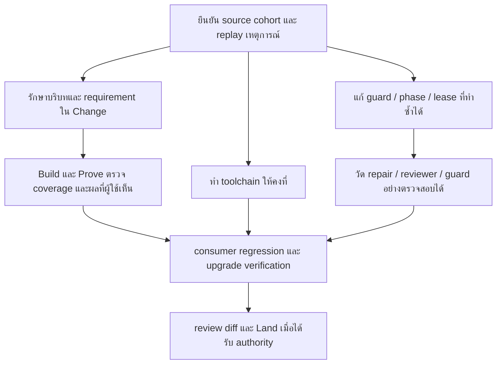

# แผนแก้ไขจาก Weekly Review feedback — 2026-09-11

สถานะ: ผู้ใช้อนุมัติ implementation แล้ว ปรับ upstream โดยตรงโดยไม่เข้า Change ตามคำขอ; ผลและข้อจำกัดอยู่ท้ายเอกสาร ไม่ใช่หลักฐาน release readiness

## แหล่งข้อมูลและขอบเขต

- อ่านข้อความใน iframe ของ [Weekly Review Round Ledger](https://claude.ai/code/artifact/f45e8fdb-6abd-4a75-885d-091043a2ea78) ครบตั้งแต่หัวรายงานถึง footer (23,825 ตัวอักษร) รวม round ledger, timeline, interventions, timing, code volume, pre-change research/design, gates, tasks, bugs, risks/waivers และ improvement candidates ทั้ง 8 ข้อ
- รายงานระบุ consumer `spiff-dashboard`, runtime 3.5.15 / API 34, อัปเดต 11 กันยายน 2569 10:17; ทั้งสาม change archived มี 33 claims และรีวิวสอง attempts ต่อ change
- ตรวจ source ของ upstream ที่ HEAD `09e4bc5bd`, protocol runtime API 35 จึงห้ามเหมารวมว่าปัญหาใน consumer ยังเป็น bug ของ current source ทุกข้อ
- ยังไม่ได้อ่าน raw consumer operations/events/audit/review receipts, transcript, installed hooks, Git authorization หรือภาพ UI ด้วยข้อมูลจริง ข้อเท็จจริงการใช้งานในเอกสารนี้เป็นสิ่งที่รายงานระบุ ไม่ใช่ผลตรวจ raw logs อย่างอิสระ
- รวมความต้องการจากบทสนทนานี้: นำบริบทก่อน Change มาใช้, diagrams และ folder mapping ตามความซับซ้อน, และรักษา requirement เมื่อเปลี่ยน phase/session
- เอกสารนี้เป็น repository-only plan และบันทึก implementation; canonical lifecycle อยู่ใน [WORKFLOW.md](../../WORKFLOW.md), ไม่สร้างสถานะคู่ขนานให้ consumer

## ข้อค้นพบที่เปลี่ยนแผน

1. รายงานระบุว่าบั๊ก 16 ข้อถูกพบโดย AI review ขณะที่ deterministic gates ผ่าน รวม UI ไม่แสดง SLA resolution และ snapshot เก่าทำ render พัง จึงต้องตรวจความหมายของหลักฐาน ไม่ใช้จำนวน tests หรือ claims เป็นตัวแทนความครบ
2. การปฏิเสธ force-released results ช่วยป้องกันหลักฐานที่ไม่มี authority ต้องรักษาคุณสมบัตินี้ขณะลดงานขอ/คืน lease ซ้ำ
3. Current shell policy มี absolute executable exclusion และการแยก literal heredoc/single-quoted data แล้ว ต้อง replay exact commands ก่อนแก้ parser เพิ่ม
4. Current mutation contract ห้าม product/instruction Edit ใน Prove และ `advance` มี REPAIR routing อยู่แล้ว รายงาน Edit ผ่านอาจเกี่ยวกับ phase ที่เปลี่ยน, host hook coverage, configuration หรือ installed version ต้องตรวจ event-level ก่อนสรุปว่าเป็น bypass
5. Current `reviewRepairIntervals` หา operation ชื่อ `proof-advance` โดยตรง จึงต้องทดสอบทาง `advance --through proven` และ nested operation การอนุมานช่วงว่างไม่เท่ากับเวลาที่ลงมือซ่อมจริง
6. Acceptance `not-required`, independence/diversity waived และไม่มี attestation เป็นข้อจำกัดหลักฐาน ต้องตรวจเหตุผลและ authority ตาม profile ไม่ถือว่าทุกข้อเป็น bug หรือบังคับ provider ใหม่ทุก change

## ความคลาดเคลื่อนในรายงานที่ต้อง reconcile

| จุด | สิ่งที่ต้องตรวจจากต้นฉบับ |
|---|---|
| เวลา | 00:44:34 → 03:09:31 เท่ากับประมาณ 144.95 นาที แต่รายงานใช้ 138.5 นาที; แยกผลรวมช่วง active change ออกจาก elapsed span และช่องว่างระหว่าง change |
| Tokens | ตาราง output 190,532 + cache write 1,663,957 = 1,854,489 แต่ footer เป็น 1,859,013; ต่าง 4,524 ต้องตรวจ cohort/ประเภท event ห้ามแก้ด้วยการเดา |
| ข้อสังเกตค้าง | สรุปบอกเปิด 6 ข้อ แต่แถว D2 รอบ 1 ระบุว่าปิดทางอ้อมรอบ 3 ต้องยืนยันยอด ณ revision สุดท้าย |
| Git authority | ข้อความว่า harness commit และมี PR ไม่พิสูจน์ว่า runtime เป็นผู้ commit หรือไม่มีอนุญาต ต้องแยก Land, host Git actions และคำอนุญาตผู้ใช้ |
| เวลาและต้นทุน | Reviewer timing เป็น partial, repair เป็นการอนุมาน, cost ไม่มี และ reviewer tokens ไม่รวม ห้ามสรุปต้นทุนทั้งหมดหรือประสิทธิภาพทั้งหมดจากตัวเลขบางส่วน |
| Interventions | แถวรวมบางแถวมีทั้ง lifecycle/tool events; นับด้วย event identity และผลการตัดสินจริง ไม่รวมแถว pin-anchor เป็น block |

## ข้อจำกัดด้านคำสั่ง — ข้อกำหนดจากผู้ใช้

- ทุกงานในแผนต้องใช้ user commands และ public CLI เดิม ห้ามเพิ่ม slash command, public command/subcommand, alias หรือ flag/argument ใหม่ รวมถึง CLI ที่ไฟล์ใน `.claude/commands/` เรียกใช้
- รักษาชื่อและ arguments ของคำสั่งเดิม ไม่เพิ่มขั้นตอนหรือชุดคำสั่งที่ผู้ใช้ต้องจำหรือรันเอง
- ปรับข้อความใน `.claude/commands/` และ references ได้เฉพาะเพื่อให้เส้นทางเดิมเรียกใช้ behavior ที่ปรับปรุงแล้ว ไม่เพิ่ม entrypoint หรือให้ agent ประกอบลำดับ primitive commands ชุดใหม่
- Context capture, coverage checks, toolchain preparation, lease recovery, evidence invalidation และ telemetry ingestion ต้องทำผ่าน runtime/internal helpers ภายใต้ `change start/amend`, `advance` และ lifecycle routes เดิมตามหน้าที่ของมัน
- คำว่า recovery/resume route ในแผนหมายถึง harness เลือกและดำเนินการผ่าน protocol/action และคำสั่งที่มีอยู่แล้ว ไม่ใช่ข้อเสนอให้เพิ่ม public recovery CLI หรือผลักงานกลับไปให้ผู้ใช้
- หากการออกแบบส่วนใดต้องพึ่งคำสั่งหรือ CLI option ใหม่ ให้ปรับการออกแบบภายในให้ผ่าน entrypoint เดิมก่อน ถือว่าข้อจำกัดนี้เป็นเกณฑ์รับของทุก workstream

## ลำดับการส่งมอบ

### 0. ยืนยัน baseline ก่อนแก้ runtime

- เก็บ redacted diagnostic bundle ของสาม change พร้อม source cohort, installed hook/adapter identities, operations, guard audit, lease generations, review attempts และ receipts ที่เกี่ยวข้อง
- Replay exact shell command + tool event + phase/workspace/config; เทียบ API 34 กับ current API 35 ใน disposable fixture
- แยกแต่ละเหตุการณ์เป็น expected protection, current defect, fixed/version skew หรือ insufficient evidence พร้อมระบุว่าทำซ้ำได้หรือไม่
- ตรวจเหตุผลและ decision references ของ waivers/acceptance และ Git actions; ไม่แก้ machine-owned JSON หรืออนุมาน authority จาก archived/PR
- เกณฑ์รับ: ทุก candidate ทั้ง 8 ข้อมี disposition และ reproduction/ข้อจำกัดชัดเจน; ตัวเลขรายงานอธิบายฐานการนับได้

### 1. รักษาเจตนาจากบทสนทนาจนถึง Change และ resume

- ก่อน draft ให้อ่านบริบทที่เกี่ยวข้องทั้งหมดที่เข้าถึงได้ รวม investigation/selected prototype; ยึดคำแก้ไขล่าสุด แยก confirmed, proposed, superseded และ unresolved โดยไม่บังคับสร้าง interview ledger
- ถ่ายทอดข้อสรุปลง proposal/requirements/scenarios/non-goals/design เดิม มีการจับคู่ข้อสรุปสำคัญกับ artifact/requirement; รายการไม่ครอบคลุมต้องมองเห็นก่อน spec approval
- ไม่อ้างว่าเข้าถึงแชตจาก session อื่นที่ไม่มีอยู่; เมื่อบริบทขาด ให้ใช้ retained agreement/notes และถามเฉพาะเรื่องสำคัญที่กู้ไม่ได้
- Multi-component change มี component/boundary diagram; workflow/state/async change มี sequence/state และ failure/recovery ตามความเกี่ยวข้อง; structural change มี affected folder tree และ `path → responsibility → change → requirement/task → verification`
- ใช้ `design.md` และ typed extensions เดิมก่อนเพิ่ม schema; ถ้าต้องเพิ่ม structured mapping ให้กำหนด amendment/preservation semantics และ compatibility ใน Change ไม่บังคับ rapid change สร้าง design ว่าง
- ก่อน Build/resume อ่าน full scenarios และ design sections ที่เกี่ยวข้อง ข้อมูลย่อ/digest เป็น navigation ไม่ใช่ agreement ฉบับเต็ม; เก็บ stable references และแจ้ง truncation ให้ตามอ่านได้
- เกณฑ์รับ: fixture บทสนทนาหลาย turn มี correction, rejected option, constraint และ unresolved choice; compiled packet เก็บสิ่งที่ตกลงครบและไม่ยกระดับข้อเสนอเป็นข้อตกลง การเริ่ม session ใหม่จาก packet ยังระบุ scope/acceptance ได้ โดยไม่มี approval ใหม่ที่อนุมานขึ้นเอง
- การทดสอบ deterministic ตรวจ links/rendering/amendment/truncation; คุณภาพการสรุปบทสนทนาต้องมี authoring evaluation แยก ไม่อ้างว่า regex test พิสูจน์ความครบทางความหมาย

### 2. Guard และ Prove repair ให้ใช้ authority เดียวกัน

- แก้เฉพาะ shell cases ที่ยัง fail บน current source แยก executable/data/operand/redirect และ nested execution; ไม่ allowlist `/opt` ทั้งต้นไม้
- ให้ Bash, Edit, Write, MultiEdit และ host adapters ใช้ active phase/workspace authority สอดคล้องกัน
- Product repair เดินผ่าน `advance` REPAIR → Build workspace → invalidate affected evidence → Prove ไม่เปิด Edit เป็นช่องหลบข้อห้ามของ shell
- เกณฑ์รับ: quoted heredoc/regex/absolute tool executable ที่ปลอดภัยผ่าน; redirect/copy/link/symlink/dynamic escape ที่ไม่พิสูจน์ได้ยังถูกกัน; product mutation ระหว่าง Prove ถูกกันทุก tool; authorized repair ทำได้และ proof เก่าหมดอายุ

### 3. Lease และ task completion ให้ harness จัดการ recovery

- ตรวจ shared-workspace baseline attribution ว่าการแก้ของ worker อื่นถูกนับเป็น out-of-scope ของผู้คืน lease หรือไม่
- วางงานที่มี write/resource overlap เป็น dependency wave; งานไม่ทับกันทำพร้อมกันได้เมื่อ attribution ตรวจสอบได้ หากแยกผู้เขียนไม่ได้ให้ serialize หรือใช้ isolation ที่รองรับ
- Host/coordinator รับผิดชอบ lease identity, generation, verify และ task completion ตามลำดับ; recovery ไม่ต้องให้ agent ติ๊ก `[x]` กลับ `[ ]` เพื่อหลอกให้ acquire ผ่าน
- Force release ยังคงไม่สร้าง accepted result; harness ออก re-verification route บน final workspace และผูกผลใหม่กับ contract/graph/lease generation ที่ถูกต้อง
- เกณฑ์รับ: 3 workers disjoint paths จบได้โดยไม่ force/toggle; overlapping paths ถูกจัดคิว; stale/wrong-owner/out-of-scope result ถูกปฏิเสธ; force takeover มี resume ที่ทำให้ผลใหม่ valid โดยไม่ใช้ผลเก่า

### 4. Toolchain และ evidence command คงที่ข้าม phase

- Resolve executable/version จาก project requirement และ environment ที่เตรียมจริง ให้ setup, task verify และ providers ใช้ environment เดียวกัน
- ตรวจ `sh -lc` ใน semantic draft/amendment เพราะ login shell อาจเปลี่ยน PATH; เลือกวิธีรักษา environment โดยไม่ทำ shell-command compatibility พัง
- เก็บ repository defaults ที่ใช้ซ้ำใน config ที่รองรับ ไม่บังคับเขียน execution.yaml ใหม่ทุก change และไม่ hardcode Node 24 ให้ทุก consumer
- เกณฑ์รับ: fixture มี Node สองเวอร์ชันและ login profile เปลี่ยน PATH; task/provider ใช้ตัวที่ตกลงไว้ และ missing/incompatible runtime กลับ typed setup route ก่อน Build

### 5. Requirement → critical case → evidence และ assurance disclosure

- เพิ่มการตรวจว่าพฤติกรรมที่ผู้ใช้เห็นถูกพิสูจน์: UI render/visibility, legacy snapshot, boundary/coercion, filtered population, measured/proxy และ null-vs-zero ตาม requirements ของงาน
- ค้นพบ `CC-*` เป็น candidate แล้วผูกกับ requirement/claim/provider ที่ตรวจได้ ไม่ให้ implementation tests ที่เขียนใหม่เปลี่ยน acceptance โดยเงียบ
- Case ที่จำเป็นแต่ไม่ bound เป็น coverage gap; bound case ที่ไม่รัน/skip/fail ต้องไม่ pass แม้ suite exit 0
- แสดง spec approval แยกจาก product acceptance; เปิดเผย waived review independence/diversity, acceptance not required และ external attestation availability ตาม profile จริง
- เกณฑ์รับ: คำนวณ SLA แต่ไม่ render ถูกตรวจพบ, legacy fixture ทำ UI พังไม่ผ่าน, unbound tag ไม่ถูกนับว่าพิสูจน์แล้ว; contract change ผ่าน amendment และ approval semantics เดิม
- ไม่บังคับ mutation, attestation หรือ human acceptance ทุกงาน; ไม่เรียก same-family reviewer ว่าเป็น agent คนเดียวโดยอาศัย family อย่างเดียว

### 6. Telemetry และรายงานที่ไม่ทำให้เข้าใจผิด

- Audit แยก enforcement mode ออกจาก outcome (`allowed`/`blocked`/`rewritten`/`audit-only`) และ reason code; preserve legacy rows โดยแสดง unknown เมื่อแยกไม่ได้
- Ingest reviewer host result/usage ผูก change/request/attempt/session; import ซ้ำต้องไม่ double-count, retry แยก attempts, แยก parent/child totals และ cache categories; missing cost เป็น null
- Repair intervals รองรับ advance route และ explicit phase events; แยก measured/derived/unavailable ไม่เรียก fail-to-resume gap ทั้งหมดว่า active repair
- รวมช่วงเวลาที่ทับกันด้วย interval semantics และแยก elapsed span, active-change sums, human wait, worker/reviewer time กับ unattributed time
- เกณฑ์รับ: anchor rewrite ไม่เพิ่ม blocked count, repeated usage import คงยอดเดิม, partial timing/cost ยังแสดง partial, repair ผ่าน advance มีช่วงที่อธิบายได้, overlaps ไม่บวกซ้ำ

## ชุดงานพร้อมนำไป implement

ตารางนี้เป็นลำดับงานออกแบบ ไม่ใช่ task ledger หรือ Change ที่สร้างแล้ว รอบวางแผนนี้ไม่เรียก lifecycle commands และไม่รอ spec approval เพื่อเขียนแผนให้ครบ

| ชุดงาน | Dependency | ขอบเขตส่งมอบ | เงื่อนไขจบ |
|---|---|---|---|
| A — Baseline และ reproduction | ไม่มี | Snapshot ของ public command surface, source cohort, fixtures ของข้อร้องเรียน และตาราง disposition | ข้อเสนอทั้ง 8 มีเจ้าของปัญหาและสถานะหลักฐาน; เคสที่แก้แล้วไม่ถูกทำซ้ำเป็น runtime feature |
| B — Context และ agreement continuity | Current-source baseline จาก A; ไม่ต้องรอ raw consumer logs | Authoring rules, diagram/folder-map triggers, compiled-content inspection และ full-source reads เมื่อ Build/resume | ตัวอย่างหลาย turn ถูกถ่ายทอดครบตามข้อสรุปล่าสุด; reference ไม่หายเมื่อ packet ถูกย่อ; amendment ไม่ทำ design/assets เดิมหาย |
| C — Guard และ repair routing | Reproduction ที่เกี่ยวข้องจาก A | แก้เฉพาะ parser/hook/phase defects ที่ยังเกิด พร้อม audit outcome แยกจาก enforcement mode | เครื่องมือทุกชนิดใช้ phase authority เดียวกัน; authorized repair ผ่านเส้นทางเดิม; negative escape cases ยังถูกกัน |
| D — Lease recovery | A และ phase semantics ที่ยืนยันใน C | Attribution ที่ตรวจสอบได้, scheduling งานทับกัน, coordinator-owned verification/completion | งานไม่ทับกันจบได้โดยไม่ toggle tasks; force release ไม่รับรองผล; stale generation และ out-of-scope writes ไม่ผ่าน |
| E — Toolchain consistency | A; ใช้ guard semantics จาก C สำหรับ integration | Environment resolution เดียวสำหรับ setup/task/provider พร้อม version diagnostic | Login shell เปลี่ยน PATH แล้วไม่ทำให้ task กับ provider ใช้ runtime คนละตัว; defaults ใช้ซ้ำได้โดยไม่สร้าง config ใหม่ทุกรอบ |
| F — Evidence coverage | B และ E | ผูก critical-case candidates กับ claims เดิม, scenario-level verification และ disclosure ของ assurance | Missing/skipped/failed required case ไม่ผ่าน; UI observable behavior และ compatibility cases มีหลักฐานที่ตรวจได้ |
| G — Telemetry และ integrated verification | C/D สำหรับ event semantics; รวม B/E/F ตอน end-to-end | Reviewer usage ingestion, interval accounting, legacy compatibility และ installed-consumer fixture | ไม่ double-count, unknown ไม่เป็นศูนย์, repair ผ่าน advance วัด/อธิบายได้; lifecycle เดิมทำงานครบโดยไม่มี public command เพิ่ม |

ลำดับลงมือที่แนะนำ: A → B → C → D → E → F → G โดยไม่หยุด B เพียงเพราะยังไม่มี raw logs ของ consumer ส่วนงาน runtime ที่อาศัยเหตุการณ์เฉพาะต้องมี reproduction ก่อน patch

### การตัดสินใจออกแบบที่ใช้ในแผน

1. Agent เป็นผู้สังเคราะห์บทสนทนาที่เข้าถึงได้; harness ตรวจโครงสร้างและรักษาสิ่งที่ส่งเข้า agreement ไม่สร้างระบบดูด transcript ทุก host หรืออ้างว่าตรวจความหมายของแชตได้ด้วย deterministic validator
2. เริ่มจาก fields และ artifacts เดิม: requirement/scenario, task paths/covers, diagrams/decisions และ design prose หากทดสอบแล้วแสดง mapping หรือ preserve เนื้อหาที่ต้องการไม่ได้ จึงเพิ่ม internal schema แบบ backward-compatible พร้อม version pin ที่เกี่ยวข้อง โดยไม่เพิ่ม CLI flag
3. Build อ่าน requirement/scenario ฉบับเต็มเฉพาะงานและ dependencies ที่เกี่ยวข้อง รวม design constraints; ไม่ขยาย global packet ให้บรรจุเอกสารทุกไฟล์ และไม่ตีความ hash ว่า agent อ่านเนื้อหาแล้ว
4. Runtime validation จับ missing references, broken coverage และ invalid observations; ความครบของเนื้อหาต้องผ่าน agent inspection และ behavioral fixtures ไม่มี read receipt ที่อ้างว่าพิสูจน์ความเข้าใจของโมเดล
5. เมื่อ provenance ของ shared-workspace writes แยกไม่ได้ ให้ใช้ scheduling/isolation เดิมเพื่อทำงานอย่างปลอดภัยก่อน ไม่อนุญาต overlapping writers เพียงเพราะอยู่ sandbox เดียวกัน
6. Host/coordinator จัดการ recovery ผ่าน action/resume เดิม ผู้ใช้ตัดสินเฉพาะ semantics หรือ authority ที่ยังขาด ไม่ได้รับคำสั่งใหม่สำหรับ rebind lease, collect context หรือ import usage
7. การค้นพบแท็ก critical case เป็นข้อมูลประกอบ ไม่เป็นเหตุให้เพิ่มข้อผูกพันใหม่เงียบ ๆ และการไม่มี optional provider ไม่เท่ากับหลักฐาน fail
8. แยกปัญหา upstream กับ product-specific bugs ของ consumer; ไม่ฝังชื่อ policy/component ของ spiff-dashboard เป็นกฎทั่วไปของ harness

### Regression scenarios ที่ต้องครอบคลุม

| Scenario | สิ่งที่ต้องตรวจ |
|---|---|
| คุยหลาย turn แล้วแก้ข้อสรุป | Agreement ใช้ค่าล่าสุด เก็บ constraint/non-goal เดิมที่ยังมีผล และไม่ถือ rejected option เป็นงาน |
| บริบทขาดหรือมี unresolved choice | แสดงข้อมูลที่ยังขาดอย่างตรงไปตรงมา ไม่สร้าง requirement หรือ authority แทนผู้ใช้ |
| Diagram/folder mapping และ amendment | Change ที่มี boundary/structure ซับซ้อนอธิบายความสัมพันธ์ได้; references resolve และ assets/custom prose อยู่ครบหลัง amend |
| Session ใหม่พร้อม packet ที่ย่อ | ตาม reference ไป full scenario/design ได้; pending task, dependencies และ acceptance ไม่หล่นจากการตัดข้อความ |
| Shell toolchain/regex/heredoc | Safe literal/executable cases ผ่าน แต่ redirect, nested execution และ symlink ที่เขียนนอกขอบเขตยังไม่ผ่าน |
| Prove → repair → Prove | Shell/Edit/Write ใช้ phase เดียวกัน; repair ทำใน workspace ที่อนุญาต และหลักฐานที่ถูก invalidated ไม่ถูกนำกลับมาใช้ |
| Workers ไม่ทับกันและทับกัน | Disjoint work จบได้, overlap ถูกจัดคิว, ผลของ worker อื่นไม่ถูกอ้างเป็นผลของผู้คืน lease |
| Takeover/stale result | Force release ไม่สร้าง accepted result; verification รอบใหม่ต้องผูกกับ final workspace และ generation ปัจจุบัน |
| Node สองเวอร์ชัน | Setup/task/provider ใช้ requirement และ environment เดียวกัน แม้ profile ของ login shell เปลี่ยน PATH |
| Test suite ผ่านแต่พฤติกรรมขาด | Missing UI output, legacy snapshot crash และ required case ที่ skip ถูกตรวจพบ ไม่อาศัย exit code หรือจำนวน tests อย่างเดียว |
| Telemetry ซ้ำ/ขาด/ทับช่วง | Import ซ้ำยอดคงเดิม, missing cost เป็น null, parent/child และ repair/human wait ไม่บวกซ้ำ |
| Upgrade และ lifecycle เดิม | Consumer config/active change อยู่ครบ; commands เดิมยังใช้ได้; fixture ถึง archived และ Land ไม่เปลี่ยน HEAD/index |

### ความครอบคลุม feedback ทั้ง 8 ข้อ

| ข้อในรายงาน | ชุดงาน | วิธีจัดการ |
|---|---|---|
| 1. Lease ชนและ force release | A/D | ทำซ้ำและแก้ coordinator/scheduling; ไม่ใช้ force เป็นทางรับรองผล |
| 2. Wire policy ไม่ sanitize | F และ consumer follow-up | ใช้ compatibility/render fixtures; product sanitizer แก้ที่ consumer |
| 3. Node 22/24 และ execution.yaml ซ้ำ | E | Resolve toolchain และใช้ repository defaults ผ่านช่องทางเดิม |
| 4. Path guard false positives | A/C | Replay exact commands เทียบ current fixes; patch เฉพาะช่องว่างที่เหลือ |
| 5. Pin-anchor นับเป็น block | C/G | แยก outcome และปรับ projection พร้อม legacy handling |
| 6. Reviewer usage/cost ไม่ครบ | G | ผูก usage กับ attempt/session และ deduplicate; ไม่ประมาณ cost ที่ไม่มีข้อมูล |
| 7. Critical cases ไม่ bound | B/F | เชื่อม approved requirements กับ executable observations โดยไม่ให้ tags ขยาย scope เอง |
| 8. Prove shell/Edit ไม่ตรงกัน | A/C/G | ตรวจ installed host/phase, รักษา REPAIR route และบันทึก repair intervals |

## Folder mapping สำหรับ implementation

| พื้นที่ | หน้าที่/งานในแผน | Regression boundary |
|---|---|---|
| `.claude/skills/change/references/workflow.md`, `.claude/orchestrator.md`, `.claude/commands/references/` | บริบทก่อน Change, diagram/map triggers, full agreement reads, host-owned recovery | user-guidance, instruction-contract, context-budget tests + authoring evaluation |
| `.claude/harness/runtime/workflow/semantic-draft.mjs`, `semantic-amendment.mjs`, `change-lifecycle.mjs`, `change-validation.mjs` | Compile/preserve mapping และ evidence bindings; provider defaults | semantic-draft tests, evidence-contract tests, upgrade matrix |
| `.claude/harness/runtime/workflow/packet-runtime.mjs`, `resume-packet.mjs` | Scoped references, full-source navigation และ resume | packet-scaling, advance-runtime, delivery-convergence tests |
| `.claude/harness/runtime/core/shell-mutation-policy.mjs`, `execution-contract.mjs`; `.claude/hooks/phase-mutation-guard.mjs`, `phase-state.mjs` | Shell classification, cross-tool phase enforcement, audit outcomes | phase-guard-policy, phase-mutation-guard + mutation fixtures |
| `.claude/harness/runtime/workflow/lease-runtime.mjs`, `agent-planning.mjs`, `agent-dispatch.mjs`, `advance-runtime.mjs` | Attribution, dependency waves, result authority, recovery | lease-acquisition, agent-dispatch, agent-contract, proof-readiness seams |
| `.claude/harness/runtime/core/tool-preparation.mjs`; `.claude/harness/runtime/evidence/adapter-runtime.mjs` | Environment/executable consistency และ provider execution | tool-preparation, installed consumer/provider fixtures |
| `.claude/harness/runtime/evidence/evidence-contract.mjs`, `proof-readiness.mjs`, `receipt-runtime.mjs` | Bound critical cases และ valid observations | critical-case-readiness, evidence-results/contract, receipt validity |
| `.claude/harness/runtime/evidence/configured-reviewer.mjs`, `review-attempt-store.mjs`; `.claude/harness/runtime/workflow/authority-runtime.mjs` | Reviewer attempt lifecycle และ usage handoff | configured reviewer, authority recovery + telemetry integration |
| `.claude/harness/runtime/observability/feedback-runtime.mjs`, `telemetry-runtime.mjs`, `host-execution-contract.mjs` | Repair intervals, deduplicated usage, completeness และ diagnostics | advance-runtime feedback, telemetry truth/import/dedup tests |

ชื่อไฟล์ที่อยู่ใน cell เดียวกันแต่ไม่ได้ใส่ path ซ้ำ ให้อ้าง directory ที่ระบุหน้าไฟล์แรก ไม่มีงาน domain ใหม่ใน composition root

## งาน consumer ที่ต้องติดตามแยก

- ไม่แก้ `sanitizeFlowPolicy` หรือ `WeeklyReview.tsx` ใน upstream นี้; ใช้ bug patterns เป็น consumer fixtures และส่ง product fixes กลับ repository เจ้าของ
- ตรวจ D1–D4 รอบ 1, D1 รอบ 2, D1 รอบ 3 ที่ revision สุดท้าย โดยยืนยัน D2 ที่ปิดทางอ้อมก่อนนับยอดค้าง
- ทำ render/interaction และ responsive check ของ SLA figures, CycleTrend marker, labels และ legacy snapshot; ตรวจข้อมูลจริงเมื่อมีสิทธิ์และ environment พร้อม
- เก็บ research/decisions/prototype selection ก่อน Change มาตรวจเทียบ compiled packets ทั้งสาม เพื่อพิสูจน์ว่าบริบทหล่นจริงหรือไม่ รายงานฉบับนี้อย่างเดียวตอบไม่ได้

## Verification และขอบเขตการอนุมัติ

ตรวจแล้วระหว่างวางแผน:

- `rtk test node --test .claude/tests/hooks/phase-guard-policy.test.mjs` — exit 0
- `rtk test bash .claude/tests/hooks/run-phase-mutation-guard-tests.sh` — 100/100 assertions ผ่าน
- นี่เป็น focused baseline เท่านั้น ไม่ใช่ full-suite/consumer replay หรือหลักฐานว่าปัญหาทั้งหมดปิดแล้ว

การวางแผนนี้ไม่เข้า Change ตามคำขอผู้ใช้ เมื่อมีคำสั่งให้ implement จึงดำเนินตามขอบเขตที่ได้รับอนุญาตและ workflow ที่ใช้ในตอนนั้น โดยใช้ชุดงานและ acceptance ข้างต้นเป็นฐาน ไม่สร้าง lifecycle state ล่วงหน้า ระหว่าง implementation ให้ run focused regressions, authoritative `.claude/tests/run-all.sh`, docs consistency/context budgets และ installed-consumer upgrade coverage ตามไฟล์ที่เปลี่ยน หาก wire-visible schema เปลี่ยนต้อง pin protocol และทดสอบ upgrade คู่กัน รวมทั้งปรับ canonical docs ภาษาอังกฤษ/ไทยให้ตรงกันเมื่อพฤติกรรมสาธารณะเปลี่ยน

ตรวจ command compatibility เทียบ baseline: ไม่มี user command หรือ public CLI command/subcommand/alias/flag/argument ใหม่ใน `.claude/commands/`, command registry และ CLI parser/router; command-contract tests ต้องยืนยันคำสั่งเดิมยังใช้ได้ และ end-to-end fixtures ต้องจบ context capture → Build → repair → Prove → Land/resume ผ่าน entrypoints เดิมโดยไม่เพิ่มคำสั่งที่ผู้ใช้ต้องรัน

Paid/model-driven evaluation ต้องได้รับ spend authority; deterministic fixtures ทำได้โดยไม่ใช้ paid consumer scenario. Land ต้องมี explicit authority และจบ archived โดย HEAD/index ไม่เปลี่ยน; Git commit/push/PR เป็น authority แยก

## Implementation หลังผู้ใช้อนุมัติ

ดำเนินการตรงใน upstream โดยไม่สร้าง Change และไม่เพิ่ม user/public CLI command, subcommand, alias, flag หรือ argument:

| พื้นที่ | สิ่งที่ปรับและขอบเขต |
|---|---|
| บริบทก่อน Change | คำสั่ง authoring ให้ reconcile บทสนทนาที่เข้าถึงได้ทั้งหมด ใช้ข้อแก้ไขล่าสุด เก็บ constraint เดิมที่ยังมีผล และแยก proposed/rejected/unresolved จาก approved intent; history ที่เข้าถึงไม่ได้ต้องบอกตรง ๆ |
| Diagram/folder mapping | เพิ่ม triggers และ responsibility → path → requirement/task → verification ใน design ผ่าน draft fields เดิม; regression ยืนยัน Mermaid และ mapping ผ่าน compiler ไปอยู่ใน OpenSpec packet |
| Build/resume | อ่าน full referenced scenarios/design/evidence ก่อนแก้ไฟล์ ไม่ใช้ packet preview หรือ hash แทน agreement; scope ที่เปลี่ยนใช้ amendment route เดิม |
| Shared workspace leases | จัด task ใน repository workspace เดียวกันเป็นลำดับ เพราะ release ดู whole-repository diff; repository workspaces แยกยังทำพร้อมกันได้ และ primitive acquire ป้องกันการข้าม scheduler |
| Force/recovery | Force release ไม่เก็บ accepted result เดิม; task ที่ checkbox เสร็จแต่ lease ยัง unresolved ถูกส่งกลับไป verification โดยไม่ต้องแก้ checkbox เพื่อหลบ gate |
| Shell environment | เปลี่ยนเฉพาะ generated provider commands เป็น non-login shell เพื่อคง PATH จาก host; explicit execution commands ยังเป็นของ project ไม่ได้เพิ่ม Node manager หรือเปลี่ยนเครื่องมือของ consumer |
| Guard audit | เพิ่ม outcome `rewritten`, `audit-only`, `blocked` แยกจาก configured mode; ไม่แก้ parser/phase enforcement ที่ baseline ปัจจุบันรองรับอยู่แล้ว |
| Evidence review | Reviewer prompt ตรวจ rendered/reachable UI และ supported legacy data ภายใน scoped claims; counts/CC tags หรือค่าที่คำนวณแต่ไม่ใช้ไม่ถือเป็น acceptance |
| Reviewer usage | รับ numeric usage จาก terminal CLI envelopes ของ ephemeral Claude/Codex reviewers ส่งผ่าน telemetry import/dedup และ budget window เดิม; missing usage/cost คง unknown ไม่มีการประมาณแทน |
| Feedback timing | รองรับ `advance` และ `proof-advance`, จำกัดช่วงก่อน next changed review, union ช่วงซ้ำ/ทับกัน และไม่หัก human/repair ที่ทับ active operation ซ้ำ; ช่วง repair ระบุเป็น derived และ legacy totals ที่พิสูจน์ overlap ไม่ได้เป็น null |
| Compatibility/docs | Pin runtime API 36, feedback schema 4 และ audit record schema 2; public commands เดิม, canonical English/Thai docs และ API guidance สอดคล้องกัน |

การ serialize shared workspace เป็น tradeoff ที่ตั้งใจ: ลด parallelism ใน repository เดียวเพื่อรักษา attribution ของผลทดสอบ หากต้องการ concurrency กลับมา ต้องมี worker isolation หรือ write provenance ที่พิสูจน์ได้ก่อน

ข้อที่ยังไม่ถือว่าปิดจากการแก้ upstream:

- ยังไม่มี raw consumer logs/installed hooks/exact commands สำหรับ replay ปัญหา historical version หรือยืนยันว่าข้อมูลก่อน Change หล่นตรงไหน
- ยังไม่ได้แก้ consumer sanitizer/UI หรือยืนยัน findings ค้างด้วยข้อมูลจริง รายงาน feedback เพียงอย่างเดียวไม่ใช่หลักฐานปิดบั๊กเหล่านั้น
- Instruction และ deterministic compiler tests ไม่รับประกันว่า model จะเก็บทุก requirement ในทุกบทสนทนา; model-driven multi-turn/session authoring evaluation ยังไม่มีผลรัน และไม่ได้ใช้ paid scenario
- Toolchain fix จำกัดที่ generated login shell ไม่ใช่การพิสูจน์ Node ทุกเวอร์ชัน/provider ของ consumer; audit outcome ใหม่ไม่สามารถเติม outcome ที่หายจาก historical records ได้
- Reviewer usage ใช้ค่าที่ CLI ส่งจริง ข้อมูลที่ CLI ไม่ส่งหรือ import ไม่สำเร็จยังขาดได้ โดยไม่ dispatch reviewer ซ้ำเพื่อเก็บ telemetry

ผลตรวจ implementation:

- Authoritative `.claude/tests/run-all.sh` ผ่านครบ 204 suites (exit 0) โดยใช้ `FOUNDATION_TEST_JOBS=8 FOUNDATION_SUITE_TIMEOUT_SECONDS=900`; รอบก่อนหน้าที่รัน 24-way มี timeout 300 วินาทีหลาย suite และพบ API guidance/test expectation ที่แก้แล้ว จึงไม่นับรอบนั้นเป็น pass
- Docs consistency ผ่าน 132/132, context budgets ผ่าน 117/117; website docs build ผ่าน 37 pages
- Focused regressions ของ semantic draft, lease acquisition/release, execution graph/DAG recovery, configured reviewer และ feedback timing ผ่าน; เพิ่ม legacy shared-workspace fencing และลบ accepted result เมื่อ force release โดยเฉพาะ
- ตรวจ reviewer usage ผ่าน normalization/import boundary: duplicate row ไม่เพิ่มยอด, missing cost เป็น null, session ของ reviewer คงอยู่ และ run attribution ใช้ parent budget window เดิม
- เปรียบเทียบกับ HEAD: slash command ทั้ง 8 ชื่อและ frontmatter/arguments เดิม, command registry/router ไม่เปลี่ยน; CLI shell เปลี่ยนเฉพาะ API pin
- Change skill validation และ `git diff --check` ผ่าน

ทั้งหมดเป็น deterministic/local verification ไม่ใช่ผล paid reviewer, historical consumer replay หรือ release qualification และไม่มี commit/push/publish ในงานนี้
