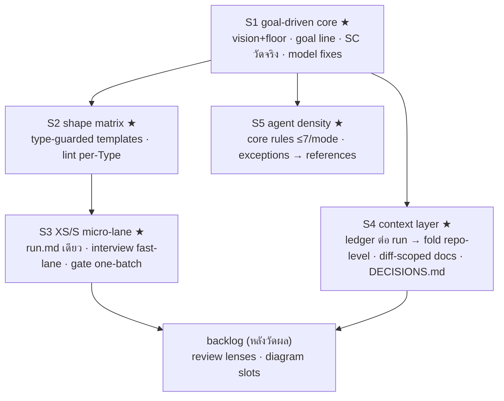

# Master improvement plan — /dev workflow

> **For humans**: แผนแม่จากบทสนทนา `feedback-core.md` — 5 slices เรียงตาม dependency, แต่ละ slice = หนึ่ง `/dev` run อิสระ ship ได้เอง อ่าน `## Summary` + diagram พอเข้าใจภาพรวม; task ราย slice คือสัญญาลงมือ

**Type**: refactor (workflow artifacts — prompts/templates/hooks, no product runtime)
**Size**: L (epic — 5 independently shippable slices, ~30 files)
**Field**: brownfield

## Summary

ปรับ `/dev` pipeline ให้ตรงวิชั่น **Fast first + Goal Driven**: ประกาศวิชั่น+floor แล้ววัด goal จริง (S1) → template พอดีงานผ่าน shape matrix แบบ lookup ไม่ใช่ freestyle (S2) → ยุบเครื่องจักรที่ XS/S ซึ่ง overhead ใหญ่กว่างาน (S3) → เลิกอ่านซ้ำด้วย context ledger + docs ที่ stamp ความสดได้ (S4) → ลดความหนาแน่นกติกาใน agent ที่เสี่ยง rule-dropping (S5). เลือกทางนี้แทน "ออกแบบ artifact สดต่อ run" เพราะ downstream ทั้งเส้น (gate set-compare, artifact-lint, qa coverage) อ่าน section ชื่อตายตัว — shape ต้องมาจาก lookup ที่ deterministic. Behaviour-equivalence: run ที่ M/L type=feat ต้องได้ artifact ครบชุดเดิมทุกประการ — การเปลี่ยนแปลงกระจุกที่ XS/S และ type ≠ feat.

## Technical Context

- **ภาษา/รูปแบบ**: Markdown prompts + POSIX sh hooks + JSON state; ไม่มี runtime code
- **Testing**: `.claude/hooks/tests/run-artifact-lint-tests.sh` (fixture-based), dry-run `/dev` ด้วยงานตัวอย่าง
- **Perf goal (SC)**: SC-1 XS round-trip มนุษย์ 2–3 → 1 · SC-2 XS ไฟล์เขียน ~8 → ≤3 · SC-3 M/L Phase-2 token ลด ≥20% (วัดจาก `phase_times` + dashboard) · SC-4 ศูนย์ AC ประดิษฐ์ใน fix/refactor/chore run ใหม่
- **Consumer ที่ห้ามพัง**: dashboard อ่าน `state.json` (`owner`, `phase_times`, `size`, `field`) · `--resume` อ่าน `step`/`next_step` · installer ship ทั้ง `.claude/` dir (ไฟล์ใหม่ไม่ต้องแก้ manifest)

## Gate check

- `coding-discipline`: surgical — ทุก slice แตะเฉพาะไฟล์ในตาราง; ไม่ reformat ข้างเคียง
- `refactoring-fundamentals`: S2/S3 เปลี่ยน shape โดยมี characterization = lint fixtures เดิมต้องเขียวก่อนแตะ (T204 ขยาย ไม่แทนที่)
- `testing-fundamentals`: ทุก lint change มี fixture ใหม่ประกบ; dry-run ต่อ slice
- `security-fundamentals`: ไม่แตะ trust boundary; floor ห้ามตัด security-trigger check (S1-T101 เขียนกำกับ)
- `git-workflow`: หนึ่ง slice = หนึ่ง branch = atomic commits ตาม T###

## Current state (cited)

- Vision line: `WORKFLOW.md:3` — มี "think before coding…drive toward the spec's goal" ไม่มี fast-first tie-breaker
- Interview บังคับทุก run: `orchestrator.md:53` "Never skip the interview"; batch 3–4 ข้อ: `orchestrator.md` op 2
- Artifact ที่ XS: spec+plan+tasks+test-plan+state+INDEX+tests+retro ≈ 8 ไฟล์ (`WORKFLOW.md > Artifacts`)
- Lint บังคับ feat-shape ทุก type: `WORKFLOW.md:125` (`## User Stories` + mermaid ไม่มีเงื่อนไข) → `.claude/hooks/artifact-lint.sh`
- `context.md` per-run เท่านั้น สร้างเฉพาะ brownfield M/L: `orchestrator.md` op 3a; ตายพร้อม run — ไม่มี repo-level fold
- SC-### เขียนใน spec แต่ไม่มีใครวัด: `_templates/retro.md` ไม่มีช่อง SC
- ADR: ไม่มีทั้งระบบ (grep ADR/decision-record ทั้ง skills/templates/rules/agents = 0)
- engineer `model: sonnet` ตายตัว (`agents/engineer.md`); type-design-analyzer `model: haiku`; lead review เอกสาร anti-bias ที่ `WORKFLOW.md:232`
- Type rules (fix→failing-test-first ฯลฯ) ซ้ำ ~4 ที่: `WORKFLOW.md` matrix, `orchestrator.md`, `agents/lead.md`, `agents/engineer.md`
- `init-project-docs` มี fresh + update (four-bucket) ไม่มี diff-scoped lane; docs ไม่มี freshness stamp

## Architecture (to-be)

ลำดับบังคับ: **S1 ก่อนเสมอ** (floor คือตัวกันไม่ให้ S3/S4 กลายเป็น "เร็วแต่รั่ว"); S2 ก่อน S3 (แกน contract เล็กลงแล้วค่อยยุบเป็น run.md); S4, S5 อิสระหลัง S1 ทำขนานได้

## Guardrails (invariants — ห้ามละเมิดทุก slice)

- **Contract sections คงอยู่ทุก shape**: `## Goal`, `**Type**:`, `AC#`, `T### … verify:` — gate/lint/qa/review อ่านสิ่งเหล่านี้
- **`state.json` schema**: field ที่ dashboard/`--resume` อ่าน (`owner`, `phase_times`, `step`, `next_step`, `size`, `field`) ห้ามเปลี่ยนชื่อ/ลบ
- **Floor (จาก S1)**: gate, security-trigger *check*, state writes, regression contract ของ fix, per-line AC confirm — ไม่มี slice ไหนตัด
- **single-writer**: worker ไม่เขียน `state.json`/ledger — คืนค่าให้ orchestrator fold
- **lint เดิมต้องเขียวตลอด**: fixtures เดิมคือ characterization baseline ก่อนขยาย

---

## S1 — Goal-driven core (Size S · run แรก)

**Goal**: วิชั่นถูกประกาศพร้อม floor, goal ไหลถึงทุก spawn, SC ถูกวัดตอนปิด run, model/dedup fix เล็กที่ค้าง
**AC**: S1-AC1 WORKFLOW+fundamentals มี fast-first tie-breaker + floor ครบ 5 ข้อ · S1-AC2 spawn-brief rule บังคับ goal line · S1-AC3 retro template/agent มีช่อง SC วัด/mark-unmeasurable→FOLLOWUPS · S1-AC4 engineer ได้ opus ที่ L/security-path, type-analyzer ได้ sonnet · S1-AC5 type rules เหลือ canonical เดียว (matrix) ที่เหลือ pointer

| T | งาน | verify |
|---|---|---|
| T101 [S1-AC1] เพิ่ม tie-breaker + floor 5 ข้อ — `WORKFLOW.md:3` (edit) | `grep -c "fast first" WORKFLOW.md` ≥1 และ floor ครบ 5 คำ |
| T102 [S1-AC1] บรรทัด fast-first ≠ ตัด verification — `.claude/rules/fundamentals.md#conduct-digest` (edit) | grep พบใน Conduct digest |
| T103 [S1-AC2] กติกา "Goal + AC ids = บรรทัดแรกทุก spawn brief" — `.claude/orchestrator.md#state-discipline` Efficiency (edit) | grep "Goal line" |
| T104 [S1-AC3] ช่อง `## SC outcome` — `_templates/retro.md` + `agents/retro.md` (edit) | grep "SC" ทั้งสองไฟล์ |
| T105 [S1-AC4] กติกา engineer→opus เมื่อ L หรือ security-path — `orchestrator.md` op 5 (edit) | grep "opus" ใน op 5 |
| T106 [S1-AC4] `model: haiku`→`sonnet` — `agents/team-type-design-analyzer.md` (edit) | grep "model: sonnet" |
| T107 [S1-AC5] type rules: matrix = canonical, `lead.md`/`engineer.md` แทนด้วย pointer — 3 ไฟล์ (edit) | grep "failing" ใน agents เหลือ pointer เท่านั้น |
| T108 [S1-AC5] adversarial line ("หา ≥3 จุดที่ plan ผิด") ที่ L review — `agents/lead.md` Mode B (edit) | grep "adversarial" |
| T109 [DoD] baseline: สคริปต์ดึง `phase_times` จาก `.workflow/*/state.json` เก็บเป็น `feedback-notes/baseline.json` (new) | ไฟล์ baseline มีข้อมูล ≥1 run |

## S2 — Shape matrix (Size M · ต่อจาก S1)

**Goal**: ทุก type ได้ template พอดีตัวผ่าน type-guarded blocks; lint เช็คตาม Type; ศูนย์ section ประดิษฐ์
**AC**: S2-AC1 fix spec ไม่มี User Stories ผ่าน lint แต่ขาด Reproduction ไม่ผ่าน · S2-AC2 feat spec ไม่มี US ไม่ผ่าน (พฤติกรรมเดิมคงอยู่) · S2-AC3 refactor ได้ Equivalence, spike ได้ Questions+Timebox เป็น required · S2-AC4 fixtures เดิมเขียวทั้งหมด · S2-AC5 spawn brief ส่ง resolved shape

| T | งาน | verify |
|---|---|---|
| T201 [S2-AC1..3] type-guard blocks ใน `_templates/spec.md` — แกน Goal/Type/AC always; US `(feat)`, Repro+Expected `(fix: required)`, Equivalence `(refactor)`, checklist `(chore)`, Questions+Timebox `(spike)` (edit) | template มี guard ครบ 5 type |
| T202 [S2-AC3] `_templates/plan.md`: mermaid required เฉพาะ code-bearing; Technical Context อนุญาต `n/a` ที่ chore/docs (edit) | guard ปรากฏ |
| T203 [S2-AC3] `_templates/tasks.md`: โครง phase เฉพาะ feat; fix/refactor = flat 2–4 task (edit) | guard ปรากฏ |
| T204 [S2-AC1,2,4] `artifact-lint.sh` parse `**Type**:` → เช็คชุด required ต่อ type + fixtures ใหม่ต่อ type — `.claude/hooks/` (edit+new) | `run-artifact-lint-tests.sh` เขียวทั้งเก่า+ใหม่ |
| T205 [S2-AC5] op 3 spawn brief แนบ "required blocks for this run" — `orchestrator.md` (edit) | grep "required blocks" |
| T206 [S2-AC5] shape-deviation lever ที่ gate (additive เท่านั้น ลบต่ำกว่าแกนไม่ได้) — `references/gate.md` (edit) | grep "shape" |
| T207 [S2-AC5] ตาราง lookup canonical — `skills/plan-writing/references/size-tiering.md` (edit) | ตารางปรากฏ + WORKFLOW ชี้มา |

## S3 — XS/S micro-lane (Size M · ต่อจาก S2)

**Goal**: XS เขียน ≤3 ไฟล์, round-trip มนุษย์เหลือ 1, ไม่มี spawn เกินจำเป็น — โดย `--resume`/lint/team-mode ยังทำงาน
**AC**: S3-AC1 XS dry-run ได้ `run.md`+`state.json`+INDEX row เท่านั้น · S3-AC2 digest ครบ → confirm เดียว (fast-lane บันทึกใน state) · S3-AC3 gate one-batch (contract+commit+deviation ใน AskUserQuestion เดียว) · S3-AC4 `--resume` run ที่ใช้ run.md ต่อได้ · S3-AC5 review inline เฉพาะ patch lane, M/L ไม่เปลี่ยนพฤติกรรมใด

| T | งาน | verify |
|---|---|---|
| T301 [S3-AC1] `_templates/run.md` (new): แกน contract (Goal/Type/AC/T###+verify/coverage row) ในไฟล์เดียว | lint ผ่านกับ fixture run.md |
| T302 [S3-AC1] XS lane เขียน run.md — `references/size-execution.md` (edit) | grep "run.md" |
| T303 [S3-AC2] fast-lane rule — `references/interview.md` (edit): ทุก slot มีคำตอบใน digest → confirm 1 ข้อ, assumptions ลง spec | grep "fast-lane" |
| T304 [S3-AC3] one-batch gate ที่ XS/S — `references/gate.md` (edit) | grep "one-batch" |
| T305 [S3-AC1,4] lint รับ run.md shape ที่ XS + fixture — `artifact-lint.sh` (edit) | tests เขียว |
| T306 [S3-AC4] resume/sharding รู้จัก run.md — `references/resume.md`, `references/team-mode-sharding.md` (edit) | dry-run: สร้าง XS run → kill → `--resume` ต่อสำเร็จ |
| T307 [S3-AC5] review inline patch-lane — `references/size-execution.md` Review row (edit) | grep + M/L row ไม่เปลี่ยน |

## S4 — Context layer (Size L · หลัง S1, ขนานกับ S3 ได้)

**Goal**: อ่านครั้งเดียวใช้ทั้ง run + ข้าม run; docs มี freshness stamp; decision ถาวรใน DECISIONS.md
**AC**: S4-AC1 worker คืน `CONTEXT:` lines แล้ว orchestrator fold ลง `context.md` (single-writer) · S4-AC2 spawn brief ทุก phase แนบ context.md + กติกา read-before-walk · S4-AC3 truth hierarchy โค้ด>docs>ledger + rule "diff ชนะ context หลัง implement" ประกาศใน fundamentals · S4-AC4 retro fold ledger → `.workflow/CONTEXT.md` (repo-level) · S4-AC5 engineer docs Mode B ทำ diff-scoped update + stamp `last-verified: <sha>` · S4-AC6 retro append decision row ลง `docs/DECISIONS.md` เมื่อ run มี arch decision

| T | งาน | verify |
|---|---|---|
| T401 [S4-AC1] `## Discovered (<phase>)` format `path#anchor — fact — [phase]` — `_templates/context.md` (edit) | section ปรากฏ |
| T402 [S4-AC1,2] fold ตอน worker return + แนบ context.md ทุก brief — `orchestrator.md` State discipline (edit) | grep "CONTEXT:" |
| T403 [S4-AC1,2] read-before-walk + return contract 2 บรรทัด — agents 6 ไฟล์ (pm/lead/engineer/qa/uxui/team-codebase-explorer) (edit) | grep ครบ 6 ไฟล์ |
| T404 [S4-AC1] first-line recognition เพิ่ม `CONTEXT:` — `references/fanout-dispatch.md` (edit) | grep |
| T405 [S4-AC4] retro fold → `.workflow/CONTEXT.md`; run ใหม่ seed จากมัน — `agents/retro.md` + `orchestrator.md` op 3a (edit) | dry-run 2 run โปรเจกต์เดียว: run 2 ไม่ re-walk พื้นที่ที่ map แล้ว |
| T406 [S4-AC3] truth hierarchy + diff-wins 1 บรรทัด — `rules/fundamentals.md` (edit) | grep |
| T407 [S4-AC5] diff-scoped docs + stamp — `agents/engineer.md` Mode B (edit) | grep "last-verified" |
| T408 [S4-AC5] lane ที่สาม (diff-scoped) + stamp convention — `skills/init-project-docs/SKILL.md` (edit) | grep "diff-scoped" |
| T409 [S4-AC6] `docs/DECISIONS.md` convention (append-only, supersede) + retro append — `agents/retro.md`, `_templates/retro.md` (edit) | grep "DECISIONS" |

## S5 — Agent density (Size S · หลัง S1, อิสระ)

**Goal**: lead/engineer body เหลือ ≤7 กติกา core ต่อ mode — exception ทั้งหมดอยู่ `references/` โดยไม่มีกติกาหาย
**AC**: S5-AC1 ทุกกติกาที่ย้ายออกพบได้ใน references (checklist ไล่ครบ) · S5-AC2 body สั้นลง ≥30% โดย Done-contract/first-line signals ไม่เปลี่ยน

| T | งาน | verify |
|---|---|---|
| T501 [S5-AC1,2] แยก core/exception — `agents/lead.md` → `agents/references/lead.md` (edit) | checklist: ทุก clause เดิม grep เจอในไฟล์ใดไฟล์หนึ่ง |
| T502 [S5-AC1,2] เดียวกัน — `agents/engineer.md` → `agents/references/engineer.md` (edit) | เดียวกัน |
| T503 [S5-AC2] dry-run M feat หนึ่ง run เทียบ artifact ครบชุดเดิม | artifact ครบ + lint เขียว |

## Measurement (ทุก slice)

หลังจบแต่ละ slice: รัน dry-run มาตรฐาน (XS chore + S feat + M fix) → เทียบ `phase_times`/ไฟล์ที่เขียน/จำนวน AskUserQuestion กับ `baseline.json` (T109) → บันทึกลง slice retro. SC-1..4 ตัดสินที่จบ S3 (SC-1,2,4) และ S4 (SC-3)

## Risks

- **S3 ripple ใหญ่สุด** (lint/resume/team-mode) — mitigations: T305/T306 มี dry-run resume เป็น verify; ถ้า team-mode ชน run.md เกินคาด → XS ตัด team-mode ออก (XS ไม่ควรใช้ team mode อยู่แล้ว — cost note ใน WORKFLOW)
- **Ledger staleness** — T406 คือกติกากัน; ถ้า run จริงพบ agent เชื่อ ledger ผิด → เพิ่ม spot-check บังคับใน T403
- **Shape ผิดทั้ง class** — lint per-type (T204) ตรวจจับได้เร็ว; แก้ที่ lookup จุดเดียว
- **Scope งอก** — backlog (review lenses, diagram slots, docs threshold) ห้ามลากเข้า slice; ลง `FOLLOWUPS.md`

## Out of scope

- phase-plan goal-minimal (ตัดทิ้ง — เสี่ยงเกินผลตอบแทน), review lens ผูกชนิด diff, diagram/domain slots, docs full-reconcile threshold → backlog หลังวัดผล S1–S5
